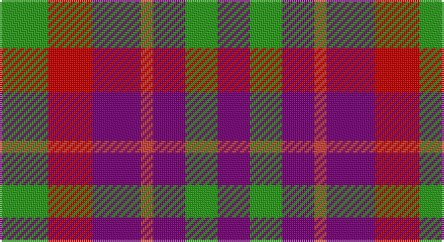

This page is one **sett** — a single exact thread-count. It belongs to the [tartan](/setts/g12r11dp12ri3dp8g8dp8/)
(the same proportion at any scale), whose colour order is pattern [BGBRBRG](/stripes/bgbrbrg/).

Part of the [Fiddes](/tartans/fiddes/) tartan — the named design grouping this sett with its other cloths.

Sourced from register-of-tartans.  It is a [7 stripe tartan](/stripes/stripes7/).

Original link https://www.tartanregister.gov.uk/tartanDetails.aspx?ref=1178

## Also known as

This cloth is also recorded under:

- Fiddes #2
- Fiddes #3

## Register references

External register numbers recorded for this tartan.

- Scottish Register of Tartans: [1178](https://www.tartanregister.gov.uk/tartanDetails.aspx?ref=1178)
- Scottish Tartans Authority (ITI): 4854

## Thread count
G/24 Ra22 P24 R6 P16 G16 P/16

One full sett is **208 threads**.

## Palette

Palette: <strong>Tartan Register</strong> <small style="color:#888">(3 of 4 colours)</small>
<table><thead><tr><th>Colour</th><th>Threads</th><th>Shade</th><th>Base</th><th>OKLCh</th></tr></thead><tbody><tr><td>G/</td><td style="text-align:right;font-variant-numeric:tabular-nums">24</td><td><code style="background-color:#289C18;">#289C18</code> <small style="color:#888">#289C18</small></td><td>G <code style="background-color:#006100;">#006100</code></td><td><small style="color:#888">oklch(60.6% 0.191 141.6)</small></td></tr><tr><td>Ra</td><td style="text-align:right;font-variant-numeric:tabular-nums">22</td><td><code style="background-color:#C80000;">#C80000</code> <small style="color:#888">#C80000</small></td><td>R <code style="background-color:#CC0000;">#CC0000</code></td><td><small style="color:#888">oklch(52.3% 0.215 29.2)</small></td></tr><tr><td>P</td><td style="text-align:right;font-variant-numeric:tabular-nums">24</td><td><code style="background-color:#780078;">#780078</code> <small style="color:#888">#780078</small></td><td>B <code style="background-color:#2A418A;">#2A418A</code></td><td><small style="color:#888">oklch(40.2% 0.185 328.4)</small></td></tr><tr><td>R</td><td style="text-align:right;font-variant-numeric:tabular-nums">6</td><td><code style="background-color:#CC4438;">#CC4438</code> <small style="color:#888">#CC4438</small></td><td>R <code style="background-color:#CC0000;">#CC0000</code></td><td><small style="color:#888">oklch(57.7% 0.174 28.7)</small></td></tr><tr><td>P</td><td style="text-align:right;font-variant-numeric:tabular-nums">16</td><td><code style="background-color:#780078;">#780078</code> <small style="color:#888">#780078</small></td><td>B <code style="background-color:#2A418A;">#2A418A</code></td><td><small style="color:#888">oklch(40.2% 0.185 328.4)</small></td></tr><tr><td>G</td><td style="text-align:right;font-variant-numeric:tabular-nums">16</td><td><code style="background-color:#289C18;">#289C18</code> <small style="color:#888">#289C18</small></td><td>G <code style="background-color:#006100;">#006100</code></td><td><small style="color:#888">oklch(60.6% 0.191 141.6)</small></td></tr><tr><td>P/</td><td style="text-align:right;font-variant-numeric:tabular-nums">16</td><td><code style="background-color:#780078;">#780078</code> <small style="color:#888">#780078</small></td><td>B <code style="background-color:#2A418A;">#2A418A</code></td><td><small style="color:#888">oklch(40.2% 0.185 328.4)</small></td></tr></tbody></table>

# Sample pattern

## Compared to the master

This cloth is one sett of its design; the master sett (the exemplar the design is anchored on) is below for comparison.

<figure style="margin:0"><figcaption style="color:#888;font-size:smaller">this sett</figcaption></figure>
<figure style="margin:0"><figcaption style="color:#888;font-size:smaller"><a href="/setts/dg12r11dp12ri3r32dp8dg8dp8/">master sett →</a></figcaption></figure>

## Nearest tartans

The nearest existing variants by ΔTartan distance, with this tartan at the top so the swatches line up against it.

ΔTartan

Tartan

Sett

—

<a href="/ttd/edit/#slug=g12r11dp12ri3dp8g8dp8~x2">Fiddes (Corrected)</a> <a class="nn-out" href="/variants/s7/g12r11dp12ri3dp8g8dp8~x2/" title="open its dictionary page">↗</a>

0.98

<a href="/ttd/edit/#slug=r10db6k8dg10r6dg3r6~x2&amp;base=g12r11dp12ri3dp8g8dp8~x2">MacDuff #3</a> <a class="nn-out" href="/variants/s7/r10db6k8dg10r6dg3r6~x2/" title="open its dictionary page">↗</a>

1.27

<a href="/ttd/edit/#slug=dg14db8dg14r14k3r14~x2&amp;base=g12r11dp12ri3dp8g8dp8~x2">Tulsa, City of</a> <a class="nn-out" href="/variants/s6/dg14db8dg14r14k3r14~x2/" title="open its dictionary page">↗</a>

1.42

<a href="/variants/s8/r4dg4r1db4r4~x12/">Gow</a>

1.42

<a href="/ttd/edit/#slug=r10db6k8g10r6g3r6~x2&amp;base=g12r11dp12ri3dp8g8dp8~x2">MacDuff</a> <a class="nn-out" href="/variants/s7/r10db6k8g10r6g3r6~x2/" title="open its dictionary page">↗</a>

1.47

<a href="/ttd/edit/#slug=r15o9w4k12r15k5~x2&amp;base=g12r11dp12ri3dp8g8dp8~x2">Eastern Kentucky University</a> <a class="nn-out" href="/variants/s6/r15o9w4k12r15k5~x2/" title="open its dictionary page">↗</a>

1.48

<a href="/ttd/edit/#slug=db5r17dg16k10db10r17db5~x2&amp;base=g12r11dp12ri3dp8g8dp8~x2">MacNaughton (Logan)</a> <a class="nn-out" href="/variants/s7/db5r17dg16k10db10r17db5~x2/" title="open its dictionary page">↗</a>

1.52

<a href="/ttd/edit/#slug=db9r12dg9db5w2~x4&amp;base=g12r11dp12ri3dp8g8dp8~x2">Battle of Prestonpans (1745) Herit</a> <a class="nn-out" href="/variants/s5/db9r12dg9db5w2~x4/" title="open its dictionary page">↗</a>

1.54

<a href="/ttd/edit/#slug=r10t5lb5dt4~x8&amp;base=g12r11dp12ri3dp8g8dp8~x2">Haggis Hostels</a> <a class="nn-out" href="/variants/s4/r10t5lb5dt4~x8/" title="open its dictionary page">↗</a>

1.56

<a href="/ttd/edit/#slug=lo2db4k1db4m4lo4db1~x8&amp;base=g12r11dp12ri3dp8g8dp8~x2">Isle of Gigha (District)</a> <a class="nn-out" href="/variants/s7/lo2db4k1db4m4lo4db1~x8/" title="open its dictionary page">↗</a>

1.57

<a href="/ttd/edit/#slug=r4db4r1g4r4~x6&amp;base=g12r11dp12ri3dp8g8dp8~x2">MacGowan</a> <a class="nn-out" href="/variants/s5/r4db4r1g4r4~x6/" title="open its dictionary page">↗</a>

## Neighbour map

Every grey dot is one of 14360 variants placed by the first two principal components of the ΔTartan feature space (44% of its variance). Red is this tartan; blue dots are its nearest — click one to open its page.

<svg viewBox="0 0 640 380" role="img" style="max-width:100%;height:auto;border:1px solid #e0e0e0;border-radius:4px;display:block" xmlns="http://www.w3.org/2000/svg"><image href="/nn/cloud.v1.png" width="640" height="380"/><a href="/variants/s7/r10db6k8dg10r6dg3r6~x2/"><circle cx="135.7" cy="290.9" r="4" fill="#3465a4"><title>MacDuff #3</title></circle></a><a href="/variants/s6/dg14db8dg14r14k3r14~x2/"><circle cx="182.0" cy="291.5" r="4" fill="#3465a4"><title>Tulsa, City of</title></circle></a><a href="/variants/s8/r4dg4r1db4r4~x12/"><circle cx="170.5" cy="296.8" r="4" fill="#3465a4"><title>Gow</title></circle></a><a href="/variants/s7/r10db6k8g10r6g3r6~x2/"><circle cx="115.2" cy="284.7" r="4" fill="#3465a4"><title>MacDuff</title></circle></a><a href="/variants/s6/r15o9w4k12r15k5~x2/"><circle cx="172.8" cy="262.5" r="4" fill="#3465a4"><title>Eastern Kentucky University</title></circle></a><a href="/variants/s7/db5r17dg16k10db10r17db5~x2/"><circle cx="130.9" cy="274.8" r="4" fill="#3465a4"><title>MacNaughton (Logan)</title></circle></a><a href="/variants/s5/db9r12dg9db5w2~x4/"><circle cx="150.2" cy="264.3" r="4" fill="#3465a4"><title>Battle of Prestonpans (1745) Herit</title></circle></a><a href="/variants/s4/r10t5lb5dt4~x8/"><circle cx="112.6" cy="306.3" r="4" fill="#3465a4"><title>Haggis Hostels</title></circle></a><a href="/variants/s7/lo2db4k1db4m4lo4db1~x8/"><circle cx="115.1" cy="251.2" r="4" fill="#3465a4"><title>Isle of Gigha (District)</title></circle></a><a href="/variants/s5/r4db4r1g4r4~x6/"><circle cx="238.5" cy="317.3" r="4" fill="#3465a4"><title>MacGowan</title></circle></a><circle cx="149.6" cy="282.5" r="5" fill="#c00000"/></svg>

ID: /variants/s7/g12r11dp12ri3dp8g8dp8~x2/
