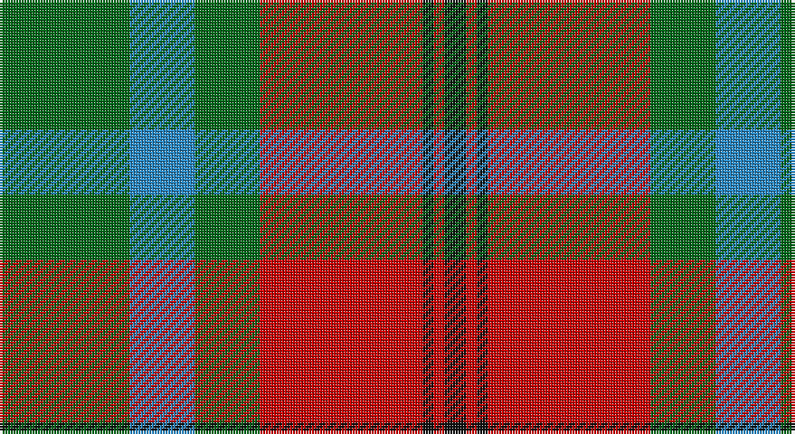

This page is one **sett** — a single exact thread-count. It belongs to the [tartan](/setts/g12t6g6r15k1r1k2/)
(the same proportion at any scale), whose colour order is pattern [GBGRKRK](/stripes/gbgrkrk/).

Sourced from tartans-authority.  It is a [7 stripe tartan](/stripes/stripes7/).

Original link http://www.tartansauthority.com/tartan-ferret/display/3910/

2 attestations — the source records this cloth was collapsed from (oldest owns this page)

<ul>
<li>2001 — McCook/Cook (Name) (tartans-authority, <a href="http://www.tartansauthority.com/tartan-ferret/display/3910/">record</a>)</li>
<li>undated — McCook/Cook (register-of-tartans, <a href="https://www.tartanregister.gov.uk/tartanDetails.aspx?ref=5280">record</a>)</li>
</ul>

## Register references

External register numbers recorded for this tartan.

- Scottish Register of Tartans: [5280](https://www.tartanregister.gov.uk/tartanDetails.aspx?ref=5280)
- Scottish Tartans Authority (ITI): 3910

## Thread count
G/48 B24 G24 R60 K4 R4 K/8

One full sett is **288 threads**.

## Palette

Palette: <strong>Tartan Register</strong>
<table><thead><tr><th>Colour</th><th>Threads</th><th>Shade</th><th>Base</th><th>OKLCh</th></tr></thead><tbody><tr><td>G/</td><td style="text-align:right;font-variant-numeric:tabular-nums">48</td><td><code style="background-color:#006818;">#006818</code> <small style="color:#888">#006818</small></td><td>G <code style="background-color:#006100;">#006100</code></td><td><small style="color:#888">oklch(45.0% 0.142 145.0)</small></td></tr><tr><td>B</td><td style="text-align:right;font-variant-numeric:tabular-nums">24</td><td><code style="background-color:#2888C4;">#2888C4</code> <small style="color:#888">#2888C4</small></td><td>B <code style="background-color:#2A418A;">#2A418A</code></td><td><small style="color:#888">oklch(60.1% 0.125 241.5)</small></td></tr><tr><td>G</td><td style="text-align:right;font-variant-numeric:tabular-nums">24</td><td><code style="background-color:#006818;">#006818</code> <small style="color:#888">#006818</small></td><td>G <code style="background-color:#006100;">#006100</code></td><td><small style="color:#888">oklch(45.0% 0.142 145.0)</small></td></tr><tr><td>R</td><td style="text-align:right;font-variant-numeric:tabular-nums">60</td><td><code style="background-color:#C80000;">#C80000</code> <small style="color:#888">#C80000</small></td><td>R <code style="background-color:#CC0000;">#CC0000</code></td><td><small style="color:#888">oklch(52.3% 0.215 29.2)</small></td></tr><tr><td>K</td><td style="text-align:right;font-variant-numeric:tabular-nums">4</td><td><code style="background-color:#101010;">#101010</code> <small style="color:#888">#101010</small></td><td>K <code style="background-color:#000000;">#000000</code></td><td><small style="color:#888">oklch(17.3% 0.000 89.9)</small></td></tr><tr><td>R</td><td style="text-align:right;font-variant-numeric:tabular-nums">4</td><td><code style="background-color:#C80000;">#C80000</code> <small style="color:#888">#C80000</small></td><td>R <code style="background-color:#CC0000;">#CC0000</code></td><td><small style="color:#888">oklch(52.3% 0.215 29.2)</small></td></tr><tr><td>K/</td><td style="text-align:right;font-variant-numeric:tabular-nums">8</td><td><code style="background-color:#101010;">#101010</code> <small style="color:#888">#101010</small></td><td>K <code style="background-color:#000000;">#000000</code></td><td><small style="color:#888">oklch(17.3% 0.000 89.9)</small></td></tr></tbody></table>

# Sample pattern

## Nearest tartans

The nearest existing variants by ΔTartan distance, with this tartan at the top so the swatches line up against it.

ΔTartan

Tartan

Sett

—

<a href="/ttd/edit/#slug=g12t6g6r15k1r1k2~x4">McCook/Cook (Name)</a> <a class="nn-out" href="/variants/s7/g12t6g6r15k1r1k2~x4/" title="open its dictionary page">↗</a>

0.39

<a href="/ttd/edit/#slug=db1r5g18r4db9r10w1~x4&amp;base=g12t6g6r15k1r1k2~x4">MacKintosh, Geddes</a> <a class="nn-out" href="/variants/s7/db1r5g18r4db9r10w1~x4/" title="open its dictionary page">↗</a>

0.61

<a href="/ttd/edit/#slug=r30db3r2db3r6db14gi26g6&amp;base=g12t6g6r15k1r1k2~x4">Cranston, dress</a> <a class="nn-out" href="/variants/s8/r30db3r2db3r6db14gi26g6/" title="open its dictionary page">↗</a>

0.67

<a href="/ttd/edit/#slug=p8r3ly1r3g14r3ly1~x4&amp;base=g12t6g6r15k1r1k2~x4">Logan, with Yellow</a> <a class="nn-out" href="/variants/s7/p8r3ly1r3g14r3ly1~x4/" title="open its dictionary page">↗</a>

0.71

<a href="/ttd/edit/#slug=dg12g6dg6r15k1r1k2~x2&amp;base=g12t6g6r15k1r1k2~x4">Cook (Name)</a> <a class="nn-out" href="/variants/s7/dg12g6dg6r15k1r1k2~x2/" title="open its dictionary page">↗</a>

0.72

<a href="/ttd/edit/#slug=dp8r3ly1r3g14r3ly1~x4&amp;base=g12t6g6r15k1r1k2~x4">Logan with Yellow</a> <a class="nn-out" href="/variants/s7/dp8r3ly1r3g14r3ly1~x4/" title="open its dictionary page">↗</a>

0.72

<a href="/ttd/edit/#slug=r15db2r1db2r3db7g13gi3~x2&amp;base=g12t6g6r15k1r1k2~x4">Cranston Dress</a> <a class="nn-out" href="/variants/s8/r15db2r1db2r3db7g13gi3~x2/" title="open its dictionary page">↗</a>

0.73

<a href="/ttd/edit/#slug=r30db3r2db3r6db14g26gi6&amp;base=g12t6g6r15k1r1k2~x4">Cranston Dress Family Tartan</a> <a class="nn-out" href="/variants/s8/r30db3r2db3r6db14g26gi6/" title="open its dictionary page">↗</a>

0.81

<a href="/ttd/edit/#slug=dp9lr4dp1lr4g15r4dp1~x4&amp;base=g12t6g6r15k1r1k2~x4">Logan #3</a> <a class="nn-out" href="/variants/s7/dp9lr4dp1lr4g15r4dp1~x4/" title="open its dictionary page">↗</a>

0.81

<a href="/ttd/edit/#slug=dp8r3ly1r3dg14r3ly1~x4&amp;base=g12t6g6r15k1r1k2~x4">Logan - 1819 (with yellow)</a> <a class="nn-out" href="/variants/s7/dp8r3ly1r3dg14r3ly1~x4/" title="open its dictionary page">↗</a>

0.84

<a href="/ttd/edit/#slug=lo15k1lo2k1lo2k10y14w2~x2&amp;base=g12t6g6r15k1r1k2~x4">Buccleuch (Fashion)</a> <a class="nn-out" href="/variants/s8/lo15k1lo2k1lo2k10y14w2~x2/" title="open its dictionary page">↗</a>

## Neighbour map

Every grey dot is one of 14360 variants placed by the first two principal components of the ΔTartan feature space (44% of its variance). Red is this tartan; blue dots are its nearest — click one to open its page.

<svg viewBox="0 0 640 380" role="img" style="max-width:100%;height:auto;border:1px solid #e0e0e0;border-radius:4px;display:block" xmlns="http://www.w3.org/2000/svg"><image href="/nn/cloud.v1.png" width="640" height="380"/><a href="/variants/s7/db1r5g18r4db9r10w1~x4/"><circle cx="248.6" cy="182.9" r="4" fill="#3465a4"><title>MacKintosh, Geddes</title></circle></a><a href="/variants/s8/r30db3r2db3r6db14gi26g6/"><circle cx="242.0" cy="170.6" r="4" fill="#3465a4"><title>Cranston, dress</title></circle></a><a href="/variants/s7/p8r3ly1r3g14r3ly1~x4/"><circle cx="239.1" cy="174.8" r="4" fill="#3465a4"><title>Logan, with Yellow</title></circle></a><a href="/variants/s7/dg12g6dg6r15k1r1k2~x2/"><circle cx="252.7" cy="191.8" r="4" fill="#3465a4"><title>Cook (Name)</title></circle></a><a href="/variants/s7/dp8r3ly1r3g14r3ly1~x4/"><circle cx="246.7" cy="178.7" r="4" fill="#3465a4"><title>Logan with Yellow</title></circle></a><a href="/variants/s8/r15db2r1db2r3db7g13gi3~x2/"><circle cx="228.6" cy="170.0" r="4" fill="#3465a4"><title>Cranston Dress</title></circle></a><a href="/variants/s8/r30db3r2db3r6db14g26gi6/"><circle cx="236.2" cy="167.0" r="4" fill="#3465a4"><title>Cranston Dress Family Tartan</title></circle></a><a href="/variants/s7/dp9lr4dp1lr4g15r4dp1~x4/"><circle cx="210.4" cy="177.3" r="4" fill="#3465a4"><title>Logan #3</title></circle></a><a href="/variants/s7/dp8r3ly1r3dg14r3ly1~x4/"><circle cx="248.0" cy="181.0" r="4" fill="#3465a4"><title>Logan - 1819 (with yellow)</title></circle></a><a href="/variants/s8/lo15k1lo2k1lo2k10y14w2~x2/"><circle cx="229.8" cy="169.6" r="4" fill="#3465a4"><title>Buccleuch (Fashion)</title></circle></a><circle cx="248.7" cy="189.5" r="5" fill="#c00000"/></svg>

ID: /variants/s7/g12t6g6r15k1r1k2~x4/
