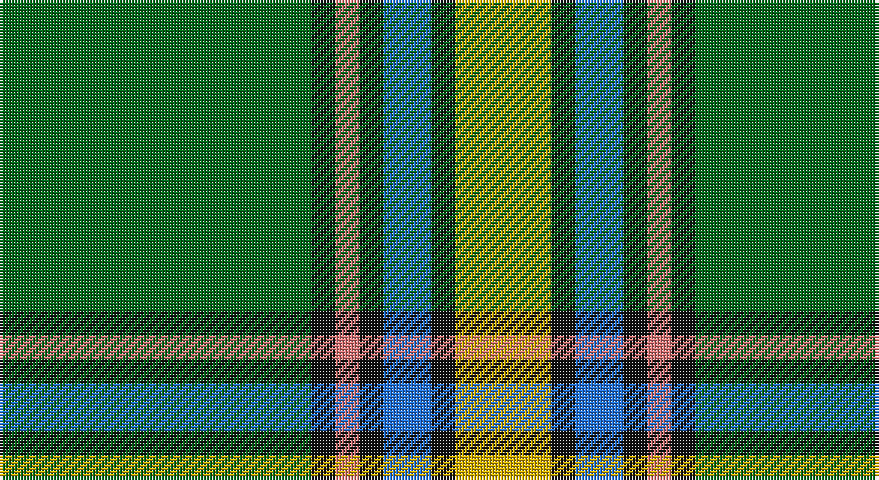

This page is one **sett** — a single exact thread-count. It belongs to the [tartan](/setts/g13k1r1k1b2k1ly4/)
(the same proportion at any scale), whose colour order is pattern [GKRKBKY](/stripes/gkrkbky/).

Part of the [Alberta](/tartans/alberta/) tartan — the named design grouping this sett with its other cloths.

Sourced from register-of-tartans.  It is a [7 stripe tartan](/stripes/stripes7/).

Original link https://www.tartanregister.gov.uk/tartanDetails.aspx?ref=39

## Register references

External register numbers recorded for this tartan.

- Scottish Register of Tartans: [39](https://www.tartanregister.gov.uk/tartanDetails.aspx?ref=39)
- Scottish Tartans Authority (ITI): 2055
- Scottish Tartans World Register: 2055

## Thread count
G/104 K8 LR8 K8 B16 K8 Y/32

One full sett is **232 threads**.

## Palette

Palette: <strong>Tartan Register</strong>
<table><thead><tr><th>Colour</th><th>Threads</th><th>Shade</th><th>Base</th><th>OKLCh</th></tr></thead><tbody><tr><td>G/</td><td style="text-align:right;font-variant-numeric:tabular-nums">104</td><td><code style="background-color:#006818;">#006818</code> <small style="color:#888">#006818</small></td><td>G <code style="background-color:#006100;">#006100</code></td><td><small style="color:#888">oklch(45.0% 0.142 145.0)</small></td></tr><tr><td>K</td><td style="text-align:right;font-variant-numeric:tabular-nums">8</td><td><code style="background-color:#101010;">#101010</code> <small style="color:#888">#101010</small></td><td>K <code style="background-color:#000000;">#000000</code></td><td><small style="color:#888">oklch(17.3% 0.000 89.9)</small></td></tr><tr><td>LR</td><td style="text-align:right;font-variant-numeric:tabular-nums">8</td><td><code style="background-color:#E87878;">#E87878</code> <small style="color:#888">#E87878</small></td><td>R <code style="background-color:#CC0000;">#CC0000</code></td><td><small style="color:#888">oklch(70.0% 0.139 21.2)</small></td></tr><tr><td>K</td><td style="text-align:right;font-variant-numeric:tabular-nums">8</td><td><code style="background-color:#101010;">#101010</code> <small style="color:#888">#101010</small></td><td>K <code style="background-color:#000000;">#000000</code></td><td><small style="color:#888">oklch(17.3% 0.000 89.9)</small></td></tr><tr><td>B</td><td style="text-align:right;font-variant-numeric:tabular-nums">16</td><td><code style="background-color:#2474E8;">#2474E8</code> <small style="color:#888">#2474E8</small></td><td>B <code style="background-color:#2A418A;">#2A418A</code></td><td><small style="color:#888">oklch(57.8% 0.192 258.7)</small></td></tr><tr><td>K</td><td style="text-align:right;font-variant-numeric:tabular-nums">8</td><td><code style="background-color:#101010;">#101010</code> <small style="color:#888">#101010</small></td><td>K <code style="background-color:#000000;">#000000</code></td><td><small style="color:#888">oklch(17.3% 0.000 89.9)</small></td></tr><tr><td>Y/</td><td style="text-align:right;font-variant-numeric:tabular-nums">32</td><td><code style="background-color:#D8B000;">#D8B000</code> <small style="color:#888">#D8B000</small></td><td>Y <code style="background-color:#F2BF00;">#F2BF00</code></td><td><small style="color:#888">oklch(77.1% 0.158 92.3)</small></td></tr></tbody></table>

# Sample pattern

## Compared to the master

This cloth is one sett of its design; the master sett (the exemplar the design is anchored on) is below for comparison.

<figure style="margin:0"><figcaption style="color:#888;font-size:smaller">this sett</figcaption></figure>
<figure style="margin:0"><figcaption style="color:#888;font-size:smaller"><a href="/setts/dg50k4dy6db28dy1db1dy1db1dy1db1dy1db1dy1db1dy1db1dy8k24dg12k4db20k1db1k1db1k1db1k1db1k1db1k1db1k8dg8db16/">master sett →</a></figcaption></figure>

## Nearest tartans

The nearest existing variants by ΔTartan distance, with this tartan at the top so the swatches line up against it.

ΔTartan

Tartan

Sett

—

<a href="/ttd/edit/#slug=g13k1r1k1b2k1ly4~x8">Alberta (Province)</a> <a class="nn-out" href="/variants/s7/g13k1r1k1b2k1ly4~x8/" title="open its dictionary page">↗</a>

0.29

<a href="/ttd/edit/#slug=g12k1r1k1b2k1ly4~x8&amp;base=g13k1r1k1b2k1ly4~x8">Alberta (District)</a> <a class="nn-out" href="/variants/s7/g12k1r1k1b2k1ly4~x8/" title="open its dictionary page">↗</a>

0.41

<a href="/ttd/edit/#slug=g12k1r1k1t2k1ly4~x2&amp;base=g13k1r1k1b2k1ly4~x8">Alberta District Tartan</a> <a class="nn-out" href="/variants/s7/g12k1r1k1t2k1ly4~x2/" title="open its dictionary page">↗</a>

0.73

<a href="/ttd/edit/#slug=w6g5r5g45k4o24k4g5~x2&amp;base=g13k1r1k1b2k1ly4~x8">O'Neill</a> <a class="nn-out" href="/variants/s8/w6g5r5g45k4o24k4g5~x2/" title="open its dictionary page">↗</a>

0.76

<a href="/ttd/edit/#slug=g18r1lb2k1lb2r1o6k2~x4&amp;base=g13k1r1k1b2k1ly4~x8">Humphries (Name)</a> <a class="nn-out" href="/variants/s8/g18r1lb2k1lb2r1o6k2~x4/" title="open its dictionary page">↗</a>

0.85

<a href="/ttd/edit/#slug=w6g5r5g45k4lo24k4g5~x2&amp;base=g13k1r1k1b2k1ly4~x8">O'Neill (Name)</a> <a class="nn-out" href="/variants/s8/w6g5r5g45k4lo24k4g5~x2/" title="open its dictionary page">↗</a>

0.97

<a href="/ttd/edit/#slug=g13p1g1p1g3db5k4ly2~x2&amp;base=g13k1r1k1b2k1ly4~x8">Carrick, hunting</a> <a class="nn-out" href="/variants/s8/g13p1g1p1g3db5k4ly2~x2/" title="open its dictionary page">↗</a>

1.00

<a href="/ttd/edit/#slug=ly5g3ly3g53r7db5r13w4~x2&amp;base=g13k1r1k1b2k1ly4~x8">Hall (P.I.E.) (Personal)</a> <a class="nn-out" href="/variants/s8/ly5g3ly3g53r7db5r13w4~x2/" title="open its dictionary page">↗</a>

1.05

<a href="/ttd/edit/#slug=t2g1t1g12dg2g1m6ly2~x4&amp;base=g13k1r1k1b2k1ly4~x8">Manitoba</a> <a class="nn-out" href="/variants/s8/t2g1t1g12dg2g1m6ly2~x4/" title="open its dictionary page">↗</a>

1.08

<a href="/ttd/edit/#slug=w9dg2g2w3g18k2dg33lo2~x2&amp;base=g13k1r1k1b2k1ly4~x8">New World Irish (Fashion)</a> <a class="nn-out" href="/variants/s8/w9dg2g2w3g18k2dg33lo2~x2/" title="open its dictionary page">↗</a>

1.12

<a href="/ttd/edit/#slug=g20ly2o5w4g2o2g2o2db6~x2&amp;base=g13k1r1k1b2k1ly4~x8">Boucherville (Tartan de..) District Tartan</a> <a class="nn-out" href="/variants/s9/g20ly2o5w4g2o2g2o2db6~x2/" title="open its dictionary page">↗</a>

## Neighbour map

Every grey dot is one of 14360 variants placed by the first two principal components of the ΔTartan feature space (44% of its variance). Red is this tartan; blue dots are its nearest — click one to open its page.

<svg viewBox="0 0 640 380" role="img" style="max-width:100%;height:auto;border:1px solid #e0e0e0;border-radius:4px;display:block" xmlns="http://www.w3.org/2000/svg"><image href="/nn/cloud.v1.png" width="640" height="380"/><a href="/variants/s7/g12k1r1k1b2k1ly4~x8/"><circle cx="270.2" cy="157.0" r="4" fill="#3465a4"><title>Alberta (District)</title></circle></a><a href="/variants/s7/g12k1r1k1t2k1ly4~x2/"><circle cx="269.8" cy="155.8" r="4" fill="#3465a4"><title>Alberta District Tartan</title></circle></a><a href="/variants/s8/w6g5r5g45k4o24k4g5~x2/"><circle cx="282.8" cy="159.7" r="4" fill="#3465a4"><title>O'Neill</title></circle></a><a href="/variants/s8/g18r1lb2k1lb2r1o6k2~x4/"><circle cx="289.1" cy="129.5" r="4" fill="#3465a4"><title>Humphries (Name)</title></circle></a><a href="/variants/s8/w6g5r5g45k4lo24k4g5~x2/"><circle cx="299.0" cy="167.7" r="4" fill="#3465a4"><title>O'Neill (Name)</title></circle></a><a href="/variants/s8/g13p1g1p1g3db5k4ly2~x2/"><circle cx="259.6" cy="159.7" r="4" fill="#3465a4"><title>Carrick, hunting</title></circle></a><a href="/variants/s8/ly5g3ly3g53r7db5r13w4~x2/"><circle cx="344.4" cy="131.8" r="4" fill="#3465a4"><title>Hall (P.I.E.) (Personal)</title></circle></a><a href="/variants/s8/t2g1t1g12dg2g1m6ly2~x4/"><circle cx="266.8" cy="167.6" r="4" fill="#3465a4"><title>Manitoba</title></circle></a><a href="/variants/s8/w9dg2g2w3g18k2dg33lo2~x2/"><circle cx="269.8" cy="150.2" r="4" fill="#3465a4"><title>New World Irish (Fashion)</title></circle></a><a href="/variants/s9/g20ly2o5w4g2o2g2o2db6~x2/"><circle cx="257.8" cy="164.4" r="4" fill="#3465a4"><title>Boucherville (Tartan de..) District Tartan</title></circle></a><circle cx="290.2" cy="153.1" r="5" fill="#c00000"/></svg>

ID: /variants/s7/g13k1r1k1b2k1ly4~x8/
