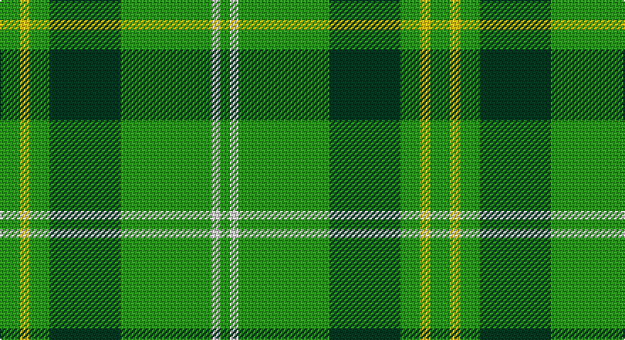

This page is one **sett** — a single exact thread-count. It belongs to the [tartan](/setts/g14ly7g14dg50g64w6g7/)
(the same proportion at any scale), whose colour order is pattern [GWGGGYG](/stripes/gwgggyg/).

Sourced from register-of-tartans.  It is a [7 stripe tartan](/stripes/stripes7/).

Original link https://www.tartanregister.gov.uk/tartanDetails.aspx?ref=1277

2 attestations — the source records this cloth was collapsed from (oldest owns this page)

<ul>
<li>01/03/2007 — Freedom of Derry (register-of-tartans, <a href="https://www.tartanregister.gov.uk/tartanDetails.aspx?ref=1277">record</a>)</li>
<li>March 2007 — Freedom of Derry (Fashion) (tartans-authority, <a href="http://www.tartansauthority.com/tartan-ferret/display/7195/">record</a>)</li>
</ul>

## Register references

External register numbers recorded for this tartan.

- Scottish Register of Tartans: [1277](https://www.tartanregister.gov.uk/tartanDetails.aspx?ref=1277)
- Scottish Tartans Authority (ITI): 7195

## Thread count
G/14 Y7 G14 DG50 G64 LN6 G/7

One full sett is **303 threads**.

## Palette

Palette: <strong>Tartan Register</strong>
<table><thead><tr><th>Colour</th><th>Threads</th><th>Shade</th><th>Base</th><th>OKLCh</th></tr></thead><tbody><tr><td>G/</td><td style="text-align:right;font-variant-numeric:tabular-nums">14</td><td><code style="background-color:#289C18;">#289C18</code> <small style="color:#888">#289C18</small></td><td>G <code style="background-color:#006100;">#006100</code></td><td><small style="color:#888">oklch(60.6% 0.191 141.6)</small></td></tr><tr><td>Y</td><td style="text-align:right;font-variant-numeric:tabular-nums">7</td><td><code style="background-color:#E8C000;">#E8C000</code> <small style="color:#888">#E8C000</small></td><td>Y <code style="background-color:#F2BF00;">#F2BF00</code></td><td><small style="color:#888">oklch(81.9% 0.168 93.7)</small></td></tr><tr><td>G</td><td style="text-align:right;font-variant-numeric:tabular-nums">14</td><td><code style="background-color:#289C18;">#289C18</code> <small style="color:#888">#289C18</small></td><td>G <code style="background-color:#006100;">#006100</code></td><td><small style="color:#888">oklch(60.6% 0.191 141.6)</small></td></tr><tr><td>DG</td><td style="text-align:right;font-variant-numeric:tabular-nums">50</td><td><code style="background-color:#003820;">#003820</code> <small style="color:#888">#003820</small></td><td>G <code style="background-color:#006100;">#006100</code></td><td><small style="color:#888">oklch(30.0% 0.070 158.3)</small></td></tr><tr><td>G</td><td style="text-align:right;font-variant-numeric:tabular-nums">64</td><td><code style="background-color:#289C18;">#289C18</code> <small style="color:#888">#289C18</small></td><td>G <code style="background-color:#006100;">#006100</code></td><td><small style="color:#888">oklch(60.6% 0.191 141.6)</small></td></tr><tr><td>LN</td><td style="text-align:right;font-variant-numeric:tabular-nums">6</td><td><code style="background-color:#E0E0E0;">#E0E0E0</code> <small style="color:#888">#E0E0E0</small></td><td>W <code style="background-color:#F7F7F7;">#F7F7F7</code></td><td><small style="color:#888">oklch(90.7% 0.000 89.9)</small></td></tr><tr><td>G/</td><td style="text-align:right;font-variant-numeric:tabular-nums">7</td><td><code style="background-color:#289C18;">#289C18</code> <small style="color:#888">#289C18</small></td><td>G <code style="background-color:#006100;">#006100</code></td><td><small style="color:#888">oklch(60.6% 0.191 141.6)</small></td></tr></tbody></table>

# Sample pattern

## Nearest tartans

The nearest existing variants by ΔTartan distance, with this tartan at the top so the swatches line up against it.

ΔTartan

Tartan

Sett

—

<a href="/ttd/edit/#slug=g14ly7g14dg50g64w6g7">Freedom of Derry</a> <a class="nn-out" href="/variants/s7/g14ly7g14dg50g64w6g7/" title="open its dictionary page">↗</a>

0.98

<a href="/ttd/edit/#slug=k3lb1g15g6k2dr3lb2~x2&amp;base=g14ly7g14dg50g64w6g7">Leach Hunting</a> <a class="nn-out" href="/variants/s7/k3lb1g15g6k2dr3lb2~x2/" title="open its dictionary page">↗</a>

1.15

<a href="/ttd/edit/#slug=g8w4g50k12g4k15lo5~x2&amp;base=g14ly7g14dg50g64w6g7">Instakilt, Green (Fashion)</a> <a class="nn-out" href="/variants/s7/g8w4g50k12g4k15lo5~x2/" title="open its dictionary page">↗</a>

1.31

<a href="/ttd/edit/#slug=db9dg16g56ly4~x2&amp;base=g14ly7g14dg50g64w6g7">Oxford University</a> <a class="nn-out" href="/variants/s4/db9dg16g56ly4~x2/" title="open its dictionary page">↗</a>

1.34

<a href="/ttd/edit/#slug=db1r3g11r2db5g11ly1~x2&amp;base=g14ly7g14dg50g64w6g7">MacKintosh, hunting</a> <a class="nn-out" href="/variants/s7/db1r3g11r2db5g11ly1~x2/" title="open its dictionary page">↗</a>

1.37

<a href="/ttd/edit/#slug=g4ly2g17dg2r4dg2g3dg11g2~x2&amp;base=g14ly7g14dg50g64w6g7">Armagh</a> <a class="nn-out" href="/variants/s9/g4ly2g17dg2r4dg2g3dg11g2~x2/" title="open its dictionary page">↗</a>

1.43

<a href="/ttd/edit/#slug=g18r6g75b6g13dy35g12b6&amp;base=g14ly7g14dg50g64w6g7">Glenlivet</a> <a class="nn-out" href="/variants/s8/g18r6g75b6g13dy35g12b6/" title="open its dictionary page">↗</a>

1.46

<a href="/ttd/edit/#slug=g4r1g15t5r1w5g4r1~x4&amp;base=g14ly7g14dg50g64w6g7">McGirr (Letterkenny) David, (Pers.)</a> <a class="nn-out" href="/variants/s8/g4r1g15t5r1w5g4r1~x4/" title="open its dictionary page">↗</a>

1.56

<a href="/ttd/edit/#slug=r8g12w5k11g42k3~x2&amp;base=g14ly7g14dg50g64w6g7">Sir Billi (Corporate)</a> <a class="nn-out" href="/variants/s6/r8g12w5k11g42k3~x2/" title="open its dictionary page">↗</a>

1.58

<a href="/ttd/edit/#slug=g56dy13ly13w5~x2&amp;base=g14ly7g14dg50g64w6g7">Colonial Marine (Aliens Legacy)</a> <a class="nn-out" href="/variants/s4/g56dy13ly13w5~x2/" title="open its dictionary page">↗</a>

1.62

<a href="/ttd/edit/#slug=r1g6ly1g6db1g1db1g1db2r1~x4&amp;base=g14ly7g14dg50g64w6g7">Ayrton, Laoch</a> <a class="nn-out" href="/variants/s10/r1g6ly1g6db1g1db1g1db2r1~x4/" title="open its dictionary page">↗</a>

## Neighbour map

Every grey dot is one of 14360 variants placed by the first two principal components of the ΔTartan feature space (44% of its variance). Red is this tartan; blue dots are its nearest — click one to open its page.

<svg viewBox="0 0 640 380" role="img" style="max-width:100%;height:auto;border:1px solid #e0e0e0;border-radius:4px;display:block" xmlns="http://www.w3.org/2000/svg"><image href="/nn/cloud.v1.png" width="640" height="380"/><a href="/variants/s7/k3lb1g15g6k2dr3lb2~x2/"><circle cx="351.1" cy="180.2" r="4" fill="#3465a4"><title>Leach Hunting</title></circle></a><a href="/variants/s7/g8w4g50k12g4k15lo5~x2/"><circle cx="337.8" cy="177.2" r="4" fill="#3465a4"><title>Instakilt, Green (Fashion)</title></circle></a><a href="/variants/s4/db9dg16g56ly4~x2/"><circle cx="384.0" cy="221.3" r="4" fill="#3465a4"><title>Oxford University</title></circle></a><a href="/variants/s7/db1r3g11r2db5g11ly1~x2/"><circle cx="364.5" cy="217.9" r="4" fill="#3465a4"><title>MacKintosh, hunting</title></circle></a><a href="/variants/s9/g4ly2g17dg2r4dg2g3dg11g2~x2/"><circle cx="303.7" cy="209.6" r="4" fill="#3465a4"><title>Armagh</title></circle></a><a href="/variants/s8/g18r6g75b6g13dy35g12b6/"><circle cx="418.6" cy="200.2" r="4" fill="#3465a4"><title>Glenlivet</title></circle></a><a href="/variants/s8/g4r1g15t5r1w5g4r1~x4/"><circle cx="352.6" cy="180.9" r="4" fill="#3465a4"><title>McGirr (Letterkenny) David, (Pers.)</title></circle></a><a href="/variants/s6/r8g12w5k11g42k3~x2/"><circle cx="372.8" cy="192.4" r="4" fill="#3465a4"><title>Sir Billi (Corporate)</title></circle></a><a href="/variants/s4/g56dy13ly13w5~x2/"><circle cx="363.8" cy="225.1" r="4" fill="#3465a4"><title>Colonial Marine (Aliens Legacy)</title></circle></a><a href="/variants/s10/r1g6ly1g6db1g1db1g1db2r1~x4/"><circle cx="355.0" cy="218.7" r="4" fill="#3465a4"><title>Ayrton, Laoch</title></circle></a><circle cx="336.3" cy="205.6" r="5" fill="#c00000"/></svg>

ID: /variants/s7/g14ly7g14dg50g64w6g7/
