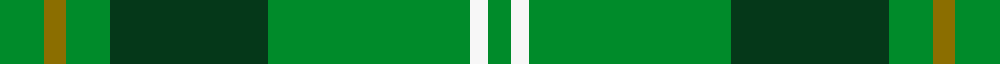

This page is one **sett** — a single exact thread-count. It belongs to the [tartan](/setts/g14y7g14dg50g64w6g7/)
(the same proportion at any scale), whose colour order is pattern [GGGGGWG](/stripes/gggggwg/).

Sourced from register-of-tartans.  It is a [7 stripe tartan](/stripes/stripes7/).

Original link https://www.tartanregister.gov.uk/tartanDetails.aspx?ref=1277

2 attestations — the source records this cloth was collapsed from (oldest owns this page)

<ul>
<li>01/03/2007 — Freedom of Derry (register-of-tartans, <a href="https://www.tartanregister.gov.uk/tartanDetails.aspx?ref=1277">record</a>)  <em>Designed by Helen Marshall of Marton Mills for Elizabeth Allen Kilthire of Carfin, Lanarkshire for their kilthire business.</em></li>
<li>March 2007 — Freedom of Derry (Fashion) (tartans-authority, <a href="http://www.tartansauthority.com/tartan-ferret/display/7195/">record</a>)  <em>Designed by Helen Marshall of Marton Mills for Elizabeth Allen Kilthire of Carfin, Lanarkshire for their kilthire business.</em></li>
</ul>

## Register references

External register numbers recorded for this tartan.

- Scottish Register of Tartans: [1277](https://www.tartanregister.gov.uk/tartanDetails.aspx?ref=1277)
- Scottish Tartans Authority (ITI): 7195

## Thread count
G/14 Y7 G14 DG50 G64 W6 G/7

One full sett is **303 threads**.

## Palette
<table><thead><tr><th>Colour</th><th>Shade</th><th>OKLCh</th></tr></thead><tbody><tr><td>DG</td><td><code style="background-color:#053819;">#053819</code> <small style="color:#888">#053819</small></td><td><small style="color:#888">oklch(30.0% 0.075 151.3)</small></td></tr><tr><td>G</td><td><code style="background-color:#008B2A;">#008B2A</code> <small style="color:#888">#008B2A</small></td><td><small style="color:#888">oklch(55.4% 0.170 145.9)</small></td></tr><tr><td>LN</td><td><code style="background-color:#F7F7F7;">#F7F7F7</code> <small style="color:#888">#F7F7F7</small></td><td><small style="color:#888">oklch(97.6% 0.000 89.9)</small></td></tr><tr><td>Y</td><td><code style="background-color:#8B6E00;">#8B6E00</code> <small style="color:#888">#8B6E00</small></td><td><small style="color:#888">oklch(55.1% 0.113 90.4)</small></td></tr></tbody></table>

# Sample pattern

## Nearest variants

The nearest existing variants by ΔTartan distance, with this cloth at the top so the swatches line up against it.

ΔTartan

Threads

Variant

Sett

—

303

<a href="/variants/s7/g14y7g14dg50g64w6g7/">Freedom of Derry</a>

<a href="/ttd/edit/#slug=g24r9g4dg19y2dg6g7~x2&amp;base=g14y7g14dg50g64w6g7" title="compare in the TTD">2.48</a>

222

<a href="/variants/s7/g24r9g4dg19y2dg6g7~x2/">Doyle</a>

<a href="/ttd/edit/#slug=dt16g4dt3g3lo2g24dr2~x2&amp;base=g14y7g14dg50g64w6g7" title="compare in the TTD">2.54</a>

180

<a href="/variants/s7/dt16g4dt3g3lo2g24dr2~x2/">St. Andrews Links (Corporate)</a>

<a href="/ttd/edit/#slug=g4y2g17dg2r4dg2g3dg11g2~x2&amp;base=g14y7g14dg50g64w6g7" title="compare in the TTD">2.96</a>

176

<a href="/variants/s9/g4y2g17dg2r4dg2g3dg11g2~x2/">Armagh</a>

## Neighbour map

Every grey dot is one of 13620 variants placed by the first two principal components of the ΔTartan feature space (42% of its variance). Red is this tartan; blue dots are its nearest — click one to open its page.

<svg viewBox="0 0 640 380" role="img" style="max-width:100%;height:auto;border:1px solid #e0e0e0;border-radius:4px;display:block" xmlns="http://www.w3.org/2000/svg"><image href="/nn/cloud.v1.png" width="640" height="380"/><a href="/variants/s7/g24r9g4dg19y2dg6g7~x2/"><circle cx="309.2" cy="229.9" r="4" fill="#3465a4"><title>Doyle</title></circle></a><a href="/variants/s7/dt16g4dt3g3lo2g24dr2~x2/"><circle cx="400.6" cy="221.8" r="4" fill="#3465a4"><title>St. Andrews Links (Corporate)</title></circle></a><a href="/variants/s9/g4y2g17dg2r4dg2g3dg11g2~x2/"><circle cx="347.2" cy="219.9" r="4" fill="#3465a4"><title>Armagh</title></circle></a><circle cx="406.5" cy="233.2" r="5" fill="#c00000"/><text x="320" y="376" text-anchor="middle" font-size="11" fill="#999">ground</text><text x="11" y="190" text-anchor="middle" font-size="11" fill="#999" transform="rotate(-90 11 190)">complexity</text></svg>

ID: /variants/s7/g14y7g14dg50g64w6g7/
