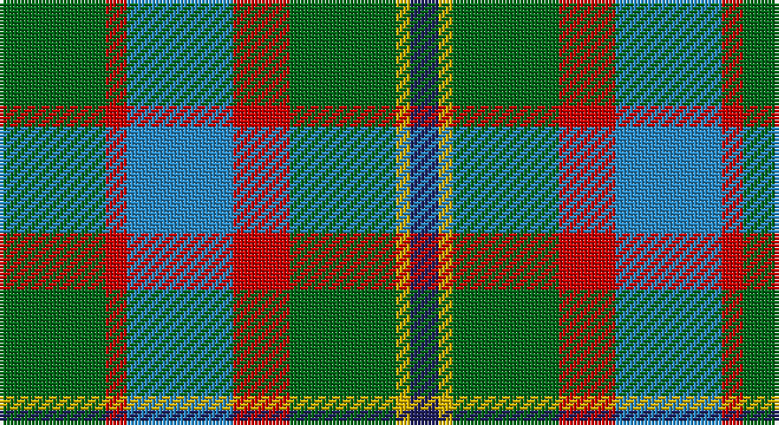

This page is one **sett** — a single exact thread-count. It belongs to the [tartan](/setts/g15r3t15r8g15ly2db4/)
(the same proportion at any scale), whose colour order is pattern [BYGRBRG](/stripes/bygrbrg/).

Part of the [Rotary](/tartans/rotary/) tartan — the named design grouping this sett with its other cloths.

Sourced from register-of-tartans.  It is a [7 stripe tartan](/stripes/stripes7/).

Original link https://www.tartanregister.gov.uk/tartanDetails.aspx?ref=3570

## Also known as

This cloth is also recorded under:

- Rotary International

2 attestations — the source records this cloth was collapsed from (oldest owns this page)

<ul>
<li>01/01/1993 — Rotary International (register-of-tartans, <a href="https://www.tartanregister.gov.uk/tartanDetails.aspx?ref=3570">record</a>)</li>
<li>Mar. 1996 — Rotary International (Corporate) (tartans-authority, <a href="http://www.tartansauthority.com/tartan-ferret/display/2334/">record</a>)</li>
</ul>

## Register references

External register numbers recorded for this tartan.

- Scottish Register of Tartans: [3570](https://www.tartanregister.gov.uk/tartanDetails.aspx?ref=3570)
- Scottish Tartans Authority (ITI): 2334
- Scottish Tartans World Register: 2334

## Thread count
G/30 R6 B30 R16 G30 Y4 DB/8

One full sett is **210 threads**.

## Palette

Palette: <strong>Tartan Register</strong>
<table><thead><tr><th>Colour</th><th>Threads</th><th>Shade</th><th>Base</th><th>OKLCh</th></tr></thead><tbody><tr><td>G/</td><td style="text-align:right;font-variant-numeric:tabular-nums">30</td><td><code style="background-color:#006818;">#006818</code> <small style="color:#888">#006818</small></td><td>G <code style="background-color:#006100;">#006100</code></td><td><small style="color:#888">oklch(45.0% 0.142 145.0)</small></td></tr><tr><td>R</td><td style="text-align:right;font-variant-numeric:tabular-nums">6</td><td><code style="background-color:#C80000;">#C80000</code> <small style="color:#888">#C80000</small></td><td>R <code style="background-color:#CC0000;">#CC0000</code></td><td><small style="color:#888">oklch(52.3% 0.215 29.2)</small></td></tr><tr><td>B</td><td style="text-align:right;font-variant-numeric:tabular-nums">30</td><td><code style="background-color:#2888C4;">#2888C4</code> <small style="color:#888">#2888C4</small></td><td>B <code style="background-color:#2A418A;">#2A418A</code></td><td><small style="color:#888">oklch(60.1% 0.125 241.5)</small></td></tr><tr><td>R</td><td style="text-align:right;font-variant-numeric:tabular-nums">16</td><td><code style="background-color:#C80000;">#C80000</code> <small style="color:#888">#C80000</small></td><td>R <code style="background-color:#CC0000;">#CC0000</code></td><td><small style="color:#888">oklch(52.3% 0.215 29.2)</small></td></tr><tr><td>G</td><td style="text-align:right;font-variant-numeric:tabular-nums">30</td><td><code style="background-color:#006818;">#006818</code> <small style="color:#888">#006818</small></td><td>G <code style="background-color:#006100;">#006100</code></td><td><small style="color:#888">oklch(45.0% 0.142 145.0)</small></td></tr><tr><td>Y</td><td style="text-align:right;font-variant-numeric:tabular-nums">4</td><td><code style="background-color:#D8B000;">#D8B000</code> <small style="color:#888">#D8B000</small></td><td>Y <code style="background-color:#F2BF00;">#F2BF00</code></td><td><small style="color:#888">oklch(77.1% 0.158 92.3)</small></td></tr><tr><td>DB/</td><td style="text-align:right;font-variant-numeric:tabular-nums">8</td><td><code style="background-color:#202060;">#202060</code> <small style="color:#888">#202060</small></td><td>B <code style="background-color:#2A418A;">#2A418A</code></td><td><small style="color:#888">oklch(28.9% 0.111 276.9)</small></td></tr></tbody></table>

# Sample pattern

## Nearest tartans

The nearest existing variants by ΔTartan distance, with this tartan at the top so the swatches line up against it.

ΔTartan

Tartan

Sett

—

<a href="/ttd/edit/#slug=g15r3t15r8g15ly2db4~x2">Rotary International</a> <a class="nn-out" href="/variants/s7/g15r3t15r8g15ly2db4~x2/" title="open its dictionary page">↗</a>

0.87

<a href="/ttd/edit/#slug=g25r4db25r13g25ly2t6~x2&amp;base=g15r3t15r8g15ly2db4~x2">Rotary</a> <a class="nn-out" href="/variants/s7/g25r4db25r13g25ly2t6~x2/" title="open its dictionary page">↗</a>

1.07

<a href="/ttd/edit/#slug=n8ly2n22dg6r2lb10dg12n3~x2&amp;base=g15r3t15r8g15ly2db4~x2">Bahamas</a> <a class="nn-out" href="/variants/s8/n8ly2n22dg6r2lb10dg12n3~x2/" title="open its dictionary page">↗</a>

1.18

<a href="/ttd/edit/#slug=g14dp11y3k5y3dp11g14ly2~x2&amp;base=g15r3t15r8g15ly2db4~x2">Wilson's No.124</a> <a class="nn-out" href="/variants/s8/g14dp11y3k5y3dp11g14ly2~x2/" title="open its dictionary page">↗</a>

1.20

<a href="/ttd/edit/#slug=g14dt11y3k5y3dt11g14ly2~x2&amp;base=g15r3t15r8g15ly2db4~x2">Wilson's No.122</a> <a class="nn-out" href="/variants/s8/g14dt11y3k5y3dt11g14ly2~x2/" title="open its dictionary page">↗</a>

1.21

<a href="/variants/s12/g15r3t15r8g15ly2db4~x2/">Rotary Corporate Tartan</a>

1.24

<a href="/ttd/edit/#slug=n8ly2n22g6r2lb10g12n3~x2&amp;base=g15r3t15r8g15ly2db4~x2">Bahamas (District)</a> <a class="nn-out" href="/variants/s8/n8ly2n22g6r2lb10g12n3~x2/" title="open its dictionary page">↗</a>

1.24

<a href="/ttd/edit/#slug=loi30w4loi20g20k20lo3k6~x2&amp;base=g15r3t15r8g15ly2db4~x2">St Andrews Bay</a> <a class="nn-out" href="/variants/s7/loi30w4loi20g20k20lo3k6~x2/" title="open its dictionary page">↗</a>

1.25

<a href="/ttd/edit/#slug=g10dp42r5gi42g42ly5g6&amp;base=g15r3t15r8g15ly2db4~x2">New Mexico (Fashion)</a> <a class="nn-out" href="/variants/s7/g10dp42r5gi42g42ly5g6/" title="open its dictionary page">↗</a>

1.26

<a href="/ttd/edit/#slug=g31ly4g6k19db18t9~x2&amp;base=g15r3t15r8g15ly2db4~x2">Lanarkshire</a> <a class="nn-out" href="/variants/s6/g31ly4g6k19db18t9~x2/" title="open its dictionary page">↗</a>

1.30

<a href="/ttd/edit/#slug=g15ly3r3dp8w2~x6&amp;base=g15r3t15r8g15ly2db4~x2">ChuMac (Personal)</a> <a class="nn-out" href="/variants/s5/g15ly3r3dp8w2~x6/" title="open its dictionary page">↗</a>

## Neighbour map

Every grey dot is one of 14360 variants placed by the first two principal components of the ΔTartan feature space (44% of its variance). Red is this tartan; blue dots are its nearest — click one to open its page.

<svg viewBox="0 0 640 380" role="img" style="max-width:100%;height:auto;border:1px solid #e0e0e0;border-radius:4px;display:block" xmlns="http://www.w3.org/2000/svg"><image href="/nn/cloud.v1.png" width="640" height="380"/><a href="/variants/s7/g25r4db25r13g25ly2t6~x2/"><circle cx="242.5" cy="205.5" r="4" fill="#3465a4"><title>Rotary</title></circle></a><a href="/variants/s8/n8ly2n22dg6r2lb10dg12n3~x2/"><circle cx="248.8" cy="196.4" r="4" fill="#3465a4"><title>Bahamas</title></circle></a><a href="/variants/s8/g14dp11y3k5y3dp11g14ly2~x2/"><circle cx="184.5" cy="221.6" r="4" fill="#3465a4"><title>Wilson's No.124</title></circle></a><a href="/variants/s8/g14dt11y3k5y3dt11g14ly2~x2/"><circle cx="200.1" cy="242.9" r="4" fill="#3465a4"><title>Wilson's No.122</title></circle></a><a href="/variants/s12/g15r3t15r8g15ly2db4~x2/"><circle cx="170.3" cy="200.6" r="4" fill="#3465a4"><title>Rotary Corporate Tartan</title></circle></a><a href="/variants/s8/n8ly2n22g6r2lb10g12n3~x2/"><circle cx="260.6" cy="202.4" r="4" fill="#3465a4"><title>Bahamas (District)</title></circle></a><a href="/variants/s7/loi30w4loi20g20k20lo3k6~x2/"><circle cx="198.6" cy="198.6" r="4" fill="#3465a4"><title>St Andrews Bay</title></circle></a><a href="/variants/s7/g10dp42r5gi42g42ly5g6/"><circle cx="171.4" cy="198.7" r="4" fill="#3465a4"><title>New Mexico (Fashion)</title></circle></a><a href="/variants/s6/g31ly4g6k19db18t9~x2/"><circle cx="165.1" cy="233.2" r="4" fill="#3465a4"><title>Lanarkshire</title></circle></a><a href="/variants/s5/g15ly3r3dp8w2~x6/"><circle cx="205.2" cy="211.4" r="4" fill="#3465a4"><title>ChuMac (Personal)</title></circle></a><circle cx="205.5" cy="227.5" r="5" fill="#c00000"/></svg>

ID: /variants/s7/g15r3t15r8g15ly2db4~x2/
