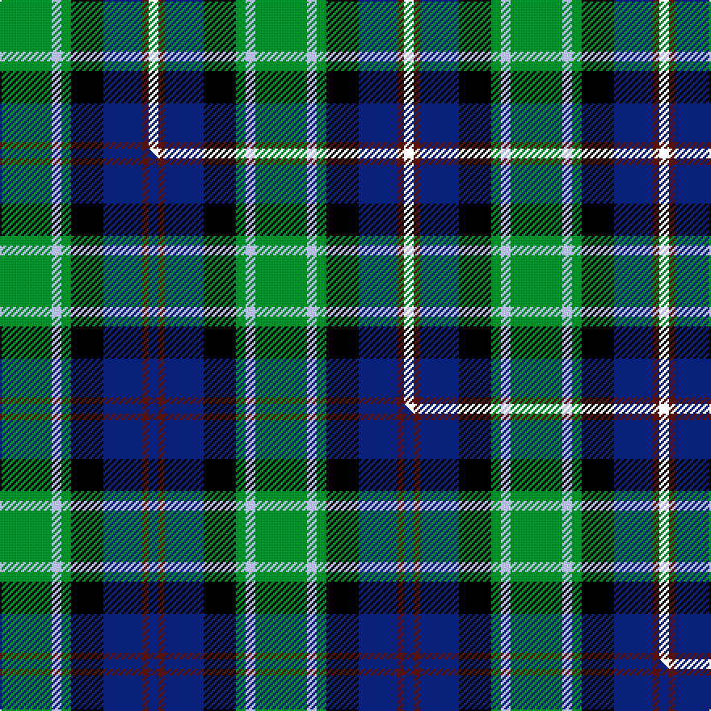

This page is one **sett** — a single exact thread-count. It belongs to the [tartan](/setts/g16lb3g3k10db12dr2k3/)
(the same proportion at any scale), whose colour order is pattern [GWGKBBK](/stripes/gwgkbbk/).

Part of the [MacLean, Donald](/tartans/maclean-donald/) tartan — the named design grouping this sett with its other cloths.

Sourced from house-of-tartan.  It is a [7 stripe tartan](/stripes/stripes7/).

Original link http://www.house-of-tartan.scotland.net/house/TartanViewjs.asp?colr=Def&tnam=3440

## Provenance

Earliest known date: pre 2002 From Pendleton Woolen Mills of Oregon, owners of the only copy of Clans Originaux. EBW 8.11.02. This is the same as MacTaggart #408 and #409!!!

## Thread count
G/32 LB6 G6 K20 DB24 DR4 K/6

One full sett is **158 threads**.

## Palette
<table><thead><tr><th>Colour</th><th>Shade</th><th>OKLCh</th></tr></thead><tbody><tr><td>DB</td><td><code style="background-color:#082077;">#082077</code> <small style="color:#888">#082077</small></td><td><small style="color:#888">oklch(30.0% 0.149 265.1)</small></td></tr><tr><td>DR</td><td><code style="background-color:#55120C;">#55120C</code> <small style="color:#888">#55120C</small></td><td><small style="color:#888">oklch(30.0% 0.099 29.3)</small></td></tr><tr><td>G</td><td><code style="background-color:#008B2A;">#008B2A</code> <small style="color:#888">#008B2A</small></td><td><small style="color:#888">oklch(55.4% 0.170 145.9)</small></td></tr><tr><td>K</td><td><code style="background-color:#000000;">#000000</code> <small style="color:#888">#000000</small></td><td><small style="color:#888">oklch(0.0% 0.000 0.0)</small></td></tr><tr><td>LB</td><td><code style="background-color:#B5BBDE;">#B5BBDE</code> <small style="color:#888">#B5BBDE</small></td><td><small style="color:#888">oklch(79.9% 0.050 277.6)</small></td></tr></tbody></table>

# Sample pattern

## Compared to the master

This cloth is one sett of its design; the master sett (the exemplar the design is anchored on) is below for comparison.

Its **ΔTartan distance** from the master is **0.92** — the same measure the nearest-tartans table ranks by (0 is identical; a re-scale of the same cloth is near 0, a recolour or a different proportion further).

<figure class="master-compare" style="margin:0">

this sett
master sett ★

<figcaption style="color:#888;font-size:smaller">One weave of this sett against the <a href="/setts/g16lb3g3k10db12dr2db3/">master sett ★</a>, split on the diagonal: a shared proportion runs seamlessly across it with only the shades shifting; a different proportion breaks on it.</figcaption>
</figure>

## Nearest tartan variants

The nearest existing variants by ΔTartan distance, with this cloth at the top so the swatches line up against it.

ΔTartan

Threads

Variant

Sett

—

158

<a href="/variants/s7/g16lb3g3k10db12dr2k3~x2/">MacLean, Donald Personal Tartan</a>

<a href="/ttd/edit/#slug=g16lb3g3k10db12dr2db3~x2&amp;base=g16lb3g3k10db12dr2k3~x2" title="compare in the TTD">1.11</a>

158

<a href="/variants/s7/g16lb3g3k10db12dr2db3~x2/">MacLean, Donald (Personal)</a>

<a href="/ttd/edit/#slug=g4w1g10k10db10r2&amp;base=g16lb3g3k10db12dr2k3~x2" title="compare in the TTD">1.16</a>

68

<a href="/variants/s6/g4w1g10k10db10r2/">Rose Hunting</a>

<a href="/ttd/edit/#slug=g9lb2g1k6db6r1db1~x2&amp;base=g16lb3g3k10db12dr2k3~x2" title="compare in the TTD">1.21</a>

84

<a href="/variants/s7/g9lb2g1k6db6r1db1~x2/">MacTaggert</a>

<a href="/ttd/edit/#slug=w2r2db16k14g15r2ly2~x2&amp;base=g16lb3g3k10db12dr2k3~x2" title="compare in the TTD">1.96</a>

204

<a href="/variants/s7/w2r2db16k14g15r2ly2~x2/">Council of Scottish Clans &amp; Ass. (Co</a>

<a href="/ttd/edit/#slug=g4lb2g9k4g2r6db12w2~x2&amp;base=g16lb3g3k10db12dr2k3~x2" title="compare in the TTD">2.23</a>

152

<a href="/variants/s8/g4lb2g9k4g2r6db12w2~x2/">Cherokee</a>

<a href="/ttd/edit/#slug=r3g2db27k19g27dp2y3~x2&amp;base=g16lb3g3k10db12dr2k3~x2" title="compare in the TTD">2.27</a>

320

<a href="/variants/s7/r3g2db27k19g27dp2y3~x2/">Christian Hunting (Personal)</a>

<a href="/ttd/edit/#slug=db5lb4db22k15g22r4g4~x2&amp;base=g16lb3g3k10db12dr2k3~x2" title="compare in the TTD">2.40</a>

286

<a href="/variants/s7/db5lb4db22k15g22r4g4~x2/">Cairngorm #2</a>

<a href="/ttd/edit/#slug=db18r3k9r3g23y3~x2&amp;base=g16lb3g3k10db12dr2k3~x2" title="compare in the TTD">2.50</a>

194

<a href="/variants/s6/db18r3k9r3g23y3~x2/">Royal College of Physicians (Corp)</a>

<a href="/ttd/edit/#slug=dr3g2dr3g18k14w2db16g3~x2&amp;base=g16lb3g3k10db12dr2k3~x2" title="compare in the TTD">2.51</a>

232

<a href="/variants/s8/dr3g2dr3g18k14w2db16g3~x2/">Mantle (Personal)</a>

<a href="/ttd/edit/#slug=y1k1g9k9db8w1~x4&amp;base=g16lb3g3k10db12dr2k3~x2" title="compare in the TTD">2.53</a>

224

<a href="/variants/s6/y1k1g9k9db8w1~x4/">MacNeil 4</a>

## Neighbour map

Every grey dot is one of 13620 variants placed by the first two principal components of the ΔTartan feature space (42% of its variance). Red is this tartan; blue dots are its nearest — click one to open its page.

<svg viewBox="0 0 640 380" role="img" style="max-width:100%;height:auto;border:1px solid #e0e0e0;border-radius:4px;display:block" xmlns="http://www.w3.org/2000/svg"><image href="/nn/cloud.v1.png" width="640" height="380"/><a href="/variants/s7/g16lb3g3k10db12dr2db3~x2/"><circle cx="131.2" cy="197.8" r="4" fill="#3465a4"><title>MacLean, Donald (Personal)</title></circle></a><a href="/variants/s6/g4w1g10k10db10r2/"><circle cx="125.1" cy="202.9" r="4" fill="#3465a4"><title>Rose Hunting</title></circle></a><a href="/variants/s7/g9lb2g1k6db6r1db1~x2/"><circle cx="130.1" cy="184.7" r="4" fill="#3465a4"><title>MacTaggert</title></circle></a><a href="/variants/s7/w2r2db16k14g15r2ly2~x2/"><circle cx="72.3" cy="169.0" r="4" fill="#3465a4"><title>Council of Scottish Clans &amp; Ass. (Co</title></circle></a><a href="/variants/s8/g4lb2g9k4g2r6db12w2~x2/"><circle cx="75.0" cy="192.6" r="4" fill="#3465a4"><title>Cherokee</title></circle></a><a href="/variants/s7/r3g2db27k19g27dp2y3~x2/"><circle cx="134.7" cy="148.9" r="4" fill="#3465a4"><title>Christian Hunting (Personal)</title></circle></a><a href="/variants/s7/db5lb4db22k15g22r4g4~x2/"><circle cx="106.6" cy="210.4" r="4" fill="#3465a4"><title>Cairngorm #2</title></circle></a><a href="/variants/s6/db18r3k9r3g23y3~x2/"><circle cx="138.2" cy="196.1" r="4" fill="#3465a4"><title>Royal College of Physicians (Corp)</title></circle></a><a href="/variants/s8/dr3g2dr3g18k14w2db16g3~x2/"><circle cx="128.8" cy="175.5" r="4" fill="#3465a4"><title>Mantle (Personal)</title></circle></a><a href="/variants/s6/y1k1g9k9db8w1~x4/"><circle cx="121.0" cy="189.8" r="4" fill="#3465a4"><title>MacNeil 4</title></circle></a><circle cx="100.7" cy="182.9" r="5" fill="#c00000"/><text x="320" y="376" text-anchor="middle" font-size="11" fill="#999">ground</text><text x="11" y="190" text-anchor="middle" font-size="11" fill="#999" transform="rotate(-90 11 190)">complexity</text></svg>

ID: /variants/s7/g16lb3g3k10db12dr2k3~x2/
