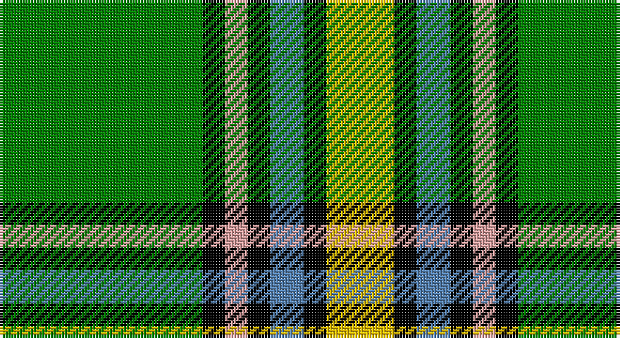

This page is one **sett** — a single exact thread-count. It belongs to the [tartan](/setts/g18k2lr2k2t3k2ly6/)
(the same proportion at any scale), whose colour order is pattern [GKYKBKY](/stripes/gkykbky/).

Part of the [Alberta](/tartans/alberta/) tartan — the named design grouping this sett with its other cloths.

Sourced from weddslist.  It is a [7 stripe tartan](/stripes/stripes7/).

Original link http://www.weddslist.com/cgi-bin/tartans/pg.pl?source=sts

## Thread count
G/72 K8 LR8 K8 B12 K8 Y/24

One full sett is **184 threads**.

## Palette

Palette: <strong>Ingles Buchan</strong> <small style="color:#888">(1 of 5 colours)</small>
<table><thead><tr><th>Colour</th><th>Threads</th><th>Shade</th><th>Base</th><th>OKLCh</th></tr></thead><tbody><tr><td>G/</td><td style="text-align:right;font-variant-numeric:tabular-nums">72</td><td><code style="background-color:#008000;">#008000</code> <small style="color:#888">#008000</small></td><td>G <code style="background-color:#006100;">#006100</code></td><td><small style="color:#888">oklch(52.0% 0.177 142.5)</small></td></tr><tr><td>K</td><td style="text-align:right;font-variant-numeric:tabular-nums">8</td><td><code style="background-color:#000000;">#000000</code> <small style="color:#888">#000000</small></td><td>K <code style="background-color:#000000;">#000000</code></td><td><small style="color:#888">oklch(0.0% 0.000 0.0)</small></td></tr><tr><td>LR</td><td style="text-align:right;font-variant-numeric:tabular-nums">8</td><td><code style="background-color:#E0A0A0;">#E0A0A0</code> <small style="color:#888">#E0A0A0</small></td><td>Y <code style="background-color:#F2BF00;">#F2BF00</code></td><td><small style="color:#888">oklch(76.7% 0.077 19.0)</small></td></tr><tr><td>K</td><td style="text-align:right;font-variant-numeric:tabular-nums">8</td><td><code style="background-color:#000000;">#000000</code> <small style="color:#888">#000000</small></td><td>K <code style="background-color:#000000;">#000000</code></td><td><small style="color:#888">oklch(0.0% 0.000 0.0)</small></td></tr><tr><td>B</td><td style="text-align:right;font-variant-numeric:tabular-nums">12</td><td><code style="background-color:#5480B0;">#5480B0</code> <small style="color:#888">#5480B0</small></td><td>B <code style="background-color:#2A418A;">#2A418A</code></td><td><small style="color:#888">oklch(58.8% 0.089 251.5)</small></td></tr><tr><td>K</td><td style="text-align:right;font-variant-numeric:tabular-nums">8</td><td><code style="background-color:#000000;">#000000</code> <small style="color:#888">#000000</small></td><td>K <code style="background-color:#000000;">#000000</code></td><td><small style="color:#888">oklch(0.0% 0.000 0.0)</small></td></tr><tr><td>Y/</td><td style="text-align:right;font-variant-numeric:tabular-nums">24</td><td><code style="background-color:#F0C000;">#F0C000</code> <small style="color:#888">#F0C000</small></td><td>Y <code style="background-color:#F2BF00;">#F2BF00</code></td><td><small style="color:#888">oklch(82.7% 0.169 90.5)</small></td></tr></tbody></table>

# Sample pattern

## Compared to the master

This cloth is one sett of its design; the master sett (the exemplar the design is anchored on) is below for comparison.

<figure style="margin:0"><figcaption style="color:#888;font-size:smaller">this sett</figcaption></figure>
<figure style="margin:0"><figcaption style="color:#888;font-size:smaller"><a href="/setts/dg50k4dy6db28dy1db1dy1db1dy1db1dy1db1dy1db1dy1db1dy8k24dg12k4db20k1db1k1db1k1db1k1db1k1db1k1db1k8dg8db16/">master sett →</a></figcaption></figure>

## Nearest tartans

The nearest existing variants by ΔTartan distance, with this tartan at the top so the swatches line up against it.

ΔTartan

Tartan

Sett

—

<a href="/ttd/edit/#slug=g18k2lr2k2t3k2ly6~x4">Alberta</a> <a class="nn-out" href="/variants/s7/g18k2lr2k2t3k2ly6~x4/" title="open its dictionary page">↗</a>

1.03

<a href="/ttd/edit/#slug=g12k1r1k1t2k1ly4~x2&amp;base=g18k2lr2k2t3k2ly6~x4">Alberta District Tartan</a> <a class="nn-out" href="/variants/s7/g12k1r1k1t2k1ly4~x2/" title="open its dictionary page">↗</a>

1.12

<a href="/ttd/edit/#slug=g12k1r1k1b2k1ly4~x8&amp;base=g18k2lr2k2t3k2ly6~x4">Alberta (District)</a> <a class="nn-out" href="/variants/s7/g12k1r1k1b2k1ly4~x8/" title="open its dictionary page">↗</a>

1.14

<a href="/ttd/edit/#slug=g11w11k3ly3dg36r7~x2&amp;base=g18k2lr2k2t3k2ly6~x4">Driver, RC</a> <a class="nn-out" href="/variants/s6/g11w11k3ly3dg36r7~x2/" title="open its dictionary page">↗</a>

1.17

<a href="/ttd/edit/#slug=ly17w7ly6g43k5o6k13~x2&amp;base=g18k2lr2k2t3k2ly6~x4">Keeling Dress</a> <a class="nn-out" href="/variants/s7/ly17w7ly6g43k5o6k13~x2/" title="open its dictionary page">↗</a>

1.21

<a href="/ttd/edit/#slug=w8k16g32dt3lo5w5~x2&amp;base=g18k2lr2k2t3k2ly6~x4">Mellor (Name)</a> <a class="nn-out" href="/variants/s6/w8k16g32dt3lo5w5~x2/" title="open its dictionary page">↗</a>

1.26

<a href="/ttd/edit/#slug=g13p1g1p1g3db5k4ly2~x2&amp;base=g18k2lr2k2t3k2ly6~x4">Carrick, hunting</a> <a class="nn-out" href="/variants/s8/g13p1g1p1g3db5k4ly2~x2/" title="open its dictionary page">↗</a>

1.26

<a href="/ttd/edit/#slug=gi1k1gi9k7ly1gi5g4w2g1w1gi1~x4&amp;base=g18k2lr2k2t3k2ly6~x4">Parkhead</a> <a class="nn-out" href="/variants/s11/gi1k1gi9k7ly1gi5g4w2g1w1gi1~x4/" title="open its dictionary page">↗</a>

1.28

<a href="/ttd/edit/#slug=w6g5r5g45k4o24k4g5~x2&amp;base=g18k2lr2k2t3k2ly6~x4">O'Neill</a> <a class="nn-out" href="/variants/s8/w6g5r5g45k4o24k4g5~x2/" title="open its dictionary page">↗</a>

1.31

<a href="/ttd/edit/#slug=g13k1r1k1b2k1ly4~x8&amp;base=g18k2lr2k2t3k2ly6~x4">Alberta (Province)</a> <a class="nn-out" href="/variants/s7/g13k1r1k1b2k1ly4~x8/" title="open its dictionary page">↗</a>

1.31

<a href="/ttd/edit/#slug=m5dg27o2g25ly7dg3m3~x2&amp;base=g18k2lr2k2t3k2ly6~x4">Kilkenny</a> <a class="nn-out" href="/variants/s7/m5dg27o2g25ly7dg3m3~x2/" title="open its dictionary page">↗</a>

## Neighbour map

Every grey dot is one of 14360 variants placed by the first two principal components of the ΔTartan feature space (44% of its variance). Red is this tartan; blue dots are its nearest — click one to open its page.

<svg viewBox="0 0 640 380" role="img" style="max-width:100%;height:auto;border:1px solid #e0e0e0;border-radius:4px;display:block" xmlns="http://www.w3.org/2000/svg"><image href="/nn/cloud.v1.png" width="640" height="380"/><a href="/variants/s7/g12k1r1k1t2k1ly4~x2/"><circle cx="269.8" cy="155.8" r="4" fill="#3465a4"><title>Alberta District Tartan</title></circle></a><a href="/variants/s7/g12k1r1k1b2k1ly4~x8/"><circle cx="270.2" cy="157.0" r="4" fill="#3465a4"><title>Alberta (District)</title></circle></a><a href="/variants/s6/g11w11k3ly3dg36r7~x2/"><circle cx="193.7" cy="150.8" r="4" fill="#3465a4"><title>Driver, RC</title></circle></a><a href="/variants/s7/ly17w7ly6g43k5o6k13~x2/"><circle cx="141.4" cy="163.8" r="4" fill="#3465a4"><title>Keeling Dress</title></circle></a><a href="/variants/s6/w8k16g32dt3lo5w5~x2/"><circle cx="186.7" cy="179.4" r="4" fill="#3465a4"><title>Mellor (Name)</title></circle></a><a href="/variants/s8/g13p1g1p1g3db5k4ly2~x2/"><circle cx="259.6" cy="159.7" r="4" fill="#3465a4"><title>Carrick, hunting</title></circle></a><a href="/variants/s11/gi1k1gi9k7ly1gi5g4w2g1w1gi1~x4/"><circle cx="186.7" cy="164.5" r="4" fill="#3465a4"><title>Parkhead</title></circle></a><a href="/variants/s8/w6g5r5g45k4o24k4g5~x2/"><circle cx="282.8" cy="159.7" r="4" fill="#3465a4"><title>O'Neill</title></circle></a><a href="/variants/s7/g13k1r1k1b2k1ly4~x8/"><circle cx="290.2" cy="153.1" r="4" fill="#3465a4"><title>Alberta (Province)</title></circle></a><a href="/variants/s7/m5dg27o2g25ly7dg3m3~x2/"><circle cx="202.2" cy="165.6" r="4" fill="#3465a4"><title>Kilkenny</title></circle></a><circle cx="208.9" cy="160.3" r="5" fill="#c00000"/></svg>

ID: /variants/s7/g18k2lr2k2t3k2ly6~x4/
