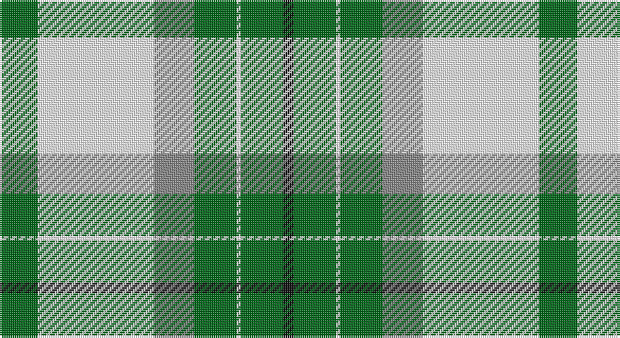

This page is one **sett** — a single exact thread-count. It belongs to the [tartan](/setts/g18w55o19g20w2g20k5/)
(the same proportion at any scale), whose colour order is pattern [GWRGWGK](/stripes/gwrgwgk/).

Sourced from register-of-tartans.  It is a [7 stripe tartan](/stripes/stripes7/).

Original link https://www.tartanregister.gov.uk/tartanDetails.aspx?ref=2476

## Provenance

Earliest known date: 2005 Designed to celebrate and commemorate the 150th Anniversary of the founding of Michigan State University. Woven sample.

## Also known as

This cloth is also recorded under:

- Michigan State University (Corporate

3 attestations — the source records this cloth was collapsed from (oldest owns this page)

<ul>
<li>01/01/2005 — Michigan State University (register-of-tartans, <a href="https://www.tartanregister.gov.uk/tartanDetails.aspx?ref=2476">record</a>)</li>
<li>pre 2005 — Michigan State University (Corporate (tartans-authority, <a href="http://www.tartansauthority.com/tartan-ferret/display/6776/">record</a>)</li>
<li>undated — Michigan State University American Corporate Tartan (house-of-tartan, <a href="http://www.house-of-tartan.scotland.net/house/TartanViewjs.asp?colr=Def&tnam=6776">record</a>)</li>
</ul>

## Register references

External register numbers recorded for this tartan.

- Scottish Register of Tartans: [2476](https://www.tartanregister.gov.uk/tartanDetails.aspx?ref=2476)
- Scottish Tartans Authority (ITI): 6776

## Thread count
G/18 W55 N19 G20 W2 G20 K/5

One full sett is **255 threads**.

## Palette

Palette: <strong>Tartan Register</strong>
<table><thead><tr><th>Colour</th><th>Threads</th><th>Shade</th><th>Base</th><th>OKLCh</th></tr></thead><tbody><tr><td>G/</td><td style="text-align:right;font-variant-numeric:tabular-nums">18</td><td><code style="background-color:#006818;">#006818</code> <small style="color:#888">#006818</small></td><td>G <code style="background-color:#006100;">#006100</code></td><td><small style="color:#888">oklch(45.0% 0.142 145.0)</small></td></tr><tr><td>W</td><td style="text-align:right;font-variant-numeric:tabular-nums">55</td><td><code style="background-color:#FFFFFF;">#FFFFFF</code> <small style="color:#888">#FFFFFF</small></td><td>W <code style="background-color:#F7F7F7;">#F7F7F7</code></td><td><small style="color:#888">oklch(100.0% 0.000 89.9)</small></td></tr><tr><td>N</td><td style="text-align:right;font-variant-numeric:tabular-nums">19</td><td><code style="background-color:#888888;">#888888</code> <small style="color:#888">#888888</small></td><td>R <code style="background-color:#CC0000;">#CC0000</code></td><td><small style="color:#888">oklch(62.7% 0.000 89.9)</small></td></tr><tr><td>G</td><td style="text-align:right;font-variant-numeric:tabular-nums">20</td><td><code style="background-color:#006818;">#006818</code> <small style="color:#888">#006818</small></td><td>G <code style="background-color:#006100;">#006100</code></td><td><small style="color:#888">oklch(45.0% 0.142 145.0)</small></td></tr><tr><td>W</td><td style="text-align:right;font-variant-numeric:tabular-nums">2</td><td><code style="background-color:#FFFFFF;">#FFFFFF</code> <small style="color:#888">#FFFFFF</small></td><td>W <code style="background-color:#F7F7F7;">#F7F7F7</code></td><td><small style="color:#888">oklch(100.0% 0.000 89.9)</small></td></tr><tr><td>G</td><td style="text-align:right;font-variant-numeric:tabular-nums">20</td><td><code style="background-color:#006818;">#006818</code> <small style="color:#888">#006818</small></td><td>G <code style="background-color:#006100;">#006100</code></td><td><small style="color:#888">oklch(45.0% 0.142 145.0)</small></td></tr><tr><td>K/</td><td style="text-align:right;font-variant-numeric:tabular-nums">5</td><td><code style="background-color:#101010;">#101010</code> <small style="color:#888">#101010</small></td><td>K <code style="background-color:#000000;">#000000</code></td><td><small style="color:#888">oklch(17.3% 0.000 89.9)</small></td></tr></tbody></table>

# Sample pattern

## Nearest tartans

The nearest existing variants by ΔTartan distance, with this tartan at the top so the swatches line up against it.

ΔTartan

Tartan

Sett

—

<a href="/ttd/edit/#slug=g18w55o19g20w2g20k5">Michigan State University</a> <a class="nn-out" href="/variants/s7/g18w55o19g20w2g20k5/" title="open its dictionary page">↗</a>

1.16

<a href="/ttd/edit/#slug=t5k1w30dp15w8g30w8dp2~x2&amp;base=g18w55o19g20w2g20k5">Shaw, Miss Rebecca (Personal)</a> <a class="nn-out" href="/variants/s8/t5k1w30dp15w8g30w8dp2~x2/" title="open its dictionary page">↗</a>

1.34

<a href="/ttd/edit/#slug=ly6dg36w5b4w30b1w2~x2&amp;base=g18w55o19g20w2g20k5">Pearce Scotch Plaid 4 (Fashion)</a> <a class="nn-out" href="/variants/s7/ly6dg36w5b4w30b1w2~x2/" title="open its dictionary page">↗</a>

1.35

<a href="/ttd/edit/#slug=dg4dr14dg14o6dr1w30dg2dr1~x2&amp;base=g18w55o19g20w2g20k5">British Columbia #2</a> <a class="nn-out" href="/variants/s8/dg4dr14dg14o6dr1w30dg2dr1~x2/" title="open its dictionary page">↗</a>

1.38

<a href="/ttd/edit/#slug=k5g25k10lg15ly1lg5~x2&amp;base=g18w55o19g20w2g20k5">Delaware Fine Spirits Guild (Corp)</a> <a class="nn-out" href="/variants/s6/k5g25k10lg15ly1lg5~x2/" title="open its dictionary page">↗</a>

1.38

<a href="/ttd/edit/#slug=dg4do10dg10o6do1w26dg2do1~x4&amp;base=g18w55o19g20w2g20k5">Dogwood</a> <a class="nn-out" href="/variants/s8/dg4do10dg10o6do1w26dg2do1~x4/" title="open its dictionary page">↗</a>

1.42

<a href="/ttd/edit/#slug=g2dy10g11ly4dy1w18g2dy1~x2&amp;base=g18w55o19g20w2g20k5">Aviemore Check</a> <a class="nn-out" href="/variants/s8/g2dy10g11ly4dy1w18g2dy1~x2/" title="open its dictionary page">↗</a>

1.47

<a href="/ttd/edit/#slug=w38r12w37g32k3w4k3g32r4&amp;base=g18w55o19g20w2g20k5">MacDiarmid, dress</a> <a class="nn-out" href="/variants/s9/w38r12w37g32k3w4k3g32r4/" title="open its dictionary page">↗</a>

1.47

<a href="/ttd/edit/#slug=g3r12g12o5r1w25g2r1~x2&amp;base=g18w55o19g20w2g20k5">Dogwood</a> <a class="nn-out" href="/variants/s8/g3r12g12o5r1w25g2r1~x2/" title="open its dictionary page">↗</a>

1.50

<a href="/ttd/edit/#slug=w38r12w37g32k3w4k3g32r4~x2&amp;base=g18w55o19g20w2g20k5">MacDiarmid Dress</a> <a class="nn-out" href="/variants/s9/w38r12w37g32k3w4k3g32r4~x2/" title="open its dictionary page">↗</a>

1.53

<a href="/ttd/edit/#slug=g3r12g12lo5r1w25g2r1~x2&amp;base=g18w55o19g20w2g20k5">Dogwood Trade Tartan</a> <a class="nn-out" href="/variants/s8/g3r12g12lo5r1w25g2r1~x2/" title="open its dictionary page">↗</a>

## Neighbour map

Every grey dot is one of 14360 variants placed by the first two principal components of the ΔTartan feature space (44% of its variance). Red is this tartan; blue dots are its nearest — click one to open its page.

<svg viewBox="0 0 640 380" role="img" style="max-width:100%;height:auto;border:1px solid #e0e0e0;border-radius:4px;display:block" xmlns="http://www.w3.org/2000/svg"><image href="/nn/cloud.v1.png" width="640" height="380"/><a href="/variants/s8/t5k1w30dp15w8g30w8dp2~x2/"><circle cx="212.7" cy="108.9" r="4" fill="#3465a4"><title>Shaw, Miss Rebecca (Personal)</title></circle></a><a href="/variants/s7/ly6dg36w5b4w30b1w2~x2/"><circle cx="268.8" cy="114.9" r="4" fill="#3465a4"><title>Pearce Scotch Plaid 4 (Fashion)</title></circle></a><a href="/variants/s8/dg4dr14dg14o6dr1w30dg2dr1~x2/"><circle cx="214.5" cy="111.5" r="4" fill="#3465a4"><title>British Columbia #2</title></circle></a><a href="/variants/s6/k5g25k10lg15ly1lg5~x2/"><circle cx="224.5" cy="173.3" r="4" fill="#3465a4"><title>Delaware Fine Spirits Guild (Corp)</title></circle></a><a href="/variants/s8/dg4do10dg10o6do1w26dg2do1~x4/"><circle cx="216.7" cy="118.6" r="4" fill="#3465a4"><title>Dogwood</title></circle></a><a href="/variants/s8/g2dy10g11ly4dy1w18g2dy1~x2/"><circle cx="187.2" cy="147.3" r="4" fill="#3465a4"><title>Aviemore Check</title></circle></a><a href="/variants/s9/w38r12w37g32k3w4k3g32r4/"><circle cx="223.6" cy="162.6" r="4" fill="#3465a4"><title>MacDiarmid, dress</title></circle></a><a href="/variants/s8/g3r12g12o5r1w25g2r1~x2/"><circle cx="222.0" cy="125.4" r="4" fill="#3465a4"><title>Dogwood</title></circle></a><a href="/variants/s9/w38r12w37g32k3w4k3g32r4~x2/"><circle cx="225.3" cy="162.9" r="4" fill="#3465a4"><title>MacDiarmid Dress</title></circle></a><a href="/variants/s8/g3r12g12lo5r1w25g2r1~x2/"><circle cx="222.1" cy="125.2" r="4" fill="#3465a4"><title>Dogwood Trade Tartan</title></circle></a><circle cx="218.0" cy="145.6" r="5" fill="#c00000"/></svg>

ID: /variants/s7/g18w55o19g20w2g20k5/
