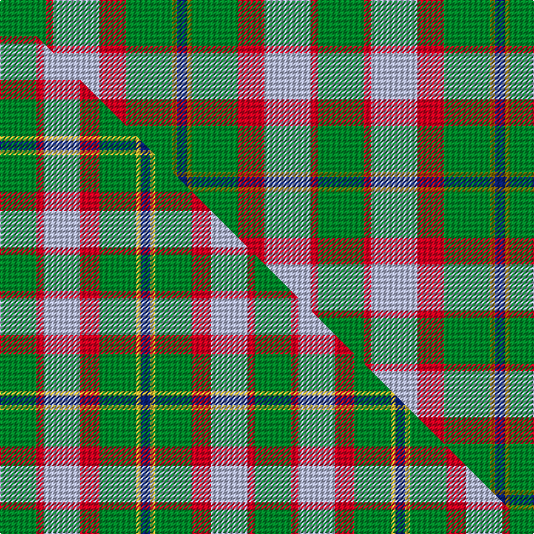

This is one **variant** — a specific cloth: this exact thread count and colourway, with its own
provenance below. It is one weaving of the [sett](/setts/g19r3lb19r11g19y2db4/) (the scale-free proportion — the
same cloth at any scale or shade), whose colour order is pattern [BGGRWRG](/stripes/bggrwrg/).

Part of the [Rotary](/tartans/rotary-2/) tartan — the named design grouping this sett with its other cloths.

Sourced from house-of-tartan.  It is a [7 stripe tartan](/stripes/stripes7/).

Original link [http://www.house-of-tartan.scotland.net/house/TartanViewjs.asp?colr=Def&tnam=2187](http://www.house-of-tartan.scotland.net/house/TartanViewjs.asp?colr=Def&tnam=2187)

## Provenance

Earliest known date: 1995 The tartan was designed by K. Lumsden of the Scottish Tartans Society in conjuntion with the Rotary Club of Glasgow. It was decided to use as a base the City of Glasgow Tartan; the colours being brightened and the gold and the deep blue of the Rotary Wheel added. The actual shades are specific Rotary colours. The tartan is currently available only from Geoffrey (Tailor) Highland Crafts, The Royal Mile, Edinburgh.

Dataset <small>— provenance for this record, inherited from the source manifest</small>

<dl class="dataset-prov">
<dt>source</dt><dd><a href="/sources/house-of-tartan/">House of Tartan</a></dd>
<dt>data captured from</dt><dd><a href="https://github.com/thetartan/tartan-database/blob/master/data/house-of-tartan/data.csv">https://github.com/thetartan/tartan-database/blob/master/data/house-of-tartan/data.csv</a></dd>
<dt>data date</dt><dd>1995 <small>(this record)</small></dd>
<dt>licence</dt><dd><a href="https://creativecommons.org/licenses/by-nc-nd/4.0/">CC BY-NC-ND 4.0</a></dd>
</dl>

Capture chain <small>— the hands this data passed through, oldest first; each capture carries its own licence</small>

<ol class="capture-chain">
<li><a href="http://www.house-of-tartan.scotland.net/">House of Tartan</a> <small>the weaver/retailer's database — the site is now offline; the URL is kept as the ultimate source's identity</small></li>
<li><a href="https://github.com/thetartan/tartan-database">thetartan/tartan-database</a> <small>2016-2017</small> · <a href="https://creativecommons.org/licenses/by-nc-nd/4.0/">CC BY-NC-ND 4.0</a> <small>Levko Kravets's frozen compilation — the capture we vendored, and where its CC licence text came from</small></li>
<li>this dictionary <small>captured 2026-06-10 · commit 5bf86c7566</small> <small>each re-capture is a git commit to data/sources</small></li>
</ol>

## Thread count
G/38 R6 LB38 R22 G38 Y4 DB/8

One full sett is **262 threads**.

## Palette
<table><thead><tr><th>Colour</th><th>Shade</th><th>OKLCh</th></tr></thead><tbody><tr><td>LB</td><td><code style="background-color:#B5BBDE;">#B5BBDE</code> <small style="color:#888">#B5BBDE</small></td><td><small style="color:#888">oklch(79.9% 0.050 277.6)</small></td></tr><tr><td>DB</td><td><code style="background-color:#082077;">#082077</code> <small style="color:#888">#082077</small></td><td><small style="color:#888">oklch(30.0% 0.149 265.1)</small></td></tr><tr><td>G</td><td><code style="background-color:#008B2A;">#008B2A</code> <small style="color:#888">#008B2A</small></td><td><small style="color:#888">oklch(55.4% 0.170 145.9)</small></td></tr><tr><td>R</td><td><code style="background-color:#D60020;">#D60020</code> <small style="color:#888">#D60020</small></td><td><small style="color:#888">oklch(55.2% 0.224 25.5)</small></td></tr><tr><td>Y</td><td><code style="background-color:#8B6E00;">#8B6E00</code> <small style="color:#888">#8B6E00</small></td><td><small style="color:#888">oklch(55.1% 0.113 90.4)</small></td></tr></tbody></table>

# Sample pattern

## Compared to the master

This cloth is one sett of its design; the master sett (the exemplar the design is anchored on) is below for comparison.

Its **ΔTartan distance** from the master is **0.26** — the same measure the nearest-tartans table ranks by (0 is identical; a re-scale of the same cloth is near 0, a recolour or a different proportion further).

<figure class="master-compare" style="margin:0">

this sett
master sett ★

<figcaption style="color:#888;font-size:smaller">One weave of this sett against the <a href="/setts/g15r3lb15r8g15ly2db4/">master sett ★</a>, split on the diagonal: a shared proportion runs seamlessly across it with only the shades shifting; a different proportion breaks on it.</figcaption>
</figure>

## Nearest tartan variants

The nearest existing variants by ΔTartan distance, with this cloth at the top so the swatches line up against it.

ΔTartan

Threads

Variant

Sett

—

262

<a href="/variants/s7/g19r3lb19r11g19y2db4~x2/">Rotary Corporate Tartan</a>

<a href="/ttd/edit/#slug=g15r3lb15r8g15ly2db4~x2&amp;base=g19r3lb19r11g19y2db4~x2" title="compare in the TTD">0.26</a>

210

<a href="/variants/s7/g15r3lb15r8g15ly2db4~x2/">Rotary International</a>

<a href="/ttd/edit/#slug=g25r4db25r13g25y2lb6~x2&amp;base=g19r3lb19r11g19y2db4~x2" title="compare in the TTD">1.97</a>

338

<a href="/variants/s7/g25r4db25r13g25y2lb6~x2/">Rotary</a>

<a href="/ttd/edit/#slug=db24r27g20y6g20r2lb3~x2&amp;base=g19r3lb19r11g19y2db4~x2" title="compare in the TTD">2.14</a>

354

<a href="/variants/s7/db24r27g20y6g20r2lb3~x2/">Buchanhaven Heritage</a>

<a href="/ttd/edit/#slug=g15y3r3dp8w2~x6&amp;base=g19r3lb19r11g19y2db4~x2" title="compare in the TTD">2.55</a>

270

<a href="/variants/s5/g15y3r3dp8w2~x6/">ChuMac (Personal)</a>

<a href="/ttd/edit/#slug=r3g10r3g14db16g3y2~x2&amp;base=g19r3lb19r11g19y2db4~x2" title="compare in the TTD">2.72</a>

194

<a href="/variants/s7/r3g10r3g14db16g3y2~x2/">Cameron of Lochiel (Hunting)</a>

<a href="/ttd/edit/#slug=r3g10r3g14db16g3y2&amp;base=g19r3lb19r11g19y2db4~x2" title="compare in the TTD">2.72</a>

97

<a href="/variants/s7/r3g10r3g14db16g3y2/">Cameron Hunting</a>

<a href="/ttd/edit/#slug=r6g4do14w4do7g30lo4~x2&amp;base=g19r3lb19r11g19y2db4~x2" title="compare in the TTD">2.74</a>

256

<a href="/variants/s7/r6g4do14w4do7g30lo4~x2/">Newfoundland (District)</a>

<a href="/ttd/edit/#slug=r3g10r3g14db16g3dy2~x2&amp;base=g19r3lb19r11g19y2db4~x2" title="compare in the TTD">2.74</a>

194

<a href="/variants/s7/r3g10r3g14db16g3dy2~x2/">Cameron Hunting Clan Tartan</a>

<a href="/ttd/edit/#slug=r5g20r5g20db24g6y4&amp;base=g19r3lb19r11g19y2db4~x2" title="compare in the TTD">2.76</a>

159

<a href="/variants/s7/r5g20r5g20db24g6y4/">Cameron of Lochiel (Hunting) Clan/Family Tartan</a>

<a href="/ttd/edit/#slug=o2g8dp4w2o13t2~x4&amp;base=g19r3lb19r11g19y2db4~x2" title="compare in the TTD">2.79</a>

232

<a href="/variants/s6/o2g8dp4w2o13t2~x4/">Ellan Vannin</a>

## Neighbour map

Every grey dot is one of 13621 variants placed by the first two principal components of the ΔTartan feature space (42% of its variance). Red is this tartan; blue dots are its nearest — click one to open its page.

<svg viewBox="0 0 640 380" role="img" style="max-width:100%;height:auto;border:1px solid #e0e0e0;border-radius:4px;display:block" xmlns="http://www.w3.org/2000/svg"><image href="/nn/cloud.v1.png" width="640" height="380"/><a href="/variants/s7/g15r3lb15r8g15ly2db4~x2/"><circle cx="216.9" cy="233.4" r="4" fill="#3465a4"><title>Rotary International</title></circle></a><a href="/variants/s7/g25r4db25r13g25y2lb6~x2/"><circle cx="239.7" cy="205.5" r="4" fill="#3465a4"><title>Rotary</title></circle></a><a href="/variants/s7/db24r27g20y6g20r2lb3~x2/"><circle cx="195.8" cy="203.8" r="4" fill="#3465a4"><title>Buchanhaven Heritage</title></circle></a><a href="/variants/s5/g15y3r3dp8w2~x6/"><circle cx="225.1" cy="225.5" r="4" fill="#3465a4"><title>ChuMac (Personal)</title></circle></a><a href="/variants/s7/r3g10r3g14db16g3y2~x2/"><circle cx="279.2" cy="231.2" r="4" fill="#3465a4"><title>Cameron of Lochiel (Hunting)</title></circle></a><a href="/variants/s7/r3g10r3g14db16g3y2/"><circle cx="279.2" cy="231.2" r="4" fill="#3465a4"><title>Cameron Hunting</title></circle></a><a href="/variants/s7/r6g4do14w4do7g30lo4~x2/"><circle cx="238.6" cy="205.2" r="4" fill="#3465a4"><title>Newfoundland (District)</title></circle></a><a href="/variants/s7/r3g10r3g14db16g3dy2~x2/"><circle cx="277.6" cy="230.4" r="4" fill="#3465a4"><title>Cameron Hunting Clan Tartan</title></circle></a><a href="/variants/s7/r5g20r5g20db24g6y4/"><circle cx="273.9" cy="249.4" r="4" fill="#3465a4"><title>Cameron of Lochiel (Hunting) Clan/Family Tartan</title></circle></a><a href="/variants/s6/o2g8dp4w2o13t2~x4/"><circle cx="252.3" cy="232.4" r="4" fill="#3465a4"><title>Ellan Vannin</title></circle></a><circle cx="238.9" cy="221.0" r="5" fill="#c00000"/><text x="320" y="376" text-anchor="middle" font-size="11" fill="#999">ground</text><text x="11" y="190" text-anchor="middle" font-size="11" fill="#999" transform="rotate(-90 11 190)">complexity</text></svg>

ID: /variants/s7/g19r3lb19r11g19y2db4~x2/
