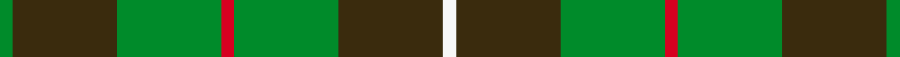

This is one **variant** — a specific cloth: this exact thread count and colourway, with its own
provenance below. It is one weaving of the [sett](/setts/g1dy8g8r1g8dy8w1/) (the scale-free proportion — the
same cloth at any scale or shade), whose colour order is pattern [GGGRGGW](/stripes/gggrggw/).

Part of the [MacKinnon Hunting](/tartans/m/ma/mackinnon-hunting-4/) tartan — the named design grouping this sett with its other cloths.

Sourced from house-of-tartan.  It is a [7 stripe tartan](/stripes/stripes7/).

Original link [http://www.house-of-tartan.scotland.net/house/TartanViewjs.asp?colr=Def&tnam=917](http://www.house-of-tartan.scotland.net/house/TartanViewjs.asp?colr=Def&tnam=917)

## Provenance

Earliest known date: 1960 The modern hunting MacKinnon is based on the sett published in the Vestiarium Scoticum in 1842. The change is simply from red in the V.S. to brown in the modern version. The result was registered with Lord Lyon in 1960.

2 attestations — the source records this cloth was collapsed from (oldest owns this page)

<ul>
<li>1960 — MacKinnon Hunting Clan Tartan (house-of-tartan, <a href="http://www.house-of-tartan.scotland.net/house/TartanViewjs.asp?colr=Def&tnam=917">record</a>) </li>
<li>undated — MacKinnon Hunting (register-of-tartans, <a href="https://www.tartanregister.gov.uk/tartanDetails.aspx?ref=2555">record</a>)  <em>The modern hunting MacKinnon is based on the sett published in the Vestiarium Scoticum in 1842. The change is simply from red in the V.S. to brown in the modern version. The result was registered with Lord Lyon in 1960.</em></li>
</ul>

Dataset <small>— provenance for this record, inherited from the source manifest</small>

<dl class="dataset-prov">
<dt>source</dt><dd><a href="/sources/house-of-tartan/">House of Tartan</a></dd>
<dt>data captured from</dt><dd><a href="https://github.com/thetartan/tartan-database/blob/master/data/house-of-tartan/data.csv">https://github.com/thetartan/tartan-database/blob/master/data/house-of-tartan/data.csv</a></dd>
<dt>data date</dt><dd>1960 <small>(this record)</small></dd>
<dt>licence</dt><dd><a href="https://creativecommons.org/licenses/by-nc-nd/4.0/">CC BY-NC-ND 4.0</a></dd>
</dl>

Capture chain <small>— the hands this data passed through, oldest first; each capture carries its own licence</small>

<ol class="capture-chain">
<li><a href="http://www.house-of-tartan.scotland.net/">House of Tartan</a> <small>the weaver/retailer's database — the site is now offline; the URL is kept as the ultimate source's identity</small></li>
<li><a href="https://github.com/thetartan/tartan-database">thetartan/tartan-database</a> <small>2016-2017</small> · <a href="https://creativecommons.org/licenses/by-nc-nd/4.0/">CC BY-NC-ND 4.0</a> <small>Levko Kravets's frozen compilation — the capture we vendored, and where its CC licence text came from</small></li>
<li>this dictionary <small>captured 2026-06-10 · commit 5bf86c7566</small> <small>each re-capture is a git commit to data/sources</small></li>
</ol>

## Register references

External register numbers recorded for this tartan.

- Scottish Register of Tartans: [2555](https://www.tartanregister.gov.uk/tartanDetails.aspx?ref=2555)
- Scottish Tartans World Register: 917

## Thread count
G/2 DY16 G16 R2 G16 DY16 W/2

One full sett is **136 threads**.

## Palette
<table><thead><tr><th>Colour</th><th>Shade</th><th>OKLCh</th></tr></thead><tbody><tr><td>G</td><td><code style="background-color:#008B2A;">#008B2A</code> <small style="color:#888">#008B2A</small></td><td><small style="color:#888">oklch(55.4% 0.170 145.9)</small></td></tr><tr><td>W</td><td><code style="background-color:#F7F7F7;">#F7F7F7</code> <small style="color:#888">#F7F7F7</small></td><td><small style="color:#888">oklch(97.6% 0.000 89.9)</small></td></tr><tr><td>R</td><td><code style="background-color:#D60020;">#D60020</code> <small style="color:#888">#D60020</small></td><td><small style="color:#888">oklch(55.2% 0.224 25.5)</small></td></tr><tr><td>DY</td><td><code style="background-color:#3A2B0D;">#3A2B0D</code> <small style="color:#888">#3A2B0D</small></td><td><small style="color:#888">oklch(30.0% 0.049 82.0)</small></td></tr></tbody></table>

# Sample pattern

## Nearest tartan variants

The nearest existing variants by ΔTartan distance, with this cloth at the top so the swatches line up against it.

ΔTartan

Threads

Variant

Sett

—

136

<a href="/variants/s7/g1dy8g8r1g8dy8w1~x2/">MacKinnon Hunting Clan Tartan</a>

<a href="/ttd/edit/#slug=g1dy8g8r1g8dy8w1~x4&amp;base=g1dy8g8r1g8dy8w1~x2" title="compare in the TTD">0.00</a>

272

<a href="/variants/s7/g1dy8g8r1g8dy8w1~x4/">MacKinnon Htg (Clan)</a>

<a href="/ttd/edit/#slug=dg2ly14dg8ly3dg12r2~x2&amp;base=g1dy8g8r1g8dy8w1~x2" title="compare in the TTD">0.93</a>

156

<a href="/variants/s6/dg2ly14dg8ly3dg12r2~x2/">Confederate Artillery</a>

<a href="/ttd/edit/#slug=dg2y14dg8y3dg12lo2~x2&amp;base=g1dy8g8r1g8dy8w1~x2" title="compare in the TTD">1.22</a>

156

<a href="/variants/s6/dg2y14dg8y3dg12lo2~x2/">Confederate Cavalry (Military)</a>

<a href="/ttd/edit/#slug=g3dy2g18dy21lo2g3lo2~x2&amp;base=g1dy8g8r1g8dy8w1~x2" title="compare in the TTD">1.49</a>

194

<a href="/variants/s7/g3dy2g18dy21lo2g3lo2~x2/">Prince David #1 (Royal)</a>

<a href="/ttd/edit/#slug=r6g4dy14w4dy7g30y4~x2&amp;base=g1dy8g8r1g8dy8w1~x2" title="compare in the TTD">2.01</a>

256

<a href="/variants/s7/r6g4dy14w4dy7g30y4~x2/">Newfoundland</a>

<a href="/ttd/edit/#slug=r4g3dy8w3dy4g18y3~x2&amp;base=g1dy8g8r1g8dy8w1~x2" title="compare in the TTD">2.09</a>

158

<a href="/variants/s7/r4g3dy8w3dy4g18y3~x2/">Newfoundland District Tartan</a>

<a href="/ttd/edit/#slug=g24r9g4dg19y2dg6g7~x2&amp;base=g1dy8g8r1g8dy8w1~x2" title="compare in the TTD">2.21</a>

222

<a href="/variants/s7/g24r9g4dg19y2dg6g7~x2/">Doyle</a>

<a href="/ttd/edit/#slug=r3g10r3g14db16g3y2~x2&amp;base=g1dy8g8r1g8dy8w1~x2" title="compare in the TTD">2.51</a>

194

<a href="/variants/s7/r3g10r3g14db16g3y2~x2/">Cameron of Lochiel (Hunting)</a>

<a href="/ttd/edit/#slug=r3g10r3g14db16g3y2&amp;base=g1dy8g8r1g8dy8w1~x2" title="compare in the TTD">2.51</a>

97

<a href="/variants/s7/r3g10r3g14db16g3y2/">Cameron Hunting</a>

<a href="/ttd/edit/#slug=r3g10r3g14db16g3dy2~x2&amp;base=g1dy8g8r1g8dy8w1~x2" title="compare in the TTD">2.52</a>

194

<a href="/variants/s7/r3g10r3g14db16g3dy2~x2/">Cameron Hunting Clan Tartan</a>

## Neighbour map

Every grey dot is one of 13656 variants placed by the first two principal components of the ΔTartan feature space (42% of its variance). Red is this tartan; blue dots are its nearest — click one to open its page. The map is a flat projection of a many-dimensional space — [how to read it](/posts/neighbourhood-maps/).

<svg viewBox="0 0 640 380" role="img" style="max-width:100%;height:auto;border:1px solid #e0e0e0;border-radius:4px;display:block" xmlns="http://www.w3.org/2000/svg"><image href="/nn/cloud.v1.png" width="640" height="380"/><a href="/variants/s7/g1dy8g8r1g8dy8w1~x4/"><circle cx="296.7" cy="243.6" r="4" fill="#3465a4"><title>MacKinnon Htg (Clan)</title></circle></a><a href="/variants/s6/dg2ly14dg8ly3dg12r2~x2/"><circle cx="285.7" cy="246.0" r="4" fill="#3465a4"><title>Confederate Artillery</title></circle></a><a href="/variants/s6/dg2y14dg8y3dg12lo2~x2/"><circle cx="382.8" cy="284.3" r="4" fill="#3465a4"><title>Confederate Cavalry (Military)</title></circle></a><a href="/variants/s7/g3dy2g18dy21lo2g3lo2~x2/"><circle cx="358.4" cy="230.2" r="4" fill="#3465a4"><title>Prince David #1 (Royal)</title></circle></a><a href="/variants/s7/r6g4dy14w4dy7g30y4~x2/"><circle cx="249.4" cy="209.4" r="4" fill="#3465a4"><title>Newfoundland</title></circle></a><a href="/variants/s7/r4g3dy8w3dy4g18y3~x2/"><circle cx="228.5" cy="222.1" r="4" fill="#3465a4"><title>Newfoundland District Tartan</title></circle></a><a href="/variants/s7/g24r9g4dg19y2dg6g7~x2/"><circle cx="309.2" cy="229.7" r="4" fill="#3465a4"><title>Doyle</title></circle></a><a href="/variants/s7/r3g10r3g14db16g3y2~x2/"><circle cx="279.0" cy="230.5" r="4" fill="#3465a4"><title>Cameron of Lochiel (Hunting)</title></circle></a><a href="/variants/s7/r3g10r3g14db16g3y2/"><circle cx="279.0" cy="230.5" r="4" fill="#3465a4"><title>Cameron Hunting</title></circle></a><a href="/variants/s7/r3g10r3g14db16g3dy2~x2/"><circle cx="277.3" cy="229.7" r="4" fill="#3465a4"><title>Cameron Hunting Clan Tartan</title></circle></a><circle cx="296.7" cy="243.6" r="5" fill="#c00000"/><text x="320" y="376" text-anchor="middle" font-size="11" fill="#999">ground</text><text x="11" y="190" text-anchor="middle" font-size="11" fill="#999" transform="rotate(-90 11 190)">complexity</text></svg>

ID: /variants/s7/g1dy8g8r1g8dy8w1~x2/
