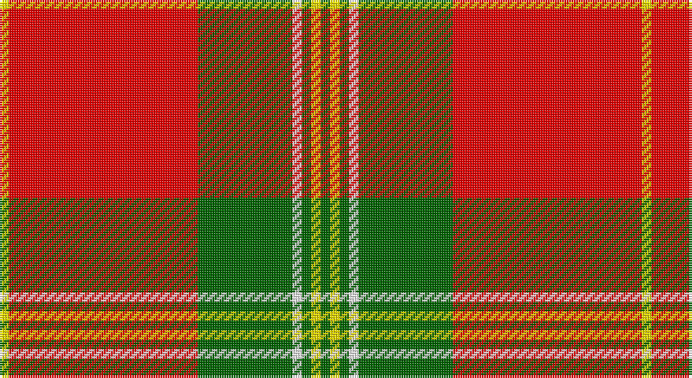

This page is one **sett** — a single exact thread-count. It belongs to the [tartan](/setts/g1ly1g1w1g10r20ly1/)
(the same proportion at any scale), whose colour order is pattern [GYGWGRY](/stripes/gygwgry/).

Sourced from register-of-tartans.  It is a [7 stripe tartan](/stripes/stripes7/).

Original link https://www.tartanregister.gov.uk/tartanDetails.aspx?ref=10329

## Register references

External register numbers recorded for this tartan.

- Scottish Register of Tartans: [10329](https://www.tartanregister.gov.uk/tartanDetails.aspx?ref=10329)

## Thread count
Y/4 R80 G40 W4 G4 Y4 G/4

One full sett is **272 threads**.

## Palette

Palette: <strong>Tartan Register</strong>
<table><thead><tr><th>Colour</th><th>Threads</th><th>Shade</th><th>Base</th><th>OKLCh</th></tr></thead><tbody><tr><td>Y/</td><td style="text-align:right;font-variant-numeric:tabular-nums">4</td><td><code style="background-color:#FFE600;">#FFE600</code> <small style="color:#888">#FFE600</small></td><td>Y <code style="background-color:#F2BF00;">#F2BF00</code></td><td><small style="color:#888">oklch(91.7% 0.192 101.4)</small></td></tr><tr><td>R</td><td style="text-align:right;font-variant-numeric:tabular-nums">80</td><td><code style="background-color:#FF0000;">#FF0000</code> <small style="color:#888">#FF0000</small></td><td>R <code style="background-color:#CC0000;">#CC0000</code></td><td><small style="color:#888">oklch(62.8% 0.258 29.2)</small></td></tr><tr><td>G</td><td style="text-align:right;font-variant-numeric:tabular-nums">40</td><td><code style="background-color:#006400;">#006400</code> <small style="color:#888">#006400</small></td><td>G <code style="background-color:#006100;">#006100</code></td><td><small style="color:#888">oklch(43.6% 0.148 142.5)</small></td></tr><tr><td>W</td><td style="text-align:right;font-variant-numeric:tabular-nums">4</td><td><code style="background-color:#FFFFFF;">#FFFFFF</code> <small style="color:#888">#FFFFFF</small></td><td>W <code style="background-color:#F7F7F7;">#F7F7F7</code></td><td><small style="color:#888">oklch(100.0% 0.000 89.9)</small></td></tr><tr><td>G</td><td style="text-align:right;font-variant-numeric:tabular-nums">4</td><td><code style="background-color:#006400;">#006400</code> <small style="color:#888">#006400</small></td><td>G <code style="background-color:#006100;">#006100</code></td><td><small style="color:#888">oklch(43.6% 0.148 142.5)</small></td></tr><tr><td>Y</td><td style="text-align:right;font-variant-numeric:tabular-nums">4</td><td><code style="background-color:#FFE600;">#FFE600</code> <small style="color:#888">#FFE600</small></td><td>Y <code style="background-color:#F2BF00;">#F2BF00</code></td><td><small style="color:#888">oklch(91.7% 0.192 101.4)</small></td></tr><tr><td>G/</td><td style="text-align:right;font-variant-numeric:tabular-nums">4</td><td><code style="background-color:#006400;">#006400</code> <small style="color:#888">#006400</small></td><td>G <code style="background-color:#006100;">#006100</code></td><td><small style="color:#888">oklch(43.6% 0.148 142.5)</small></td></tr></tbody></table>

# Sample pattern

## Nearest tartans

The nearest existing variants by ΔTartan distance, with this tartan at the top so the swatches line up against it.

ΔTartan

Tartan

Sett

—

<a href="/ttd/edit/#slug=g1ly1g1w1g10r20ly1~x4">Maver (Buckie)</a> <a class="nn-out" href="/variants/s7/g1ly1g1w1g10r20ly1~x4/" title="open its dictionary page">↗</a>

1.24

<a href="/ttd/edit/#slug=ly8k3ly4k2r30ly6~x2&amp;base=g1ly1g1w1g10r20ly1~x4">Masai Shuka 16 (Artefact)</a> <a class="nn-out" href="/variants/s6/ly8k3ly4k2r30ly6~x2/" title="open its dictionary page">↗</a>

1.28

<a href="/ttd/edit/#slug=g10r4g46r69k2w6&amp;base=g1ly1g1w1g10r20ly1~x4">Colchester &amp; District Pipes &amp; Drums</a> <a class="nn-out" href="/variants/s6/g10r4g46r69k2w6/" title="open its dictionary page">↗</a>

1.32

<a href="/ttd/edit/#slug=r5g20r5g3r4g5r36do2w4~x2&amp;base=g1ly1g1w1g10r20ly1~x4">Baluch Regiment (Military)</a> <a class="nn-out" href="/variants/s9/r5g20r5g3r4g5r36do2w4~x2/" title="open its dictionary page">↗</a>

1.34

<a href="/ttd/edit/#slug=r40w2db2w2r1ly20~x2&amp;base=g1ly1g1w1g10r20ly1~x4">National Defense</a> <a class="nn-out" href="/variants/s6/r40w2db2w2r1ly20~x2/" title="open its dictionary page">↗</a>

1.34

<a href="/ttd/edit/#slug=r35g16r5g5w2k3~x2&amp;base=g1ly1g1w1g10r20ly1~x4">MacGregor</a> <a class="nn-out" href="/variants/s6/r35g16r5g5w2k3~x2/" title="open its dictionary page">↗</a>

1.35

<a href="/ttd/edit/#slug=r50ly8k2w2k2ly8k22r3~x2&amp;base=g1ly1g1w1g10r20ly1~x4">FIRES Center of Excelence</a> <a class="nn-out" href="/variants/s8/r50ly8k2w2k2ly8k22r3~x2/" title="open its dictionary page">↗</a>

1.39

<a href="/ttd/edit/#slug=lb6k2r32lo2k6lo2r4k2lb3~x2&amp;base=g1ly1g1w1g10r20ly1~x4">Lantern, The</a> <a class="nn-out" href="/variants/s9/lb6k2r32lo2k6lo2r4k2lb3~x2/" title="open its dictionary page">↗</a>

1.40

<a href="/ttd/edit/#slug=g5ly5g5ly35ri44r3ri3~x2&amp;base=g1ly1g1w1g10r20ly1~x4">Fernandes (Personal)</a> <a class="nn-out" href="/variants/s7/g5ly5g5ly35ri44r3ri3~x2/" title="open its dictionary page">↗</a>

1.41

<a href="/ttd/edit/#slug=r35dg16r5dg5w2k3~x2&amp;base=g1ly1g1w1g10r20ly1~x4">MacGregor</a> <a class="nn-out" href="/variants/s6/r35dg16r5dg5w2k3~x2/" title="open its dictionary page">↗</a>

1.45

<a href="/ttd/edit/#slug=r56w2db6w2g32r11db6w5&amp;base=g1ly1g1w1g10r20ly1~x4">Spens</a> <a class="nn-out" href="/variants/s8/r56w2db6w2g32r11db6w5/" title="open its dictionary page">↗</a>

## Neighbour map

Every grey dot is one of 14360 variants placed by the first two principal components of the ΔTartan feature space (44% of its variance). Red is this tartan; blue dots are its nearest — click one to open its page.

<svg viewBox="0 0 640 380" role="img" style="max-width:100%;height:auto;border:1px solid #e0e0e0;border-radius:4px;display:block" xmlns="http://www.w3.org/2000/svg"><image href="/nn/cloud.v1.png" width="640" height="380"/><a href="/variants/s6/ly8k3ly4k2r30ly6~x2/"><circle cx="360.4" cy="163.2" r="4" fill="#3465a4"><title>Masai Shuka 16 (Artefact)</title></circle></a><a href="/variants/s6/g10r4g46r69k2w6/"><circle cx="377.6" cy="129.2" r="4" fill="#3465a4"><title>Colchester &amp; District Pipes &amp; Drums</title></circle></a><a href="/variants/s9/r5g20r5g3r4g5r36do2w4~x2/"><circle cx="382.7" cy="141.7" r="4" fill="#3465a4"><title>Baluch Regiment (Military)</title></circle></a><a href="/variants/s6/r40w2db2w2r1ly20~x2/"><circle cx="407.7" cy="104.4" r="4" fill="#3465a4"><title>National Defense</title></circle></a><a href="/variants/s6/r35g16r5g5w2k3~x2/"><circle cx="379.2" cy="162.1" r="4" fill="#3465a4"><title>MacGregor</title></circle></a><a href="/variants/s8/r50ly8k2w2k2ly8k22r3~x2/"><circle cx="336.0" cy="107.6" r="4" fill="#3465a4"><title>FIRES Center of Excelence</title></circle></a><a href="/variants/s9/lb6k2r32lo2k6lo2r4k2lb3~x2/"><circle cx="368.4" cy="117.2" r="4" fill="#3465a4"><title>Lantern, The</title></circle></a><a href="/variants/s7/g5ly5g5ly35ri44r3ri3~x2/"><circle cx="283.3" cy="143.7" r="4" fill="#3465a4"><title>Fernandes (Personal)</title></circle></a><a href="/variants/s6/r35dg16r5dg5w2k3~x2/"><circle cx="386.2" cy="161.0" r="4" fill="#3465a4"><title>MacGregor</title></circle></a><a href="/variants/s8/r56w2db6w2g32r11db6w5/"><circle cx="359.1" cy="124.2" r="4" fill="#3465a4"><title>Spens</title></circle></a><circle cx="368.0" cy="118.1" r="5" fill="#c00000"/></svg>

ID: /variants/s7/g1ly1g1w1g10r20ly1~x4/
