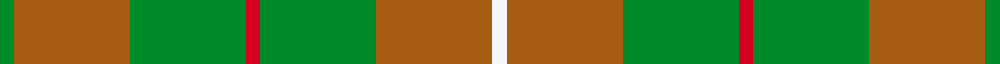

This is one **variant** — a specific cloth: this exact thread count and colourway, with its own
provenance below. It is one weaving of the [sett](/setts/g1o8g8r1g8o8w1/) (the scale-free proportion — the
same cloth at any scale or shade), whose colour order is pattern [GRGRGRW](/stripes/grgrgrw/).

Part of the [MacKinnon, hunting](/tartans/m/ma/mackinnon-hunting-5/) tartan — the named design grouping this sett with its other cloths.

Sourced from weddslist.  It is a [7 stripe tartan](/stripes/stripes7/).

Original link [http://www.weddslist.com/cgi-bin/tartans/pg.pl?source=sts](http://www.weddslist.com/cgi-bin/tartans/pg.pl?source=sts)

Dataset <small>— provenance for this record, inherited from the source manifest</small>

<dl class="dataset-prov">
<dt>source</dt><dd><a href="/sources/weddslist/">Weddslist</a></dd>
<dt>data captured from</dt><dd><a href="https://github.com/thetartan/tartan-database/blob/master/data/weddslist/data.csv">https://github.com/thetartan/tartan-database/blob/master/data/weddslist/data.csv</a></dd>
<dt>data date</dt><dd>2016-11-17 <small>(dataset default)</small></dd>
<dt>licence</dt><dd><a href="https://creativecommons.org/licenses/by-nc-nd/4.0/">CC BY-NC-ND 4.0</a></dd>
</dl>

Capture chain <small>— the hands this data passed through, oldest first; each capture carries its own licence</small>

<ol class="capture-chain">
<li><a href="https://www.weddslist.com/tartans/">Weddslist</a> <small>the living privately compiled reference</small></li>
<li><a href="https://github.com/thetartan/tartan-database">thetartan/tartan-database</a> <small>2016-2017</small> · <a href="https://creativecommons.org/licenses/by-nc-nd/4.0/">CC BY-NC-ND 4.0</a> <small>Levko Kravets's frozen compilation — the capture we vendored, and where its CC licence text came from</small></li>
<li>this dictionary <small>captured 2026-06-10 · commit 5bf86c7566</small> <small>each re-capture is a git commit to data/sources</small></li>
</ol>

## Thread count
G/4 O32 G32 R4 G32 O32 W/4

One full sett is **272 threads**.

## Palette
<table><thead><tr><th>Colour</th><th>Shade</th><th>OKLCh</th></tr></thead><tbody><tr><td>G</td><td><code style="background-color:#008B2A;">#008B2A</code> <small style="color:#888">#008B2A</small></td><td><small style="color:#888">oklch(55.4% 0.170 145.9)</small></td></tr><tr><td>W</td><td><code style="background-color:#F7F7F7;">#F7F7F7</code> <small style="color:#888">#F7F7F7</small></td><td><small style="color:#888">oklch(97.6% 0.000 89.9)</small></td></tr><tr><td>O</td><td><code style="background-color:#A65C11;">#A65C11</code> <small style="color:#888">#A65C11</small></td><td><small style="color:#888">oklch(55.0% 0.125 58.3)</small></td></tr><tr><td>R</td><td><code style="background-color:#D60020;">#D60020</code> <small style="color:#888">#D60020</small></td><td><small style="color:#888">oklch(55.2% 0.224 25.5)</small></td></tr></tbody></table>

# Sample pattern

## Nearest tartan variants

The nearest existing variants by ΔTartan distance, with this cloth at the top so the swatches line up against it.

ΔTartan

Threads

Variant

Sett

—

272

<a href="/variants/s7/g1o8g8r1g8o8w1~x4/">MacKinnon, hunting</a>

<a href="/ttd/edit/#slug=o20g40w5g40o20g9~x2&amp;base=g1o8g8r1g8o8w1~x4" title="compare in the TTD">1.29</a>

478

<a href="/variants/s6/o20g40w5g40o20g9~x2/">O'Neill (Australia)</a>

<a href="/ttd/edit/#slug=o1g1o5g8lg1g1lg1~x4&amp;base=g1o8g8r1g8o8w1~x4" title="compare in the TTD">1.60</a>

136

<a href="/variants/s7/o1g1o5g8lg1g1lg1~x4/">O'Neill Pipe Band 1983 (Corporate)</a>

<a href="/ttd/edit/#slug=o6g2o29g29o2g6~x2&amp;base=g1o8g8r1g8o8w1~x4" title="compare in the TTD">1.89</a>

272

<a href="/variants/s6/o6g2o29g29o2g6~x2/">Harmony, 11</a>

<a href="/ttd/edit/#slug=r4g3o8w3o4g18y3~x2&amp;base=g1o8g8r1g8o8w1~x4" title="compare in the TTD">2.10</a>

158

<a href="/variants/s7/r4g3o8w3o4g18y3~x2/">Newfoundland</a>

<a href="/ttd/edit/#slug=o2g10dy15o10g2~x4&amp;base=g1o8g8r1g8o8w1~x4" title="compare in the TTD">2.46</a>

296

<a href="/variants/s5/o2g10dy15o10g2~x4/">Harmony 6</a>

<a href="/ttd/edit/#slug=g1dy8g8r1g8dy8w1~x2&amp;base=g1o8g8r1g8o8w1~x4" title="compare in the TTD">2.69</a>

136

<a href="/variants/s7/g1dy8g8r1g8dy8w1~x2/">MacKinnon Hunting Clan Tartan</a>

<a href="/ttd/edit/#slug=g1dy8g8r1g8dy8w1~x4&amp;base=g1o8g8r1g8o8w1~x4" title="compare in the TTD">2.69</a>

272

<a href="/variants/s7/g1dy8g8r1g8dy8w1~x4/">MacKinnon Htg (Clan)</a>

<a href="/ttd/edit/#slug=g1r8g8ri1g8r8w1~x2~r1906028-ri2109032&amp;base=g1o8g8r1g8o8w1~x4" title="compare in the TTD">3.11</a>

136

<a href="/variants/s7/g1r8g8ri1g8r8w1~x2~r1906028-ri2109032/">MacKinnon Hunting</a>

<a href="/ttd/edit/#slug=g3dy4g2dy22n5r16ly3~x2~dy1603076-ly3307090&amp;base=g1o8g8r1g8o8w1~x4" title="compare in the TTD">3.17</a>

208

<a href="/variants/s7/g3dy4g2dy22n5r16ly3~x2~dy1603076-ly3307090/">Pubcrawlers (Corporate)</a>

<a href="/ttd/edit/#slug=r1g8o8w1~x2&amp;base=g1o8g8r1g8o8w1~x4" title="compare in the TTD">3.18</a>

68

<a href="/variants/s4/r1g8o8w1~x2/">MacKinnon, hunting</a>

## Neighbour map

Every grey dot is one of 13656 variants placed by the first two principal components of the ΔTartan feature space (42% of its variance). Red is this tartan; blue dots are its nearest — click one to open its page. The map is a flat projection of a many-dimensional space — [how to read it](/posts/neighbourhood-maps/).

<svg viewBox="0 0 640 380" role="img" style="max-width:100%;height:auto;border:1px solid #e0e0e0;border-radius:4px;display:block" xmlns="http://www.w3.org/2000/svg"><image href="/nn/cloud.v1.png" width="640" height="380"/><a href="/variants/s6/o20g40w5g40o20g9~x2/"><circle cx="462.5" cy="294.4" r="4" fill="#3465a4"><title>O'Neill (Australia)</title></circle></a><a href="/variants/s7/o1g1o5g8lg1g1lg1~x4/"><circle cx="430.2" cy="258.2" r="4" fill="#3465a4"><title>O'Neill Pipe Band 1983 (Corporate)</title></circle></a><a href="/variants/s6/o6g2o29g29o2g6~x2/"><circle cx="516.3" cy="271.7" r="4" fill="#3465a4"><title>Harmony, 11</title></circle></a><a href="/variants/s7/r4g3o8w3o4g18y3~x2/"><circle cx="278.3" cy="238.5" r="4" fill="#3465a4"><title>Newfoundland</title></circle></a><a href="/variants/s5/o2g10dy15o10g2~x4/"><circle cx="290.3" cy="289.3" r="4" fill="#3465a4"><title>Harmony 6</title></circle></a><a href="/variants/s7/g1dy8g8r1g8dy8w1~x2/"><circle cx="296.7" cy="243.6" r="4" fill="#3465a4"><title>MacKinnon Hunting Clan Tartan</title></circle></a><a href="/variants/s7/g1dy8g8r1g8dy8w1~x4/"><circle cx="296.7" cy="243.6" r="4" fill="#3465a4"><title>MacKinnon Htg (Clan)</title></circle></a><a href="/variants/s7/g1r8g8ri1g8r8w1~x2~r1906028-ri2109032/"><circle cx="315.3" cy="242.8" r="4" fill="#3465a4"><title>MacKinnon Hunting</title></circle></a><a href="/variants/s7/g3dy4g2dy22n5r16ly3~x2~dy1603076-ly3307090/"><circle cx="315.5" cy="204.9" r="4" fill="#3465a4"><title>Pubcrawlers (Corporate)</title></circle></a><a href="/variants/s4/r1g8o8w1~x2/"><circle cx="333.8" cy="270.9" r="4" fill="#3465a4"><title>MacKinnon, hunting</title></circle></a><circle cx="369.8" cy="267.2" r="5" fill="#c00000"/><text x="320" y="376" text-anchor="middle" font-size="11" fill="#999">ground</text><text x="11" y="190" text-anchor="middle" font-size="11" fill="#999" transform="rotate(-90 11 190)">complexity</text></svg>

ID: /variants/s7/g1o8g8r1g8o8w1~x4/
