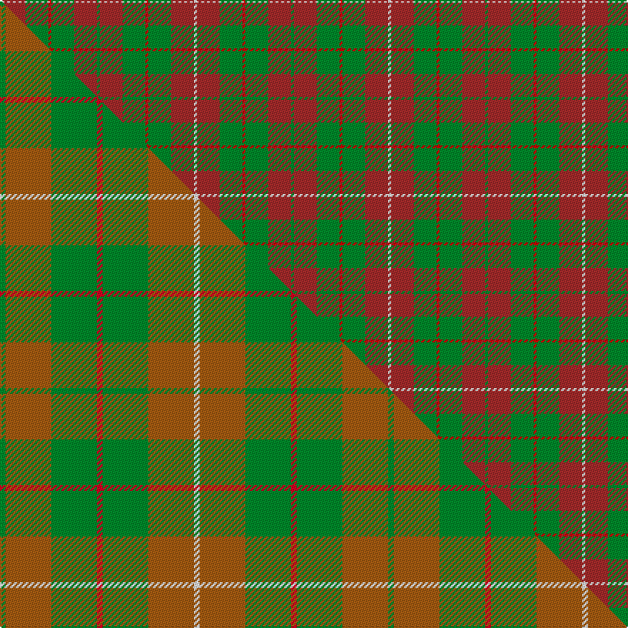

This is one **variant** — a specific cloth: this exact thread count and colourway, with its own
provenance below. It is one weaving of the [sett](/tartans/m/ma/mackinnon-hunting-5/) (the scale-free proportion — the
same cloth at any scale or shade), whose colour order is pattern [GRGRGRW](/stripes/grgrgrw/).

Part of the [MacKinnon, hunting](/tartans/m/ma/mackinnon-hunting-5/) tartan — the named design grouping this sett with its other cloths.

Sourced from weddslist.  It is a [7 stripe tartan](/stripes/stripes7/).

Original link [http://www.weddslist.com/cgi-bin/tartans/pg.pl?source=rb](http://www.weddslist.com/cgi-bin/tartans/pg.pl?source=rb)

Dataset <small>— provenance for this record, inherited from the source manifest</small>

<dl class="dataset-prov">
<dt>source</dt><dd><a href="/sources/weddslist/">Weddslist</a></dd>
<dt>data captured from</dt><dd><a href="https://github.com/thetartan/tartan-database/blob/master/data/weddslist/data.csv">https://github.com/thetartan/tartan-database/blob/master/data/weddslist/data.csv</a></dd>
<dt>data date</dt><dd>2016-11-17 <small>(dataset default)</small></dd>
<dt>licence</dt><dd><a href="https://creativecommons.org/licenses/by-nc-nd/4.0/">CC BY-NC-ND 4.0</a></dd>
</dl>

Capture chain <small>— the hands this data passed through, oldest first; each capture carries its own licence</small>

<ol class="capture-chain">
<li><a href="https://www.weddslist.com/tartans/">Weddslist</a> <small>the living privately compiled reference</small></li>
<li><a href="https://github.com/thetartan/tartan-database">thetartan/tartan-database</a> <small>2016-2017</small> · <a href="https://creativecommons.org/licenses/by-nc-nd/4.0/">CC BY-NC-ND 4.0</a> <small>Levko Kravets's frozen compilation — the capture we vendored, and where its CC licence text came from</small></li>
<li>this dictionary <small>captured 2026-06-10 · commit 5bf86c7566</small> <small>each re-capture is a git commit to data/sources</small></li>
</ol>

## Thread count
W/2 R16 G16 Ri2 G16 R16 G/2

One full sett is **136 threads**.

## Palette
<table><thead><tr><th>Colour</th><th>Shade</th><th>OKLCh</th></tr></thead><tbody><tr><td>R</td><td><code style="background-color:#A52A2A;">#A52A2A</code> <small style="color:#888">#A52A2A</small></td><td><small style="color:#888">oklch(48.1% 0.160 25.6)</small></td></tr><tr><td>G</td><td><code style="background-color:#008B2A;">#008B2A</code> <small style="color:#888">#008B2A</small></td><td><small style="color:#888">oklch(55.4% 0.170 145.9)</small></td></tr><tr><td>W</td><td><code style="background-color:#F7F7F7;">#F7F7F7</code> <small style="color:#888">#F7F7F7</small></td><td><small style="color:#888">oklch(97.6% 0.000 89.9)</small></td></tr><tr><td>R</td><td><code style="background-color:#C80000;">#C80000</code> <small style="color:#888">#C80000</small></td><td><small style="color:#888">oklch(52.3% 0.215 29.2)</small></td></tr></tbody></table>

# Sample pattern

## Compared to the master

This cloth is one sett of its design; the master sett (the exemplar the design is anchored on) is below for comparison.

Its **ΔTartan distance** from the master is **3.11** — the same measure the nearest-tartans table ranks by (0 is identical; a re-scale of the same cloth is near 0, a recolour or a different proportion further).

<figure class="master-compare" style="margin:0">

this sett
master sett ★

<figcaption style="color:#888;font-size:smaller">One weave of this sett against the <a href="/setts/g1o8g8r1g8o8w1/">master sett ★</a>, split on the diagonal: a shared proportion runs seamlessly across it with only the shades shifting; a different proportion breaks on it.</figcaption>
</figure>

## Nearest tartan variants

The nearest existing variants by ΔTartan distance, with this cloth at the top so the swatches line up against it.

ΔTartan

Threads

Variant

Sett

—

136

<a href="/variants/s7/g1r8g8ri1g8r8w1~x2~r1906028-ri2109032/">MacKinnon Hunting</a>

<a href="/ttd/edit/#slug=r30g3db5g21r3g21db2~x2&amp;base=g1r8g8ri1g8r8w1~x2~r1906028-ri2109032" title="compare in the TTD">1.29</a>

276

<a href="/variants/s7/r30g3db5g21r3g21db2~x2/">Scottish Piping Soc. of London (Corp</a>

<a href="/ttd/edit/#slug=r3g3lo2r18w2g21lo2g2lo3~x2&amp;base=g1r8g8ri1g8r8w1~x2~r1906028-ri2109032" title="compare in the TTD">1.74</a>

212

<a href="/variants/s9/r3g3lo2r18w2g21lo2g2lo3~x2/">MacDonald of Kingsburgh</a>

<a href="/ttd/edit/#slug=g8r2g9r16w1~x2&amp;base=g1r8g8ri1g8r8w1~x2~r1906028-ri2109032" title="compare in the TTD">1.88</a>

126

<a href="/variants/s5/g8r2g9r16w1~x2/">MacGregor of Balquhidder</a>

<a href="/ttd/edit/#slug=g5w2r27g27r5w2~x2&amp;base=g1r8g8ri1g8r8w1~x2~r1906028-ri2109032" title="compare in the TTD">2.13</a>

258

<a href="/variants/s6/g5w2r27g27r5w2~x2/">MacDonald of Glenaladale (symmetrical)</a>

<a href="/ttd/edit/#slug=r3g19dy3g19r3g3r21lb3~x2&amp;base=g1r8g8ri1g8r8w1~x2~r1906028-ri2109032" title="compare in the TTD">2.26</a>

284

<a href="/variants/s8/r3g19dy3g19r3g3r21lb3~x2/">Burnett of Powis (Personal)</a>

<a href="/ttd/edit/#slug=r4g14ly3g14r4g3r29y4~x2&amp;base=g1r8g8ri1g8r8w1~x2~r1906028-ri2109032" title="compare in the TTD">2.28</a>

284

<a href="/variants/s8/r4g14ly3g14r4g3r29y4~x2/">Burnett</a>

<a href="/ttd/edit/#slug=y1r3g7r3g7r3y1~x4&amp;base=g1r8g8ri1g8r8w1~x2~r1906028-ri2109032" title="compare in the TTD">2.71</a>

192

<a href="/variants/s7/y1r3g7r3g7r3y1~x4/">Unidentified #42</a>

<a href="/ttd/edit/#slug=db9r6g2r6g18r6g2&amp;base=g1r8g8ri1g8r8w1~x2~r1906028-ri2109032" title="compare in the TTD">2.77</a>

87

<a href="/variants/s7/db9r6g2r6g18r6g2/">Skene D</a>

<a href="/ttd/edit/#slug=db9r6g2r6g18r6g2~x2&amp;base=g1r8g8ri1g8r8w1~x2~r1906028-ri2109032" title="compare in the TTD">2.77</a>

174

<a href="/variants/s7/db9r6g2r6g18r6g2~x2/">Skene D</a>

<a href="/ttd/edit/#slug=g1dy8g8r1g8dy8w1~x2&amp;base=g1r8g8ri1g8r8w1~x2~r1906028-ri2109032" title="compare in the TTD">2.82</a>

136

<a href="/variants/s7/g1dy8g8r1g8dy8w1~x2/">MacKinnon Hunting Clan Tartan</a>

## Neighbour map

Every grey dot is one of 13656 variants placed by the first two principal components of the ΔTartan feature space (42% of its variance). Red is this tartan; blue dots are its nearest — click one to open its page. The map is a flat projection of a many-dimensional space — [how to read it](/posts/neighbourhood-maps/).

<svg viewBox="0 0 640 380" role="img" style="max-width:100%;height:auto;border:1px solid #e0e0e0;border-radius:4px;display:block" xmlns="http://www.w3.org/2000/svg"><image href="/nn/cloud.v1.png" width="640" height="380"/><a href="/variants/s7/r30g3db5g21r3g21db2~x2/"><circle cx="349.8" cy="206.9" r="4" fill="#3465a4"><title>Scottish Piping Soc. of London (Corp</title></circle></a><a href="/variants/s9/r3g3lo2r18w2g21lo2g2lo3~x2/"><circle cx="293.7" cy="179.2" r="4" fill="#3465a4"><title>MacDonald of Kingsburgh</title></circle></a><a href="/variants/s5/g8r2g9r16w1~x2/"><circle cx="360.4" cy="227.2" r="4" fill="#3465a4"><title>MacGregor of Balquhidder</title></circle></a><a href="/variants/s6/g5w2r27g27r5w2~x2/"><circle cx="338.6" cy="205.7" r="4" fill="#3465a4"><title>MacDonald of Glenaladale (symmetrical)</title></circle></a><a href="/variants/s8/r3g19dy3g19r3g3r21lb3~x2/"><circle cx="323.8" cy="219.3" r="4" fill="#3465a4"><title>Burnett of Powis (Personal)</title></circle></a><a href="/variants/s8/r4g14ly3g14r4g3r29y4~x2/"><circle cx="325.0" cy="205.1" r="4" fill="#3465a4"><title>Burnett</title></circle></a><a href="/variants/s7/y1r3g7r3g7r3y1~x4/"><circle cx="352.8" cy="266.8" r="4" fill="#3465a4"><title>Unidentified #42</title></circle></a><a href="/variants/s7/db9r6g2r6g18r6g2/"><circle cx="263.9" cy="236.8" r="4" fill="#3465a4"><title>Skene D</title></circle></a><a href="/variants/s7/db9r6g2r6g18r6g2~x2/"><circle cx="263.9" cy="236.8" r="4" fill="#3465a4"><title>Skene D</title></circle></a><a href="/variants/s7/g1dy8g8r1g8dy8w1~x2/"><circle cx="296.7" cy="243.6" r="4" fill="#3465a4"><title>MacKinnon Hunting Clan Tartan</title></circle></a><circle cx="315.3" cy="242.8" r="5" fill="#c00000"/><text x="320" y="376" text-anchor="middle" font-size="11" fill="#999">ground</text><text x="11" y="190" text-anchor="middle" font-size="11" fill="#999" transform="rotate(-90 11 190)">complexity</text></svg>

ID: /variants/s7/g1r8g8ri1g8r8w1~x2~r1906028-ri2109032/
