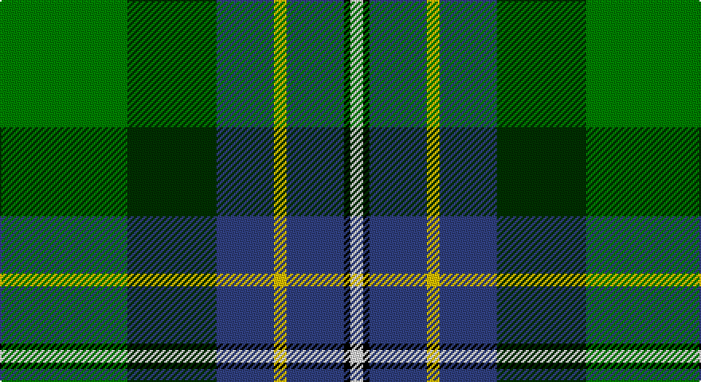

This page is one **sett** — a single exact thread-count. It belongs to the [tartan](/setts/g20dg14db9ly2db9k1w2/)
(the same proportion at any scale), whose colour order is pattern [GGBYBKW](/stripes/ggbybkw/).

Sourced from weddslist.  It is a [7 stripe tartan](/stripes/stripes7/).

Original link http://www.weddslist.com/cgi-bin/tartans/pg.pl?source=sts

## Thread count
G/80 DG56 B36 Y8 B36 K4 LN/8

One full sett is **368 threads**.

## Palette

Palette: <strong>Tartan Register</strong> <small style="color:#888">(2 of 6 colours)</small>
<table><thead><tr><th>Colour</th><th>Threads</th><th>Shade</th><th>Base</th><th>OKLCh</th></tr></thead><tbody><tr><td>G/</td><td style="text-align:right;font-variant-numeric:tabular-nums">80</td><td><code style="background-color:#008000;">#008000</code> <small style="color:#888">#008000</small></td><td>G <code style="background-color:#006100;">#006100</code></td><td><small style="color:#888">oklch(52.0% 0.177 142.5)</small></td></tr><tr><td>DG</td><td style="text-align:right;font-variant-numeric:tabular-nums">56</td><td><code style="background-color:#003000;">#003000</code> <small style="color:#888">#003000</small></td><td>G <code style="background-color:#006100;">#006100</code></td><td><small style="color:#888">oklch(26.8% 0.091 142.5)</small></td></tr><tr><td>B</td><td style="text-align:right;font-variant-numeric:tabular-nums">36</td><td><code style="background-color:#304080;">#304080</code> <small style="color:#888">#304080</small></td><td>B <code style="background-color:#2A418A;">#2A418A</code></td><td><small style="color:#888">oklch(39.4% 0.109 270.2)</small></td></tr><tr><td>Y</td><td style="text-align:right;font-variant-numeric:tabular-nums">8</td><td><code style="background-color:#F0C000;">#F0C000</code> <small style="color:#888">#F0C000</small></td><td>Y <code style="background-color:#F2BF00;">#F2BF00</code></td><td><small style="color:#888">oklch(82.7% 0.169 90.5)</small></td></tr><tr><td>B</td><td style="text-align:right;font-variant-numeric:tabular-nums">36</td><td><code style="background-color:#304080;">#304080</code> <small style="color:#888">#304080</small></td><td>B <code style="background-color:#2A418A;">#2A418A</code></td><td><small style="color:#888">oklch(39.4% 0.109 270.2)</small></td></tr><tr><td>K</td><td style="text-align:right;font-variant-numeric:tabular-nums">4</td><td><code style="background-color:#000000;">#000000</code> <small style="color:#888">#000000</small></td><td>K <code style="background-color:#000000;">#000000</code></td><td><small style="color:#888">oklch(0.0% 0.000 0.0)</small></td></tr><tr><td>LN/</td><td style="text-align:right;font-variant-numeric:tabular-nums">8</td><td><code style="background-color:#E0E0E0;">#E0E0E0</code> <small style="color:#888">#E0E0E0</small></td><td>W <code style="background-color:#F7F7F7;">#F7F7F7</code></td><td><small style="color:#888">oklch(90.7% 0.000 89.9)</small></td></tr></tbody></table>

# Sample pattern

## Nearest tartans

The nearest existing variants by ΔTartan distance, with this tartan at the top so the swatches line up against it.

ΔTartan

Tartan

Sett

—

<a href="/ttd/edit/#slug=g20dg14db9ly2db9k1w2~x4">Hughes</a> <a class="nn-out" href="/variants/s7/g20dg14db9ly2db9k1w2~x4/" title="open its dictionary page">↗</a>

0.72

<a href="/ttd/edit/#slug=g36dg24b18ly4b18k2w5~x2&amp;base=g20dg14db9ly2db9k1w2~x4">Hughes (Inverbervie) (Personal)</a> <a class="nn-out" href="/variants/s7/g36dg24b18ly4b18k2w5~x2/" title="open its dictionary page">↗</a>

1.00

<a href="/ttd/edit/#slug=w1r2b16k14g15k3ly1~x2&amp;base=g20dg14db9ly2db9k1w2~x4">Macneil of Barra - Chief (Personal)</a> <a class="nn-out" href="/variants/s7/w1r2b16k14g15k3ly1~x2/" title="open its dictionary page">↗</a>

1.02

<a href="/ttd/edit/#slug=g3dp4g23k10r2k10t18k1w3~x2&amp;base=g20dg14db9ly2db9k1w2~x4">Birch Family Tartan</a> <a class="nn-out" href="/variants/s9/g3dp4g23k10r2k10t18k1w3~x2/" title="open its dictionary page">↗</a>

1.10

<a href="/ttd/edit/#slug=r4lb1y6g25k8db15lb2~x2&amp;base=g20dg14db9ly2db9k1w2~x4">Jones (Name)</a> <a class="nn-out" href="/variants/s7/r4lb1y6g25k8db15lb2~x2/" title="open its dictionary page">↗</a>

1.10

<a href="/ttd/edit/#slug=t34r3t8db4t8k24g34k2w6&amp;base=g20dg14db9ly2db9k1w2~x4">Hogg Dress (Name)</a> <a class="nn-out" href="/variants/s9/t34r3t8db4t8k24g34k2w6/" title="open its dictionary page">↗</a>

1.12

<a href="/ttd/edit/#slug=t6db17p4db2k11g33ly4~x2&amp;base=g20dg14db9ly2db9k1w2~x4">East Lothian</a> <a class="nn-out" href="/variants/s7/t6db17p4db2k11g33ly4~x2/" title="open its dictionary page">↗</a>

1.17

<a href="/ttd/edit/#slug=dbi4db4dg16g16dbi4db4ly1~x4&amp;base=g20dg14db9ly2db9k1w2~x4">Unidentified, Waistcoat</a> <a class="nn-out" href="/variants/s7/dbi4db4dg16g16dbi4db4ly1~x4/" title="open its dictionary page">↗</a>

1.18

<a href="/ttd/edit/#slug=gi18g6dy3w1dy3w1t6db6~x2&amp;base=g20dg14db9ly2db9k1w2~x4">Iroquois Falls Centenary (Commem.)</a> <a class="nn-out" href="/variants/s8/gi18g6dy3w1dy3w1t6db6~x2/" title="open its dictionary page">↗</a>

1.23

<a href="/ttd/edit/#slug=r3k11gi29k28g19ly2db1~x2&amp;base=g20dg14db9ly2db9k1w2~x4">PMMC</a> <a class="nn-out" href="/variants/s7/r3k11gi29k28g19ly2db1~x2/" title="open its dictionary page">↗</a>

1.24

<a href="/ttd/edit/#slug=r3k11dg29k28g19ly2b1~x2&amp;base=g20dg14db9ly2db9k1w2~x4">PMMC</a> <a class="nn-out" href="/variants/s7/r3k11dg29k28g19ly2b1~x2/" title="open its dictionary page">↗</a>

## Neighbour map

Every grey dot is one of 14360 variants placed by the first two principal components of the ΔTartan feature space (44% of its variance). Red is this tartan; blue dots are its nearest — click one to open its page.

<svg viewBox="0 0 640 380" role="img" style="max-width:100%;height:auto;border:1px solid #e0e0e0;border-radius:4px;display:block" xmlns="http://www.w3.org/2000/svg"><image href="/nn/cloud.v1.png" width="640" height="380"/><a href="/variants/s7/g36dg24b18ly4b18k2w5~x2/"><circle cx="153.0" cy="170.3" r="4" fill="#3465a4"><title>Hughes (Inverbervie) (Personal)</title></circle></a><a href="/variants/s7/w1r2b16k14g15k3ly1~x2/"><circle cx="152.1" cy="156.6" r="4" fill="#3465a4"><title>Macneil of Barra - Chief (Personal)</title></circle></a><a href="/variants/s9/g3dp4g23k10r2k10t18k1w3~x2/"><circle cx="160.6" cy="129.1" r="4" fill="#3465a4"><title>Birch Family Tartan</title></circle></a><a href="/variants/s7/r4lb1y6g25k8db15lb2~x2/"><circle cx="209.4" cy="147.6" r="4" fill="#3465a4"><title>Jones (Name)</title></circle></a><a href="/variants/s9/t34r3t8db4t8k24g34k2w6/"><circle cx="181.2" cy="142.3" r="4" fill="#3465a4"><title>Hogg Dress (Name)</title></circle></a><a href="/variants/s7/t6db17p4db2k11g33ly4~x2/"><circle cx="170.3" cy="145.3" r="4" fill="#3465a4"><title>East Lothian</title></circle></a><a href="/variants/s7/dbi4db4dg16g16dbi4db4ly1~x4/"><circle cx="175.9" cy="192.7" r="4" fill="#3465a4"><title>Unidentified, Waistcoat</title></circle></a><a href="/variants/s8/gi18g6dy3w1dy3w1t6db6~x2/"><circle cx="189.1" cy="154.9" r="4" fill="#3465a4"><title>Iroquois Falls Centenary (Commem.)</title></circle></a><a href="/variants/s7/r3k11gi29k28g19ly2db1~x2/"><circle cx="212.1" cy="142.4" r="4" fill="#3465a4"><title>PMMC</title></circle></a><a href="/variants/s7/r3k11dg29k28g19ly2b1~x2/"><circle cx="212.5" cy="142.4" r="4" fill="#3465a4"><title>PMMC</title></circle></a><circle cx="166.8" cy="160.8" r="5" fill="#c00000"/></svg>

ID: /variants/s7/g20dg14db9ly2db9k1w2~x4/
