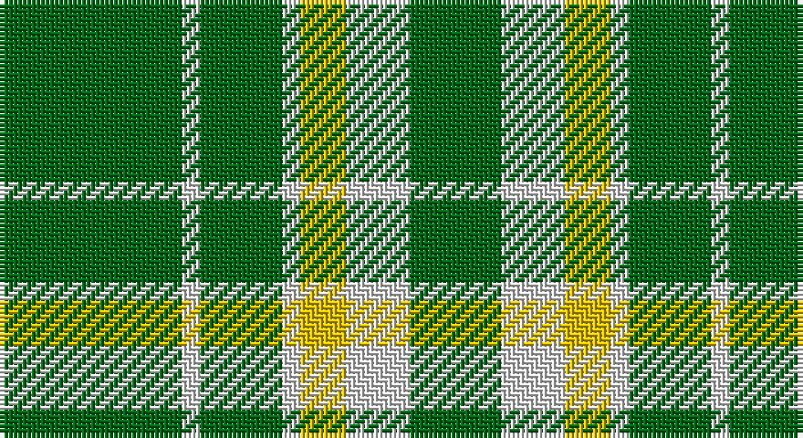

This page is one **sett** — a single exact thread-count. It belongs to the [tartan](/setts/g20w2g9w2ly5w7g10/)
(the same proportion at any scale), whose colour order is pattern [GWGWYWG](/stripes/gwgwywg/).

Sourced from tartans-authority.  It is a [7 stripe tartan](/stripes/stripes7/).

Original link http://www.tartansauthority.com/tartan-ferret/display/8039/

## Register references

External register numbers recorded for this tartan.

- Scottish Tartans Authority (ITI): 8039

## Thread count
G/40 LN4 G18 LN4 Y10 LN14 G/20

One full sett is **160 threads**.

## Palette

Palette: <strong>Tartan Register</strong>
<table><thead><tr><th>Colour</th><th>Threads</th><th>Shade</th><th>Base</th><th>OKLCh</th></tr></thead><tbody><tr><td>G/</td><td style="text-align:right;font-variant-numeric:tabular-nums">40</td><td><code style="background-color:#006818;">#006818</code> <small style="color:#888">#006818</small></td><td>G <code style="background-color:#006100;">#006100</code></td><td><small style="color:#888">oklch(45.0% 0.142 145.0)</small></td></tr><tr><td>LN</td><td style="text-align:right;font-variant-numeric:tabular-nums">4</td><td><code style="background-color:#E0E0E0;">#E0E0E0</code> <small style="color:#888">#E0E0E0</small></td><td>W <code style="background-color:#F7F7F7;">#F7F7F7</code></td><td><small style="color:#888">oklch(90.7% 0.000 89.9)</small></td></tr><tr><td>G</td><td style="text-align:right;font-variant-numeric:tabular-nums">18</td><td><code style="background-color:#006818;">#006818</code> <small style="color:#888">#006818</small></td><td>G <code style="background-color:#006100;">#006100</code></td><td><small style="color:#888">oklch(45.0% 0.142 145.0)</small></td></tr><tr><td>LN</td><td style="text-align:right;font-variant-numeric:tabular-nums">4</td><td><code style="background-color:#E0E0E0;">#E0E0E0</code> <small style="color:#888">#E0E0E0</small></td><td>W <code style="background-color:#F7F7F7;">#F7F7F7</code></td><td><small style="color:#888">oklch(90.7% 0.000 89.9)</small></td></tr><tr><td>Y</td><td style="text-align:right;font-variant-numeric:tabular-nums">10</td><td><code style="background-color:#E8C000;">#E8C000</code> <small style="color:#888">#E8C000</small></td><td>Y <code style="background-color:#F2BF00;">#F2BF00</code></td><td><small style="color:#888">oklch(81.9% 0.168 93.7)</small></td></tr><tr><td>LN</td><td style="text-align:right;font-variant-numeric:tabular-nums">14</td><td><code style="background-color:#E0E0E0;">#E0E0E0</code> <small style="color:#888">#E0E0E0</small></td><td>W <code style="background-color:#F7F7F7;">#F7F7F7</code></td><td><small style="color:#888">oklch(90.7% 0.000 89.9)</small></td></tr><tr><td>G/</td><td style="text-align:right;font-variant-numeric:tabular-nums">20</td><td><code style="background-color:#006818;">#006818</code> <small style="color:#888">#006818</small></td><td>G <code style="background-color:#006100;">#006100</code></td><td><small style="color:#888">oklch(45.0% 0.142 145.0)</small></td></tr></tbody></table>

# Sample pattern

## Nearest tartans

The nearest existing variants by ΔTartan distance, with this tartan at the top so the swatches line up against it.

ΔTartan

Tartan

Sett

—

<a href="/ttd/edit/#slug=g20w2g9w2ly5w7g10~x2">Heritage (Commemorative)</a> <a class="nn-out" href="/variants/s7/g20w2g9w2ly5w7g10~x2/" title="open its dictionary page">↗</a>

0.82

<a href="/ttd/edit/#slug=dg20w2dg9w2ly5w7dg10~x2&amp;base=g20w2g9w2ly5w7g10~x2">Heritage #2</a> <a class="nn-out" href="/variants/s7/dg20w2dg9w2ly5w7dg10~x2/" title="open its dictionary page">↗</a>

1.41

<a href="/ttd/edit/#slug=g9ly20g40w5~x2&amp;base=g20w2g9w2ly5w7g10~x2">O'Neill Irish Family Tartan</a> <a class="nn-out" href="/variants/s4/g9ly20g40w5~x2/" title="open its dictionary page">↗</a>

1.66

<a href="/ttd/edit/#slug=k3lb1g15g6k2dr3lb2~x2&amp;base=g20w2g9w2ly5w7g10~x2">Leach Hunting</a> <a class="nn-out" href="/variants/s7/k3lb1g15g6k2dr3lb2~x2/" title="open its dictionary page">↗</a>

1.70

<a href="/ttd/edit/#slug=g19w5g2k5w2~x2&amp;base=g20w2g9w2ly5w7g10~x2">Loch Rannoch</a> <a class="nn-out" href="/variants/s5/g19w5g2k5w2~x2/" title="open its dictionary page">↗</a>

1.71

<a href="/ttd/edit/#slug=g37w9g3k9w3&amp;base=g20w2g9w2ly5w7g10~x2">Loch Rannoch</a> <a class="nn-out" href="/variants/s5/g37w9g3k9w3/" title="open its dictionary page">↗</a>

1.74

<a href="/ttd/edit/#slug=g34m4g4m4g4m12g20w5~x2&amp;base=g20w2g9w2ly5w7g10~x2">Leeds, University of (Dance)</a> <a class="nn-out" href="/variants/s8/g34m4g4m4g4m12g20w5~x2/" title="open its dictionary page">↗</a>

1.77

<a href="/ttd/edit/#slug=g7db1g2k3g2~x4&amp;base=g20w2g9w2ly5w7g10~x2">Peterhead</a> <a class="nn-out" href="/variants/s5/g7db1g2k3g2~x4/" title="open its dictionary page">↗</a>

1.83

<a href="/ttd/edit/#slug=g14ly7g14dg50g64w6g7&amp;base=g20w2g9w2ly5w7g10~x2">Freedom of Derry</a> <a class="nn-out" href="/variants/s7/g14ly7g14dg50g64w6g7/" title="open its dictionary page">↗</a>

1.83

<a href="/ttd/edit/#slug=dg21ly43dg86t10&amp;base=g20w2g9w2ly5w7g10~x2">Special Saffron Tartan</a> <a class="nn-out" href="/variants/s4/dg21ly43dg86t10/" title="open its dictionary page">↗</a>

1.83

<a href="/ttd/edit/#slug=g9ri4g1ri4g15r4g1~x4&amp;base=g20w2g9w2ly5w7g10~x2">Logan #4</a> <a class="nn-out" href="/variants/s7/g9ri4g1ri4g15r4g1~x4/" title="open its dictionary page">↗</a>

## Neighbour map

Every grey dot is one of 14360 variants placed by the first two principal components of the ΔTartan feature space (44% of its variance). Red is this tartan; blue dots are its nearest — click one to open its page.

<svg viewBox="0 0 640 380" role="img" style="max-width:100%;height:auto;border:1px solid #e0e0e0;border-radius:4px;display:block" xmlns="http://www.w3.org/2000/svg"><image href="/nn/cloud.v1.png" width="640" height="380"/><a href="/variants/s7/dg20w2dg9w2ly5w7dg10~x2/"><circle cx="371.6" cy="226.4" r="4" fill="#3465a4"><title>Heritage #2</title></circle></a><a href="/variants/s4/g9ly20g40w5~x2/"><circle cx="361.9" cy="261.1" r="4" fill="#3465a4"><title>O'Neill Irish Family Tartan</title></circle></a><a href="/variants/s7/k3lb1g15g6k2dr3lb2~x2/"><circle cx="351.1" cy="180.2" r="4" fill="#3465a4"><title>Leach Hunting</title></circle></a><a href="/variants/s5/g19w5g2k5w2~x2/"><circle cx="332.3" cy="217.2" r="4" fill="#3465a4"><title>Loch Rannoch</title></circle></a><a href="/variants/s5/g37w9g3k9w3/"><circle cx="356.6" cy="204.0" r="4" fill="#3465a4"><title>Loch Rannoch</title></circle></a><a href="/variants/s8/g34m4g4m4g4m12g20w5~x2/"><circle cx="429.5" cy="226.9" r="4" fill="#3465a4"><title>Leeds, University of (Dance)</title></circle></a><a href="/variants/s5/g7db1g2k3g2~x4/"><circle cx="386.6" cy="270.5" r="4" fill="#3465a4"><title>Peterhead</title></circle></a><a href="/variants/s7/g14ly7g14dg50g64w6g7/"><circle cx="336.3" cy="205.6" r="4" fill="#3465a4"><title>Freedom of Derry</title></circle></a><a href="/variants/s4/dg21ly43dg86t10/"><circle cx="356.7" cy="255.8" r="4" fill="#3465a4"><title>Special Saffron Tartan</title></circle></a><a href="/variants/s7/g9ri4g1ri4g15r4g1~x4/"><circle cx="427.7" cy="217.7" r="4" fill="#3465a4"><title>Logan #4</title></circle></a><circle cx="379.3" cy="230.0" r="5" fill="#c00000"/></svg>

ID: /variants/s7/g20w2g9w2ly5w7g10~x2/
