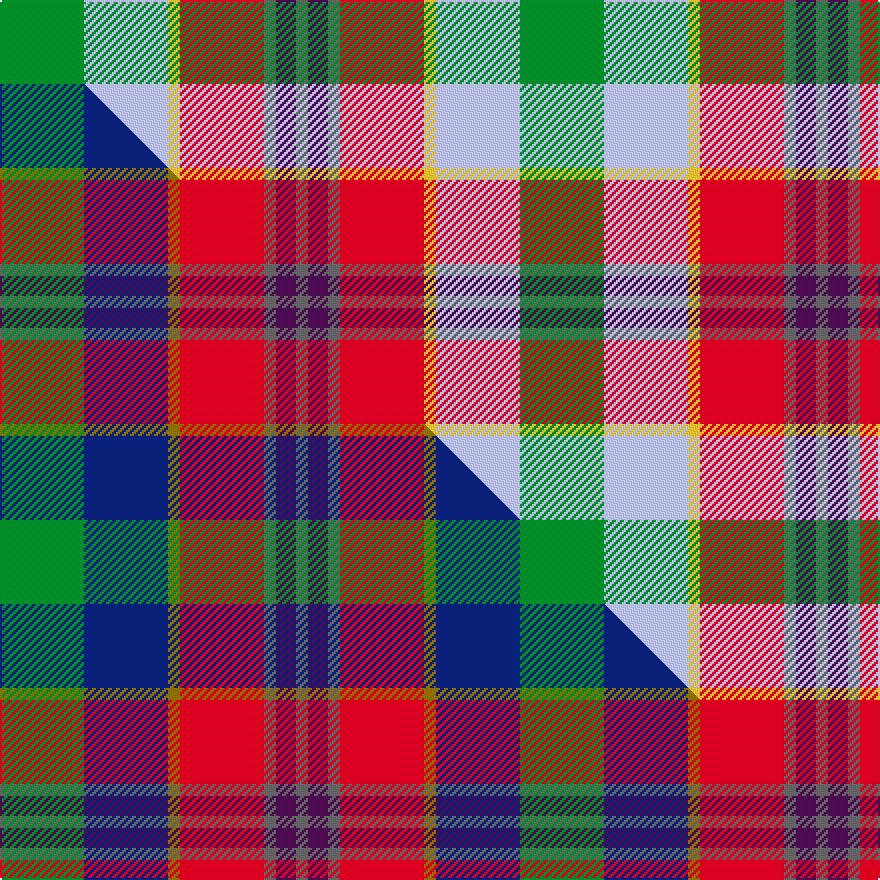

This is one **variant** — a specific cloth: this exact thread count and colourway, with its own
provenance below. It is one weaving of the [sett](/setts/g21lb21ly3r21n3dp5n3/) (the scale-free proportion — the
same cloth at any scale or shade), whose colour order is pattern [BBBRYWG](/stripes/bbbrywg/).

Part of the [Falardeau-Murphy](/tartans/falardeau-murphy/) tartan — the named design grouping this sett with its other cloths.

Sourced from tartans-authority.  It is a [7 stripe tartan](/stripes/stripes7/).

Original link [https://www.tartanregister.gov.uk/tartanDetails.aspx?ref=11033](https://www.tartanregister.gov.uk/tartanDetails.aspx?ref=11033)

Dataset <small>— provenance for this record, inherited from the source manifest</small>

<dl class="dataset-prov">
<dt>source</dt><dd><a href="/sources/tartans-authority/">Scottish Tartans Authority</a></dd>
<dt>data captured from</dt><dd><a href="https://github.com/thetartan/tartan-database/blob/master/data/tartans-authority/data.csv">https://github.com/thetartan/tartan-database/blob/master/data/tartans-authority/data.csv</a></dd>
<dt>data date</dt><dd>2014 <small>(this record)</small></dd>
<dt>licence</dt><dd><a href="https://creativecommons.org/licenses/by-nc-nd/4.0/">CC BY-NC-ND 4.0</a></dd>
</dl>

Capture chain <small>— the hands this data passed through, oldest first; each capture carries its own licence</small>

<ol class="capture-chain">
<li><a href="https://www.tartansauthority.com/">Scottish Tartans Authority</a> <small>the heritage body's archive — its tartan-ferret record browser is retired (links repaired to the SRT, above)</small></li>
<li><a href="https://github.com/thetartan/tartan-database">thetartan/tartan-database</a> <small>2016-2017</small> · <a href="https://creativecommons.org/licenses/by-nc-nd/4.0/">CC BY-NC-ND 4.0</a> <small>Levko Kravets's frozen compilation — the capture we vendored, and where its CC licence text came from</small></li>
<li>this dictionary <small>captured 2026-06-10 · commit 5bf86c7566</small> <small>each re-capture is a git commit to data/sources</small></li>
</ol>

## Register references

External register numbers recorded for this tartan.

- Scottish Register of Tartans: [11033](https://www.tartanregister.gov.uk/tartanDetails?ref=11033)
- Scottish Tartans Authority (ITI): 11033

## Thread count
G/42 LB42 LY6 R42 N6 DP10 N/6

One full sett is **260 threads**.

## Palette
<table><thead><tr><th>Colour</th><th>Shade</th><th>OKLCh</th></tr></thead><tbody><tr><td>LB</td><td><code style="background-color:#B5BBDE;">#B5BBDE</code> <small style="color:#888">#B5BBDE</small></td><td><small style="color:#888">oklch(79.9% 0.050 277.6)</small></td></tr><tr><td>R</td><td><code style="background-color:#D60020;">#D60020</code> <small style="color:#888">#D60020</small></td><td><small style="color:#888">oklch(55.2% 0.224 25.5)</small></td></tr><tr><td>G</td><td><code style="background-color:#008B2A;">#008B2A</code> <small style="color:#888">#008B2A</small></td><td><small style="color:#888">oklch(55.4% 0.170 145.9)</small></td></tr><tr><td>N</td><td><code style="background-color:#636363;">#636363</code> <small style="color:#888">#636363</small></td><td><small style="color:#888">oklch(50.0% 0.000 89.9)</small></td></tr><tr><td>DP</td><td><code style="background-color:#4B0B4F;">#4B0B4F</code> <small style="color:#888">#4B0B4F</small></td><td><small style="color:#888">oklch(30.1% 0.125 325.4)</small></td></tr><tr><td>LY</td><td><code style="background-color:#DCBC32;">#DCBC32</code> <small style="color:#888">#DCBC32</small></td><td><small style="color:#888">oklch(80.0% 0.150 95.2)</small></td></tr></tbody></table>

# Sample pattern

## Compared to the master

This cloth is one sett of its design; the master sett (the exemplar the design is anchored on) is below for comparison.

Its **ΔTartan distance** from the master is **0.19** — the same measure the nearest-tartans table ranks by (0 is identical; a re-scale of the same cloth is near 0, a recolour or a different proportion further).

<figure class="master-compare" style="margin:0">

this sett
master sett ★

<figcaption style="color:#888;font-size:smaller">One weave of this sett against the <a href="/setts/g21db21y3r21n3dp5n3/">master sett ★</a>, split on the diagonal: a shared proportion runs seamlessly across it with only the shades shifting; a different proportion breaks on it.</figcaption>
</figure>

## Nearest tartan variants

The nearest existing variants by ΔTartan distance, with this cloth at the top so the swatches line up against it.

ΔTartan

Threads

Variant

Sett

—

260

<a href="/variants/s7/g21lb21ly3r21n3dp5n3~x2/">Falardeau-Murphy (Canada) (Personal)</a>

<a href="/ttd/edit/#slug=g21db21y3r21n3dp5n3~x2&amp;base=g21lb21ly3r21n3dp5n3~x2" title="compare in the TTD">0.19</a>

260

<a href="/variants/s7/g21db21y3r21n3dp5n3~x2/">Falardeau-Murphy (Canada) (Personal)</a>

<a href="/ttd/edit/#slug=r8lo4y3g6lb6dp1~x5&amp;base=g21lb21ly3r21n3dp5n3~x2" title="compare in the TTD">1.46</a>

235

<a href="/variants/s6/r8lo4y3g6lb6dp1~x5/">Pride, The Tartan of</a>

<a href="/ttd/edit/#slug=ly8r3t2db1w6g12db2~x2&amp;base=g21lb21ly3r21n3dp5n3~x2" title="compare in the TTD">1.56</a>

116

<a href="/variants/s7/ly8r3t2db1w6g12db2~x2/">Carmen Lau (Hong Kong) (Personal)</a>

<a href="/ttd/edit/#slug=n7w1r6db10g10w1~x4&amp;base=g21lb21ly3r21n3dp5n3~x2" title="compare in the TTD">1.62</a>

248

<a href="/variants/s6/n7w1r6db10g10w1~x4/">McEachem (Name)</a>

<a href="/ttd/edit/#slug=w6lb36y12g19dg6r6dg6r28dg4&amp;base=g21lb21ly3r21n3dp5n3~x2" title="compare in the TTD">1.73</a>

236

<a href="/variants/s9/w6lb36y12g19dg6r6dg6r28dg4/">Derry Family (Olney, Buckinghamshire) (Personal)</a>

<a href="/ttd/edit/#slug=w6lb36ly12g19dg6r6dg6r28dg4~g2408144-dg1806142&amp;base=g21lb21ly3r21n3dp5n3~x2" title="compare in the TTD">1.93</a>

236

<a href="/variants/s9/w6lb36ly12g19dg6r6dg6r28dg4~g2408144-dg1806142/">Derry Family (Personal)</a>

<a href="/ttd/edit/#slug=o17n5db2w12db2y4g7~x2&amp;base=g21lb21ly3r21n3dp5n3~x2" title="compare in the TTD">2.13</a>

148

<a href="/variants/s7/o17n5db2w12db2y4g7~x2/">Ontario, Northern</a>

<a href="/ttd/edit/#slug=r10dbi6g24db24r6y3~dbi1406275-db1004274&amp;base=g21lb21ly3r21n3dp5n3~x2" title="compare in the TTD">2.31</a>

133

<a href="/variants/s6/r10dbi6g24db24r6y3~dbi1406275-db1004274/">Canine All Dogs (Fashion)</a>

<a href="/ttd/edit/#slug=o10n3db1lb8db1lo2g5~x4&amp;base=g21lb21ly3r21n3dp5n3~x2" title="compare in the TTD">2.42</a>

180

<a href="/variants/s7/o10n3db1lb8db1lo2g5~x4/">Porcupine City of</a>

<a href="/ttd/edit/#slug=r24w3y4dg18dp18dgi3lb4~x2~dg1104144-dgi1703114&amp;base=g21lb21ly3r21n3dp5n3~x2" title="compare in the TTD">2.46</a>

240

<a href="/variants/s7/r24w3y4dg18dp18dy3lb4~x2~dg1104144-dy1703114/">Walter</a>

## Neighbour map

Every grey dot is one of 13621 variants placed by the first two principal components of the ΔTartan feature space (42% of its variance). Red is this tartan; blue dots are its nearest — click one to open its page.

<svg viewBox="0 0 640 380" role="img" style="max-width:100%;height:auto;border:1px solid #e0e0e0;border-radius:4px;display:block" xmlns="http://www.w3.org/2000/svg"><image href="/nn/cloud.v1.png" width="640" height="380"/><a href="/variants/s7/g21db21y3r21n3dp5n3~x2/"><circle cx="122.4" cy="206.8" r="4" fill="#3465a4"><title>Falardeau-Murphy (Canada) (Personal)</title></circle></a><a href="/variants/s6/r8lo4y3g6lb6dp1~x5/"><circle cx="116.9" cy="246.9" r="4" fill="#3465a4"><title>Pride, The Tartan of</title></circle></a><a href="/variants/s7/ly8r3t2db1w6g12db2~x2/"><circle cx="135.0" cy="189.6" r="4" fill="#3465a4"><title>Carmen Lau (Hong Kong) (Personal)</title></circle></a><a href="/variants/s6/n7w1r6db10g10w1~x4/"><circle cx="135.8" cy="229.8" r="4" fill="#3465a4"><title>McEachem (Name)</title></circle></a><a href="/variants/s9/w6lb36y12g19dg6r6dg6r28dg4/"><circle cx="110.1" cy="182.5" r="4" fill="#3465a4"><title>Derry Family (Olney, Buckinghamshire) (Personal)</title></circle></a><a href="/variants/s9/w6lb36ly12g19dg6r6dg6r28dg4~g2408144-dg1806142/"><circle cx="119.1" cy="187.1" r="4" fill="#3465a4"><title>Derry Family (Personal)</title></circle></a><a href="/variants/s7/o17n5db2w12db2y4g7~x2/"><circle cx="125.5" cy="200.6" r="4" fill="#3465a4"><title>Ontario, Northern</title></circle></a><a href="/variants/s6/r10dbi6g24db24r6y3~dbi1406275-db1004274/"><circle cx="163.3" cy="226.8" r="4" fill="#3465a4"><title>Canine All Dogs (Fashion)</title></circle></a><a href="/variants/s7/o10n3db1lb8db1lo2g5~x4/"><circle cx="170.2" cy="206.1" r="4" fill="#3465a4"><title>Porcupine City of</title></circle></a><a href="/variants/s7/r24w3y4dg18dp18dy3lb4~x2~dg1104144-dy1703114/"><circle cx="124.1" cy="183.1" r="4" fill="#3465a4"><title>Walter</title></circle></a><circle cx="125.5" cy="209.8" r="5" fill="#c00000"/><text x="320" y="376" text-anchor="middle" font-size="11" fill="#999">ground</text><text x="11" y="190" text-anchor="middle" font-size="11" fill="#999" transform="rotate(-90 11 190)">complexity</text></svg>

ID: /variants/s7/g21lb21ly3r21n3dp5n3~x2/
