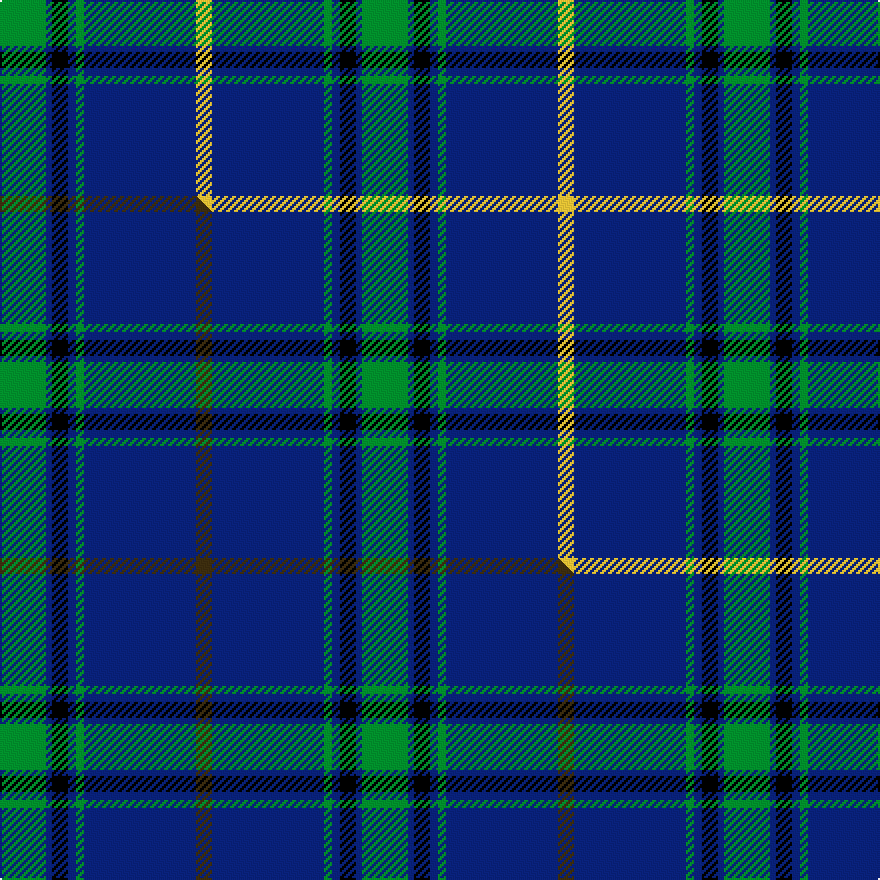

This page is one **sett** — a single exact thread-count. It belongs to the [tartan](/setts/g23db3k8db4g4db56ly8/)
(the same proportion at any scale), whose colour order is pattern [GBKBGBY](/stripes/gbkbgby/).

Part of the [Tern House](/tartans/tern-house/) tartan — the named design grouping this sett with its other cloths.

Sourced from tartans-authority.  It is a [7 stripe tartan](/stripes/stripes7/).

Original link http://www.tartansauthority.com/tartan-ferret/display/11247/

## Register references

External register numbers recorded for this tartan.

- Scottish Register of Tartans: [11247](https://www.tartanregister.gov.uk/tartanDetails?ref=11247)
- Scottish Tartans Authority (ITI): 11247

## Thread count
G/23 DB3 K8 DB4 G4 DB56 LY/8

One full sett is **181 threads**.

## Palette
<table><thead><tr><th>Colour</th><th>Shade</th><th>OKLCh</th></tr></thead><tbody><tr><td>DB</td><td><code style="background-color:#082077;">#082077</code> <small style="color:#888">#082077</small></td><td><small style="color:#888">oklch(30.0% 0.149 265.1)</small></td></tr><tr><td>G</td><td><code style="background-color:#008B2A;">#008B2A</code> <small style="color:#888">#008B2A</small></td><td><small style="color:#888">oklch(55.4% 0.170 145.9)</small></td></tr><tr><td>K</td><td><code style="background-color:#000000;">#000000</code> <small style="color:#888">#000000</small></td><td><small style="color:#888">oklch(0.0% 0.000 0.0)</small></td></tr><tr><td>LY</td><td><code style="background-color:#DCBC32;">#DCBC32</code> <small style="color:#888">#DCBC32</small></td><td><small style="color:#888">oklch(80.0% 0.150 95.2)</small></td></tr></tbody></table>

# Sample pattern

## Compared to the master

This cloth is one sett of its design; the master sett (the exemplar the design is anchored on) is below for comparison.

Its **ΔTartan distance** from the master is **0.84** — the same measure the nearest-tartans table ranks by (0 is identical; a re-scale of the same cloth is near 0, a recolour or a different proportion further).

<figure class="master-compare" style="margin:0">

this sett
master sett ★

<figcaption style="color:#888;font-size:smaller">One weave of this sett against the <a href="/setts/g23db3k8db4g4db56dy8/">master sett ★</a>, split on the diagonal: a shared proportion runs seamlessly across it with only the shades shifting; a different proportion breaks on it.</figcaption>
</figure>

## Nearest tartan variants

The nearest existing variants by ΔTartan distance, with this cloth at the top so the swatches line up against it.

ΔTartan

Threads

Variant

Sett

—

181

<a href="/variants/s7/g23db3k8db4g4db56ly8/">Tern House</a>

<a href="/ttd/edit/#slug=g23db3k8db4g4db56dy8&amp;base=g23db3k8db4g4db56ly8" title="compare in the TTD">0.00</a>

181

<a href="/variants/s7/g23db3k8db4g4db56dy8/">Tern House</a>

<a href="/ttd/edit/#slug=db3r3g18db16w2db26r3g3~x2&amp;base=g23db3k8db4g4db56ly8" title="compare in the TTD">1.23</a>

284

<a href="/variants/s8/db3r3g18db16w2db26r3g3~x2/">MacHardy</a>

<a href="/ttd/edit/#slug=k10db30g3db3g3db3r6~x2&amp;base=g23db3k8db4g4db56ly8" title="compare in the TTD">1.60</a>

200

<a href="/variants/s7/k10db30g3db3g3db3r6~x2/">Kinding</a>

<a href="/ttd/edit/#slug=db2y1db18g7r7db1g1~x2&amp;base=g23db3k8db4g4db56ly8" title="compare in the TTD">1.95</a>

142

<a href="/variants/s7/db2y1db18g7r7db1g1~x2/">Unnamed C20th - USA</a>

<a href="/ttd/edit/#slug=db4k4db24g32w1g2~x4&amp;base=g23db3k8db4g4db56ly8" title="compare in the TTD">2.29</a>

512

<a href="/variants/s6/db4k4db24g32w1g2~x4/">Oliphant (Clan)</a>

<a href="/ttd/edit/#slug=db4k4db24g32w1g2~x2&amp;base=g23db3k8db4g4db56ly8" title="compare in the TTD">2.29</a>

256

<a href="/variants/s6/db4k4db24g32w1g2~x2/">Oliphant</a>

<a href="/ttd/edit/#slug=db1k1db8y1g12y1db8k1db1~x2&amp;base=g23db3k8db4g4db56ly8" title="compare in the TTD">2.34</a>

132

<a href="/variants/s9/db1k1db8y1g12y1db8k1db1~x2/">Rowan</a>

<a href="/ttd/edit/#slug=db16w1db1w1db8g16r1db2~x2&amp;base=g23db3k8db4g4db56ly8" title="compare in the TTD">2.35</a>

148

<a href="/variants/s8/db16w1db1w1db8g16r1db2~x2/">Roxburgh</a>

<a href="/ttd/edit/#slug=db23w1db1w1db8g22r1db3~x4&amp;base=g23db3k8db4g4db56ly8" title="compare in the TTD">2.38</a>

376

<a href="/variants/s8/db23w1db1w1db8g22r1db3~x4/">Roxburgh, Green (District)</a>

<a href="/ttd/edit/#slug=db22y2db1y2db10r2g11r6~x2&amp;base=g23db3k8db4g4db56ly8" title="compare in the TTD">2.39</a>

168

<a href="/variants/s8/db22y2db1y2db10r2g11r6~x2/">Katsushika Scottish Country Dancers</a>

## Neighbour map

Every grey dot is one of 13620 variants placed by the first two principal components of the ΔTartan feature space (42% of its variance). Red is this tartan; blue dots are its nearest — click one to open its page.

<svg viewBox="0 0 640 380" role="img" style="max-width:100%;height:auto;border:1px solid #e0e0e0;border-radius:4px;display:block" xmlns="http://www.w3.org/2000/svg"><image href="/nn/cloud.v1.png" width="640" height="380"/><a href="/variants/s7/g23db3k8db4g4db56dy8/"><circle cx="352.2" cy="154.9" r="4" fill="#3465a4"><title>Tern House</title></circle></a><a href="/variants/s8/db3r3g18db16w2db26r3g3~x2/"><circle cx="339.8" cy="183.7" r="4" fill="#3465a4"><title>MacHardy</title></circle></a><a href="/variants/s7/k10db30g3db3g3db3r6~x2/"><circle cx="320.1" cy="167.3" r="4" fill="#3465a4"><title>Kinding</title></circle></a><a href="/variants/s7/db2y1db18g7r7db1g1~x2/"><circle cx="339.5" cy="166.3" r="4" fill="#3465a4"><title>Unnamed C20th - USA</title></circle></a><a href="/variants/s6/db4k4db24g32w1g2~x4/"><circle cx="320.2" cy="145.6" r="4" fill="#3465a4"><title>Oliphant (Clan)</title></circle></a><a href="/variants/s6/db4k4db24g32w1g2~x2/"><circle cx="320.2" cy="145.6" r="4" fill="#3465a4"><title>Oliphant</title></circle></a><a href="/variants/s9/db1k1db8y1g12y1db8k1db1~x2/"><circle cx="290.0" cy="167.2" r="4" fill="#3465a4"><title>Rowan</title></circle></a><a href="/variants/s8/db16w1db1w1db8g16r1db2~x2/"><circle cx="347.6" cy="167.0" r="4" fill="#3465a4"><title>Roxburgh</title></circle></a><a href="/variants/s8/db23w1db1w1db8g22r1db3~x4/"><circle cx="368.9" cy="149.5" r="4" fill="#3465a4"><title>Roxburgh, Green (District)</title></circle></a><a href="/variants/s8/db22y2db1y2db10r2g11r6~x2/"><circle cx="346.9" cy="164.1" r="4" fill="#3465a4"><title>Katsushika Scottish Country Dancers</title></circle></a><circle cx="324.8" cy="146.4" r="5" fill="#c00000"/><text x="320" y="376" text-anchor="middle" font-size="11" fill="#999">ground</text><text x="11" y="190" text-anchor="middle" font-size="11" fill="#999" transform="rotate(-90 11 190)">complexity</text></svg>

ID: /variants/s7/g23db3k8db4g4db56ly8/
