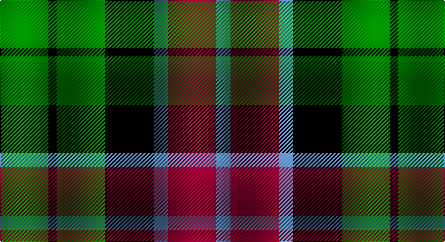

This page is one **sett** — a single exact thread-count. It belongs to the [tartan](/setts/g24k4g24k24t7r24t7/)
(the same proportion at any scale), whose colour order is pattern [BRBKGKG](/stripes/brbkgkg/).

Part of the [Unidentified Pinafore](/tartans/unidentified-pinafore/) tartan — the named design grouping this sett with its other cloths.

Sourced from weddslist.  It is a [7 stripe tartan](/stripes/stripes7/).

Original link http://www.weddslist.com/cgi-bin/tartans/pg.pl?source=sts

## Also known as

This cloth is also recorded under:

- Unidentified, Pinafore

## Thread count
G/48 K8 G48 K48 B14 DR48 B/14

One full sett is **394 threads**.

## Palette

Palette: <strong>Ingles Buchan</strong> <small style="color:#888">(1 of 4 colours)</small>
<table><thead><tr><th>Colour</th><th>Threads</th><th>Shade</th><th>Base</th><th>OKLCh</th></tr></thead><tbody><tr><td>G/</td><td style="text-align:right;font-variant-numeric:tabular-nums">48</td><td><code style="background-color:#008000;">#008000</code> <small style="color:#888">#008000</small></td><td>G <code style="background-color:#006100;">#006100</code></td><td><small style="color:#888">oklch(52.0% 0.177 142.5)</small></td></tr><tr><td>K</td><td style="text-align:right;font-variant-numeric:tabular-nums">8</td><td><code style="background-color:#000000;">#000000</code> <small style="color:#888">#000000</small></td><td>K <code style="background-color:#000000;">#000000</code></td><td><small style="color:#888">oklch(0.0% 0.000 0.0)</small></td></tr><tr><td>G</td><td style="text-align:right;font-variant-numeric:tabular-nums">48</td><td><code style="background-color:#008000;">#008000</code> <small style="color:#888">#008000</small></td><td>G <code style="background-color:#006100;">#006100</code></td><td><small style="color:#888">oklch(52.0% 0.177 142.5)</small></td></tr><tr><td>K</td><td style="text-align:right;font-variant-numeric:tabular-nums">48</td><td><code style="background-color:#000000;">#000000</code> <small style="color:#888">#000000</small></td><td>K <code style="background-color:#000000;">#000000</code></td><td><small style="color:#888">oklch(0.0% 0.000 0.0)</small></td></tr><tr><td>B</td><td style="text-align:right;font-variant-numeric:tabular-nums">14</td><td><code style="background-color:#5480B0;">#5480B0</code> <small style="color:#888">#5480B0</small></td><td>B <code style="background-color:#2A418A;">#2A418A</code></td><td><small style="color:#888">oklch(58.8% 0.089 251.5)</small></td></tr><tr><td>DR</td><td style="text-align:right;font-variant-numeric:tabular-nums">48</td><td><code style="background-color:#900030;">#900030</code> <small style="color:#888">#900030</small></td><td>R <code style="background-color:#CC0000;">#CC0000</code></td><td><small style="color:#888">oklch(41.6% 0.166 13.6)</small></td></tr><tr><td>B/</td><td style="text-align:right;font-variant-numeric:tabular-nums">14</td><td><code style="background-color:#5480B0;">#5480B0</code> <small style="color:#888">#5480B0</small></td><td>B <code style="background-color:#2A418A;">#2A418A</code></td><td><small style="color:#888">oklch(58.8% 0.089 251.5)</small></td></tr></tbody></table>

# Sample pattern

## Compared to the master

This cloth is one sett of its design; the master sett (the exemplar the design is anchored on) is below for comparison.

<figure style="margin:0"><figcaption style="color:#888;font-size:smaller">this sett</figcaption></figure>
<figure style="margin:0"><figcaption style="color:#888;font-size:smaller"><a href="/setts/dg24k4dg24k24t7r24t7/">master sett →</a></figcaption></figure>

## Nearest tartans

The nearest existing variants by ΔTartan distance, with this tartan at the top so the swatches line up against it.

ΔTartan

Tartan

Sett

—

<a href="/ttd/edit/#slug=g24k4g24k24t7r24t7~x2">Unidentified, Pinafore</a> <a class="nn-out" href="/variants/s7/g24k4g24k24t7r24t7~x2/" title="open its dictionary page">↗</a>

0.82

<a href="/ttd/edit/#slug=k2g7t1k6r4g2~x4&amp;base=g24k4g24k24t7r24t7~x2">Walker, James</a> <a class="nn-out" href="/variants/s6/k2g7t1k6r4g2~x4/" title="open its dictionary page">↗</a>

0.95

<a href="/ttd/edit/#slug=k4w19k11dg15k3dg16ly3~x2&amp;base=g24k4g24k24t7r24t7~x2">Lawson, William 2002</a> <a class="nn-out" href="/variants/s7/k4w19k11dg15k3dg16ly3~x2/" title="open its dictionary page">↗</a>

0.98

<a href="/ttd/edit/#slug=k6g6ly1g6k6p6k1~x4&amp;base=g24k4g24k24t7r24t7~x2">Abercrombie, (Wilson's No 64)</a> <a class="nn-out" href="/variants/s7/k6g6ly1g6k6p6k1~x4/" title="open its dictionary page">↗</a>

0.98

<a href="/ttd/edit/#slug=k4o9k13g6o3g9w4~x2&amp;base=g24k4g24k24t7r24t7~x2">Ramsay, Red</a> <a class="nn-out" href="/variants/s7/k4o9k13g6o3g9w4~x2/" title="open its dictionary page">↗</a>

1.00

<a href="/ttd/edit/#slug=k11g12k2g12k12p12w3~x2&amp;base=g24k4g24k24t7r24t7~x2">Wilson's, No 97</a> <a class="nn-out" href="/variants/s7/k11g12k2g12k12p12w3~x2/" title="open its dictionary page">↗</a>

1.01

<a href="/ttd/edit/#slug=k6g6w1g6k6p6k1~x4&amp;base=g24k4g24k24t7r24t7~x2">Wilson's, No 64 or Abercrombie</a> <a class="nn-out" href="/variants/s7/k6g6w1g6k6p6k1~x4/" title="open its dictionary page">↗</a>

1.02

<a href="/ttd/edit/#slug=t3g6k6t4r1t1~x2&amp;base=g24k4g24k24t7r24t7~x2">Wellington, or Waterloo</a> <a class="nn-out" href="/variants/s6/t3g6k6t4r1t1~x2/" title="open its dictionary page">↗</a>

1.04

<a href="/ttd/edit/#slug=k4lo9k13g6lo3g9w4~x2&amp;base=g24k4g24k24t7r24t7~x2">Ramsay (Orange)</a> <a class="nn-out" href="/variants/s7/k4lo9k13g6lo3g9w4~x2/" title="open its dictionary page">↗</a>

1.06

<a href="/ttd/edit/#slug=g1db5g1k5g6ly1~x2&amp;base=g24k4g24k24t7r24t7~x2">MacKay</a> <a class="nn-out" href="/variants/s6/g1db5g1k5g6ly1~x2/" title="open its dictionary page">↗</a>

1.06

<a href="/ttd/edit/#slug=y3dg6k6y4r1y1~x2&amp;base=g24k4g24k24t7r24t7~x2">Waterloo</a> <a class="nn-out" href="/variants/s6/y3dg6k6y4r1y1~x2/" title="open its dictionary page">↗</a>

## Neighbour map

Every grey dot is one of 14360 variants placed by the first two principal components of the ΔTartan feature space (44% of its variance). Red is this tartan; blue dots are its nearest — click one to open its page.

<svg viewBox="0 0 640 380" role="img" style="max-width:100%;height:auto;border:1px solid #e0e0e0;border-radius:4px;display:block" xmlns="http://www.w3.org/2000/svg"><image href="/nn/cloud.v1.png" width="640" height="380"/><a href="/variants/s6/k2g7t1k6r4g2~x4/"><circle cx="157.6" cy="237.9" r="4" fill="#3465a4"><title>Walker, James</title></circle></a><a href="/variants/s7/k4w19k11dg15k3dg16ly3~x2/"><circle cx="148.1" cy="225.5" r="4" fill="#3465a4"><title>Lawson, William 2002</title></circle></a><a href="/variants/s7/k6g6ly1g6k6p6k1~x4/"><circle cx="137.4" cy="252.0" r="4" fill="#3465a4"><title>Abercrombie, (Wilson's No 64)</title></circle></a><a href="/variants/s7/k4o9k13g6o3g9w4~x2/"><circle cx="83.9" cy="254.3" r="4" fill="#3465a4"><title>Ramsay, Red</title></circle></a><a href="/variants/s7/k11g12k2g12k12p12w3~x2/"><circle cx="121.3" cy="253.9" r="4" fill="#3465a4"><title>Wilson's, No 97</title></circle></a><a href="/variants/s7/k6g6w1g6k6p6k1~x4/"><circle cx="136.4" cy="251.7" r="4" fill="#3465a4"><title>Wilson's, No 64 or Abercrombie</title></circle></a><a href="/variants/s6/t3g6k6t4r1t1~x2/"><circle cx="128.4" cy="245.2" r="4" fill="#3465a4"><title>Wellington, or Waterloo</title></circle></a><a href="/variants/s7/k4lo9k13g6lo3g9w4~x2/"><circle cx="94.8" cy="256.2" r="4" fill="#3465a4"><title>Ramsay (Orange)</title></circle></a><a href="/variants/s6/g1db5g1k5g6ly1~x2/"><circle cx="156.9" cy="239.0" r="4" fill="#3465a4"><title>MacKay</title></circle></a><a href="/variants/s6/y3dg6k6y4r1y1~x2/"><circle cx="157.3" cy="255.4" r="4" fill="#3465a4"><title>Waterloo</title></circle></a><circle cx="136.9" cy="243.1" r="5" fill="#c00000"/></svg>

ID: /variants/s7/g24k4g24k24t7r24t7~x2/
