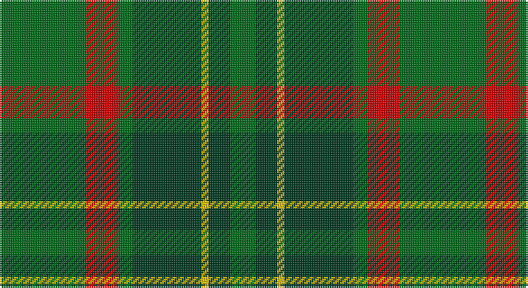

This page is one **sett** — a single exact thread-count. It belongs to the [tartan](/setts/g24r9g4dg19ly2dg6g7/)
(the same proportion at any scale), whose colour order is pattern [GGYGGRG](/stripes/ggyggrg/).

Part of the [Doyle](/tartans/doyle/) tartan — the named design grouping this sett with its other cloths.

Sourced from register-of-tartans.  It is a [7 stripe tartan](/stripes/stripes7/).

Original link https://www.tartanregister.gov.uk/tartanDetails.aspx?ref=970

## Provenance

Earliest known date: 1999 Clan Doyle runs it Clan Register from PO Box 173, Dromana, Victoria, 3936, Australia. The tartan is restricted to registered clansmen.

## Also known as

This cloth is also recorded under:

- Doyle Blue
- Doyle, Blue
- Doyle/O'Dubhghaill

4 attestations — the source records this cloth was collapsed from (oldest owns this page)

<ul>
<li>01/03/1998 — Doyle (register-of-tartans, <a href="https://www.tartanregister.gov.uk/tartanDetails.aspx?ref=970">record</a>)</li>
<li>March 1998 — Doyle (Corporate) (tartans-authority, <a href="http://www.tartansauthority.com/tartan-ferret/display/2511/">record</a>)</li>
<li>undated — Doyle/O'Dubhghaill (weddslist, <a href="http://www.weddslist.com/cgi-bin/tartans/pg.pl?source=sts">record</a>)</li>
<li>undated — Doyle Irish Family Tartan (house-of-tartan, <a href="http://www.house-of-tartan.scotland.net/house/TartanViewjs.asp?colr=Def&tnam=2511">record</a>)</li>
</ul>

## Register references

External register numbers recorded for this tartan.

- Scottish Register of Tartans: [970](https://www.tartanregister.gov.uk/tartanDetails.aspx?ref=970)
- Scottish Tartans Authority (ITI): 2511
- Scottish Tartans World Register: 2511

## Thread count
G/48 R18 G8 DG38 Y4 DG12 G/14

One full sett is **222 threads**.

## Palette

Palette: <strong>Tartan Register</strong>
<table><thead><tr><th>Colour</th><th>Threads</th><th>Shade</th><th>Base</th><th>OKLCh</th></tr></thead><tbody><tr><td>G/</td><td style="text-align:right;font-variant-numeric:tabular-nums">48</td><td><code style="background-color:#006818;">#006818</code> <small style="color:#888">#006818</small></td><td>G <code style="background-color:#006100;">#006100</code></td><td><small style="color:#888">oklch(45.0% 0.142 145.0)</small></td></tr><tr><td>R</td><td style="text-align:right;font-variant-numeric:tabular-nums">18</td><td><code style="background-color:#C80000;">#C80000</code> <small style="color:#888">#C80000</small></td><td>R <code style="background-color:#CC0000;">#CC0000</code></td><td><small style="color:#888">oklch(52.3% 0.215 29.2)</small></td></tr><tr><td>G</td><td style="text-align:right;font-variant-numeric:tabular-nums">8</td><td><code style="background-color:#006818;">#006818</code> <small style="color:#888">#006818</small></td><td>G <code style="background-color:#006100;">#006100</code></td><td><small style="color:#888">oklch(45.0% 0.142 145.0)</small></td></tr><tr><td>DG</td><td style="text-align:right;font-variant-numeric:tabular-nums">38</td><td><code style="background-color:#003820;">#003820</code> <small style="color:#888">#003820</small></td><td>G <code style="background-color:#006100;">#006100</code></td><td><small style="color:#888">oklch(30.0% 0.070 158.3)</small></td></tr><tr><td>Y</td><td style="text-align:right;font-variant-numeric:tabular-nums">4</td><td><code style="background-color:#E8C000;">#E8C000</code> <small style="color:#888">#E8C000</small></td><td>Y <code style="background-color:#F2BF00;">#F2BF00</code></td><td><small style="color:#888">oklch(81.9% 0.168 93.7)</small></td></tr><tr><td>DG</td><td style="text-align:right;font-variant-numeric:tabular-nums">12</td><td><code style="background-color:#003820;">#003820</code> <small style="color:#888">#003820</small></td><td>G <code style="background-color:#006100;">#006100</code></td><td><small style="color:#888">oklch(30.0% 0.070 158.3)</small></td></tr><tr><td>G/</td><td style="text-align:right;font-variant-numeric:tabular-nums">14</td><td><code style="background-color:#006818;">#006818</code> <small style="color:#888">#006818</small></td><td>G <code style="background-color:#006100;">#006100</code></td><td><small style="color:#888">oklch(45.0% 0.142 145.0)</small></td></tr></tbody></table>

# Sample pattern

## Nearest tartans

The nearest existing variants by ΔTartan distance, with this tartan at the top so the swatches line up against it.

ΔTartan

Tartan

Sett

—

<a href="/ttd/edit/#slug=g24r9g4dg19ly2dg6g7~x2">Doyle</a> <a class="nn-out" href="/variants/s7/g24r9g4dg19ly2dg6g7~x2/" title="open its dictionary page">↗</a>

1.11

<a href="/ttd/edit/#slug=dy3g6dg2r2dg14g2dg2dy3~x2&amp;base=g24r9g4dg19ly2dg6g7~x2">Daks (Muted Loden)</a> <a class="nn-out" href="/variants/s8/dy3g6dg2r2dg14g2dg2dy3~x2/" title="open its dictionary page">↗</a>

1.12

<a href="/ttd/edit/#slug=dy10r5dy62dg40dy5g44r10&amp;base=g24r9g4dg19ly2dg6g7~x2">Ballintrae Trade Tartan</a> <a class="nn-out" href="/variants/s7/dy10r5dy62dg40dy5g44r10/" title="open its dictionary page">↗</a>

1.15

<a href="/ttd/edit/#slug=dy5r3dy31dg20dy3g22r5~x2&amp;base=g24r9g4dg19ly2dg6g7~x2">Ballantrae (Dalgety)</a> <a class="nn-out" href="/variants/s7/dy5r3dy31dg20dy3g22r5~x2/" title="open its dictionary page">↗</a>

1.29

<a href="/ttd/edit/#slug=t4dg26gi8t8gi8g3t2~x2&amp;base=g24r9g4dg19ly2dg6g7~x2">Valley of the Green (The ) Canadian Tartan</a> <a class="nn-out" href="/variants/s7/t4dg26gi8t8gi8g3t2~x2/" title="open its dictionary page">↗</a>

1.32

<a href="/ttd/edit/#slug=g5k2g28k10dy26db4g4~x2&amp;base=g24r9g4dg19ly2dg6g7~x2">John Telfar Dunbar/Hunting Tartan</a> <a class="nn-out" href="/variants/s7/g5k2g28k10dy26db4g4~x2/" title="open its dictionary page">↗</a>

1.38

<a href="/ttd/edit/#slug=r10g44o5dg40o62r5o10&amp;base=g24r9g4dg19ly2dg6g7~x2">Ballintrae</a> <a class="nn-out" href="/variants/s7/r10g44o5dg40o62r5o10/" title="open its dictionary page">↗</a>

1.38

<a href="/ttd/edit/#slug=g18k1r9k12r9k1g18k1n6g1~x2&amp;base=g24r9g4dg19ly2dg6g7~x2">Arizona Jones</a> <a class="nn-out" href="/variants/s10/g18k1r9k12r9k1g18k1n6g1~x2/" title="open its dictionary page">↗</a>

1.38

<a href="/ttd/edit/#slug=g28db9dg18w3dg18db9g28r3~x2&amp;base=g24r9g4dg19ly2dg6g7~x2">Simple Technology</a> <a class="nn-out" href="/variants/s8/g28db9dg18w3dg18db9g28r3~x2/" title="open its dictionary page">↗</a>

1.40

<a href="/ttd/edit/#slug=db3o7g2r2g14o2g2db3~x2&amp;base=g24r9g4dg19ly2dg6g7~x2">Daks, Tartan-Loden</a> <a class="nn-out" href="/variants/s8/db3o7g2r2g14o2g2db3~x2/" title="open its dictionary page">↗</a>

1.43

<a href="/ttd/edit/#slug=db5dg8k1ly2k1dg8db4~x4&amp;base=g24r9g4dg19ly2dg6g7~x2">Salvation Army Htg (Corporate)</a> <a class="nn-out" href="/variants/s7/db5dg8k1ly2k1dg8db4~x4/" title="open its dictionary page">↗</a>

## Neighbour map

Every grey dot is one of 14360 variants placed by the first two principal components of the ΔTartan feature space (44% of its variance). Red is this tartan; blue dots are its nearest — click one to open its page.

<svg viewBox="0 0 640 380" role="img" style="max-width:100%;height:auto;border:1px solid #e0e0e0;border-radius:4px;display:block" xmlns="http://www.w3.org/2000/svg"><image href="/nn/cloud.v1.png" width="640" height="380"/><a href="/variants/s8/dy3g6dg2r2dg14g2dg2dy3~x2/"><circle cx="296.7" cy="234.8" r="4" fill="#3465a4"><title>Daks (Muted Loden)</title></circle></a><a href="/variants/s7/dy10r5dy62dg40dy5g44r10/"><circle cx="270.0" cy="218.7" r="4" fill="#3465a4"><title>Ballintrae Trade Tartan</title></circle></a><a href="/variants/s7/dy5r3dy31dg20dy3g22r5~x2/"><circle cx="261.4" cy="226.4" r="4" fill="#3465a4"><title>Ballantrae (Dalgety)</title></circle></a><a href="/variants/s7/t4dg26gi8t8gi8g3t2~x2/"><circle cx="278.7" cy="224.7" r="4" fill="#3465a4"><title>Valley of the Green (The ) Canadian Tartan</title></circle></a><a href="/variants/s7/g5k2g28k10dy26db4g4~x2/"><circle cx="333.4" cy="234.6" r="4" fill="#3465a4"><title>John Telfar Dunbar/Hunting Tartan</title></circle></a><a href="/variants/s7/r10g44o5dg40o62r5o10/"><circle cx="253.9" cy="207.8" r="4" fill="#3465a4"><title>Ballintrae</title></circle></a><a href="/variants/s10/g18k1r9k12r9k1g18k1n6g1~x2/"><circle cx="300.1" cy="192.9" r="4" fill="#3465a4"><title>Arizona Jones</title></circle></a><a href="/variants/s8/g28db9dg18w3dg18db9g28r3~x2/"><circle cx="252.9" cy="240.6" r="4" fill="#3465a4"><title>Simple Technology</title></circle></a><a href="/variants/s8/db3o7g2r2g14o2g2db3~x2/"><circle cx="304.6" cy="239.6" r="4" fill="#3465a4"><title>Daks, Tartan-Loden</title></circle></a><a href="/variants/s7/db5dg8k1ly2k1dg8db4~x4/"><circle cx="295.3" cy="252.9" r="4" fill="#3465a4"><title>Salvation Army Htg (Corporate)</title></circle></a><circle cx="303.3" cy="237.7" r="5" fill="#c00000"/></svg>

ID: /variants/s7/g24r9g4dg19ly2dg6g7~x2/
