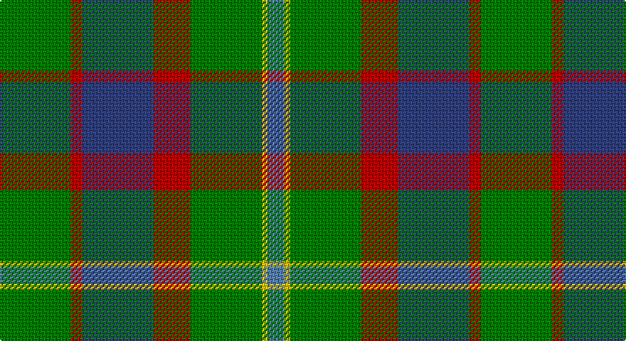

This page is one **sett** — a single exact thread-count. It belongs to the [tartan](/setts/g25r4db25r13g25ly2t6/)
(the same proportion at any scale), whose colour order is pattern [BYGRBRG](/stripes/bygrbrg/).

Part of the [Rotary](/tartans/rotary/) tartan — the named design grouping this sett with its other cloths.

Sourced from weddslist.  It is a [7 stripe tartan](/stripes/stripes7/).

Original link http://www.weddslist.com/cgi-bin/tartans/pg.pl?source=sts

## Also known as

This cloth is also recorded under:

- Rotary International

## Thread count
G/50 R8 B50 R26 G50 Y4 Ba/12

One full sett is **338 threads**.

## Palette

Palette: <strong>custom</strong>
<table><thead><tr><th>Colour</th><th>Threads</th><th>Shade</th><th>Base</th><th>OKLCh</th></tr></thead><tbody><tr><td>G/</td><td style="text-align:right;font-variant-numeric:tabular-nums">50</td><td><code style="background-color:#008000;">#008000</code> <small style="color:#888">#008000</small></td><td>G <code style="background-color:#006100;">#006100</code></td><td><small style="color:#888">oklch(52.0% 0.177 142.5)</small></td></tr><tr><td>R</td><td style="text-align:right;font-variant-numeric:tabular-nums">8</td><td><code style="background-color:#C00000;">#C00000</code> <small style="color:#888">#C00000</small></td><td>R <code style="background-color:#CC0000;">#CC0000</code></td><td><small style="color:#888">oklch(50.7% 0.208 29.2)</small></td></tr><tr><td>B</td><td style="text-align:right;font-variant-numeric:tabular-nums">50</td><td><code style="background-color:#304080;">#304080</code> <small style="color:#888">#304080</small></td><td>B <code style="background-color:#2A418A;">#2A418A</code></td><td><small style="color:#888">oklch(39.4% 0.109 270.2)</small></td></tr><tr><td>R</td><td style="text-align:right;font-variant-numeric:tabular-nums">26</td><td><code style="background-color:#C00000;">#C00000</code> <small style="color:#888">#C00000</small></td><td>R <code style="background-color:#CC0000;">#CC0000</code></td><td><small style="color:#888">oklch(50.7% 0.208 29.2)</small></td></tr><tr><td>G</td><td style="text-align:right;font-variant-numeric:tabular-nums">50</td><td><code style="background-color:#008000;">#008000</code> <small style="color:#888">#008000</small></td><td>G <code style="background-color:#006100;">#006100</code></td><td><small style="color:#888">oklch(52.0% 0.177 142.5)</small></td></tr><tr><td>Y</td><td style="text-align:right;font-variant-numeric:tabular-nums">4</td><td><code style="background-color:#F0C000;">#F0C000</code> <small style="color:#888">#F0C000</small></td><td>Y <code style="background-color:#F2BF00;">#F2BF00</code></td><td><small style="color:#888">oklch(82.7% 0.169 90.5)</small></td></tr><tr><td>Ba/</td><td style="text-align:right;font-variant-numeric:tabular-nums">12</td><td><code style="background-color:#5480B0;">#5480B0</code> <small style="color:#888">#5480B0</small></td><td>B <code style="background-color:#2A418A;">#2A418A</code></td><td><small style="color:#888">oklch(58.8% 0.089 251.5)</small></td></tr></tbody></table>

# Sample pattern

## Compared to the master

This cloth is one sett of its design; the master sett (the exemplar the design is anchored on) is below for comparison.

<figure style="margin:0"><figcaption style="color:#888;font-size:smaller">this sett</figcaption></figure>
<figure style="margin:0"><figcaption style="color:#888;font-size:smaller"><a href="/setts/g15r3t15r8g15ly2db4/">master sett →</a></figcaption></figure>

## Nearest tartans

The nearest existing variants by ΔTartan distance, with this tartan at the top so the swatches line up against it.

ΔTartan

Tartan

Sett

—

<a href="/ttd/edit/#slug=g25r4db25r13g25ly2t6~x2">Rotary</a> <a class="nn-out" href="/variants/s7/g25r4db25r13g25ly2t6~x2/" title="open its dictionary page">↗</a>

0.87

<a href="/ttd/edit/#slug=g15r3t15r8g15ly2db4~x2&amp;base=g25r4db25r13g25ly2t6~x2">Rotary International</a> <a class="nn-out" href="/variants/s7/g15r3t15r8g15ly2db4~x2/" title="open its dictionary page">↗</a>

0.93

<a href="/ttd/edit/#slug=g10r3g30y10w2db15r4~x2&amp;base=g25r4db25r13g25ly2t6~x2">Sinclair</a> <a class="nn-out" href="/variants/s7/g10r3g30y10w2db15r4~x2/" title="open its dictionary page">↗</a>

0.96

<a href="/ttd/edit/#slug=n8ly2n22dg6r2lb10dg12n3~x2&amp;base=g25r4db25r13g25ly2t6~x2">Bahamas</a> <a class="nn-out" href="/variants/s8/n8ly2n22dg6r2lb10dg12n3~x2/" title="open its dictionary page">↗</a>

1.04

<a href="/ttd/edit/#slug=db22g6db5t2g22r6g5r4g9w3~x2&amp;base=g25r4db25r13g25ly2t6~x2">MacConnell</a> <a class="nn-out" href="/variants/s10/db22g6db5t2g22r6g5r4g9w3~x2/" title="open its dictionary page">↗</a>

1.07

<a href="/ttd/edit/#slug=n8ly2n22g6r2lb10g12n3~x2&amp;base=g25r4db25r13g25ly2t6~x2">Bahamas (District)</a> <a class="nn-out" href="/variants/s8/n8ly2n22g6r2lb10g12n3~x2/" title="open its dictionary page">↗</a>

1.11

<a href="/ttd/edit/#slug=g8k2g13r4g12db22g5ly3~x2&amp;base=g25r4db25r13g25ly2t6~x2">Taylor</a> <a class="nn-out" href="/variants/s8/g8k2g13r4g12db22g5ly3~x2/" title="open its dictionary page">↗</a>

1.21

<a href="/ttd/edit/#slug=loi30w4loi20g20k20lo3k6~x2&amp;base=g25r4db25r13g25ly2t6~x2">St Andrews Bay</a> <a class="nn-out" href="/variants/s7/loi30w4loi20g20k20lo3k6~x2/" title="open its dictionary page">↗</a>

1.24

<a href="/ttd/edit/#slug=dy21r2g18r2g18r2dg8w6dy10~x2&amp;base=g25r4db25r13g25ly2t6~x2">Red Dirt Girl</a> <a class="nn-out" href="/variants/s9/dy21r2g18r2g18r2dg8w6dy10~x2/" title="open its dictionary page">↗</a>

1.24

<a href="/ttd/edit/#slug=k4g16db11r16g25ly2t3~x2&amp;base=g25r4db25r13g25ly2t6~x2">Mayo</a> <a class="nn-out" href="/variants/s7/k4g16db11r16g25ly2t3~x2/" title="open its dictionary page">↗</a>

1.24

<a href="/ttd/edit/#slug=g26db3g12k10dp15w2~x2&amp;base=g25r4db25r13g25ly2t6~x2">Lossiemouth/Hersbruck</a> <a class="nn-out" href="/variants/s6/g26db3g12k10dp15w2~x2/" title="open its dictionary page">↗</a>

## Neighbour map

Every grey dot is one of 14360 variants placed by the first two principal components of the ΔTartan feature space (44% of its variance). Red is this tartan; blue dots are its nearest — click one to open its page.

<svg viewBox="0 0 640 380" role="img" style="max-width:100%;height:auto;border:1px solid #e0e0e0;border-radius:4px;display:block" xmlns="http://www.w3.org/2000/svg"><image href="/nn/cloud.v1.png" width="640" height="380"/><a href="/variants/s7/g15r3t15r8g15ly2db4~x2/"><circle cx="205.5" cy="227.5" r="4" fill="#3465a4"><title>Rotary International</title></circle></a><a href="/variants/s7/g10r3g30y10w2db15r4~x2/"><circle cx="288.8" cy="190.0" r="4" fill="#3465a4"><title>Sinclair</title></circle></a><a href="/variants/s8/n8ly2n22dg6r2lb10dg12n3~x2/"><circle cx="248.8" cy="196.4" r="4" fill="#3465a4"><title>Bahamas</title></circle></a><a href="/variants/s10/db22g6db5t2g22r6g5r4g9w3~x2/"><circle cx="246.2" cy="180.8" r="4" fill="#3465a4"><title>MacConnell</title></circle></a><a href="/variants/s8/n8ly2n22g6r2lb10g12n3~x2/"><circle cx="260.6" cy="202.4" r="4" fill="#3465a4"><title>Bahamas (District)</title></circle></a><a href="/variants/s8/g8k2g13r4g12db22g5ly3~x2/"><circle cx="265.6" cy="200.2" r="4" fill="#3465a4"><title>Taylor</title></circle></a><a href="/variants/s7/loi30w4loi20g20k20lo3k6~x2/"><circle cx="198.6" cy="198.6" r="4" fill="#3465a4"><title>St Andrews Bay</title></circle></a><a href="/variants/s9/dy21r2g18r2g18r2dg8w6dy10~x2/"><circle cx="200.3" cy="196.0" r="4" fill="#3465a4"><title>Red Dirt Girl</title></circle></a><a href="/variants/s7/k4g16db11r16g25ly2t3~x2/"><circle cx="222.4" cy="176.1" r="4" fill="#3465a4"><title>Mayo</title></circle></a><a href="/variants/s6/g26db3g12k10dp15w2~x2/"><circle cx="275.1" cy="208.3" r="4" fill="#3465a4"><title>Lossiemouth/Hersbruck</title></circle></a><circle cx="242.5" cy="205.5" r="5" fill="#c00000"/></svg>

ID: /variants/s7/g25r4db25r13g25ly2t6~x2/
