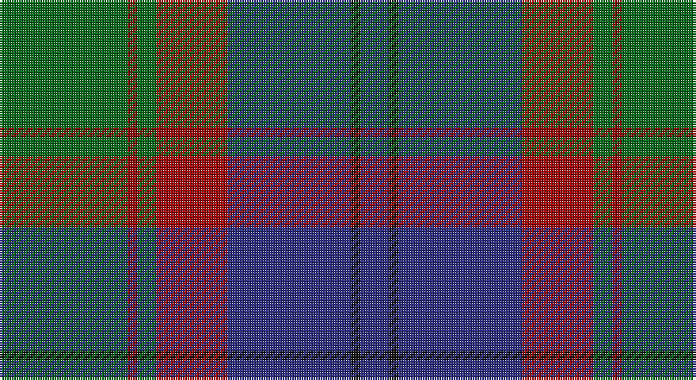

This page is one **sett** — a single exact thread-count. It belongs to the [tartan](/setts/g27ri2g4r15db26k2db6/)
(the same proportion at any scale), whose colour order is pattern [BKBRGRG](/stripes/bkbrgrg/).

Sourced from tartans-authority.  It is a [7 stripe tartan](/stripes/stripes7/).

Original link http://www.tartansauthority.com/tartan-ferret/display/3628/

2 attestations — the source records this cloth was collapsed from (oldest owns this page)

<ul>
<li>Feb 2003 — Bailies of Bennachie (Corporate) (tartans-authority, <a href="http://www.tartansauthority.com/tartan-ferret/display/3628/">record</a>)</li>
<li>undated — Bailies of Bennachie (register-of-tartans, <a href="https://www.tartanregister.gov.uk/tartanDetails.aspx?ref=5090">record</a>)</li>
</ul>

## Register references

External register numbers recorded for this tartan.

- Scottish Register of Tartans: [5090](https://www.tartanregister.gov.uk/tartanDetails.aspx?ref=5090)
- Scottish Tartans Authority (ITI): 3628

## Thread count
G/54 DR4 G8 DRa30 DB52 K4 DB/12

One full sett is **262 threads**.

## Palette

Palette: <strong>Tartan Register</strong>
<table><thead><tr><th>Colour</th><th>Threads</th><th>Shade</th><th>Base</th><th>OKLCh</th></tr></thead><tbody><tr><td>G/</td><td style="text-align:right;font-variant-numeric:tabular-nums">54</td><td><code style="background-color:#006818;">#006818</code> <small style="color:#888">#006818</small></td><td>G <code style="background-color:#006100;">#006100</code></td><td><small style="color:#888">oklch(45.0% 0.142 145.0)</small></td></tr><tr><td>DR</td><td style="text-align:right;font-variant-numeric:tabular-nums">4</td><td><code style="background-color:#880000;">#880000</code> <small style="color:#888">#880000</small></td><td>R <code style="background-color:#CC0000;">#CC0000</code></td><td><small style="color:#888">oklch(39.4% 0.162 29.2)</small></td></tr><tr><td>G</td><td style="text-align:right;font-variant-numeric:tabular-nums">8</td><td><code style="background-color:#006818;">#006818</code> <small style="color:#888">#006818</small></td><td>G <code style="background-color:#006100;">#006100</code></td><td><small style="color:#888">oklch(45.0% 0.142 145.0)</small></td></tr><tr><td>DRa</td><td style="text-align:right;font-variant-numeric:tabular-nums">30</td><td><code style="background-color:#A00000;">#A00000</code> <small style="color:#888">#A00000</small></td><td>R <code style="background-color:#CC0000;">#CC0000</code></td><td><small style="color:#888">oklch(44.3% 0.182 29.2)</small></td></tr><tr><td>DB</td><td style="text-align:right;font-variant-numeric:tabular-nums">52</td><td><code style="background-color:#2C2C80;">#2C2C80</code> <small style="color:#888">#2C2C80</small></td><td>B <code style="background-color:#2A418A;">#2A418A</code></td><td><small style="color:#888">oklch(35.0% 0.138 276.6)</small></td></tr><tr><td>K</td><td style="text-align:right;font-variant-numeric:tabular-nums">4</td><td><code style="background-color:#101010;">#101010</code> <small style="color:#888">#101010</small></td><td>K <code style="background-color:#000000;">#000000</code></td><td><small style="color:#888">oklch(17.3% 0.000 89.9)</small></td></tr><tr><td>DB/</td><td style="text-align:right;font-variant-numeric:tabular-nums">12</td><td><code style="background-color:#2C2C80;">#2C2C80</code> <small style="color:#888">#2C2C80</small></td><td>B <code style="background-color:#2A418A;">#2A418A</code></td><td><small style="color:#888">oklch(35.0% 0.138 276.6)</small></td></tr></tbody></table>

# Sample pattern

## Nearest tartans

The nearest existing variants by ΔTartan distance, with this tartan at the top so the swatches line up against it.

ΔTartan

Tartan

Sett

—

<a href="/ttd/edit/#slug=g27ri2g4r15db26k2db6~x2">Bailies of Bennachie (Corporate)</a> <a class="nn-out" href="/variants/s7/g27ri2g4r15db26k2db6~x2/" title="open its dictionary page">↗</a>

0.75

<a href="/ttd/edit/#slug=dg3db12lb1k12dg13r2dg2~x2&amp;base=g27ri2g4r15db26k2db6~x2">MacPhedran/MacFadzean</a> <a class="nn-out" href="/variants/s7/dg3db12lb1k12dg13r2dg2~x2/" title="open its dictionary page">↗</a>

0.79

<a href="/ttd/edit/#slug=dt10r1dt1r1dt1k6y9b2~x2&amp;base=g27ri2g4r15db26k2db6~x2">Antique 2000</a> <a class="nn-out" href="/variants/s8/dt10r1dt1r1dt1k6y9b2~x2/" title="open its dictionary page">↗</a>

0.84

<a href="/ttd/edit/#slug=db3m2db22k11g24lp2g3~x2&amp;base=g27ri2g4r15db26k2db6~x2">MacThomas Clan Tartan</a> <a class="nn-out" href="/variants/s7/db3m2db22k11g24lp2g3~x2/" title="open its dictionary page">↗</a>

0.84

<a href="/ttd/edit/#slug=db3g13lr1o3lr1db10lo1~x2&amp;base=g27ri2g4r15db26k2db6~x2">Graeme Heckenberg Hunting</a> <a class="nn-out" href="/variants/s7/db3g13lr1o3lr1db10lo1~x2/" title="open its dictionary page">↗</a>

0.84

<a href="/ttd/edit/#slug=g11k2g1r4db1r4db13t2db1~x4&amp;base=g27ri2g4r15db26k2db6~x2">Dunbartonshire</a> <a class="nn-out" href="/variants/s9/g11k2g1r4db1r4db13t2db1~x4/" title="open its dictionary page">↗</a>

0.85

<a href="/ttd/edit/#slug=y27dr2y4o15db26k2db6~x2&amp;base=g27ri2g4r15db26k2db6~x2">Bailies of Bennachie Corporate Tartan</a> <a class="nn-out" href="/variants/s7/y27dr2y4o15db26k2db6~x2/" title="open its dictionary page">↗</a>

0.87

<a href="/ttd/edit/#slug=k2r1dg15k15db15ly1k2~x2&amp;base=g27ri2g4r15db26k2db6~x2">MacCaskill (Personal)</a> <a class="nn-out" href="/variants/s7/k2r1dg15k15db15ly1k2~x2/" title="open its dictionary page">↗</a>

0.89

<a href="/ttd/edit/#slug=r1o5dt3dti11dt3o5lo1~x8&amp;base=g27ri2g4r15db26k2db6~x2">Newmill</a> <a class="nn-out" href="/variants/s7/r1o5dt3dti11dt3o5lo1~x8/" title="open its dictionary page">↗</a>

0.89

<a href="/ttd/edit/#slug=dy2g12k10r1db16r2~x2&amp;base=g27ri2g4r15db26k2db6~x2">MacWilliam Clan Tartan</a> <a class="nn-out" href="/variants/s6/dy2g12k10r1db16r2~x2/" title="open its dictionary page">↗</a>

0.90

<a href="/ttd/edit/#slug=r5t3g24db24r4ly2~x2&amp;base=g27ri2g4r15db26k2db6~x2">Canine All Dogs</a> <a class="nn-out" href="/variants/s6/r5t3g24db24r4ly2~x2/" title="open its dictionary page">↗</a>

## Neighbour map

Every grey dot is one of 14360 variants placed by the first two principal components of the ΔTartan feature space (44% of its variance). Red is this tartan; blue dots are its nearest — click one to open its page.

<svg viewBox="0 0 640 380" role="img" style="max-width:100%;height:auto;border:1px solid #e0e0e0;border-radius:4px;display:block" xmlns="http://www.w3.org/2000/svg"><image href="/nn/cloud.v1.png" width="640" height="380"/><a href="/variants/s7/dg3db12lb1k12dg13r2dg2~x2/"><circle cx="220.5" cy="204.2" r="4" fill="#3465a4"><title>MacPhedran/MacFadzean</title></circle></a><a href="/variants/s8/dt10r1dt1r1dt1k6y9b2~x2/"><circle cx="203.9" cy="190.2" r="4" fill="#3465a4"><title>Antique 2000</title></circle></a><a href="/variants/s7/db3m2db22k11g24lp2g3~x2/"><circle cx="233.7" cy="195.6" r="4" fill="#3465a4"><title>MacThomas Clan Tartan</title></circle></a><a href="/variants/s7/db3g13lr1o3lr1db10lo1~x2/"><circle cx="261.5" cy="191.5" r="4" fill="#3465a4"><title>Graeme Heckenberg Hunting</title></circle></a><a href="/variants/s9/g11k2g1r4db1r4db13t2db1~x4/"><circle cx="228.3" cy="178.3" r="4" fill="#3465a4"><title>Dunbartonshire</title></circle></a><a href="/variants/s7/y27dr2y4o15db26k2db6~x2/"><circle cx="261.2" cy="207.7" r="4" fill="#3465a4"><title>Bailies of Bennachie Corporate Tartan</title></circle></a><a href="/variants/s7/k2r1dg15k15db15ly1k2~x2/"><circle cx="234.0" cy="193.4" r="4" fill="#3465a4"><title>MacCaskill (Personal)</title></circle></a><a href="/variants/s7/r1o5dt3dti11dt3o5lo1~x8/"><circle cx="205.9" cy="209.3" r="4" fill="#3465a4"><title>Newmill</title></circle></a><a href="/variants/s6/dy2g12k10r1db16r2~x2/"><circle cx="214.2" cy="201.6" r="4" fill="#3465a4"><title>MacWilliam Clan Tartan</title></circle></a><a href="/variants/s6/r5t3g24db24r4ly2~x2/"><circle cx="218.5" cy="189.0" r="4" fill="#3465a4"><title>Canine All Dogs</title></circle></a><circle cx="240.6" cy="195.7" r="5" fill="#c00000"/></svg>

ID: /variants/s7/g27ri2g4r15db26k2db6~x2/
