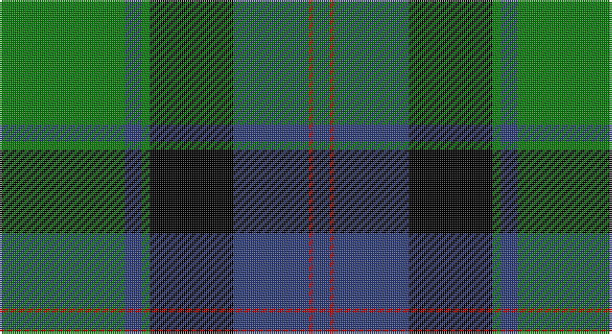

This page is one **sett** — a single exact thread-count. It belongs to the [tartan](/setts/g30db4g2k20db18r1db4/)
(the same proportion at any scale), whose colour order is pattern [BRBKGBG](/stripes/brbkgbg/).

Part of the [MacTaggert](/tartans/mactaggert/) tartan — the named design grouping this sett with its other cloths.

Sourced from weddslist.  It is a [7 stripe tartan](/stripes/stripes7/).

Original link http://www.weddslist.com/cgi-bin/tartans/pg.pl?source=sts

## Thread count
G/60 B8 G4 K40 B36 R2 B/8

One full sett is **248 threads**.

## Palette

Palette: <strong>Ingles Buchan</strong> <small style="color:#888">(1 of 4 colours)</small>
<table><thead><tr><th>Colour</th><th>Threads</th><th>Shade</th><th>Base</th><th>OKLCh</th></tr></thead><tbody><tr><td>G/</td><td style="text-align:right;font-variant-numeric:tabular-nums">60</td><td><code style="background-color:#008000;">#008000</code> <small style="color:#888">#008000</small></td><td>G <code style="background-color:#006100;">#006100</code></td><td><small style="color:#888">oklch(52.0% 0.177 142.5)</small></td></tr><tr><td>B</td><td style="text-align:right;font-variant-numeric:tabular-nums">8</td><td><code style="background-color:#304080;">#304080</code> <small style="color:#888">#304080</small></td><td>B <code style="background-color:#2A418A;">#2A418A</code></td><td><small style="color:#888">oklch(39.4% 0.109 270.2)</small></td></tr><tr><td>G</td><td style="text-align:right;font-variant-numeric:tabular-nums">4</td><td><code style="background-color:#008000;">#008000</code> <small style="color:#888">#008000</small></td><td>G <code style="background-color:#006100;">#006100</code></td><td><small style="color:#888">oklch(52.0% 0.177 142.5)</small></td></tr><tr><td>K</td><td style="text-align:right;font-variant-numeric:tabular-nums">40</td><td><code style="background-color:#000000;">#000000</code> <small style="color:#888">#000000</small></td><td>K <code style="background-color:#000000;">#000000</code></td><td><small style="color:#888">oklch(0.0% 0.000 0.0)</small></td></tr><tr><td>B</td><td style="text-align:right;font-variant-numeric:tabular-nums">36</td><td><code style="background-color:#304080;">#304080</code> <small style="color:#888">#304080</small></td><td>B <code style="background-color:#2A418A;">#2A418A</code></td><td><small style="color:#888">oklch(39.4% 0.109 270.2)</small></td></tr><tr><td>R</td><td style="text-align:right;font-variant-numeric:tabular-nums">2</td><td><code style="background-color:#C00000;">#C00000</code> <small style="color:#888">#C00000</small></td><td>R <code style="background-color:#CC0000;">#CC0000</code></td><td><small style="color:#888">oklch(50.7% 0.208 29.2)</small></td></tr><tr><td>B/</td><td style="text-align:right;font-variant-numeric:tabular-nums">8</td><td><code style="background-color:#304080;">#304080</code> <small style="color:#888">#304080</small></td><td>B <code style="background-color:#2A418A;">#2A418A</code></td><td><small style="color:#888">oklch(39.4% 0.109 270.2)</small></td></tr></tbody></table>

# Sample pattern

## Compared to the master

This cloth is one sett of its design; the master sett (the exemplar the design is anchored on) is below for comparison.

<figure style="margin:0"><figcaption style="color:#888;font-size:smaller">this sett</figcaption></figure>
<figure style="margin:0"><figcaption style="color:#888;font-size:smaller"><a href="/setts/db9k12g2t4g18t4g2k12db12r2db2r2db3/">master sett →</a></figcaption></figure>

## Nearest tartans

The nearest existing variants by ΔTartan distance, with this tartan at the top so the swatches line up against it.

ΔTartan

Tartan

Sett

—

<a href="/ttd/edit/#slug=g30db4g2k20db18r1db4~x2">MacTaggert</a> <a class="nn-out" href="/variants/s7/g30db4g2k20db18r1db4~x2/" title="open its dictionary page">↗</a>

0.95

<a href="/ttd/edit/#slug=r3k2db25k28g25k2r1db2~x2&amp;base=g30db4g2k20db18r1db4~x2">Common Kilt</a> <a class="nn-out" href="/variants/s8/r3k2db25k28g25k2r1db2~x2/" title="open its dictionary page">↗</a>

1.04

<a href="/ttd/edit/#slug=k3db3k3db22g26k2db1ly3~x2&amp;base=g30db4g2k20db18r1db4~x2">Johnstone / Johnston</a> <a class="nn-out" href="/variants/s8/k3db3k3db22g26k2db1ly3~x2/" title="open its dictionary page">↗</a>

1.05

<a href="/ttd/edit/#slug=db4k2db16w1k8g24r4~x2&amp;base=g30db4g2k20db18r1db4~x2">Colquhoun</a> <a class="nn-out" href="/variants/s7/db4k2db16w1k8g24r4~x2/" title="open its dictionary page">↗</a>

1.17

<a href="/ttd/edit/#slug=db24k8g8r2g8k1ly2~x2&amp;base=g30db4g2k20db18r1db4~x2">MacLaren</a> <a class="nn-out" href="/variants/s7/db24k8g8r2g8k1ly2~x2/" title="open its dictionary page">↗</a>

1.20

<a href="/ttd/edit/#slug=k2db3g16b1k13b1db18k2db2~x2&amp;base=g30db4g2k20db18r1db4~x2">Hebridean Old</a> <a class="nn-out" href="/variants/s9/k2db3g16b1k13b1db18k2db2~x2/" title="open its dictionary page">↗</a>

1.21

<a href="/ttd/edit/#slug=g2r1g16k12r1t16g1t2~x2&amp;base=g30db4g2k20db18r1db4~x2">Lochaber District</a> <a class="nn-out" href="/variants/s8/g2r1g16k12r1t16g1t2~x2/" title="open its dictionary page">↗</a>

1.22

<a href="/ttd/edit/#slug=db24k8g8r2g8k1w2~x2&amp;base=g30db4g2k20db18r1db4~x2">Ferguson of Athol</a> <a class="nn-out" href="/variants/s7/db24k8g8r2g8k1w2~x2/" title="open its dictionary page">↗</a>

1.25

<a href="/ttd/edit/#slug=g3r1g18k20r1db18t1g2~x4&amp;base=g30db4g2k20db18r1db4~x2">Lochaber</a> <a class="nn-out" href="/variants/s8/g3r1g18k20r1db18t1g2~x4/" title="open its dictionary page">↗</a>

1.31

<a href="/ttd/edit/#slug=db24ly2k8g16k1g3k1g3r4~x2&amp;base=g30db4g2k20db18r1db4~x2">Ogilvie 1</a> <a class="nn-out" href="/variants/s9/db24ly2k8g16k1g3k1g3r4~x2/" title="open its dictionary page">↗</a>

1.31

<a href="/ttd/edit/#slug=db4r1db18k20g18r1g4~x2&amp;base=g30db4g2k20db18r1db4~x2">Blair</a> <a class="nn-out" href="/variants/s7/db4r1db18k20g18r1g4~x2/" title="open its dictionary page">↗</a>

## Neighbour map

Every grey dot is one of 14360 variants placed by the first two principal components of the ΔTartan feature space (44% of its variance). Red is this tartan; blue dots are its nearest — click one to open its page.

<svg viewBox="0 0 640 380" role="img" style="max-width:100%;height:auto;border:1px solid #e0e0e0;border-radius:4px;display:block" xmlns="http://www.w3.org/2000/svg"><image href="/nn/cloud.v1.png" width="640" height="380"/><a href="/variants/s8/r3k2db25k28g25k2r1db2~x2/"><circle cx="224.6" cy="146.7" r="4" fill="#3465a4"><title>Common Kilt</title></circle></a><a href="/variants/s8/k3db3k3db22g26k2db1ly3~x2/"><circle cx="266.6" cy="143.2" r="4" fill="#3465a4"><title>Johnstone / Johnston</title></circle></a><a href="/variants/s7/db4k2db16w1k8g24r4~x2/"><circle cx="212.5" cy="149.3" r="4" fill="#3465a4"><title>Colquhoun</title></circle></a><a href="/variants/s7/db24k8g8r2g8k1ly2~x2/"><circle cx="236.1" cy="147.8" r="4" fill="#3465a4"><title>MacLaren</title></circle></a><a href="/variants/s9/k2db3g16b1k13b1db18k2db2~x2/"><circle cx="220.3" cy="161.2" r="4" fill="#3465a4"><title>Hebridean Old</title></circle></a><a href="/variants/s8/g2r1g16k12r1t16g1t2~x2/"><circle cx="208.8" cy="167.4" r="4" fill="#3465a4"><title>Lochaber District</title></circle></a><a href="/variants/s7/db24k8g8r2g8k1w2~x2/"><circle cx="234.4" cy="147.2" r="4" fill="#3465a4"><title>Ferguson of Athol</title></circle></a><a href="/variants/s8/g3r1g18k20r1db18t1g2~x4/"><circle cx="189.4" cy="144.3" r="4" fill="#3465a4"><title>Lochaber</title></circle></a><a href="/variants/s9/db24ly2k8g16k1g3k1g3r4~x2/"><circle cx="210.0" cy="127.2" r="4" fill="#3465a4"><title>Ogilvie 1</title></circle></a><a href="/variants/s7/db4r1db18k20g18r1g4~x2/"><circle cx="205.3" cy="185.8" r="4" fill="#3465a4"><title>Blair</title></circle></a><circle cx="243.6" cy="161.4" r="5" fill="#c00000"/></svg>

ID: /variants/s7/g30db4g2k20db18r1db4~x2/
