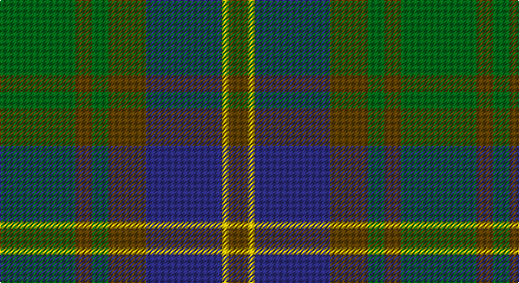

This page is one **sett** — a single exact thread-count. It belongs to the [tartan](/setts/g32dy7g7dy16db32ly3dy8/)
(the same proportion at any scale), whose colour order is pattern [GGGGBYG](/stripes/ggggbyg/).

Sourced from tartans-authority.  It is a [7 stripe tartan](/stripes/stripes7/).

Original link http://www.tartansauthority.com/tartan-ferret/display/2259/

## Provenance

Earliest known date: 1996 Designed by Kenny Dalgliesh of D C Dalgliesh of Selkirk and recorded in Lyon Court Book. LCB101 on 11th June 1996. Lyon count: G64 Brown14 G14 Brown32 B64 Y6 Brown16. Full counts at pivots. Green and blue lightened to show sett.

## Also known as

This cloth is also recorded under:

- Strange Of Balcaskie

2 attestations — the source records this cloth was collapsed from (oldest owns this page)

<ul>
<li>Sep. 1995 — Strange of Balcaskie (Clan) (tartans-authority, <a href="http://www.tartansauthority.com/tartan-ferret/display/2259/">record</a>)</li>
<li>undated — Strange of Balcaskie Family Tartan (house-of-tartan, <a href="http://www.house-of-tartan.scotland.net/house/TartanViewjs.asp?colr=Def&tnam=2259">record</a>)</li>
</ul>

## Register references

External register numbers recorded for this tartan.

- Scottish Tartans Authority (ITI): 2259

## Thread count
G/64 T14 G14 T32 DB64 Y6 T/16

One full sett is **340 threads**.

## Palette

Palette: <strong>Tartan Register</strong>
<table><thead><tr><th>Colour</th><th>Threads</th><th>Shade</th><th>Base</th><th>OKLCh</th></tr></thead><tbody><tr><td>G/</td><td style="text-align:right;font-variant-numeric:tabular-nums">64</td><td><code style="background-color:#006818;">#006818</code> <small style="color:#888">#006818</small></td><td>G <code style="background-color:#006100;">#006100</code></td><td><small style="color:#888">oklch(45.0% 0.142 145.0)</small></td></tr><tr><td>T</td><td style="text-align:right;font-variant-numeric:tabular-nums">14</td><td><code style="background-color:#604000;">#604000</code> <small style="color:#888">#604000</small></td><td>G <code style="background-color:#006100;">#006100</code></td><td><small style="color:#888">oklch(39.8% 0.083 76.8)</small></td></tr><tr><td>G</td><td style="text-align:right;font-variant-numeric:tabular-nums">14</td><td><code style="background-color:#006818;">#006818</code> <small style="color:#888">#006818</small></td><td>G <code style="background-color:#006100;">#006100</code></td><td><small style="color:#888">oklch(45.0% 0.142 145.0)</small></td></tr><tr><td>T</td><td style="text-align:right;font-variant-numeric:tabular-nums">32</td><td><code style="background-color:#604000;">#604000</code> <small style="color:#888">#604000</small></td><td>G <code style="background-color:#006100;">#006100</code></td><td><small style="color:#888">oklch(39.8% 0.083 76.8)</small></td></tr><tr><td>DB</td><td style="text-align:right;font-variant-numeric:tabular-nums">64</td><td><code style="background-color:#2C2C80;">#2C2C80</code> <small style="color:#888">#2C2C80</small></td><td>B <code style="background-color:#2A418A;">#2A418A</code></td><td><small style="color:#888">oklch(35.0% 0.138 276.6)</small></td></tr><tr><td>Y</td><td style="text-align:right;font-variant-numeric:tabular-nums">6</td><td><code style="background-color:#E8C000;">#E8C000</code> <small style="color:#888">#E8C000</small></td><td>Y <code style="background-color:#F2BF00;">#F2BF00</code></td><td><small style="color:#888">oklch(81.9% 0.168 93.7)</small></td></tr><tr><td>T/</td><td style="text-align:right;font-variant-numeric:tabular-nums">16</td><td><code style="background-color:#604000;">#604000</code> <small style="color:#888">#604000</small></td><td>G <code style="background-color:#006100;">#006100</code></td><td><small style="color:#888">oklch(39.8% 0.083 76.8)</small></td></tr></tbody></table>

# Sample pattern

## Nearest tartans

The nearest existing variants by ΔTartan distance, with this tartan at the top so the swatches line up against it.

ΔTartan

Tartan

Sett

—

<a href="/ttd/edit/#slug=g32dy7g7dy16db32ly3dy8~x2">Strange of Balcaskie (Clan)</a> <a class="nn-out" href="/variants/s7/g32dy7g7dy16db32ly3dy8~x2/" title="open its dictionary page">↗</a>

0.68

<a href="/ttd/edit/#slug=g32o7g7o16db32ly3o8~x2&amp;base=g32dy7g7dy16db32ly3dy8~x2">Strange Of Balcaskie</a> <a class="nn-out" href="/variants/s7/g32o7g7o16db32ly3o8~x2/" title="open its dictionary page">↗</a>

0.86

<a href="/ttd/edit/#slug=db4dy7ly3dy12g15dy5db20dy5g4dy2~x2&amp;base=g32dy7g7dy16db32ly3dy8~x2">Tupper. Sir Charles.. Family Tartan</a> <a class="nn-out" href="/variants/s10/db4dy7ly3dy12g15dy5db20dy5g4dy2~x2/" title="open its dictionary page">↗</a>

0.88

<a href="/ttd/edit/#slug=t4dy28dg6t12k12t3~x2&amp;base=g32dy7g7dy16db32ly3dy8~x2">Thompson/Thomson/MacTavish Hunting</a> <a class="nn-out" href="/variants/s6/t4dy28dg6t12k12t3~x2/" title="open its dictionary page">↗</a>

1.02

<a href="/ttd/edit/#slug=dg6ly3dg26k10n30lb3~x2&amp;base=g32dy7g7dy16db32ly3dy8~x2">Montrose (1983)</a> <a class="nn-out" href="/variants/s6/dg6ly3dg26k10n30lb3~x2/" title="open its dictionary page">↗</a>

1.04

<a href="/ttd/edit/#slug=db4o7ly3o12g15o5db20o5g4o2~x2&amp;base=g32dy7g7dy16db32ly3dy8~x2">Tupper., Sir Charles..</a> <a class="nn-out" href="/variants/s10/db4o7ly3o12g15o5db20o5g4o2~x2/" title="open its dictionary page">↗</a>

1.14

<a href="/ttd/edit/#slug=dp4n18k17n3g18n4~x2&amp;base=g32dy7g7dy16db32ly3dy8~x2">Scottish Airports (Corporate)</a> <a class="nn-out" href="/variants/s6/dp4n18k17n3g18n4~x2/" title="open its dictionary page">↗</a>

1.14

<a href="/ttd/edit/#slug=k2dg12k12r1db12dg2~x2&amp;base=g32dy7g7dy16db32ly3dy8~x2">Ferguson of Balquhidder</a> <a class="nn-out" href="/variants/s6/k2dg12k12r1db12dg2~x2/" title="open its dictionary page">↗</a>

1.15

<a href="/ttd/edit/#slug=dy28g2dy4db18g23db2g3lo4~x2&amp;base=g32dy7g7dy16db32ly3dy8~x2">Eastern Western Motor Group, Dalbraith</a> <a class="nn-out" href="/variants/s8/dy28g2dy4db18g23db2g3lo4~x2/" title="open its dictionary page">↗</a>

1.15

<a href="/ttd/edit/#slug=n4g18n3k17n18p4~x2&amp;base=g32dy7g7dy16db32ly3dy8~x2">Scottish Airports</a> <a class="nn-out" href="/variants/s6/n4g18n3k17n18p4~x2/" title="open its dictionary page">↗</a>

1.17

<a href="/ttd/edit/#slug=g31dg7lo3dg14g8db18dp5~x2&amp;base=g32dy7g7dy16db32ly3dy8~x2">Reidy Wedding</a> <a class="nn-out" href="/variants/s7/g31dg7lo3dg14g8db18dp5~x2/" title="open its dictionary page">↗</a>

## Neighbour map

Every grey dot is one of 14360 variants placed by the first two principal components of the ΔTartan feature space (44% of its variance). Red is this tartan; blue dots are its nearest — click one to open its page.

<svg viewBox="0 0 640 380" role="img" style="max-width:100%;height:auto;border:1px solid #e0e0e0;border-radius:4px;display:block" xmlns="http://www.w3.org/2000/svg"><image href="/nn/cloud.v1.png" width="640" height="380"/><a href="/variants/s7/g32o7g7o16db32ly3o8~x2/"><circle cx="237.9" cy="236.3" r="4" fill="#3465a4"><title>Strange Of Balcaskie</title></circle></a><a href="/variants/s10/db4dy7ly3dy12g15dy5db20dy5g4dy2~x2/"><circle cx="241.5" cy="226.8" r="4" fill="#3465a4"><title>Tupper. Sir Charles.. Family Tartan</title></circle></a><a href="/variants/s6/t4dy28dg6t12k12t3~x2/"><circle cx="249.8" cy="242.4" r="4" fill="#3465a4"><title>Thompson/Thomson/MacTavish Hunting</title></circle></a><a href="/variants/s6/dg6ly3dg26k10n30lb3~x2/"><circle cx="254.3" cy="228.9" r="4" fill="#3465a4"><title>Montrose (1983)</title></circle></a><a href="/variants/s10/db4o7ly3o12g15o5db20o5g4o2~x2/"><circle cx="241.9" cy="224.5" r="4" fill="#3465a4"><title>Tupper., Sir Charles..</title></circle></a><a href="/variants/s6/dp4n18k17n3g18n4~x2/"><circle cx="223.0" cy="281.8" r="4" fill="#3465a4"><title>Scottish Airports (Corporate)</title></circle></a><a href="/variants/s6/k2dg12k12r1db12dg2~x2/"><circle cx="250.3" cy="251.8" r="4" fill="#3465a4"><title>Ferguson of Balquhidder</title></circle></a><a href="/variants/s8/dy28g2dy4db18g23db2g3lo4~x2/"><circle cx="289.5" cy="219.4" r="4" fill="#3465a4"><title>Eastern Western Motor Group, Dalbraith</title></circle></a><a href="/variants/s6/n4g18n3k17n18p4~x2/"><circle cx="211.5" cy="276.1" r="4" fill="#3465a4"><title>Scottish Airports</title></circle></a><a href="/variants/s7/g31dg7lo3dg14g8db18dp5~x2/"><circle cx="245.7" cy="231.8" r="4" fill="#3465a4"><title>Reidy Wedding</title></circle></a><circle cx="243.8" cy="241.3" r="5" fill="#c00000"/></svg>

ID: /variants/s7/g32dy7g7dy16db32ly3dy8~x2/
