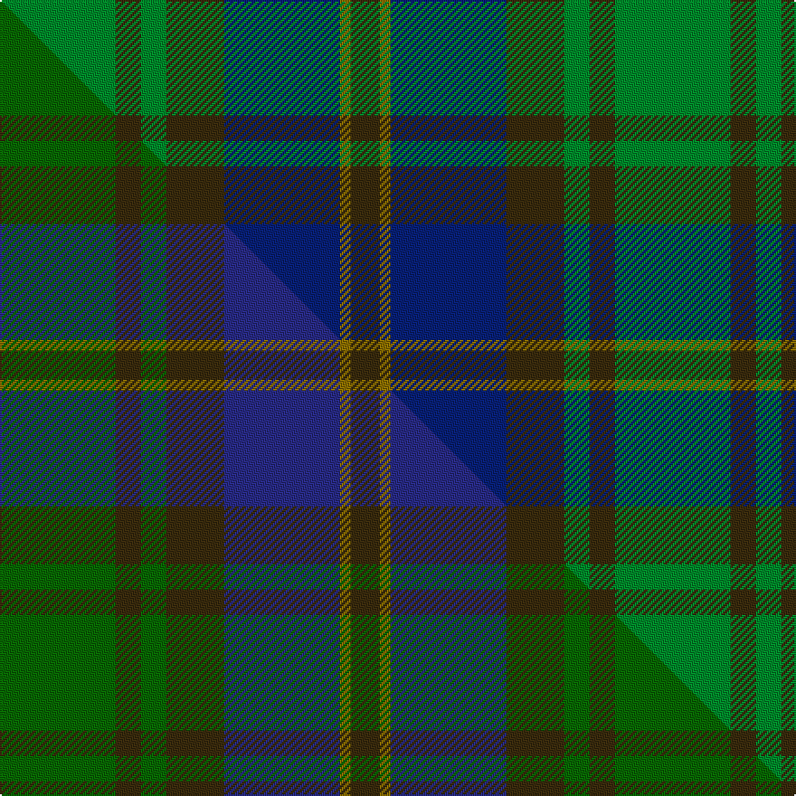

This page is one **sett** — a single exact thread-count. It belongs to the [tartan](/setts/g32dy7g7dy16db32y3dy8/)
(the same proportion at any scale), whose colour order is pattern [GGBGGGG](/stripes/ggbgggg/).

Part of the [Strange of Balcaskie](/tartans/strange-of-balcaskie/) tartan — the named design grouping this sett with its other cloths.

Sourced from tartans-authority.  It is a [7 stripe tartan](/stripes/stripes7/).

Original link http://www.tartansauthority.com/tartan-ferret/display/2259/

## Register references

External register numbers recorded for this tartan.

- Scottish Tartans Authority (ITI): 2259

## Thread count
G/64 DY14 G14 DY32 DB64 Y6 DY/16

One full sett is **340 threads**.

## Palette
<table><thead><tr><th>Colour</th><th>Shade</th><th>OKLCh</th></tr></thead><tbody><tr><td>DB</td><td><code style="background-color:#082077;">#082077</code> <small style="color:#888">#082077</small></td><td><small style="color:#888">oklch(30.0% 0.149 265.1)</small></td></tr><tr><td>G</td><td><code style="background-color:#008B2A;">#008B2A</code> <small style="color:#888">#008B2A</small></td><td><small style="color:#888">oklch(55.4% 0.170 145.9)</small></td></tr><tr><td>DY</td><td><code style="background-color:#3A2B0D;">#3A2B0D</code> <small style="color:#888">#3A2B0D</small></td><td><small style="color:#888">oklch(30.0% 0.049 82.0)</small></td></tr><tr><td>Y</td><td><code style="background-color:#8B6E00;">#8B6E00</code> <small style="color:#888">#8B6E00</small></td><td><small style="color:#888">oklch(55.1% 0.113 90.4)</small></td></tr></tbody></table>

# Sample pattern

## Compared to the master

This cloth is one sett of its design; the master sett (the exemplar the design is anchored on) is below for comparison.

Its **ΔTartan distance** from the master is **1.60** — the same measure the nearest-tartans table ranks by (0 is identical; a re-scale of the same cloth is near 0, a recolour or a different proportion further).

<figure class="master-compare" style="margin:0">

this sett
master sett ★

<figcaption style="color:#888;font-size:smaller">One weave of this sett against the <a href="/setts/dg32dy7dg7dy16db32y3dy8/">master sett ★</a>, split on the diagonal: a shared proportion runs seamlessly across it with only the shades shifting; a different proportion breaks on it.</figcaption>
</figure>

## Nearest variants

The nearest existing variants by ΔTartan distance, with this cloth at the top so the swatches line up against it.

ΔTartan

Threads

Variant

Sett

—

340

<a href="/variants/s7/g32dy7g7dy16db32y3dy8~x2/">Strange of Balcaskie (Clan)</a>

<a href="/ttd/edit/#slug=g32dy7g7dy16db32y3dy8~x2~db1406275&amp;base=g32dy7g7dy16db32y3dy8~x2" title="compare in the TTD">0.00</a>

340

<a href="/variants/s7/g32dy7g7dy16db32y3dy8~x2~db1406275/">Strange of Balcaskie Family Tartan</a>

<a href="/ttd/edit/#slug=db8y1dg5y12r1dg2~x6&amp;base=g32dy7g7dy16db32y3dy8~x2" title="compare in the TTD">2.24</a>

288

<a href="/variants/s6/db8y1dg5y12r1dg2~x6/">McCabe (2016)</a>

<a href="/ttd/edit/#slug=g31dg7y3dg14g8db18dp5~x2&amp;base=g32dy7g7dy16db32y3dy8~x2" title="compare in the TTD">2.87</a>

272

<a href="/variants/s7/g31dg7y3dg14g8db18dp5~x2/">Reidy Wedding</a>

<a href="/ttd/edit/#slug=dy28g2dy4db18g23db2g3ly4~x2&amp;base=g32dy7g7dy16db32y3dy8~x2" title="compare in the TTD">2.93</a>

272

<a href="/variants/s8/dy28g2dy4db18g23db2g3ly4~x2/">Eastern Western Motor Group, Dalbraith</a>

## Neighbour map

Every grey dot is one of 13620 variants placed by the first two principal components of the ΔTartan feature space (42% of its variance). Red is this tartan; blue dots are its nearest — click one to open its page.

<svg viewBox="0 0 640 380" role="img" style="max-width:100%;height:auto;border:1px solid #e0e0e0;border-radius:4px;display:block" xmlns="http://www.w3.org/2000/svg"><image href="/nn/cloud.v1.png" width="640" height="380"/><a href="/variants/s7/g32dy7g7dy16db32y3dy8~x2~db1406275/"><circle cx="272.1" cy="248.8" r="4" fill="#3465a4"><title>Strange of Balcaskie Family Tartan</title></circle></a><a href="/variants/s6/db8y1dg5y12r1dg2~x6/"><circle cx="289.6" cy="222.0" r="4" fill="#3465a4"><title>McCabe (2016)</title></circle></a><a href="/variants/s7/g31dg7y3dg14g8db18dp5~x2/"><circle cx="266.8" cy="237.3" r="4" fill="#3465a4"><title>Reidy Wedding</title></circle></a><a href="/variants/s8/dy28g2dy4db18g23db2g3ly4~x2/"><circle cx="269.9" cy="209.2" r="4" fill="#3465a4"><title>Eastern Western Motor Group, Dalbraith</title></circle></a><circle cx="262.0" cy="246.3" r="5" fill="#c00000"/><text x="320" y="376" text-anchor="middle" font-size="11" fill="#999">ground</text><text x="11" y="190" text-anchor="middle" font-size="11" fill="#999" transform="rotate(-90 11 190)">complexity</text></svg>

ID: /variants/s7/g32dy7g7dy16db32y3dy8~x2/
