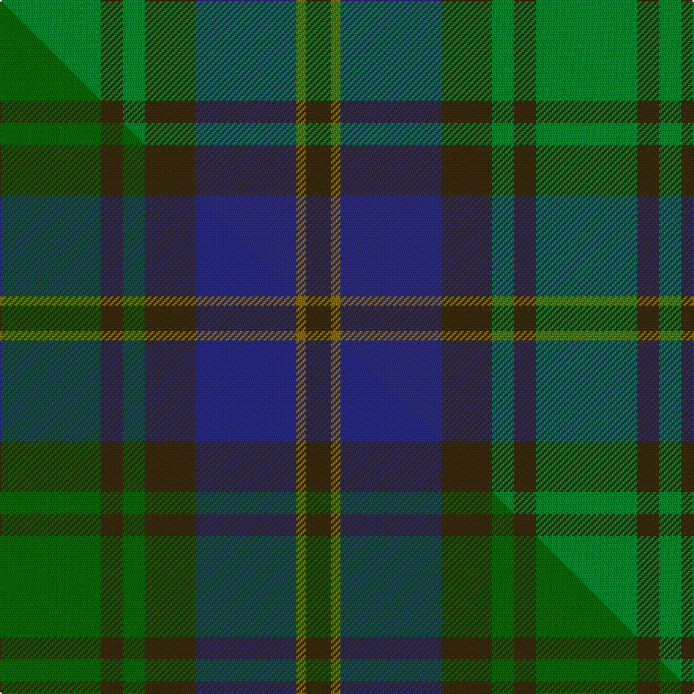

This is one **variant** — a specific cloth: this exact thread count and colourway, with its own
provenance below. It is one weaving of the [sett](/setts/g32dy7g7dy16db32y3dy8/) (the scale-free proportion — the
same cloth at any scale or shade), whose colour order is pattern [GGBGGGG](/stripes/ggbgggg/).

Part of the [Strange of Balcaskie](/tartans/strange-of-balcaskie-2/) tartan — the named design grouping this sett with its other cloths.

Sourced from house-of-tartan.  It is a [7 stripe tartan](/stripes/stripes7/).

Original link [http://www.house-of-tartan.scotland.net/house/TartanViewjs.asp?colr=Def&tnam=2259](http://www.house-of-tartan.scotland.net/house/TartanViewjs.asp?colr=Def&tnam=2259)

## Provenance

Earliest known date: 1996 Designed by Kenny Dalgliesh of D C Dalgliesh of Selkirk and recorded in Lyon Court Book. LCB101 on 11th June 1996. Lyon count: G64 Brown14 G14 Brown32 B64 Y6 Brown16. Full counts at pivots. Green and blue lightened to show sett.

Dataset <small>— provenance for this record, inherited from the source manifest</small>

<dl class="dataset-prov">
<dt>source</dt><dd><a href="/sources/house-of-tartan/">House of Tartan</a></dd>
<dt>data captured from</dt><dd><a href="https://github.com/thetartan/tartan-database/blob/master/data/house-of-tartan/data.csv">https://github.com/thetartan/tartan-database/blob/master/data/house-of-tartan/data.csv</a></dd>
<dt>data date</dt><dd>1996 <small>(this record)</small></dd>
<dt>licence</dt><dd><a href="https://creativecommons.org/licenses/by-nc-nd/4.0/">CC BY-NC-ND 4.0</a></dd>
</dl>

Capture chain <small>— the hands this data passed through, oldest first; each capture carries its own licence</small>

<ol class="capture-chain">
<li><a href="http://www.house-of-tartan.scotland.net/">House of Tartan</a> <small>the weaver/retailer's database — the site is now offline; the URL is kept as the ultimate source's identity</small></li>
<li><a href="https://github.com/thetartan/tartan-database">thetartan/tartan-database</a> <small>2016-2017</small> · <a href="https://creativecommons.org/licenses/by-nc-nd/4.0/">CC BY-NC-ND 4.0</a> <small>Levko Kravets's frozen compilation — the capture we vendored, and where its CC licence text came from</small></li>
<li>this dictionary <small>captured 2026-06-10 · commit 5bf86c7566</small> <small>each re-capture is a git commit to data/sources</small></li>
</ol>

## Thread count
G/64 DY14 G14 DY32 DB64 Y6 DY/16

One full sett is **340 threads**.

## Palette
<table><thead><tr><th>Colour</th><th>Shade</th><th>OKLCh</th></tr></thead><tbody><tr><td>DB</td><td><code style="background-color:#202060;">#202060</code> <small style="color:#888">#202060</small></td><td><small style="color:#888">oklch(28.9% 0.111 276.9)</small></td></tr><tr><td>DB</td><td><code style="background-color:#2C2C80;">#2C2C80</code> <small style="color:#888">#2C2C80</small></td><td><small style="color:#888">oklch(35.0% 0.138 276.6)</small></td></tr><tr><td>DG</td><td><code style="background-color:#053819;">#053819</code> <small style="color:#888">#053819</small></td><td><small style="color:#888">oklch(30.0% 0.075 151.3)</small></td></tr><tr><td>G</td><td><code style="background-color:#008B2A;">#008B2A</code> <small style="color:#888">#008B2A</small></td><td><small style="color:#888">oklch(55.4% 0.170 145.9)</small></td></tr><tr><td>DY</td><td><code style="background-color:#3A2B0D;">#3A2B0D</code> <small style="color:#888">#3A2B0D</small></td><td><small style="color:#888">oklch(30.0% 0.049 82.0)</small></td></tr><tr><td>Y</td><td><code style="background-color:#8B6E00;">#8B6E00</code> <small style="color:#888">#8B6E00</small></td><td><small style="color:#888">oklch(55.1% 0.113 90.4)</small></td></tr></tbody></table>

# Sample pattern

## Compared to the master

This cloth is one sett of its design; the master sett (the exemplar the design is anchored on) is below for comparison.

Its **ΔTartan distance** from the master is **0.09** — the same measure the nearest-tartans table ranks by (0 is identical; a re-scale of the same cloth is near 0, a recolour or a different proportion further).

<figure class="master-compare" style="margin:0">

this sett
master sett ★

<figcaption style="color:#888;font-size:smaller">One weave of this sett against the <a href="/setts/dg32dy7dg7dy16db32y3dy8/">master sett ★</a>, split on the diagonal: a shared proportion runs seamlessly across it with only the shades shifting; a different proportion breaks on it.</figcaption>
</figure>

## Nearest tartan variants

The nearest existing variants by ΔTartan distance, with this cloth at the top so the swatches line up against it.

ΔTartan

Threads

Variant

Sett

—

340

<a href="/variants/s7/g32dy7g7dy16db32y3dy8~x2~db1406275/">Strange of Balcaskie Family Tartan</a>

<a href="/ttd/edit/#slug=g32dy7g7dy16db32y3dy8~x2&amp;base=g32dy7g7dy16db32y3dy8~x2~db1406275" title="compare in the TTD">0.04</a>

340

<a href="/variants/s7/g32dy7g7dy16db32y3dy8~x2/">Strange of Balcaskie (Clan)</a>

<a href="/ttd/edit/#slug=db4dy7y3dy12g15dy5db20dy5g4dy2~x2&amp;base=g32dy7g7dy16db32y3dy8~x2~db1406275" title="compare in the TTD">2.03</a>

296

<a href="/variants/s10/db4dy7y3dy12g15dy5db20dy5g4dy2~x2/">Tupper. Sir Charles.. Family Tartan</a>

<a href="/ttd/edit/#slug=dr2do22g22do3db12y2~x2&amp;base=g32dy7g7dy16db32y3dy8~x2~db1406275" title="compare in the TTD">2.26</a>

244

<a href="/variants/s6/dr2do22g22do3db12y2~x2/">Lisbon</a>

<a href="/ttd/edit/#slug=g4dy25g6db12g12db3~x2&amp;base=g32dy7g7dy16db32y3dy8~x2~db1406275" title="compare in the TTD">2.38</a>

234

<a href="/variants/s6/g4dy25g6db12g12db3~x2/">Canadian Fancy</a>

<a href="/ttd/edit/#slug=db8y1dg5y12r1dg2~x6&amp;base=g32dy7g7dy16db32y3dy8~x2~db1406275" title="compare in the TTD">2.40</a>

288

<a href="/variants/s6/db8y1dg5y12r1dg2~x6/">McCabe (2016)</a>

<a href="/ttd/edit/#slug=t32dy16g3lo4dg28~x2&amp;base=g32dy7g7dy16db32y3dy8~x2~db1406275" title="compare in the TTD">2.50</a>

212

<a href="/variants/s5/t32dy16g3lo4dg28~x2/">Corey (Name)</a>

<a href="/ttd/edit/#slug=dt4g2db10y1db2g13dt11g13db13y2~x2~dt1204274-db1406275&amp;base=g32dy7g7dy16db32y3dy8~x2~db1406275" title="compare in the TTD">2.56</a>

272

<a href="/variants/s10/db4g2dbi10y1dbi2g13db11g13dbi13y2~x2~db1204274-dbi1406275/">Pinney's of Scotland</a>

<a href="/ttd/edit/#slug=dy28g2dy4db18g23db2g3ly4~x2&amp;base=g32dy7g7dy16db32y3dy8~x2~db1406275" title="compare in the TTD">2.64</a>

272

<a href="/variants/s8/dy28g2dy4db18g23db2g3ly4~x2/">Eastern Western Motor Group, Dalbraith</a>

<a href="/ttd/edit/#slug=db1dy1db7dy5y7lr1~x4&amp;base=g32dy7g7dy16db32y3dy8~x2~db1406275" title="compare in the TTD">2.83</a>

168

<a href="/variants/s6/db1dy1db7dy5y7lr1~x4/">Dewar (WCWM)</a>

<a href="/ttd/edit/#slug=g31dg7y3dg14g8db18dp5~x2&amp;base=g32dy7g7dy16db32y3dy8~x2~db1406275" title="compare in the TTD">2.86</a>

272

<a href="/variants/s7/g31dg7y3dg14g8db18dp5~x2/">Reidy Wedding</a>

## Neighbour map

Every grey dot is one of 13621 variants placed by the first two principal components of the ΔTartan feature space (42% of its variance). Red is this tartan; blue dots are its nearest — click one to open its page.

<svg viewBox="0 0 640 380" role="img" style="max-width:100%;height:auto;border:1px solid #e0e0e0;border-radius:4px;display:block" xmlns="http://www.w3.org/2000/svg"><image href="/nn/cloud.v1.png" width="640" height="380"/><a href="/variants/s7/g32dy7g7dy16db32y3dy8~x2/"><circle cx="262.2" cy="246.6" r="4" fill="#3465a4"><title>Strange of Balcaskie (Clan)</title></circle></a><a href="/variants/s10/db4dy7y3dy12g15dy5db20dy5g4dy2~x2/"><circle cx="275.4" cy="239.2" r="4" fill="#3465a4"><title>Tupper. Sir Charles.. Family Tartan</title></circle></a><a href="/variants/s6/dr2do22g22do3db12y2~x2/"><circle cx="276.8" cy="233.5" r="4" fill="#3465a4"><title>Lisbon</title></circle></a><a href="/variants/s6/g4dy25g6db12g12db3~x2/"><circle cx="298.4" cy="279.4" r="4" fill="#3465a4"><title>Canadian Fancy</title></circle></a><a href="/variants/s6/db8y1dg5y12r1dg2~x6/"><circle cx="289.7" cy="222.4" r="4" fill="#3465a4"><title>McCabe (2016)</title></circle></a><a href="/variants/s5/t32dy16g3lo4dg28~x2/"><circle cx="262.4" cy="255.0" r="4" fill="#3465a4"><title>Corey (Name)</title></circle></a><a href="/variants/s10/db4g2dbi10y1dbi2g13db11g13dbi13y2~x2~db1204274-dbi1406275/"><circle cx="273.5" cy="233.6" r="4" fill="#3465a4"><title>Pinney's of Scotland</title></circle></a><a href="/variants/s8/dy28g2dy4db18g23db2g3ly4~x2/"><circle cx="270.0" cy="209.5" r="4" fill="#3465a4"><title>Eastern Western Motor Group, Dalbraith</title></circle></a><a href="/variants/s6/db1dy1db7dy5y7lr1~x4/"><circle cx="245.5" cy="261.8" r="4" fill="#3465a4"><title>Dewar (WCWM)</title></circle></a><a href="/variants/s7/g31dg7y3dg14g8db18dp5~x2/"><circle cx="266.9" cy="237.6" r="4" fill="#3465a4"><title>Reidy Wedding</title></circle></a><circle cx="272.3" cy="249.2" r="5" fill="#c00000"/><text x="320" y="376" text-anchor="middle" font-size="11" fill="#999">ground</text><text x="11" y="190" text-anchor="middle" font-size="11" fill="#999" transform="rotate(-90 11 190)">complexity</text></svg>

ID: /variants/s7/g32dy7g7dy16db32y3dy8~x2~db1406275/
