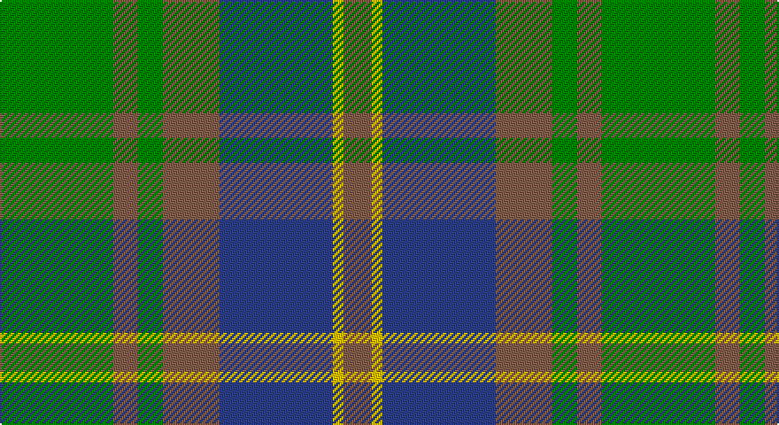

This page is one **sett** — a single exact thread-count. It belongs to the [tartan](/setts/g32o7g7o16db32ly3o8/)
(the same proportion at any scale), whose colour order is pattern [GRGRBYR](/stripes/grgrbyr/).

Sourced from weddslist.  It is a [7 stripe tartan](/stripes/stripes7/).

Original link http://www.weddslist.com/cgi-bin/tartans/pg.pl?source=sts

## Thread count
G/64 LT14 G14 LT32 B64 Y6 LT/16

One full sett is **340 threads**.

## Palette

Palette: <strong>custom</strong>
<table><thead><tr><th>Colour</th><th>Threads</th><th>Shade</th><th>Base</th><th>OKLCh</th></tr></thead><tbody><tr><td>G/</td><td style="text-align:right;font-variant-numeric:tabular-nums">64</td><td><code style="background-color:#008000;">#008000</code> <small style="color:#888">#008000</small></td><td>G <code style="background-color:#006100;">#006100</code></td><td><small style="color:#888">oklch(52.0% 0.177 142.5)</small></td></tr><tr><td>LT</td><td style="text-align:right;font-variant-numeric:tabular-nums">14</td><td><code style="background-color:#806050;">#806050</code> <small style="color:#888">#806050</small></td><td>R <code style="background-color:#CC0000;">#CC0000</code></td><td><small style="color:#888">oklch(51.7% 0.049 47.8)</small></td></tr><tr><td>G</td><td style="text-align:right;font-variant-numeric:tabular-nums">14</td><td><code style="background-color:#008000;">#008000</code> <small style="color:#888">#008000</small></td><td>G <code style="background-color:#006100;">#006100</code></td><td><small style="color:#888">oklch(52.0% 0.177 142.5)</small></td></tr><tr><td>LT</td><td style="text-align:right;font-variant-numeric:tabular-nums">32</td><td><code style="background-color:#806050;">#806050</code> <small style="color:#888">#806050</small></td><td>R <code style="background-color:#CC0000;">#CC0000</code></td><td><small style="color:#888">oklch(51.7% 0.049 47.8)</small></td></tr><tr><td>B</td><td style="text-align:right;font-variant-numeric:tabular-nums">64</td><td><code style="background-color:#304080;">#304080</code> <small style="color:#888">#304080</small></td><td>B <code style="background-color:#2A418A;">#2A418A</code></td><td><small style="color:#888">oklch(39.4% 0.109 270.2)</small></td></tr><tr><td>Y</td><td style="text-align:right;font-variant-numeric:tabular-nums">6</td><td><code style="background-color:#F0C000;">#F0C000</code> <small style="color:#888">#F0C000</small></td><td>Y <code style="background-color:#F2BF00;">#F2BF00</code></td><td><small style="color:#888">oklch(82.7% 0.169 90.5)</small></td></tr><tr><td>LT/</td><td style="text-align:right;font-variant-numeric:tabular-nums">16</td><td><code style="background-color:#806050;">#806050</code> <small style="color:#888">#806050</small></td><td>R <code style="background-color:#CC0000;">#CC0000</code></td><td><small style="color:#888">oklch(51.7% 0.049 47.8)</small></td></tr></tbody></table>

# Sample pattern

## Nearest tartans

The nearest existing variants by ΔTartan distance, with this tartan at the top so the swatches line up against it.

ΔTartan

Tartan

Sett

—

<a href="/ttd/edit/#slug=g32o7g7o16db32ly3o8~x2">Strange Of Balcaskie</a> <a class="nn-out" href="/variants/s7/g32o7g7o16db32ly3o8~x2/" title="open its dictionary page">↗</a>

0.68

<a href="/ttd/edit/#slug=g32dy7g7dy16db32ly3dy8~x2&amp;base=g32o7g7o16db32ly3o8~x2">Strange of Balcaskie (Clan)</a> <a class="nn-out" href="/variants/s7/g32dy7g7dy16db32ly3dy8~x2/" title="open its dictionary page">↗</a>

0.83

<a href="/ttd/edit/#slug=t12dg2t2dg2t2dy8g8dy1~x2&amp;base=g32o7g7o16db32ly3o8~x2">Universal Ancient</a> <a class="nn-out" href="/variants/s8/t12dg2t2dg2t2dy8g8dy1~x2/" title="open its dictionary page">↗</a>

0.92

<a href="/ttd/edit/#slug=db4o7ly3o12g15o5db20o5g4o2~x2&amp;base=g32o7g7o16db32ly3o8~x2">Tupper., Sir Charles..</a> <a class="nn-out" href="/variants/s10/db4o7ly3o12g15o5db20o5g4o2~x2/" title="open its dictionary page">↗</a>

0.93

<a href="/ttd/edit/#slug=t12gi2t2gi2t2dy8g8dy1~x2&amp;base=g32o7g7o16db32ly3o8~x2">Universal Ancient International Tartan</a> <a class="nn-out" href="/variants/s8/t12gi2t2gi2t2dy8g8dy1~x2/" title="open its dictionary page">↗</a>

1.10

<a href="/ttd/edit/#slug=b30ly3dy11ly3g33r6~x2&amp;base=g32o7g7o16db32ly3o8~x2">Balfour Hunting</a> <a class="nn-out" href="/variants/s6/b30ly3dy11ly3g33r6~x2/" title="open its dictionary page">↗</a>

1.17

<a href="/ttd/edit/#slug=db4dy7ly3dy12g15dy5db20dy5g4dy2~x2&amp;base=g32o7g7o16db32ly3o8~x2">Tupper. Sir Charles.. Family Tartan</a> <a class="nn-out" href="/variants/s10/db4dy7ly3dy12g15dy5db20dy5g4dy2~x2/" title="open its dictionary page">↗</a>

1.19

<a href="/ttd/edit/#slug=t4dg26gi8t8gi8g3t2~x2&amp;base=g32o7g7o16db32ly3o8~x2">Valley of the Green (The ) Canadian Tartan</a> <a class="nn-out" href="/variants/s7/t4dg26gi8t8gi8g3t2~x2/" title="open its dictionary page">↗</a>

1.23

<a href="/ttd/edit/#slug=t4dy28dg6t12k12t3~x2&amp;base=g32o7g7o16db32ly3o8~x2">Thompson/Thomson/MacTavish Hunting</a> <a class="nn-out" href="/variants/s6/t4dy28dg6t12k12t3~x2/" title="open its dictionary page">↗</a>

1.24

<a href="/ttd/edit/#slug=db3o10g9r1g3~x4&amp;base=g32o7g7o16db32ly3o8~x2">Bethlehem, City of (District)</a> <a class="nn-out" href="/variants/s5/db3o10g9r1g3~x4/" title="open its dictionary page">↗</a>

1.24

<a href="/ttd/edit/#slug=dg6ly3dg26k10n30lb3~x2&amp;base=g32o7g7o16db32ly3o8~x2">Montrose (1983)</a> <a class="nn-out" href="/variants/s6/dg6ly3dg26k10n30lb3~x2/" title="open its dictionary page">↗</a>

## Neighbour map

Every grey dot is one of 14360 variants placed by the first two principal components of the ΔTartan feature space (44% of its variance). Red is this tartan; blue dots are its nearest — click one to open its page.

<svg viewBox="0 0 640 380" role="img" style="max-width:100%;height:auto;border:1px solid #e0e0e0;border-radius:4px;display:block" xmlns="http://www.w3.org/2000/svg"><image href="/nn/cloud.v1.png" width="640" height="380"/><a href="/variants/s7/g32dy7g7dy16db32ly3dy8~x2/"><circle cx="243.8" cy="241.3" r="4" fill="#3465a4"><title>Strange of Balcaskie (Clan)</title></circle></a><a href="/variants/s8/t12dg2t2dg2t2dy8g8dy1~x2/"><circle cx="254.5" cy="219.5" r="4" fill="#3465a4"><title>Universal Ancient</title></circle></a><a href="/variants/s10/db4o7ly3o12g15o5db20o5g4o2~x2/"><circle cx="241.9" cy="224.5" r="4" fill="#3465a4"><title>Tupper., Sir Charles..</title></circle></a><a href="/variants/s8/t12gi2t2gi2t2dy8g8dy1~x2/"><circle cx="264.9" cy="222.1" r="4" fill="#3465a4"><title>Universal Ancient International Tartan</title></circle></a><a href="/variants/s6/b30ly3dy11ly3g33r6~x2/"><circle cx="216.7" cy="209.7" r="4" fill="#3465a4"><title>Balfour Hunting</title></circle></a><a href="/variants/s10/db4dy7ly3dy12g15dy5db20dy5g4dy2~x2/"><circle cx="241.5" cy="226.8" r="4" fill="#3465a4"><title>Tupper. Sir Charles.. Family Tartan</title></circle></a><a href="/variants/s7/t4dg26gi8t8gi8g3t2~x2/"><circle cx="278.7" cy="224.7" r="4" fill="#3465a4"><title>Valley of the Green (The ) Canadian Tartan</title></circle></a><a href="/variants/s6/t4dy28dg6t12k12t3~x2/"><circle cx="249.8" cy="242.4" r="4" fill="#3465a4"><title>Thompson/Thomson/MacTavish Hunting</title></circle></a><a href="/variants/s5/db3o10g9r1g3~x4/"><circle cx="279.3" cy="256.1" r="4" fill="#3465a4"><title>Bethlehem, City of (District)</title></circle></a><a href="/variants/s6/dg6ly3dg26k10n30lb3~x2/"><circle cx="254.3" cy="228.9" r="4" fill="#3465a4"><title>Montrose (1983)</title></circle></a><circle cx="237.9" cy="236.3" r="5" fill="#c00000"/></svg>

ID: /variants/s7/g32o7g7o16db32ly3o8~x2/
