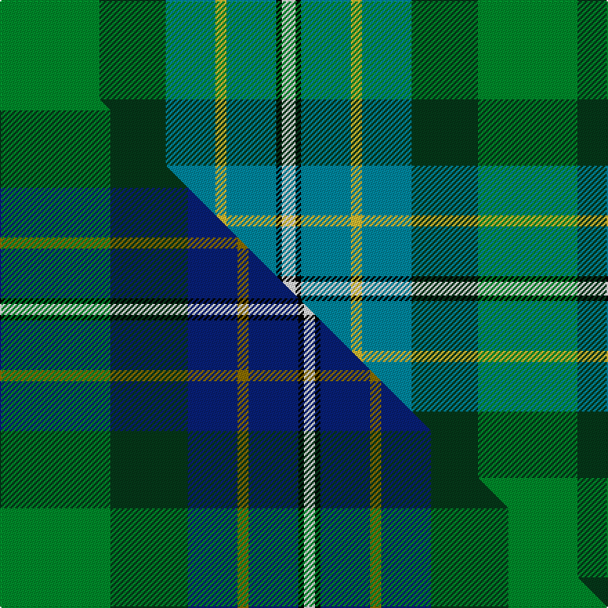

This page is one **sett** — a single exact thread-count. It belongs to the [tartan](/setts/g36dg24t18ly4t18k2w5/)
(the same proportion at any scale), whose colour order is pattern [GGBYBKW](/stripes/ggbybkw/).

Part of the [Hughes](/tartans/hughes/) tartan — the named design grouping this sett with its other cloths.

Sourced from tartans-authority.  It is a [7 stripe tartan](/stripes/stripes7/).

Original link https://www.tartanregister.gov.uk/tartanDetails.aspx?ref=2599

Dataset <small>— provenance for this record, inherited from the source manifest</small>

<dl class="dataset-prov">
<dt>source</dt><dd><a href="/sources/tartans-authority/">Scottish Tartans Authority</a></dd>
<dt>data captured from</dt><dd><a href="https://github.com/thetartan/tartan-database/blob/master/data/tartans-authority/data.csv">https://github.com/thetartan/tartan-database/blob/master/data/tartans-authority/data.csv</a></dd>
<dt>data date</dt><dd>1998 April <small>(this record)</small></dd>
<dt>licence</dt><dd><a href="https://creativecommons.org/licenses/by-nc-nd/4.0/">CC BY-NC-ND 4.0</a></dd>
</dl>

Capture chain <small>— the hands this data passed through, oldest first; each capture carries its own licence</small>

<ol class="capture-chain">
<li><a href="https://www.tartansauthority.com/">Scottish Tartans Authority</a> <small>the heritage body's archive — its tartan-ferret record browser is retired (links repaired to the SRT, above)</small></li>
<li><a href="https://github.com/thetartan/tartan-database">thetartan/tartan-database</a> <small>2016-2017</small> · <a href="https://creativecommons.org/licenses/by-nc-nd/4.0/">CC BY-NC-ND 4.0</a> <small>Levko Kravets's frozen compilation — the capture we vendored, and where its CC licence text came from</small></li>
<li>this dictionary <small>captured 2026-06-10 · commit 5bf86c7566</small> <small>each re-capture is a git commit to data/sources</small></li>
</ol>

## Register references

External register numbers recorded for this tartan.

- Scottish Tartans Authority (ITI): 2599

## Thread count
G/72 DG48 T36 LY8 T36 K4 W/10

One full sett is **346 threads**.

## Palette
<table><thead><tr><th>Colour</th><th>Shade</th><th>OKLCh</th></tr></thead><tbody><tr><td>T</td><td><code style="background-color:#00879F;">#00879F</code> <small style="color:#888">#00879F</small></td><td><small style="color:#888">oklch(57.4% 0.102 216.1)</small></td></tr><tr><td>DG</td><td><code style="background-color:#053819;">#053819</code> <small style="color:#888">#053819</small></td><td><small style="color:#888">oklch(30.0% 0.075 151.3)</small></td></tr><tr><td>G</td><td><code style="background-color:#008B2A;">#008B2A</code> <small style="color:#888">#008B2A</small></td><td><small style="color:#888">oklch(55.4% 0.170 145.9)</small></td></tr><tr><td>K</td><td><code style="background-color:#000000;">#000000</code> <small style="color:#888">#000000</small></td><td><small style="color:#888">oklch(0.0% 0.000 0.0)</small></td></tr><tr><td>W</td><td><code style="background-color:#F7F7F7;">#F7F7F7</code> <small style="color:#888">#F7F7F7</small></td><td><small style="color:#888">oklch(97.6% 0.000 89.9)</small></td></tr><tr><td>LY</td><td><code style="background-color:#DCBC32;">#DCBC32</code> <small style="color:#888">#DCBC32</small></td><td><small style="color:#888">oklch(80.0% 0.150 95.2)</small></td></tr></tbody></table>

# Sample pattern

## Compared to the master

This cloth is one sett of its design; the master sett (the exemplar the design is anchored on) is below for comparison.

Its **ΔTartan distance** from the master is **0.30** — the same measure the nearest-tartans table ranks by (0 is identical; a re-scale of the same cloth is near 0, a recolour or a different proportion further).

<figure class="master-compare" style="margin:0">

this sett
master sett ★

<figcaption style="color:#888;font-size:smaller">One weave of this sett against the <a href="/setts/g20dg14db9y2db9k1w2/">master sett ★</a>, split on the diagonal: a shared proportion runs seamlessly across it with only the shades shifting; a different proportion breaks on it.</figcaption>
</figure>

## Nearest tartan variants

The nearest existing variants by ΔTartan distance, with this cloth at the top so the swatches line up against it.

ΔTartan

Threads

Variant

Sett

—

346

<a href="/variants/s7/g36dg24t18ly4t18k2w5~x2/">Hughes (Inverbervie) (Personal)</a>

<a href="/ttd/edit/#slug=g20dg14db9y2db9k1w2~x4&amp;base=g36dg24t18ly4t18k2w5~x2" title="compare in the TTD">0.30</a>

368

<a href="/variants/s7/g20dg14db9y2db9k1w2~x4/">Hughes</a>

<a href="/ttd/edit/#slug=lg22w1gi6r6gi6y3g12~x2~gi2504202-g2203152&amp;base=g36dg24t18ly4t18k2w5~x2" title="compare in the TTD">1.45</a>

156

<a href="/variants/s7/lg22w1gi6r6gi6y3g12~x2~gi2504202-g2203152/">Dalveen (District)</a>

<a href="/ttd/edit/#slug=dg6r2db1r3db16g20w2~x2&amp;base=g36dg24t18ly4t18k2w5~x2" title="compare in the TTD">2.03</a>

184

<a href="/variants/s7/dg6r2db1r3db16g20w2~x2/">MacCord / McCord (Personal)</a>

<a href="/ttd/edit/#slug=r4k2g36k2t18y3t18k2~x2&amp;base=g36dg24t18ly4t18k2w5~x2" title="compare in the TTD">2.14</a>

328

<a href="/variants/s8/r4k2g36k2t18y3t18k2~x2/">Fox Hunting</a>

<a href="/ttd/edit/#slug=k2db2g16dt2y1dt13w2~x2~db1406275-dt1204274&amp;base=g36dg24t18ly4t18k2w5~x2" title="compare in the TTD">2.53</a>

144

<a href="/variants/s7/k2dbi2g16db2y1db13w2~x2~dbi1406275-db1204274/">Wishart Hunting Family Tartan</a>

<a href="/ttd/edit/#slug=dg35g25r15t2db21~x2&amp;base=g36dg24t18ly4t18k2w5~x2" title="compare in the TTD">2.76</a>

280

<a href="/variants/s5/dg35g25r15t2db21~x2/">Dunanas Rising (Corporate)</a>

<a href="/ttd/edit/#slug=g15y1dy2db5k4dg5~x6&amp;base=g36dg24t18ly4t18k2w5~x2" title="compare in the TTD">2.98</a>

264

<a href="/variants/s6/g15y1dy2db5k4dg5~x6/">Dobson (Palm Bay) (Personal)</a>

<a href="/ttd/edit/#slug=g15ly1dy2db5k4dg5~x6~ly3307090-dy1603076&amp;base=g36dg24t18ly4t18k2w5~x2" title="compare in the TTD">3.02</a>

264

<a href="/variants/s6/g15ly1dy2db5k4dg5~x6~ly3307090-dy1603076/">Dobson (Palm Bay) (Personal)</a>

<a href="/ttd/edit/#slug=k1y1db8g10lb7w1~x2&amp;base=g36dg24t18ly4t18k2w5~x2" title="compare in the TTD">3.04</a>

108

<a href="/variants/s6/k1y1db8g10lb7w1~x2/">Porteous</a>

<a href="/ttd/edit/#slug=db2r1db10w1o4g8y1g2~x4&amp;base=g36dg24t18ly4t18k2w5~x2" title="compare in the TTD">3.17</a>

216

<a href="/variants/s8/db2r1db10w1o4g8y1g2~x4/">Ayrshire</a>

## Neighbour map

Every grey dot is one of 13620 variants placed by the first two principal components of the ΔTartan feature space (42% of its variance). Red is this tartan; blue dots are its nearest — click one to open its page.

<svg viewBox="0 0 640 380" role="img" style="max-width:100%;height:auto;border:1px solid #e0e0e0;border-radius:4px;display:block" xmlns="http://www.w3.org/2000/svg"><image href="/nn/cloud.v1.png" width="640" height="380"/><a href="/variants/s7/g20dg14db9y2db9k1w2~x4/"><circle cx="170.3" cy="160.7" r="4" fill="#3465a4"><title>Hughes</title></circle></a><a href="/variants/s7/lg22w1gi6r6gi6y3g12~x2~gi2504202-g2203152/"><circle cx="242.0" cy="185.0" r="4" fill="#3465a4"><title>Dalveen (District)</title></circle></a><a href="/variants/s7/dg6r2db1r3db16g20w2~x2/"><circle cx="225.6" cy="163.7" r="4" fill="#3465a4"><title>MacCord / McCord (Personal)</title></circle></a><a href="/variants/s8/r4k2g36k2t18y3t18k2~x2/"><circle cx="266.5" cy="156.8" r="4" fill="#3465a4"><title>Fox Hunting</title></circle></a><a href="/variants/s7/k2dbi2g16db2y1db13w2~x2~dbi1406275-db1204274/"><circle cx="199.3" cy="137.9" r="4" fill="#3465a4"><title>Wishart Hunting Family Tartan</title></circle></a><a href="/variants/s5/dg35g25r15t2db21~x2/"><circle cx="197.0" cy="229.3" r="4" fill="#3465a4"><title>Dunanas Rising (Corporate)</title></circle></a><a href="/variants/s6/g15y1dy2db5k4dg5~x6/"><circle cx="192.5" cy="165.2" r="4" fill="#3465a4"><title>Dobson (Palm Bay) (Personal)</title></circle></a><a href="/variants/s6/g15ly1dy2db5k4dg5~x6~ly3307090-dy1603076/"><circle cx="185.2" cy="162.8" r="4" fill="#3465a4"><title>Dobson (Palm Bay) (Personal)</title></circle></a><a href="/variants/s6/k1y1db8g10lb7w1~x2/"><circle cx="118.6" cy="178.9" r="4" fill="#3465a4"><title>Porteous</title></circle></a><a href="/variants/s8/db2r1db10w1o4g8y1g2~x4/"><circle cx="190.9" cy="176.6" r="4" fill="#3465a4"><title>Ayrshire</title></circle></a><circle cx="172.7" cy="179.4" r="5" fill="#c00000"/><text x="320" y="376" text-anchor="middle" font-size="11" fill="#999">ground</text><text x="11" y="190" text-anchor="middle" font-size="11" fill="#999" transform="rotate(-90 11 190)">complexity</text></svg>

ID: /variants/s7/g36dg24t18ly4t18k2w5~x2/
