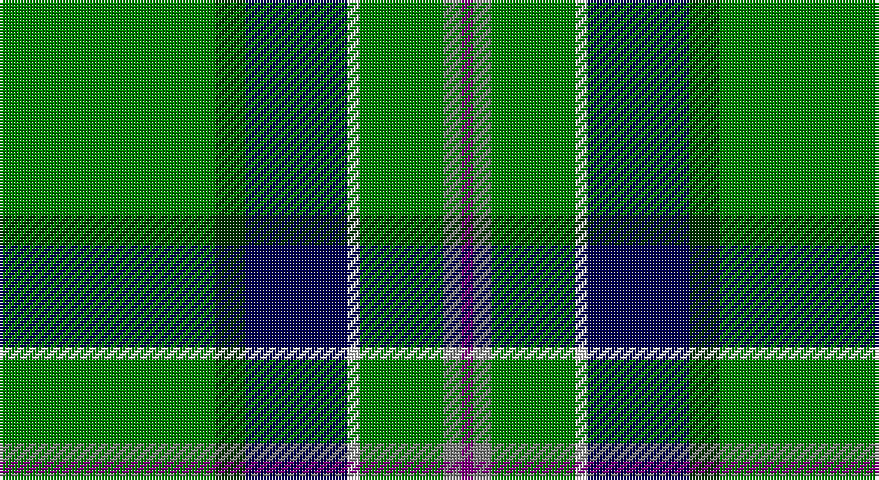

This page is one **sett** — a single exact thread-count. It belongs to the [tartan](/setts/g36dg5db17w2g14y3p2/)
(the same proportion at any scale), whose colour order is pattern [BGGWBGG](/stripes/bggwbgg/).

Sourced from weddslist.  It is a [7 stripe tartan](/stripes/stripes7/).

Original link http://www.weddslist.com/cgi-bin/tartans/pg.pl?source=sts

## Thread count
G/72 DG10 DB34 LN4 G28 N6 P/4

One full sett is **240 threads**.

## Palette

Palette: <strong>Tartan Register</strong> <small style="color:#888">(2 of 6 colours)</small>
<table><thead><tr><th>Colour</th><th>Threads</th><th>Shade</th><th>Base</th><th>OKLCh</th></tr></thead><tbody><tr><td>G/</td><td style="text-align:right;font-variant-numeric:tabular-nums">72</td><td><code style="background-color:#008000;">#008000</code> <small style="color:#888">#008000</small></td><td>G <code style="background-color:#006100;">#006100</code></td><td><small style="color:#888">oklch(52.0% 0.177 142.5)</small></td></tr><tr><td>DG</td><td style="text-align:right;font-variant-numeric:tabular-nums">10</td><td><code style="background-color:#003000;">#003000</code> <small style="color:#888">#003000</small></td><td>G <code style="background-color:#006100;">#006100</code></td><td><small style="color:#888">oklch(26.8% 0.091 142.5)</small></td></tr><tr><td>DB</td><td style="text-align:right;font-variant-numeric:tabular-nums">34</td><td><code style="background-color:#000050;">#000050</code> <small style="color:#888">#000050</small></td><td>B <code style="background-color:#2A418A;">#2A418A</code></td><td><small style="color:#888">oklch(19.5% 0.135 264.1)</small></td></tr><tr><td>LN</td><td style="text-align:right;font-variant-numeric:tabular-nums">4</td><td><code style="background-color:#E0E0E0;">#E0E0E0</code> <small style="color:#888">#E0E0E0</small></td><td>W <code style="background-color:#F7F7F7;">#F7F7F7</code></td><td><small style="color:#888">oklch(90.7% 0.000 89.9)</small></td></tr><tr><td>G</td><td style="text-align:right;font-variant-numeric:tabular-nums">28</td><td><code style="background-color:#008000;">#008000</code> <small style="color:#888">#008000</small></td><td>G <code style="background-color:#006100;">#006100</code></td><td><small style="color:#888">oklch(52.0% 0.177 142.5)</small></td></tr><tr><td>N</td><td style="text-align:right;font-variant-numeric:tabular-nums">6</td><td><code style="background-color:#808080;">#808080</code> <small style="color:#888">#808080</small></td><td>G <code style="background-color:#006100;">#006100</code></td><td><small style="color:#888">oklch(60.0% 0.000 89.9)</small></td></tr><tr><td>P/</td><td style="text-align:right;font-variant-numeric:tabular-nums">4</td><td><code style="background-color:#800080;">#800080</code> <small style="color:#888">#800080</small></td><td>B <code style="background-color:#2A418A;">#2A418A</code></td><td><small style="color:#888">oklch(42.1% 0.193 328.4)</small></td></tr></tbody></table>

# Sample pattern

## Nearest tartans

The nearest existing variants by ΔTartan distance, with this tartan at the top so the swatches line up against it.

ΔTartan

Tartan

Sett

—

<a href="/ttd/edit/#slug=g36dg5db17w2g14y3p2~x2">Mounth, The, (rejected)</a> <a class="nn-out" href="/variants/s7/g36dg5db17w2g14y3p2~x2/" title="open its dictionary page">↗</a>

1.09

<a href="/ttd/edit/#slug=k3g34b10g5r2k8dy2w3~x2&amp;base=g36dg5db17w2g14y3p2~x2">Lambert Kai (Personal)</a> <a class="nn-out" href="/variants/s8/k3g34b10g5r2k8dy2w3~x2/" title="open its dictionary page">↗</a>

1.30

<a href="/ttd/edit/#slug=g10loi3w2k2g8k22g43lo4~x2&amp;base=g36dg5db17w2g14y3p2~x2">Celtic Pride</a> <a class="nn-out" href="/variants/s8/g10loi3w2k2g8k22g43lo4~x2/" title="open its dictionary page">↗</a>

1.33

<a href="/ttd/edit/#slug=g40db2w2db2ly2db23g32r2~x2&amp;base=g36dg5db17w2g14y3p2~x2">Marshall, Fields</a> <a class="nn-out" href="/variants/s8/g40db2w2db2ly2db23g32r2~x2/" title="open its dictionary page">↗</a>

1.35

<a href="/ttd/edit/#slug=k3g2k3g18r2db2lo1~x4&amp;base=g36dg5db17w2g14y3p2~x2">Selvon-Bruce (Personal)</a> <a class="nn-out" href="/variants/s7/k3g2k3g18r2db2lo1~x4/" title="open its dictionary page">↗</a>

1.36

<a href="/ttd/edit/#slug=k17y4gi51ly3g4ly3gi51y4k17db6~x2&amp;base=g36dg5db17w2g14y3p2~x2">U.S. Army</a> <a class="nn-out" href="/variants/s10/k17y4gi51ly3g4ly3gi51y4k17db6~x2/" title="open its dictionary page">↗</a>

1.36

<a href="/ttd/edit/#slug=db6k17y4gi51ly3g4~x2&amp;base=g36dg5db17w2g14y3p2~x2">U.S. Army (Military)</a> <a class="nn-out" href="/variants/s6/db6k17y4gi51ly3g4~x2/" title="open its dictionary page">↗</a>

1.38

<a href="/ttd/edit/#slug=w1db6g4db1g16k1g4k6ly1~x4&amp;base=g36dg5db17w2g14y3p2~x2">Henderson/MacKendrick</a> <a class="nn-out" href="/variants/s9/w1db6g4db1g16k1g4k6ly1~x4/" title="open its dictionary page">↗</a>

1.38

<a href="/ttd/edit/#slug=w1db6g4db1g16k1g4k6ly1~x2&amp;base=g36dg5db17w2g14y3p2~x2">MacKendrick</a> <a class="nn-out" href="/variants/s9/w1db6g4db1g16k1g4k6ly1~x2/" title="open its dictionary page">↗</a>

1.39

<a href="/ttd/edit/#slug=g40dbi8g8lp8db5lp13k9g40r4&amp;base=g36dg5db17w2g14y3p2~x2">Vorwerk, The</a> <a class="nn-out" href="/variants/s9/g40dbi8g8lp8db5lp13k9g40r4/" title="open its dictionary page">↗</a>

1.44

<a href="/ttd/edit/#slug=k2w2db8k4g33r2g16w2~x2&amp;base=g36dg5db17w2g14y3p2~x2">Sarros (Personal) XX</a> <a class="nn-out" href="/variants/s8/k2w2db8k4g33r2g16w2~x2/" title="open its dictionary page">↗</a>

## Neighbour map

Every grey dot is one of 14360 variants placed by the first two principal components of the ΔTartan feature space (44% of its variance). Red is this tartan; blue dots are its nearest — click one to open its page.

<svg viewBox="0 0 640 380" role="img" style="max-width:100%;height:auto;border:1px solid #e0e0e0;border-radius:4px;display:block" xmlns="http://www.w3.org/2000/svg"><image href="/nn/cloud.v1.png" width="640" height="380"/><a href="/variants/s8/k3g34b10g5r2k8dy2w3~x2/"><circle cx="299.8" cy="136.0" r="4" fill="#3465a4"><title>Lambert Kai (Personal)</title></circle></a><a href="/variants/s8/g10loi3w2k2g8k22g43lo4~x2/"><circle cx="382.5" cy="151.4" r="4" fill="#3465a4"><title>Celtic Pride</title></circle></a><a href="/variants/s8/g40db2w2db2ly2db23g32r2~x2/"><circle cx="389.6" cy="148.9" r="4" fill="#3465a4"><title>Marshall, Fields</title></circle></a><a href="/variants/s7/k3g2k3g18r2db2lo1~x4/"><circle cx="378.6" cy="155.1" r="4" fill="#3465a4"><title>Selvon-Bruce (Personal)</title></circle></a><a href="/variants/s10/k17y4gi51ly3g4ly3gi51y4k17db6~x2/"><circle cx="353.8" cy="143.8" r="4" fill="#3465a4"><title>U.S. Army</title></circle></a><a href="/variants/s6/db6k17y4gi51ly3g4~x2/"><circle cx="339.3" cy="159.7" r="4" fill="#3465a4"><title>U.S. Army (Military)</title></circle></a><a href="/variants/s9/w1db6g4db1g16k1g4k6ly1~x4/"><circle cx="326.6" cy="166.2" r="4" fill="#3465a4"><title>Henderson/MacKendrick</title></circle></a><a href="/variants/s9/w1db6g4db1g16k1g4k6ly1~x2/"><circle cx="326.6" cy="166.2" r="4" fill="#3465a4"><title>MacKendrick</title></circle></a><a href="/variants/s9/g40dbi8g8lp8db5lp13k9g40r4/"><circle cx="309.0" cy="169.8" r="4" fill="#3465a4"><title>Vorwerk, The</title></circle></a><a href="/variants/s8/k2w2db8k4g33r2g16w2~x2/"><circle cx="405.8" cy="156.2" r="4" fill="#3465a4"><title>Sarros (Personal) XX</title></circle></a><circle cx="321.7" cy="150.9" r="5" fill="#c00000"/></svg>

ID: /variants/s7/g36dg5db17w2g14y3p2~x2/
