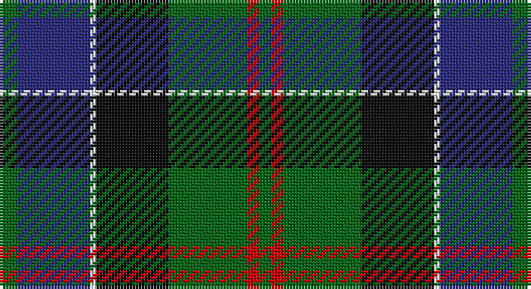

This page is one **sett** — a single exact thread-count. It belongs to the [tartan](/setts/g3db12w1k12g13r2g2/)
(the same proportion at any scale), whose colour order is pattern [GBWKGRG](/stripes/gbwkgrg/).

Part of the [Paterson](/tartans/paterson/) tartan — the named design grouping this sett with its other cloths.

Sourced from register-of-tartans.  It is a [7 stripe tartan](/stripes/stripes7/).

Original link https://www.tartanregister.gov.uk/tartanDetails.aspx?ref=3300

## Also known as

This cloth is also recorded under:

- MacFadzean, MacPhedran
- MacFadzean/MacPhedran

3 attestations — the source records this cloth was collapsed from (oldest owns this page)

<ul>
<li>01/01/1993 — Paterson (Personal) (register-of-tartans, <a href="https://www.tartanregister.gov.uk/tartanDetails.aspx?ref=3300">record</a>)</li>
<li>1993 — Paterson (Personal) (tartans-authority, <a href="http://www.tartansauthority.com/tartan-ferret/display/4174/">record</a>)</li>
<li>undated — MacFadzean, MacPhedran (weddslist, <a href="http://www.weddslist.com/cgi-bin/tartans/pg.pl?source=sts">record</a>)</li>
</ul>

## Register references

External register numbers recorded for this tartan.

- Scottish Register of Tartans: [3300](https://www.tartanregister.gov.uk/tartanDetails.aspx?ref=3300)
- Scottish Tartans Authority (ITI): 4174

## Thread count
G/6 DB24 W2 K24 G26 R4 G/4

One full sett is **170 threads**.

## Palette

Palette: <strong>Tartan Register</strong>
<table><thead><tr><th>Colour</th><th>Threads</th><th>Shade</th><th>Base</th><th>OKLCh</th></tr></thead><tbody><tr><td>G/</td><td style="text-align:right;font-variant-numeric:tabular-nums">6</td><td><code style="background-color:#006818;">#006818</code> <small style="color:#888">#006818</small></td><td>G <code style="background-color:#006100;">#006100</code></td><td><small style="color:#888">oklch(45.0% 0.142 145.0)</small></td></tr><tr><td>DB</td><td style="text-align:right;font-variant-numeric:tabular-nums">24</td><td><code style="background-color:#2C2C80;">#2C2C80</code> <small style="color:#888">#2C2C80</small></td><td>B <code style="background-color:#2A418A;">#2A418A</code></td><td><small style="color:#888">oklch(35.0% 0.138 276.6)</small></td></tr><tr><td>W</td><td style="text-align:right;font-variant-numeric:tabular-nums">2</td><td><code style="background-color:#FCFCFC;">#FCFCFC</code> <small style="color:#888">#FCFCFC</small></td><td>W <code style="background-color:#F7F7F7;">#F7F7F7</code></td><td><small style="color:#888">oklch(99.1% 0.000 89.9)</small></td></tr><tr><td>K</td><td style="text-align:right;font-variant-numeric:tabular-nums">24</td><td><code style="background-color:#101010;">#101010</code> <small style="color:#888">#101010</small></td><td>K <code style="background-color:#000000;">#000000</code></td><td><small style="color:#888">oklch(17.3% 0.000 89.9)</small></td></tr><tr><td>G</td><td style="text-align:right;font-variant-numeric:tabular-nums">26</td><td><code style="background-color:#006818;">#006818</code> <small style="color:#888">#006818</small></td><td>G <code style="background-color:#006100;">#006100</code></td><td><small style="color:#888">oklch(45.0% 0.142 145.0)</small></td></tr><tr><td>R</td><td style="text-align:right;font-variant-numeric:tabular-nums">4</td><td><code style="background-color:#C80000;">#C80000</code> <small style="color:#888">#C80000</small></td><td>R <code style="background-color:#CC0000;">#CC0000</code></td><td><small style="color:#888">oklch(52.3% 0.215 29.2)</small></td></tr><tr><td>G/</td><td style="text-align:right;font-variant-numeric:tabular-nums">4</td><td><code style="background-color:#006818;">#006818</code> <small style="color:#888">#006818</small></td><td>G <code style="background-color:#006100;">#006100</code></td><td><small style="color:#888">oklch(45.0% 0.142 145.0)</small></td></tr></tbody></table>

# Sample pattern

## Nearest tartans

The nearest existing variants by ΔTartan distance, with this tartan at the top so the swatches line up against it.

ΔTartan

Tartan

Sett

—

<a href="/ttd/edit/#slug=g3db12w1k12g13r2g2~x2">Paterson (Personal)</a> <a class="nn-out" href="/variants/s7/g3db12w1k12g13r2g2~x2/" title="open its dictionary page">↗</a>

0.56

<a href="/ttd/edit/#slug=r12db68w7k39g75r6g6&amp;base=g3db12w1k12g13r2g2~x2">Rhun (Fashion)</a> <a class="nn-out" href="/variants/s7/r12db68w7k39g75r6g6/" title="open its dictionary page">↗</a>

0.58

<a href="/ttd/edit/#slug=dg24k5dg6r6dg6k20b20w2~x2&amp;base=g3db12w1k12g13r2g2~x2">Dunfermline Bank of Scotland (Corp)</a> <a class="nn-out" href="/variants/s8/dg24k5dg6r6dg6k20b20w2~x2/" title="open its dictionary page">↗</a>

0.66

<a href="/ttd/edit/#slug=g12k1g2r1g2k10db10lo1~x4&amp;base=g3db12w1k12g13r2g2~x2">Guelph, City Of</a> <a class="nn-out" href="/variants/s8/g12k1g2r1g2k10db10lo1~x4/" title="open its dictionary page">↗</a>

0.67

<a href="/ttd/edit/#slug=r5k2db19g4k19g28k2ly5~x2&amp;base=g3db12w1k12g13r2g2~x2">Tait #1</a> <a class="nn-out" href="/variants/s8/r5k2db19g4k19g28k2ly5~x2/" title="open its dictionary page">↗</a>

0.68

<a href="/ttd/edit/#slug=dg3db12lb1k12dg13r2dg2~x2&amp;base=g3db12w1k12g13r2g2~x2">MacPhedran/MacFadzean</a> <a class="nn-out" href="/variants/s7/dg3db12lb1k12dg13r2dg2~x2/" title="open its dictionary page">↗</a>

0.68

<a href="/ttd/edit/#slug=g3db12w1k12g13r2g2~x4&amp;base=g3db12w1k12g13r2g2~x2">MacFadzean/MacPhedran</a> <a class="nn-out" href="/variants/s7/g3db12w1k12g13r2g2~x4/" title="open its dictionary page">↗</a>

0.76

<a href="/ttd/edit/#slug=r2k9g12db8r1db1w1~x4&amp;base=g3db12w1k12g13r2g2~x2">Genet, Citizen (Commem)</a> <a class="nn-out" href="/variants/s7/r2k9g12db8r1db1w1~x4/" title="open its dictionary page">↗</a>

0.76

<a href="/ttd/edit/#slug=r3g2r3g18k14w2db16g3~x2&amp;base=g3db12w1k12g13r2g2~x2">Mantle (Personal)</a> <a class="nn-out" href="/variants/s8/r3g2r3g18k14w2db16g3~x2/" title="open its dictionary page">↗</a>

0.79

<a href="/ttd/edit/#slug=dy2g12k10r1b16r2~x4&amp;base=g3db12w1k12g13r2g2~x2">MacWilliam (Clan)</a> <a class="nn-out" href="/variants/s6/dy2g12k10r1b16r2~x4/" title="open its dictionary page">↗</a>

0.80

<a href="/ttd/edit/#slug=g2b22r2k21g23ly2~x2&amp;base=g3db12w1k12g13r2g2~x2">Royal Ashburn Golf Club</a> <a class="nn-out" href="/variants/s6/g2b22r2k21g23ly2~x2/" title="open its dictionary page">↗</a>

## Neighbour map

Every grey dot is one of 14360 variants placed by the first two principal components of the ΔTartan feature space (44% of its variance). Red is this tartan; blue dots are its nearest — click one to open its page.

<svg viewBox="0 0 640 380" role="img" style="max-width:100%;height:auto;border:1px solid #e0e0e0;border-radius:4px;display:block" xmlns="http://www.w3.org/2000/svg"><image href="/nn/cloud.v1.png" width="640" height="380"/><a href="/variants/s7/r12db68w7k39g75r6g6/"><circle cx="196.7" cy="184.1" r="4" fill="#3465a4"><title>Rhun (Fashion)</title></circle></a><a href="/variants/s8/dg24k5dg6r6dg6k20b20w2~x2/"><circle cx="181.9" cy="194.6" r="4" fill="#3465a4"><title>Dunfermline Bank of Scotland (Corp)</title></circle></a><a href="/variants/s8/g12k1g2r1g2k10db10lo1~x4/"><circle cx="220.0" cy="188.6" r="4" fill="#3465a4"><title>Guelph, City Of</title></circle></a><a href="/variants/s8/r5k2db19g4k19g28k2ly5~x2/"><circle cx="184.2" cy="172.9" r="4" fill="#3465a4"><title>Tait #1</title></circle></a><a href="/variants/s7/dg3db12lb1k12dg13r2dg2~x2/"><circle cx="220.5" cy="204.2" r="4" fill="#3465a4"><title>MacPhedran/MacFadzean</title></circle></a><a href="/variants/s7/g3db12w1k12g13r2g2~x4/"><circle cx="193.7" cy="188.3" r="4" fill="#3465a4"><title>MacFadzean/MacPhedran</title></circle></a><a href="/variants/s7/r2k9g12db8r1db1w1~x4/"><circle cx="170.8" cy="184.1" r="4" fill="#3465a4"><title>Genet, Citizen (Commem)</title></circle></a><a href="/variants/s8/r3g2r3g18k14w2db16g3~x2/"><circle cx="174.5" cy="196.7" r="4" fill="#3465a4"><title>Mantle (Personal)</title></circle></a><a href="/variants/s6/dy2g12k10r1b16r2~x4/"><circle cx="193.3" cy="192.3" r="4" fill="#3465a4"><title>MacWilliam (Clan)</title></circle></a><a href="/variants/s6/g2b22r2k21g23ly2~x2/"><circle cx="175.5" cy="200.3" r="4" fill="#3465a4"><title>Royal Ashburn Golf Club</title></circle></a><circle cx="200.7" cy="195.4" r="5" fill="#c00000"/></svg>

ID: /variants/s7/g3db12w1k12g13r2g2~x2/
