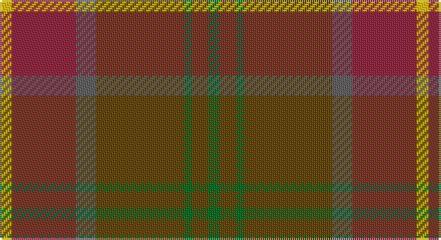

This page is one **sett** — a single exact thread-count. It belongs to the [tartan](/setts/g3dy4g2dy22n5r16ly3/)
(the same proportion at any scale), whose colour order is pattern [GGGGBRY](/stripes/ggggbry/).

Sourced from tartans-authority.  It is a [7 stripe tartan](/stripes/stripes7/).

Original link http://www.tartansauthority.com/tartan-ferret/display/10668/

## Register references

External register numbers recorded for this tartan.

- Scottish Register of Tartans: [10668](https://www.tartanregister.gov.uk/tartanDetails?ref=10668)
- Scottish Tartans Authority (ITI): 10668

## Thread count
Y/6 DR32 N10 T44 G4 T8 G/6

One full sett is **208 threads**.

## Palette

Palette: <strong>Tartan Register</strong> <small style="color:#888">(4 of 5 colours)</small>
<table><thead><tr><th>Colour</th><th>Threads</th><th>Shade</th><th>Base</th><th>OKLCh</th></tr></thead><tbody><tr><td>Y/</td><td style="text-align:right;font-variant-numeric:tabular-nums">6</td><td><code style="background-color:#E8C000;">#E8C000</code> <small style="color:#888">#E8C000</small></td><td>Y <code style="background-color:#F2BF00;">#F2BF00</code></td><td><small style="color:#888">oklch(81.9% 0.168 93.7)</small></td></tr><tr><td>DR</td><td style="text-align:right;font-variant-numeric:tabular-nums">32</td><td><code style="background-color:#901C38;">#901C38</code> <small style="color:#888">#901C38</small></td><td>R <code style="background-color:#CC0000;">#CC0000</code></td><td><small style="color:#888">oklch(43.2% 0.150 13.1)</small></td></tr><tr><td>N</td><td style="text-align:right;font-variant-numeric:tabular-nums">10</td><td><code style="background-color:#5C5C5C;">#5C5C5C</code> <small style="color:#888">#5C5C5C</small></td><td>B <code style="background-color:#2A418A;">#2A418A</code></td><td><small style="color:#888">oklch(47.5% 0.000 89.9)</small></td></tr><tr><td>T</td><td style="text-align:right;font-variant-numeric:tabular-nums">44</td><td><code style="background-color:#604000;">#604000</code> <small style="color:#888">#604000</small></td><td>G <code style="background-color:#006100;">#006100</code></td><td><small style="color:#888">oklch(39.8% 0.083 76.8)</small></td></tr><tr><td>G</td><td style="text-align:right;font-variant-numeric:tabular-nums">4</td><td><code style="background-color:#006818;">#006818</code> <small style="color:#888">#006818</small></td><td>G <code style="background-color:#006100;">#006100</code></td><td><small style="color:#888">oklch(45.0% 0.142 145.0)</small></td></tr><tr><td>T</td><td style="text-align:right;font-variant-numeric:tabular-nums">8</td><td><code style="background-color:#604000;">#604000</code> <small style="color:#888">#604000</small></td><td>G <code style="background-color:#006100;">#006100</code></td><td><small style="color:#888">oklch(39.8% 0.083 76.8)</small></td></tr><tr><td>G/</td><td style="text-align:right;font-variant-numeric:tabular-nums">6</td><td><code style="background-color:#006818;">#006818</code> <small style="color:#888">#006818</small></td><td>G <code style="background-color:#006100;">#006100</code></td><td><small style="color:#888">oklch(45.0% 0.142 145.0)</small></td></tr></tbody></table>

# Sample pattern

## Nearest tartans

The nearest existing variants by ΔTartan distance, with this tartan at the top so the swatches line up against it.

ΔTartan

Tartan

Sett

—

<a href="/ttd/edit/#slug=g3dy4g2dy22n5r16ly3~x2">Pubcrawlers (Corporate)</a> <a class="nn-out" href="/variants/s7/g3dy4g2dy22n5r16ly3~x2/" title="open its dictionary page">↗</a>

1.06

<a href="/ttd/edit/#slug=dr9o9n9r1db1o9db1r1~x4&amp;base=g3dy4g2dy22n5r16ly3~x2">Jardine, of Castlemilk</a> <a class="nn-out" href="/variants/s8/dr9o9n9r1db1o9db1r1~x4/" title="open its dictionary page">↗</a>

1.11

<a href="/ttd/edit/#slug=dy35dg19r3y8r3dg8r3t3~x2&amp;base=g3dy4g2dy22n5r16ly3~x2">John Muir Way</a> <a class="nn-out" href="/variants/s8/dy35dg19r3y8r3dg8r3t3~x2/" title="open its dictionary page">↗</a>

1.12

<a href="/ttd/edit/#slug=do6lg3do18dy2do2dy10y28r2y4~x2&amp;base=g3dy4g2dy22n5r16ly3~x2">Scottish Crofting Foundation</a> <a class="nn-out" href="/variants/s9/do6lg3do18dy2do2dy10y28r2y4~x2/" title="open its dictionary page">↗</a>

1.14

<a href="/ttd/edit/#slug=dy35dg19r3g8r3dg8r3db3~x2&amp;base=g3dy4g2dy22n5r16ly3~x2">John Muir Way</a> <a class="nn-out" href="/variants/s8/dy35dg19r3g8r3dg8r3db3~x2/" title="open its dictionary page">↗</a>

1.26

<a href="/ttd/edit/#slug=db2o22dy11ly2dy11db2~x2&amp;base=g3dy4g2dy22n5r16ly3~x2">Cetoloni Family Tartan</a> <a class="nn-out" href="/variants/s6/db2o22dy11ly2dy11db2~x2/" title="open its dictionary page">↗</a>

1.42

<a href="/ttd/edit/#slug=y25r2lb2db2lb2r13dy28db2r3~x2&amp;base=g3dy4g2dy22n5r16ly3~x2">Brousseau (Personal)</a> <a class="nn-out" href="/variants/s9/y25r2lb2db2lb2r13dy28db2r3~x2/" title="open its dictionary page">↗</a>

1.43

<a href="/ttd/edit/#slug=k3r22dgi5dg10do10dg2~x2&amp;base=g3dy4g2dy22n5r16ly3~x2">Rowardennan</a> <a class="nn-out" href="/variants/s6/k3r22dgi5dg10do10dg2~x2/" title="open its dictionary page">↗</a>

1.50

<a href="/ttd/edit/#slug=dr24g2dr5o14g2o5oi17dr2~x2&amp;base=g3dy4g2dy22n5r16ly3~x2">Loch Rannoch</a> <a class="nn-out" href="/variants/s8/dr24g2dr5o14g2o5oi17dr2~x2/" title="open its dictionary page">↗</a>

1.57

<a href="/ttd/edit/#slug=y16oi2y2o2y2oi2y2do6n10y3~x2&amp;base=g3dy4g2dy22n5r16ly3~x2">Annan (Fashion)</a> <a class="nn-out" href="/variants/s10/y16oi2y2o2y2oi2y2do6n10y3~x2/" title="open its dictionary page">↗</a>

1.58

<a href="/ttd/edit/#slug=dy11t2o4ly1oi2dt2~x4&amp;base=g3dy4g2dy22n5r16ly3~x2">Windy Meadows</a> <a class="nn-out" href="/variants/s6/dy11t2o4ly1oi2dt2~x4/" title="open its dictionary page">↗</a>

## Neighbour map

Every grey dot is one of 14360 variants placed by the first two principal components of the ΔTartan feature space (44% of its variance). Red is this tartan; blue dots are its nearest — click one to open its page.

<svg viewBox="0 0 640 380" role="img" style="max-width:100%;height:auto;border:1px solid #e0e0e0;border-radius:4px;display:block" xmlns="http://www.w3.org/2000/svg"><image href="/nn/cloud.v1.png" width="640" height="380"/><a href="/variants/s8/dr9o9n9r1db1o9db1r1~x4/"><circle cx="291.7" cy="234.2" r="4" fill="#3465a4"><title>Jardine, of Castlemilk</title></circle></a><a href="/variants/s8/dy35dg19r3y8r3dg8r3t3~x2/"><circle cx="301.9" cy="206.3" r="4" fill="#3465a4"><title>John Muir Way</title></circle></a><a href="/variants/s9/do6lg3do18dy2do2dy10y28r2y4~x2/"><circle cx="309.6" cy="194.6" r="4" fill="#3465a4"><title>Scottish Crofting Foundation</title></circle></a><a href="/variants/s8/dy35dg19r3g8r3dg8r3db3~x2/"><circle cx="300.3" cy="205.9" r="4" fill="#3465a4"><title>John Muir Way</title></circle></a><a href="/variants/s6/db2o22dy11ly2dy11db2~x2/"><circle cx="357.3" cy="243.2" r="4" fill="#3465a4"><title>Cetoloni Family Tartan</title></circle></a><a href="/variants/s9/y25r2lb2db2lb2r13dy28db2r3~x2/"><circle cx="269.3" cy="172.9" r="4" fill="#3465a4"><title>Brousseau (Personal)</title></circle></a><a href="/variants/s6/k3r22dgi5dg10do10dg2~x2/"><circle cx="297.1" cy="247.7" r="4" fill="#3465a4"><title>Rowardennan</title></circle></a><a href="/variants/s8/dr24g2dr5o14g2o5oi17dr2~x2/"><circle cx="292.2" cy="213.0" r="4" fill="#3465a4"><title>Loch Rannoch</title></circle></a><a href="/variants/s10/y16oi2y2o2y2oi2y2do6n10y3~x2/"><circle cx="348.0" cy="222.7" r="4" fill="#3465a4"><title>Annan (Fashion)</title></circle></a><a href="/variants/s6/dy11t2o4ly1oi2dt2~x4/"><circle cx="276.8" cy="189.8" r="4" fill="#3465a4"><title>Windy Meadows</title></circle></a><circle cx="316.8" cy="215.8" r="5" fill="#c00000"/></svg>

ID: /variants/s7/g3dy4g2dy22n5r16ly3~x2/
