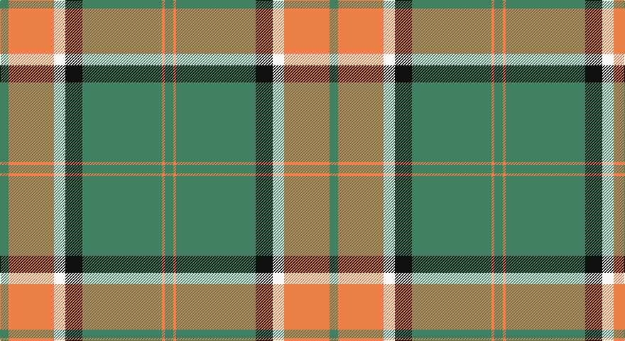

This page is one **sett** — a single exact thread-count. It belongs to the [tartan](/setts/g3lo16w4k6g28lo1g3/)
(the same proportion at any scale), whose colour order is pattern [GYGKWYG](/stripes/gygkwyg/).

Part of the [Pollock](/tartans/pollock/) tartan — the named design grouping this sett with its other cloths.

Sourced from register-of-tartans.  It is a [7 stripe tartan](/stripes/stripes7/).

Original link https://www.tartanregister.gov.uk/tartanDetails.aspx?ref=3352

## Register references

External register numbers recorded for this tartan.

- Scottish Register of Tartans: [3352](https://www.tartanregister.gov.uk/tartanDetails.aspx?ref=3352)
- Scottish Tartans Authority (ITI): 867
- Scottish Tartans World Register: 867

## Thread count
G/12 O64 W16 K24 G112 O4 G/12

One full sett is **464 threads**.

## Palette

Palette: <strong>Tartan Register</strong>
<table><thead><tr><th>Colour</th><th>Threads</th><th>Shade</th><th>Base</th><th>OKLCh</th></tr></thead><tbody><tr><td>G/</td><td style="text-align:right;font-variant-numeric:tabular-nums">12</td><td><code style="background-color:#408060;">#408060</code> <small style="color:#888">#408060</small></td><td>G <code style="background-color:#006100;">#006100</code></td><td><small style="color:#888">oklch(54.8% 0.084 160.1)</small></td></tr><tr><td>O</td><td style="text-align:right;font-variant-numeric:tabular-nums">64</td><td><code style="background-color:#EC8048;">#EC8048</code> <small style="color:#888">#EC8048</small></td><td>Y <code style="background-color:#F2BF00;">#F2BF00</code></td><td><small style="color:#888">oklch(71.0% 0.150 46.4)</small></td></tr><tr><td>W</td><td style="text-align:right;font-variant-numeric:tabular-nums">16</td><td><code style="background-color:#F8F8F8;">#F8F8F8</code> <small style="color:#888">#F8F8F8</small></td><td>W <code style="background-color:#F7F7F7;">#F7F7F7</code></td><td><small style="color:#888">oklch(97.9% 0.000 89.9)</small></td></tr><tr><td>K</td><td style="text-align:right;font-variant-numeric:tabular-nums">24</td><td><code style="background-color:#101010;">#101010</code> <small style="color:#888">#101010</small></td><td>K <code style="background-color:#000000;">#000000</code></td><td><small style="color:#888">oklch(17.3% 0.000 89.9)</small></td></tr><tr><td>G</td><td style="text-align:right;font-variant-numeric:tabular-nums">112</td><td><code style="background-color:#408060;">#408060</code> <small style="color:#888">#408060</small></td><td>G <code style="background-color:#006100;">#006100</code></td><td><small style="color:#888">oklch(54.8% 0.084 160.1)</small></td></tr><tr><td>O</td><td style="text-align:right;font-variant-numeric:tabular-nums">4</td><td><code style="background-color:#EC8048;">#EC8048</code> <small style="color:#888">#EC8048</small></td><td>Y <code style="background-color:#F2BF00;">#F2BF00</code></td><td><small style="color:#888">oklch(71.0% 0.150 46.4)</small></td></tr><tr><td>G/</td><td style="text-align:right;font-variant-numeric:tabular-nums">12</td><td><code style="background-color:#408060;">#408060</code> <small style="color:#888">#408060</small></td><td>G <code style="background-color:#006100;">#006100</code></td><td><small style="color:#888">oklch(54.8% 0.084 160.1)</small></td></tr></tbody></table>

# Sample pattern

## Nearest tartans

The nearest existing variants by ΔTartan distance, with this tartan at the top so the swatches line up against it.

ΔTartan

Tartan

Sett

—

<a href="/ttd/edit/#slug=g3lo16w4k6g28lo1g3~x4">Pollock</a> <a class="nn-out" href="/variants/s7/g3lo16w4k6g28lo1g3~x4/" title="open its dictionary page">↗</a>

0.98

<a href="/ttd/edit/#slug=g6lo2g32k8w6lo20g5~x2&amp;base=g3lo16w4k6g28lo1g3~x4">Pollock (Name)</a> <a class="nn-out" href="/variants/s7/g6lo2g32k8w6lo20g5~x2/" title="open its dictionary page">↗</a>

1.28

<a href="/ttd/edit/#slug=r2lb10k15lo36lb2k2lb2~x2&amp;base=g3lo16w4k6g28lo1g3~x4">Unidentified (ex Tony Murray)</a> <a class="nn-out" href="/variants/s7/r2lb10k15lo36lb2k2lb2~x2/" title="open its dictionary page">↗</a>

1.30

<a href="/ttd/edit/#slug=g26r5k1r2k1r5g16r5w16g2w8~x2&amp;base=g3lo16w4k6g28lo1g3~x4">Livingston (Personal)</a> <a class="nn-out" href="/variants/s11/g26r5k1r2k1r5g16r5w16g2w8~x2/" title="open its dictionary page">↗</a>

1.34

<a href="/ttd/edit/#slug=g68r24g8lo18g3lo18~x2&amp;base=g3lo16w4k6g28lo1g3~x4">MacMillan/Isetan</a> <a class="nn-out" href="/variants/s6/g68r24g8lo18g3lo18~x2/" title="open its dictionary page">↗</a>

1.34

<a href="/ttd/edit/#slug=r1lb5k8o18lb1k1lb1~x4&amp;base=g3lo16w4k6g28lo1g3~x4">Merrick, Camel</a> <a class="nn-out" href="/variants/s7/r1lb5k8o18lb1k1lb1~x4/" title="open its dictionary page">↗</a>

1.36

<a href="/ttd/edit/#slug=dt4lo21dt1lo21y8db4y5db4y4dt4&amp;base=g3lo16w4k6g28lo1g3~x4">Rice (Welsh Name)</a> <a class="nn-out" href="/variants/s10/dt4lo21dt1lo21y8db4y5db4y4dt4/" title="open its dictionary page">↗</a>

1.37

<a href="/ttd/edit/#slug=g3r16w4k6g28r1g3~x2&amp;base=g3lo16w4k6g28lo1g3~x4">Pollock</a> <a class="nn-out" href="/variants/s7/g3r16w4k6g28r1g3~x2/" title="open its dictionary page">↗</a>

1.42

<a href="/ttd/edit/#slug=lo72dt16w9dt4w5dt16~x2&amp;base=g3lo16w4k6g28lo1g3~x4">Machair</a> <a class="nn-out" href="/variants/s6/lo72dt16w9dt4w5dt16~x2/" title="open its dictionary page">↗</a>

1.42

<a href="/ttd/edit/#slug=o4g2o7dt30o8dt7lg5g1w2~x2&amp;base=g3lo16w4k6g28lo1g3~x4">Inchforth (Personal)</a> <a class="nn-out" href="/variants/s9/o4g2o7dt30o8dt7lg5g1w2~x2/" title="open its dictionary page">↗</a>

1.43

<a href="/ttd/edit/#slug=w2do30lo10w1lo10do1y10do1~x4&amp;base=g3lo16w4k6g28lo1g3~x4">Evergreen</a> <a class="nn-out" href="/variants/s8/w2do30lo10w1lo10do1y10do1~x4/" title="open its dictionary page">↗</a>

## Neighbour map

Every grey dot is one of 14360 variants placed by the first two principal components of the ΔTartan feature space (44% of its variance). Red is this tartan; blue dots are its nearest — click one to open its page.

<svg viewBox="0 0 640 380" role="img" style="max-width:100%;height:auto;border:1px solid #e0e0e0;border-radius:4px;display:block" xmlns="http://www.w3.org/2000/svg"><image href="/nn/cloud.v1.png" width="640" height="380"/><a href="/variants/s7/g6lo2g32k8w6lo20g5~x2/"><circle cx="293.0" cy="174.7" r="4" fill="#3465a4"><title>Pollock (Name)</title></circle></a><a href="/variants/s7/r2lb10k15lo36lb2k2lb2~x2/"><circle cx="291.2" cy="138.2" r="4" fill="#3465a4"><title>Unidentified (ex Tony Murray)</title></circle></a><a href="/variants/s11/g26r5k1r2k1r5g16r5w16g2w8~x2/"><circle cx="271.4" cy="123.6" r="4" fill="#3465a4"><title>Livingston (Personal)</title></circle></a><a href="/variants/s6/g68r24g8lo18g3lo18~x2/"><circle cx="367.0" cy="192.8" r="4" fill="#3465a4"><title>MacMillan/Isetan</title></circle></a><a href="/variants/s7/r1lb5k8o18lb1k1lb1~x4/"><circle cx="294.4" cy="143.3" r="4" fill="#3465a4"><title>Merrick, Camel</title></circle></a><a href="/variants/s10/dt4lo21dt1lo21y8db4y5db4y4dt4/"><circle cx="323.0" cy="160.4" r="4" fill="#3465a4"><title>Rice (Welsh Name)</title></circle></a><a href="/variants/s7/g3r16w4k6g28r1g3~x2/"><circle cx="321.3" cy="141.9" r="4" fill="#3465a4"><title>Pollock</title></circle></a><a href="/variants/s6/lo72dt16w9dt4w5dt16~x2/"><circle cx="381.1" cy="179.0" r="4" fill="#3465a4"><title>Machair</title></circle></a><a href="/variants/s9/o4g2o7dt30o8dt7lg5g1w2~x2/"><circle cx="333.0" cy="120.4" r="4" fill="#3465a4"><title>Inchforth (Personal)</title></circle></a><a href="/variants/s8/w2do30lo10w1lo10do1y10do1~x4/"><circle cx="336.9" cy="147.4" r="4" fill="#3465a4"><title>Evergreen</title></circle></a><circle cx="336.5" cy="145.3" r="5" fill="#c00000"/></svg>

ID: /variants/s7/g3lo16w4k6g28lo1g3~x4/
