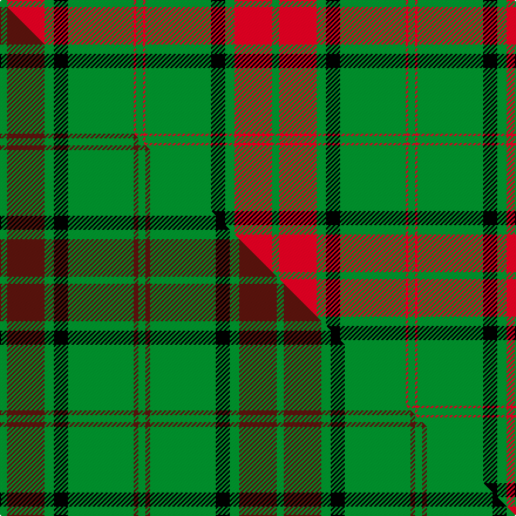

This is one **variant** — a specific cloth: this exact thread count and colourway, with its own
provenance below. It is one weaving of the [sett](/setts/g3r16g4k6g28r1g3/) (the scale-free proportion — the
same cloth at any scale or shade), whose colour order is pattern [GRGKGRG](/stripes/grgkgrg/).

Part of the [Maxwell Hunting](/tartans/m/ma/maxwell-hunting/) tartan — the named design grouping this sett with its other cloths.

Sourced from weddslist.  It is a [7 stripe tartan](/stripes/stripes7/).

Original link [http://www.weddslist.com/cgi-bin/tartans/pg.pl?source=sts](http://www.weddslist.com/cgi-bin/tartans/pg.pl?source=sts)

## Provenance

Earliest known date: 0 Tartans of the Lowland families were not named until the publication the 'Vestiarium Scoticum' in 1842. The authors, the Sobieski Stuart brothers, enjoyed a popular following amongst the Scottish gentry in the early Victorian era, and in the spirit of the times, added mystery, romance and some spurious historical documentation to the subject of tartans. The Maxwells have, nevertheless, a tartan of at least 150 years antiquity, probably designed by persons of great imagination and flair. The Maxwells come from Glasgow and the S.W. of Scotland.

2 attestations — the source records this cloth was collapsed from (oldest owns this page)

<ul>
<li>undated — Maxwell, hunting (weddslist, <a href="http://www.weddslist.com/cgi-bin/tartans/pg.pl?source=sts">record</a>) </li>
<li>undated — Maxwell Hunting Clan Tartan (house-of-tartan, <a href="http://www.house-of-tartan.scotland.net/house/TartanViewjs.asp?colr=Def&tnam=865">record</a>) </li>
</ul>

Dataset <small>— provenance for this record, inherited from the source manifest</small>

<dl class="dataset-prov">
<dt>source</dt><dd><a href="/sources/weddslist/">Weddslist</a></dd>
<dt>data captured from</dt><dd><a href="https://github.com/thetartan/tartan-database/blob/master/data/weddslist/data.csv">https://github.com/thetartan/tartan-database/blob/master/data/weddslist/data.csv</a></dd>
<dt>data date</dt><dd>2016-11-17 <small>(dataset default)</small></dd>
<dt>licence</dt><dd><a href="https://creativecommons.org/licenses/by-nc-nd/4.0/">CC BY-NC-ND 4.0</a></dd>
</dl>

Capture chain <small>— the hands this data passed through, oldest first; each capture carries its own licence</small>

<ol class="capture-chain">
<li><a href="https://www.weddslist.com/tartans/">Weddslist</a> <small>the living privately compiled reference</small></li>
<li><a href="https://github.com/thetartan/tartan-database">thetartan/tartan-database</a> <small>2016-2017</small> · <a href="https://creativecommons.org/licenses/by-nc-nd/4.0/">CC BY-NC-ND 4.0</a> <small>Levko Kravets's frozen compilation — the capture we vendored, and where its CC licence text came from</small></li>
<li>this dictionary <small>captured 2026-06-10 · commit 5bf86c7566</small> <small>each re-capture is a git commit to data/sources</small></li>
</ol>

## Thread count
G/6 R32 G8 K12 G56 R2 G/6

One full sett is **232 threads**.

## Palette
<table><thead><tr><th>Colour</th><th>Shade</th><th>OKLCh</th></tr></thead><tbody><tr><td>G</td><td><code style="background-color:#008B2A;">#008B2A</code> <small style="color:#888">#008B2A</small></td><td><small style="color:#888">oklch(55.4% 0.170 145.9)</small></td></tr><tr><td>K</td><td><code style="background-color:#000000;">#000000</code> <small style="color:#888">#000000</small></td><td><small style="color:#888">oklch(0.0% 0.000 0.0)</small></td></tr><tr><td>R</td><td><code style="background-color:#D60020;">#D60020</code> <small style="color:#888">#D60020</small></td><td><small style="color:#888">oklch(55.2% 0.224 25.5)</small></td></tr></tbody></table>

# Sample pattern

## Compared to the master

This cloth is one sett of its design; the master sett (the exemplar the design is anchored on) is below for comparison.

Its **ΔTartan distance** from the master is **0.58** — the same measure the nearest-tartans table ranks by (0 is identical; a re-scale of the same cloth is near 0, a recolour or a different proportion further).

<figure class="master-compare" style="margin:0">

this sett
master sett ★

<figcaption style="color:#888;font-size:smaller">One weave of this sett against the <a href="/setts/g3dr16g4k6g28dr2g3/">master sett ★</a>, split on the diagonal: a shared proportion runs seamlessly across it with only the shades shifting; a different proportion breaks on it.</figcaption>
</figure>

## Nearest tartan variants

The nearest existing variants by ΔTartan distance, with this cloth at the top so the swatches line up against it.

ΔTartan

Threads

Variant

Sett

—

232

<a href="/variants/s7/g3r16g4k6g28r1g3~x2/">Maxwell, hunting</a>

<a href="/ttd/edit/#slug=g3dr16g4k6g28dr2g3~x2&amp;base=g3r16g4k6g28r1g3~x2" title="compare in the TTD">0.58</a>

236

<a href="/variants/s7/g3dr16g4k6g28dr2g3~x2/">Maxwell Htg (Clan)</a>

<a href="/ttd/edit/#slug=g24r4g3k14g5r2g10~x2&amp;base=g3r16g4k6g28r1g3~x2" title="compare in the TTD">0.96</a>

180

<a href="/variants/s7/g24r4g3k14g5r2g10~x2/">Northcroft (Personal)</a>

<a href="/ttd/edit/#slug=g3r16w4k6g28r1g3~x2&amp;base=g3r16g4k6g28r1g3~x2" title="compare in the TTD">1.06</a>

232

<a href="/variants/s7/g3r16w4k6g28r1g3~x2/">Pollock Clan Tartan</a>

<a href="/ttd/edit/#slug=r30g3db5g21r3g21db2~x2&amp;base=g3r16g4k6g28r1g3~x2" title="compare in the TTD">2.04</a>

276

<a href="/variants/s7/r30g3db5g21r3g21db2~x2/">Scottish Piping Soc. of London (Corp</a>

<a href="/ttd/edit/#slug=g3w1g12r6g3k3g2~x4&amp;base=g3r16g4k6g28r1g3~x2" title="compare in the TTD">2.08</a>

220

<a href="/variants/s7/g3w1g12r6g3k3g2~x4/">Arkansas (Fashion)</a>

<a href="/ttd/edit/#slug=dg3w1dg12r6dg3k3dg2~x4~dg1806142&amp;base=g3r16g4k6g28r1g3~x2" title="compare in the TTD">2.08</a>

220

<a href="/variants/s7/dg3w1dg12r6dg3k3dg2~x4~dg1806142/">Arkansas</a>

<a href="/ttd/edit/#slug=g13k1g13r1g1k1g1k1r13k1y1k1~x3&amp;base=g3r16g4k6g28r1g3~x2" title="compare in the TTD">2.13</a>

246

<a href="/variants/s12/g13k1g13r1g1k1g1k1r13k1y1k1~x3/">Ulster Red Irish District Tartan</a>

<a href="/ttd/edit/#slug=g32r12g6r6k2w3~x2&amp;base=g3r16g4k6g28r1g3~x2" title="compare in the TTD">2.87</a>

174

<a href="/variants/s6/g32r12g6r6k2w3~x2/">Princess Margaret Rose (Royal)</a>

<a href="/ttd/edit/#slug=dg5r3dg3ly2dg1lyi8dg24ly2~x2~ly2705081-lyi3104101&amp;base=g3r16g4k6g28r1g3~x2" title="compare in the TTD">2.90</a>

178

<a href="/variants/s8/dg5r3dg3ly2dg1lyi8dg24ly2~x2~ly2705081-lyi3104101/">St. Christopher (Corporate)</a>

<a href="/ttd/edit/#slug=g36r18g4r6k1w2~x2&amp;base=g3r16g4k6g28r1g3~x2" title="compare in the TTD">2.92</a>

192

<a href="/variants/s6/g36r18g4r6k1w2~x2/">Princess Margaret Rose Tartan</a>

## Neighbour map

Every grey dot is one of 13621 variants placed by the first two principal components of the ΔTartan feature space (42% of its variance). Red is this tartan; blue dots are its nearest — click one to open its page.

<svg viewBox="0 0 640 380" role="img" style="max-width:100%;height:auto;border:1px solid #e0e0e0;border-radius:4px;display:block" xmlns="http://www.w3.org/2000/svg"><image href="/nn/cloud.v1.png" width="640" height="380"/><a href="/variants/s7/g3dr16g4k6g28dr2g3~x2/"><circle cx="349.8" cy="184.0" r="4" fill="#3465a4"><title>Maxwell Htg (Clan)</title></circle></a><a href="/variants/s7/g24r4g3k14g5r2g10~x2/"><circle cx="341.1" cy="195.0" r="4" fill="#3465a4"><title>Northcroft (Personal)</title></circle></a><a href="/variants/s7/g3r16w4k6g28r1g3~x2/"><circle cx="296.2" cy="133.8" r="4" fill="#3465a4"><title>Pollock Clan Tartan</title></circle></a><a href="/variants/s7/r30g3db5g21r3g21db2~x2/"><circle cx="349.7" cy="207.8" r="4" fill="#3465a4"><title>Scottish Piping Soc. of London (Corp</title></circle></a><a href="/variants/s7/g3w1g12r6g3k3g2~x4/"><circle cx="325.0" cy="186.2" r="4" fill="#3465a4"><title>Arkansas (Fashion)</title></circle></a><a href="/variants/s7/dg3w1dg12r6dg3k3dg2~x4~dg1806142/"><circle cx="334.3" cy="186.5" r="4" fill="#3465a4"><title>Arkansas</title></circle></a><a href="/variants/s12/g13k1g13r1g1k1g1k1r13k1y1k1~x3/"><circle cx="299.6" cy="125.6" r="4" fill="#3465a4"><title>Ulster Red Irish District Tartan</title></circle></a><a href="/variants/s6/g32r12g6r6k2w3~x2/"><circle cx="346.3" cy="167.4" r="4" fill="#3465a4"><title>Princess Margaret Rose (Royal)</title></circle></a><a href="/variants/s8/dg5r3dg3ly2dg1lyi8dg24ly2~x2~ly2705081-lyi3104101/"><circle cx="413.9" cy="143.5" r="4" fill="#3465a4"><title>St. Christopher (Corporate)</title></circle></a><a href="/variants/s6/g36r18g4r6k1w2~x2/"><circle cx="385.0" cy="133.5" r="4" fill="#3465a4"><title>Princess Margaret Rose Tartan</title></circle></a><circle cx="369.0" cy="150.2" r="5" fill="#c00000"/><text x="320" y="376" text-anchor="middle" font-size="11" fill="#999">ground</text><text x="11" y="190" text-anchor="middle" font-size="11" fill="#999" transform="rotate(-90 11 190)">complexity</text></svg>

ID: /variants/s7/g3r16g4k6g28r1g3~x2/
