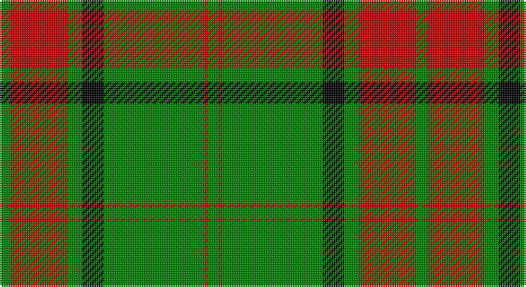

This page is one **sett** — a single exact thread-count. It belongs to the [tartan](/setts/g3r16g4k6g28r1g3/)
(the same proportion at any scale), whose colour order is pattern [GRGKGRG](/stripes/grgkgrg/).

Part of the [Maxwell Hunting](/tartans/maxwell-hunting/) tartan — the named design grouping this sett with its other cloths.

Sourced from weddslist.  It is a [7 stripe tartan](/stripes/stripes7/).

Original link http://www.weddslist.com/cgi-bin/tartans/pg.pl?source=sts

## Provenance

Earliest known date: 0 Tartans of the Lowland families were not named until the publication the 'Vestiarium Scoticum' in 1842. The authors, the Sobieski Stuart brothers, enjoyed a popular following amongst the Scottish gentry in the early Victorian era, and in the spirit of the times, added mystery, romance and some spurious historical documentation to the subject of tartans. The Maxwells have, nevertheless, a tartan of at least 150 years antiquity, probably designed by persons of great imagination and flair. The Maxwells come from Glasgow and the S.W. of Scotland.

## Also known as

This cloth is also recorded under:

- Maxwell Htg
- Maxwell, hunting

2 attestations — the source records this cloth was collapsed from (oldest owns this page)

<ul>
<li>undated — Maxwell, hunting (weddslist, <a href="http://www.weddslist.com/cgi-bin/tartans/pg.pl?source=sts">record</a>)</li>
<li>undated — Maxwell Hunting Clan Tartan (house-of-tartan, <a href="http://www.house-of-tartan.scotland.net/house/TartanViewjs.asp?colr=Def&tnam=865">record</a>)</li>
</ul>

## Thread count
G/6 R32 G8 K12 G56 R2 G/6

One full sett is **232 threads**.

## Palette

Palette: <strong>Ingles Buchan</strong> <small style="color:#888">(1 of 3 colours)</small>
<table><thead><tr><th>Colour</th><th>Threads</th><th>Shade</th><th>Base</th><th>OKLCh</th></tr></thead><tbody><tr><td>G/</td><td style="text-align:right;font-variant-numeric:tabular-nums">6</td><td><code style="background-color:#008000;">#008000</code> <small style="color:#888">#008000</small></td><td>G <code style="background-color:#006100;">#006100</code></td><td><small style="color:#888">oklch(52.0% 0.177 142.5)</small></td></tr><tr><td>R</td><td style="text-align:right;font-variant-numeric:tabular-nums">32</td><td><code style="background-color:#C00000;">#C00000</code> <small style="color:#888">#C00000</small></td><td>R <code style="background-color:#CC0000;">#CC0000</code></td><td><small style="color:#888">oklch(50.7% 0.208 29.2)</small></td></tr><tr><td>G</td><td style="text-align:right;font-variant-numeric:tabular-nums">8</td><td><code style="background-color:#008000;">#008000</code> <small style="color:#888">#008000</small></td><td>G <code style="background-color:#006100;">#006100</code></td><td><small style="color:#888">oklch(52.0% 0.177 142.5)</small></td></tr><tr><td>K</td><td style="text-align:right;font-variant-numeric:tabular-nums">12</td><td><code style="background-color:#000000;">#000000</code> <small style="color:#888">#000000</small></td><td>K <code style="background-color:#000000;">#000000</code></td><td><small style="color:#888">oklch(0.0% 0.000 0.0)</small></td></tr><tr><td>G</td><td style="text-align:right;font-variant-numeric:tabular-nums">56</td><td><code style="background-color:#008000;">#008000</code> <small style="color:#888">#008000</small></td><td>G <code style="background-color:#006100;">#006100</code></td><td><small style="color:#888">oklch(52.0% 0.177 142.5)</small></td></tr><tr><td>R</td><td style="text-align:right;font-variant-numeric:tabular-nums">2</td><td><code style="background-color:#C00000;">#C00000</code> <small style="color:#888">#C00000</small></td><td>R <code style="background-color:#CC0000;">#CC0000</code></td><td><small style="color:#888">oklch(50.7% 0.208 29.2)</small></td></tr><tr><td>G/</td><td style="text-align:right;font-variant-numeric:tabular-nums">6</td><td><code style="background-color:#008000;">#008000</code> <small style="color:#888">#008000</small></td><td>G <code style="background-color:#006100;">#006100</code></td><td><small style="color:#888">oklch(52.0% 0.177 142.5)</small></td></tr></tbody></table>

# Sample pattern

## Compared to the master

This cloth is one sett of its design; the master sett (the exemplar the design is anchored on) is below for comparison.

<figure style="margin:0"><figcaption style="color:#888;font-size:smaller">this sett</figcaption></figure>
<figure style="margin:0"><figcaption style="color:#888;font-size:smaller"><a href="/setts/g3r16g4k6g28r2g3/">master sett →</a></figcaption></figure>

## Nearest tartans

The nearest existing variants by ΔTartan distance, with this tartan at the top so the swatches line up against it.

ΔTartan

Tartan

Sett

—

<a href="/ttd/edit/#slug=g3r16g4k6g28r1g3~x2">Maxwell, hunting</a> <a class="nn-out" href="/variants/s7/g3r16g4k6g28r1g3~x2/" title="open its dictionary page">↗</a>

1.29

<a href="/ttd/edit/#slug=g3r16w4k6g28r1g3~x2&amp;base=g3r16g4k6g28r1g3~x2">Pollock</a> <a class="nn-out" href="/variants/s7/g3r16w4k6g28r1g3~x2/" title="open its dictionary page">↗</a>

1.47

<a href="/ttd/edit/#slug=g4r16g4r2g3r2g32w1g1w2~x2&amp;base=g3r16g4k6g28r1g3~x2">Rothesay #2</a> <a class="nn-out" href="/variants/s10/g4r16g4r2g3r2g32w1g1w2~x2/" title="open its dictionary page">↗</a>

1.50

<a href="/ttd/edit/#slug=g68r24g8lo18g3lo18~x2&amp;base=g3r16g4k6g28r1g3~x2">MacMillan/Isetan</a> <a class="nn-out" href="/variants/s6/g68r24g8lo18g3lo18~x2/" title="open its dictionary page">↗</a>

1.52

<a href="/ttd/edit/#slug=r8g12w5k11g42k3~x2&amp;base=g3r16g4k6g28r1g3~x2">Sir Billi (Corporate)</a> <a class="nn-out" href="/variants/s6/r8g12w5k11g42k3~x2/" title="open its dictionary page">↗</a>

1.54

<a href="/ttd/edit/#slug=g36r18g4r6k1w2~x2&amp;base=g3r16g4k6g28r1g3~x2">Princess Margaret Rose Tartan</a> <a class="nn-out" href="/variants/s6/g36r18g4r6k1w2~x2/" title="open its dictionary page">↗</a>

1.56

<a href="/ttd/edit/#slug=dg11lo1dg1lo6k1lo1~x4&amp;base=g3r16g4k6g28r1g3~x2">Big Spruce Brewing</a> <a class="nn-out" href="/variants/s6/dg11lo1dg1lo6k1lo1~x4/" title="open its dictionary page">↗</a>

1.62

<a href="/ttd/edit/#slug=dg5r3dg3lo2dg1ly8dg24lo2~x2&amp;base=g3r16g4k6g28r1g3~x2">St. Christopher (Corporate)</a> <a class="nn-out" href="/variants/s8/dg5r3dg3lo2dg1ly8dg24lo2~x2/" title="open its dictionary page">↗</a>

1.63

<a href="/ttd/edit/#slug=dg4r16dg4r2dg3r2dg32w2dg2w3~x2&amp;base=g3r16g4k6g28r1g3~x2">Rothesay Hunting Family Tartan</a> <a class="nn-out" href="/variants/s10/dg4r16dg4r2dg3r2dg32w2dg2w3~x2/" title="open its dictionary page">↗</a>

1.63

<a href="/ttd/edit/#slug=dg3r6dg2r1dg2r1dg16w1dg2w3~x4&amp;base=g3r16g4k6g28r1g3~x2">Prince of Wales (Fashion)</a> <a class="nn-out" href="/variants/s10/dg3r6dg2r1dg2r1dg16w1dg2w3~x4/" title="open its dictionary page">↗</a>

1.71

<a href="/ttd/edit/#slug=dg11ly1dg1ly6k1ly1~x8&amp;base=g3r16g4k6g28r1g3~x2">Big Spruce Brewing</a> <a class="nn-out" href="/variants/s6/dg11ly1dg1ly6k1ly1~x8/" title="open its dictionary page">↗</a>

## Neighbour map

Every grey dot is one of 14360 variants placed by the first two principal components of the ΔTartan feature space (44% of its variance). Red is this tartan; blue dots are its nearest — click one to open its page.

<svg viewBox="0 0 640 380" role="img" style="max-width:100%;height:auto;border:1px solid #e0e0e0;border-radius:4px;display:block" xmlns="http://www.w3.org/2000/svg"><image href="/nn/cloud.v1.png" width="640" height="380"/><a href="/variants/s7/g3r16w4k6g28r1g3~x2/"><circle cx="321.3" cy="141.9" r="4" fill="#3465a4"><title>Pollock</title></circle></a><a href="/variants/s10/g4r16g4r2g3r2g32w1g1w2~x2/"><circle cx="462.1" cy="133.5" r="4" fill="#3465a4"><title>Rothesay #2</title></circle></a><a href="/variants/s6/g68r24g8lo18g3lo18~x2/"><circle cx="367.0" cy="192.8" r="4" fill="#3465a4"><title>MacMillan/Isetan</title></circle></a><a href="/variants/s6/r8g12w5k11g42k3~x2/"><circle cx="372.8" cy="192.4" r="4" fill="#3465a4"><title>Sir Billi (Corporate)</title></circle></a><a href="/variants/s6/g36r18g4r6k1w2~x2/"><circle cx="421.0" cy="152.3" r="4" fill="#3465a4"><title>Princess Margaret Rose Tartan</title></circle></a><a href="/variants/s6/dg11lo1dg1lo6k1lo1~x4/"><circle cx="350.7" cy="201.7" r="4" fill="#3465a4"><title>Big Spruce Brewing</title></circle></a><a href="/variants/s8/dg5r3dg3lo2dg1ly8dg24lo2~x2/"><circle cx="441.4" cy="158.5" r="4" fill="#3465a4"><title>St. Christopher (Corporate)</title></circle></a><a href="/variants/s10/dg4r16dg4r2dg3r2dg32w2dg2w3~x2/"><circle cx="413.0" cy="158.2" r="4" fill="#3465a4"><title>Rothesay Hunting Family Tartan</title></circle></a><a href="/variants/s10/dg3r6dg2r1dg2r1dg16w1dg2w3~x4/"><circle cx="416.2" cy="166.9" r="4" fill="#3465a4"><title>Prince of Wales (Fashion)</title></circle></a><a href="/variants/s6/dg11ly1dg1ly6k1ly1~x8/"><circle cx="329.2" cy="192.7" r="4" fill="#3465a4"><title>Big Spruce Brewing</title></circle></a><circle cx="396.9" cy="167.0" r="5" fill="#c00000"/></svg>

ID: /variants/s7/g3r16g4k6g28r1g3~x2/
