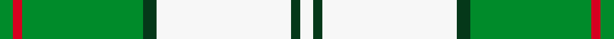

This page is one **sett** — a single exact thread-count. It belongs to the [tartan](/setts/g3r2g27dg3w30dg2w3/)
(the same proportion at any scale), whose colour order is pattern [GRGGWGW](/stripes/grggwgw/).

Sourced from tartans-authority.  It is a [7 stripe tartan](/stripes/stripes7/).

Original link http://www.tartansauthority.com/tartan-ferret/display/7602/

## Provenance

Earliest known date: March 2008 One of a series of dancer's tartans for the House of Edgar's in-house collection designed by Kirsty Anderson.

3 attestations — the source records this cloth was collapsed from (oldest owns this page)

<ul>
<li>March 2008 — Uist, Green (Dance) (tartans-authority, <a href="http://www.tartansauthority.com/tartan-ferret/display/7602/">record</a>)  <em>One of a series of dancer's tartans for the House of Edgar's in-house collection designed by Kirsty Anderson.</em></li>
<li>undated — Uist Green (register-of-tartans, <a href="https://www.tartanregister.gov.uk/tartanDetails.aspx?ref=5626">record</a>)  <em>One of a series of dancer's tartans for the House of Edgar's in-house collection designed by Kirsty Anderson.</em></li>
<li>undated — Uist Green Fashion Tartan (house-of-tartan, <a href="http://www.house-of-tartan.scotland.net/house/TartanViewjs.asp?colr=Def&tnam=7602">record</a>) </li>
</ul>

## Register references

External register numbers recorded for this tartan.

- Scottish Register of Tartans: [5626](https://www.tartanregister.gov.uk/tartanDetails.aspx?ref=5626)
- Scottish Tartans Authority (ITI): 7602

## Thread count
G/6 R4 G54 DG6 W60 DG4 W/6

One full sett is **268 threads**.

## Palette
<table><thead><tr><th>Colour</th><th>Shade</th><th>OKLCh</th></tr></thead><tbody><tr><td>DG</td><td><code style="background-color:#053819;">#053819</code> <small style="color:#888">#053819</small></td><td><small style="color:#888">oklch(30.0% 0.075 151.3)</small></td></tr><tr><td>G</td><td><code style="background-color:#008B2A;">#008B2A</code> <small style="color:#888">#008B2A</small></td><td><small style="color:#888">oklch(55.4% 0.170 145.9)</small></td></tr><tr><td>R</td><td><code style="background-color:#D60020;">#D60020</code> <small style="color:#888">#D60020</small></td><td><small style="color:#888">oklch(55.2% 0.224 25.5)</small></td></tr><tr><td>W</td><td><code style="background-color:#F7F7F7;">#F7F7F7</code> <small style="color:#888">#F7F7F7</small></td><td><small style="color:#888">oklch(97.6% 0.000 89.9)</small></td></tr></tbody></table>

# Sample pattern

## Nearest tartan variants

The nearest existing variants by ΔTartan distance, with this cloth at the top so the swatches line up against it.

ΔTartan

Threads

Variant

Sett

—

268

<a href="/variants/s7/g3r2g27dg3w30dg2w3~x2/">Uist, Green (Dance)</a>

<a href="/ttd/edit/#slug=g42b2w2b2g5dg12w32g4~x2&amp;base=g3r2g27dg3w30dg2w3~x2" title="compare in the TTD">2.74</a>

312

<a href="/variants/s8/g42b2w2b2g5dg12w32g4~x2/">Longniddry, Green</a>

<a href="/ttd/edit/#slug=dg42g2w2g2dg5dt12w32dg4~x2~dg1806142-g2408144&amp;base=g3r2g27dg3w30dg2w3~x2" title="compare in the TTD">2.74</a>

312

<a href="/variants/s8/dg42g2w2g2dg5dt12w32dg4~x2~dg1806142-g2408144/">Longniddry Green (Dance)</a>

<a href="/ttd/edit/#slug=dgi42g2w2g2dgi5dg12w32dgi4~x2~dgi1806142-g2408144&amp;base=g3r2g27dg3w30dg2w3~x2" title="compare in the TTD">2.74</a>

312

<a href="/variants/s8/dgi42g2w2g2dgi5dg12w32dgi4~x2~dgi1806142-g2408144/">Longniddry Green District Tartan</a>

## Neighbour map

Every grey dot is one of 13620 variants placed by the first two principal components of the ΔTartan feature space (42% of its variance). Red is this tartan; blue dots are its nearest — click one to open its page.

<svg viewBox="0 0 640 380" role="img" style="max-width:100%;height:auto;border:1px solid #e0e0e0;border-radius:4px;display:block" xmlns="http://www.w3.org/2000/svg"><image href="/nn/cloud.v1.png" width="640" height="380"/><a href="/variants/s8/g42b2w2b2g5dg12w32g4~x2/"><circle cx="306.5" cy="167.9" r="4" fill="#3465a4"><title>Longniddry, Green</title></circle></a><a href="/variants/s8/dg42g2w2g2dg5dt12w32dg4~x2~dg1806142-g2408144/"><circle cx="298.8" cy="163.6" r="4" fill="#3465a4"><title>Longniddry Green (Dance)</title></circle></a><a href="/variants/s8/dgi42g2w2g2dgi5dg12w32dgi4~x2~dgi1806142-g2408144/"><circle cx="299.1" cy="164.0" r="4" fill="#3465a4"><title>Longniddry Green District Tartan</title></circle></a><circle cx="278.6" cy="169.6" r="5" fill="#c00000"/><text x="320" y="376" text-anchor="middle" font-size="11" fill="#999">ground</text><text x="11" y="190" text-anchor="middle" font-size="11" fill="#999" transform="rotate(-90 11 190)">complexity</text></svg>

ID: /variants/s7/g3r2g27dg3w30dg2w3~x2/
