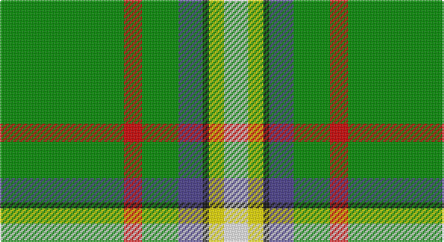

This page is one **sett** — a single exact thread-count. It belongs to the [tartan](/setts/g41r6g12db8k2ly5w8/)
(the same proportion at any scale), whose colour order is pattern [GRGBKYW](/stripes/grgbkyw/).

Sourced from register-of-tartans.  It is a [7 stripe tartan](/stripes/stripes7/).

Original link https://www.tartanregister.gov.uk/tartanDetails.aspx?ref=10163

2 attestations — the source records this cloth was collapsed from (oldest owns this page)

<ul>
<li>26/01/2010 — Decatur Presbyterian Church (register-of-tartans, <a href="https://www.tartanregister.gov.uk/tartanDetails.aspx?ref=10163">record</a>)</li>
<li>26th Jan. 2010 — Decatur Presbyterian Church (Corp) (tartans-authority, <a href="http://www.tartansauthority.com/tartan-ferret/display/10163/">record</a>)</li>
</ul>

## Register references

External register numbers recorded for this tartan.

- Scottish Register of Tartans: [10163](https://www.tartanregister.gov.uk/tartanDetails?ref=10163)
- Scottish Tartans Authority (ITI): 10163

## Thread count
G/82 R12 G24 B16 K4 Y10 W/16

One full sett is **230 threads**.

## Palette

Palette: <strong>Tartan Register</strong> <small style="color:#888">(4 of 6 colours)</small>
<table><thead><tr><th>Colour</th><th>Threads</th><th>Shade</th><th>Base</th><th>OKLCh</th></tr></thead><tbody><tr><td>G/</td><td style="text-align:right;font-variant-numeric:tabular-nums">82</td><td><code style="background-color:#008B00;">#008B00</code> <small style="color:#888">#008B00</small></td><td>G <code style="background-color:#006100;">#006100</code></td><td><small style="color:#888">oklch(55.2% 0.188 142.5)</small></td></tr><tr><td>R</td><td style="text-align:right;font-variant-numeric:tabular-nums">12</td><td><code style="background-color:#CD0000;">#CD0000</code> <small style="color:#888">#CD0000</small></td><td>R <code style="background-color:#CC0000;">#CC0000</code></td><td><small style="color:#888">oklch(53.3% 0.219 29.2)</small></td></tr><tr><td>G</td><td style="text-align:right;font-variant-numeric:tabular-nums">24</td><td><code style="background-color:#008B00;">#008B00</code> <small style="color:#888">#008B00</small></td><td>G <code style="background-color:#006100;">#006100</code></td><td><small style="color:#888">oklch(55.2% 0.188 142.5)</small></td></tr><tr><td>B</td><td style="text-align:right;font-variant-numeric:tabular-nums">16</td><td><code style="background-color:#473C8B;">#473C8B</code> <small style="color:#888">#473C8B</small></td><td>B <code style="background-color:#2A418A;">#2A418A</code></td><td><small style="color:#888">oklch(41.2% 0.126 285.8)</small></td></tr><tr><td>K</td><td style="text-align:right;font-variant-numeric:tabular-nums">4</td><td><code style="background-color:#101010;">#101010</code> <small style="color:#888">#101010</small></td><td>K <code style="background-color:#000000;">#000000</code></td><td><small style="color:#888">oklch(17.3% 0.000 89.9)</small></td></tr><tr><td>Y</td><td style="text-align:right;font-variant-numeric:tabular-nums">10</td><td><code style="background-color:#FFE600;">#FFE600</code> <small style="color:#888">#FFE600</small></td><td>Y <code style="background-color:#F2BF00;">#F2BF00</code></td><td><small style="color:#888">oklch(91.7% 0.192 101.4)</small></td></tr><tr><td>W/</td><td style="text-align:right;font-variant-numeric:tabular-nums">16</td><td><code style="background-color:#FFFFFF;">#FFFFFF</code> <small style="color:#888">#FFFFFF</small></td><td>W <code style="background-color:#F7F7F7;">#F7F7F7</code></td><td><small style="color:#888">oklch(100.0% 0.000 89.9)</small></td></tr></tbody></table>

# Sample pattern

## Nearest tartans

The nearest existing variants by ΔTartan distance, with this tartan at the top so the swatches line up against it.

ΔTartan

Tartan

Sett

—

<a href="/ttd/edit/#slug=g41r6g12db8k2ly5w8~x2">Decatur Presbyterian Church</a> <a class="nn-out" href="/variants/s7/g41r6g12db8k2ly5w8~x2/" title="open its dictionary page">↗</a>

1.55

<a href="/ttd/edit/#slug=g20ri1g10ly2t3k1w2ly10r1g10t2k1~x2&amp;base=g41r6g12db8k2ly5w8~x2">Lethbridge, City of</a> <a class="nn-out" href="/variants/s12/g20ri1g10ly2t3k1w2ly10r1g10t2k1~x2/" title="open its dictionary page">↗</a>

1.59

<a href="/ttd/edit/#slug=g36dg5db17w2g14y3p2~x2&amp;base=g41r6g12db8k2ly5w8~x2">Mounth, The, (rejected)</a> <a class="nn-out" href="/variants/s7/g36dg5db17w2g14y3p2~x2/" title="open its dictionary page">↗</a>

1.65

<a href="/ttd/edit/#slug=do8g50t4lb2w5ly2~x2&amp;base=g41r6g12db8k2ly5w8~x2">Greenup (2015)</a> <a class="nn-out" href="/variants/s6/do8g50t4lb2w5ly2~x2/" title="open its dictionary page">↗</a>

1.66

<a href="/ttd/edit/#slug=g55r4lb3dp11w4db11lb3r4g55k4~x2&amp;base=g41r6g12db8k2ly5w8~x2">Rollings Personal Tartan</a> <a class="nn-out" href="/variants/s10/g55r4lb3dp11w4db11lb3r4g55k4~x2/" title="open its dictionary page">↗</a>

1.73

<a href="/ttd/edit/#slug=db3g16ly1r1w1r6g3r1g3w1~x2&amp;base=g41r6g12db8k2ly5w8~x2">Canadian Caledonian</a> <a class="nn-out" href="/variants/s10/db3g16ly1r1w1r6g3r1g3w1~x2/" title="open its dictionary page">↗</a>

1.76

<a href="/ttd/edit/#slug=w8r6ly2g34b3~x2&amp;base=g41r6g12db8k2ly5w8~x2">Milling-Christensen</a> <a class="nn-out" href="/variants/s5/w8r6ly2g34b3~x2/" title="open its dictionary page">↗</a>

1.78

<a href="/ttd/edit/#slug=w3r4db13g37b3k3ly2~x2&amp;base=g41r6g12db8k2ly5w8~x2">Washington</a> <a class="nn-out" href="/variants/s7/w3r4db13g37b3k3ly2~x2/" title="open its dictionary page">↗</a>

1.80

<a href="/ttd/edit/#slug=g9k2g15r4g14w3y3w23g5ly3~x2&amp;base=g41r6g12db8k2ly5w8~x2">Taylor, dress</a> <a class="nn-out" href="/variants/s10/g9k2g15r4g14w3y3w23g5ly3~x2/" title="open its dictionary page">↗</a>

1.81

<a href="/ttd/edit/#slug=g55p7r24g12db4ly3db4~x2&amp;base=g41r6g12db8k2ly5w8~x2">Crieff, and Strathearn</a> <a class="nn-out" href="/variants/s7/g55p7r24g12db4ly3db4~x2/" title="open its dictionary page">↗</a>

1.81

<a href="/ttd/edit/#slug=g14w1db2r1g1r1db2w1g4ly1~x4&amp;base=g41r6g12db8k2ly5w8~x2">Seattle</a> <a class="nn-out" href="/variants/s10/g14w1db2r1g1r1db2w1g4ly1~x4/" title="open its dictionary page">↗</a>

## Neighbour map

Every grey dot is one of 14360 variants placed by the first two principal components of the ΔTartan feature space (44% of its variance). Red is this tartan; blue dots are its nearest — click one to open its page.

<svg viewBox="0 0 640 380" role="img" style="max-width:100%;height:auto;border:1px solid #e0e0e0;border-radius:4px;display:block" xmlns="http://www.w3.org/2000/svg"><image href="/nn/cloud.v1.png" width="640" height="380"/><a href="/variants/s12/g20ri1g10ly2t3k1w2ly10r1g10t2k1~x2/"><circle cx="305.3" cy="96.9" r="4" fill="#3465a4"><title>Lethbridge, City of</title></circle></a><a href="/variants/s7/g36dg5db17w2g14y3p2~x2/"><circle cx="321.7" cy="150.9" r="4" fill="#3465a4"><title>Mounth, The, (rejected)</title></circle></a><a href="/variants/s6/do8g50t4lb2w5ly2~x2/"><circle cx="418.9" cy="113.6" r="4" fill="#3465a4"><title>Greenup (2015)</title></circle></a><a href="/variants/s10/g55r4lb3dp11w4db11lb3r4g55k4~x2/"><circle cx="367.1" cy="97.3" r="4" fill="#3465a4"><title>Rollings Personal Tartan</title></circle></a><a href="/variants/s10/db3g16ly1r1w1r6g3r1g3w1~x2/"><circle cx="339.3" cy="134.0" r="4" fill="#3465a4"><title>Canadian Caledonian</title></circle></a><a href="/variants/s5/w8r6ly2g34b3~x2/"><circle cx="334.5" cy="153.4" r="4" fill="#3465a4"><title>Milling-Christensen</title></circle></a><a href="/variants/s7/w3r4db13g37b3k3ly2~x2/"><circle cx="269.5" cy="108.4" r="4" fill="#3465a4"><title>Washington</title></circle></a><a href="/variants/s10/g9k2g15r4g14w3y3w23g5ly3~x2/"><circle cx="209.0" cy="140.7" r="4" fill="#3465a4"><title>Taylor, dress</title></circle></a><a href="/variants/s7/g55p7r24g12db4ly3db4~x2/"><circle cx="357.8" cy="155.0" r="4" fill="#3465a4"><title>Crieff, and Strathearn</title></circle></a><a href="/variants/s10/g14w1db2r1g1r1db2w1g4ly1~x4/"><circle cx="383.3" cy="138.9" r="4" fill="#3465a4"><title>Seattle</title></circle></a><circle cx="315.9" cy="126.7" r="5" fill="#c00000"/></svg>

ID: /variants/s7/g41r6g12db8k2ly5w8~x2/
