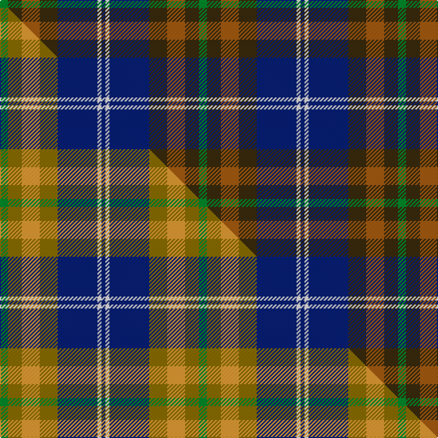

This page is one **sett** — a single exact thread-count. It belongs to the [tartan](/setts/g4dy7o9dy9db20w2db2/)
(the same proportion at any scale), whose colour order is pattern [BWBGRGG](/stripes/bwbgrgg/).

Part of the [Tombow 140th Anniversary, The](/tartans/tombow-140th-anniversary-the/) tartan — the named design grouping this sett with its other cloths.

Sourced from tartans-authority.  It is a [7 stripe tartan](/stripes/stripes7/).

Original link [https://www.tartanregister.gov.uk/tartanDetails.aspx?ref=11220](https://www.tartanregister.gov.uk/tartanDetails.aspx?ref=11220)

Dataset <small>— provenance for this record, inherited from the source manifest</small>

<dl class="dataset-prov">
<dt>source</dt><dd><a href="/sources/tartans-authority/">Scottish Tartans Authority</a></dd>
<dt>data captured from</dt><dd><a href="https://github.com/thetartan/tartan-database/blob/master/data/tartans-authority/data.csv">https://github.com/thetartan/tartan-database/blob/master/data/tartans-authority/data.csv</a></dd>
<dt>data date</dt><dd>2015 <small>(this record)</small></dd>
<dt>licence</dt><dd><a href="https://creativecommons.org/licenses/by-nc-nd/4.0/">CC BY-NC-ND 4.0</a></dd>
</dl>

Capture chain <small>— the hands this data passed through, oldest first; each capture carries its own licence</small>

<ol class="capture-chain">
<li><a href="https://www.tartansauthority.com/">Scottish Tartans Authority</a> <small>the heritage body's archive — its tartan-ferret record browser is retired (links repaired to the SRT, above)</small></li>
<li><a href="https://github.com/thetartan/tartan-database">thetartan/tartan-database</a> <small>2016-2017</small> · <a href="https://creativecommons.org/licenses/by-nc-nd/4.0/">CC BY-NC-ND 4.0</a> <small>Levko Kravets's frozen compilation — the capture we vendored, and where its CC licence text came from</small></li>
<li>this dictionary <small>captured 2026-06-10 · commit 5bf86c7566</small> <small>each re-capture is a git commit to data/sources</small></li>
</ol>

## Register references

External register numbers recorded for this tartan.

- Scottish Register of Tartans: [11220](https://www.tartanregister.gov.uk/tartanDetails?ref=11220)
- Scottish Tartans Authority (ITI): 11220

## Thread count
G/8 DY14 O18 DY18 DB40 W4 DB/4

One full sett is **200 threads**.

## Palette
<table><thead><tr><th>Colour</th><th>Shade</th><th>OKLCh</th></tr></thead><tbody><tr><td>DB</td><td><code style="background-color:#082077;">#082077</code> <small style="color:#888">#082077</small></td><td><small style="color:#888">oklch(30.0% 0.149 265.1)</small></td></tr><tr><td>O</td><td><code style="background-color:#A65C11;">#A65C11</code> <small style="color:#888">#A65C11</small></td><td><small style="color:#888">oklch(55.0% 0.125 58.3)</small></td></tr><tr><td>G</td><td><code style="background-color:#008B2A;">#008B2A</code> <small style="color:#888">#008B2A</small></td><td><small style="color:#888">oklch(55.4% 0.170 145.9)</small></td></tr><tr><td>W</td><td><code style="background-color:#F7F7F7;">#F7F7F7</code> <small style="color:#888">#F7F7F7</small></td><td><small style="color:#888">oklch(97.6% 0.000 89.9)</small></td></tr><tr><td>DY</td><td><code style="background-color:#3A2B0D;">#3A2B0D</code> <small style="color:#888">#3A2B0D</small></td><td><small style="color:#888">oklch(30.0% 0.049 82.0)</small></td></tr></tbody></table>

# Sample pattern

## Compared to the master

This cloth is one sett of its design; the master sett (the exemplar the design is anchored on) is below for comparison.

Its **ΔTartan distance** from the master is **0.17** — the same measure the nearest-tartans table ranks by (0 is identical; a re-scale of the same cloth is near 0, a recolour or a different proportion further).

<figure class="master-compare" style="margin:0">

this sett
master sett ★

<figcaption style="color:#888;font-size:smaller">One weave of this sett against the <a href="/setts/g4y7lo9y9db20w2db2/">master sett ★</a>, split on the diagonal: a shared proportion runs seamlessly across it with only the shades shifting; a different proportion breaks on it.</figcaption>
</figure>

## Nearest tartan variants

The nearest existing variants by ΔTartan distance, with this cloth at the top so the swatches line up against it.

ΔTartan

Threads

Variant

Sett

—

200

<a href="/variants/s7/g4dy7o9dy9db20w2db2~x2/">Tombow 140th Anniversary, The</a>

<a href="/ttd/edit/#slug=dg5t2dg9db19r9ly2~x2&amp;base=g4dy7o9dy9db20w2db2~x2" title="compare in the TTD">1.09</a>

170

<a href="/variants/s6/dg5t2dg9db19r9ly2~x2/">Lyle and Scott</a>

<a href="/ttd/edit/#slug=dg5db2dg9k19r9y2~x2~db1406275-k0705267&amp;base=g4dy7o9dy9db20w2db2~x2" title="compare in the TTD">1.56</a>

170

<a href="/variants/s6/dg5dbi2dg9db19r9y2~x2~dbi1406275-db0705267/">Lyle and Scott</a>

<a href="/ttd/edit/#slug=dg3b22do10o5dg21r6b3~x2&amp;base=g4dy7o9dy9db20w2db2~x2" title="compare in the TTD">2.07</a>

268

<a href="/variants/s7/dg3b22do10o5dg21r6b3~x2/">Swankie</a>

<a href="/ttd/edit/#slug=y5db24k8n18y6o3~db0805267-n1604274&amp;base=g4dy7o9dy9db20w2db2~x2" title="compare in the TTD">2.10</a>

120

<a href="/variants/s6/y5db24k8dbi18y6o3~db0805267-dbi1604274/">CALA Homes</a>

<a href="/ttd/edit/#slug=ly5dt24k8db18ly6dy3~ly3307090-dt1204274-db1406275-dy1603076&amp;base=g4dy7o9dy9db20w2db2~x2" title="compare in the TTD">2.10</a>

120

<a href="/variants/s6/ly5db24k8dbi18ly6dy3~ly3307090-db1204274-dbi1406275-dy1603076/">Cala Homes (Corporate)</a>

<a href="/ttd/edit/#slug=y15db8r25db72dg98w15&amp;base=g4dy7o9dy9db20w2db2~x2" title="compare in the TTD">2.17</a>

436

<a href="/variants/s6/y15db8r25db72dg98w15/">Afternoon Tea / Darjeeling</a>

<a href="/ttd/edit/#slug=dg3lo2o10dg10db20dg12r3db10w2~x2&amp;base=g4dy7o9dy9db20w2db2~x2" title="compare in the TTD">2.19</a>

278

<a href="/variants/s9/dg3lo2o10dg10db20dg12r3db10w2~x2/">Patel Name Tartan</a>

<a href="/ttd/edit/#slug=r15dt8g25dt72n98lb15~dt0900000&amp;base=g4dy7o9dy9db20w2db2~x2" title="compare in the TTD">2.25</a>

436

<a href="/variants/s6/r15dt8g25dt72n98lb15~dt0900000/">Afternoon Tea / Black Tea</a>

<a href="/ttd/edit/#slug=db4g2r18dr10g10db29b4~x2~db1003265-b1813263&amp;base=g4dy7o9dy9db20w2db2~x2" title="compare in the TTD">2.34</a>

292

<a href="/variants/s7/db4g2r18dr10g10db29b4~x2~db1003265-b1813263/">Ross Dempster (Personal)</a>

<a href="/ttd/edit/#slug=db49y12r12y12dg32w8db3&amp;base=g4dy7o9dy9db20w2db2~x2" title="compare in the TTD">2.35</a>

204

<a href="/variants/s7/db49y12r12y12dg32w8db3/">Kuznetsov (2014)</a>

## Neighbour map

Every grey dot is one of 13621 variants placed by the first two principal components of the ΔTartan feature space (42% of its variance). Red is this tartan; blue dots are its nearest — click one to open its page.

<svg viewBox="0 0 640 380" role="img" style="max-width:100%;height:auto;border:1px solid #e0e0e0;border-radius:4px;display:block" xmlns="http://www.w3.org/2000/svg"><image href="/nn/cloud.v1.png" width="640" height="380"/><a href="/variants/s6/dg5t2dg9db19r9ly2~x2/"><circle cx="219.5" cy="217.3" r="4" fill="#3465a4"><title>Lyle and Scott</title></circle></a><a href="/variants/s6/dg5dbi2dg9db19r9y2~x2~dbi1406275-db0705267/"><circle cx="220.2" cy="215.1" r="4" fill="#3465a4"><title>Lyle and Scott</title></circle></a><a href="/variants/s7/dg3b22do10o5dg21r6b3~x2/"><circle cx="203.4" cy="230.2" r="4" fill="#3465a4"><title>Swankie</title></circle></a><a href="/variants/s6/y5db24k8dbi18y6o3~db0805267-dbi1604274/"><circle cx="166.5" cy="216.1" r="4" fill="#3465a4"><title>CALA Homes</title></circle></a><a href="/variants/s6/ly5db24k8dbi18ly6dy3~ly3307090-db1204274-dbi1406275-dy1603076/"><circle cx="138.0" cy="206.7" r="4" fill="#3465a4"><title>Cala Homes (Corporate)</title></circle></a><a href="/variants/s6/y15db8r25db72dg98w15/"><circle cx="227.6" cy="196.3" r="4" fill="#3465a4"><title>Afternoon Tea / Darjeeling</title></circle></a><a href="/variants/s9/dg3lo2o10dg10db20dg12r3db10w2~x2/"><circle cx="196.4" cy="191.9" r="4" fill="#3465a4"><title>Patel Name Tartan</title></circle></a><a href="/variants/s6/r15dt8g25dt72n98lb15~dt0900000/"><circle cx="254.5" cy="204.3" r="4" fill="#3465a4"><title>Afternoon Tea / Black Tea</title></circle></a><a href="/variants/s7/db4g2r18dr10g10db29b4~x2~db1003265-b1813263/"><circle cx="222.0" cy="184.3" r="4" fill="#3465a4"><title>Ross Dempster (Personal)</title></circle></a><a href="/variants/s7/db49y12r12y12dg32w8db3/"><circle cx="205.6" cy="180.3" r="4" fill="#3465a4"><title>Kuznetsov (2014)</title></circle></a><circle cx="216.9" cy="210.0" r="5" fill="#c00000"/><text x="320" y="376" text-anchor="middle" font-size="11" fill="#999">ground</text><text x="11" y="190" text-anchor="middle" font-size="11" fill="#999" transform="rotate(-90 11 190)">complexity</text></svg>

ID: /variants/s7/g4dy7o9dy9db20w2db2~x2/
