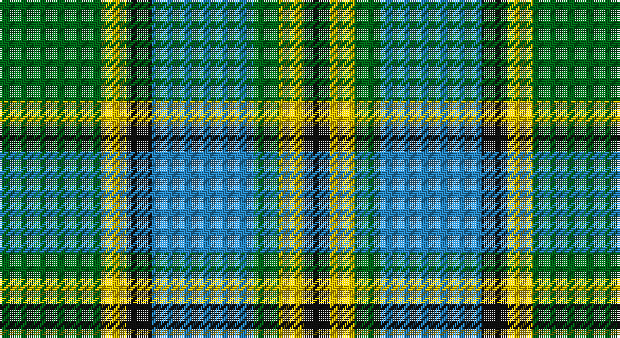

This page is one **sett** — a single exact thread-count. It belongs to the [tartan](/setts/g4ly1k1t4g1ly1k1/)
(the same proportion at any scale), whose colour order is pattern [GYKBGYK](/stripes/gykbgyk/).

Sourced from register-of-tartans.  It is a [7 stripe tartan](/stripes/stripes7/).

Original link https://www.tartanregister.gov.uk/tartanDetails.aspx?ref=4447

2 attestations — the source records this cloth was collapsed from (oldest owns this page)

<ul>
<li>01/03/2005 — Verble (Personal) (register-of-tartans, <a href="https://www.tartanregister.gov.uk/tartanDetails.aspx?ref=4447">record</a>)</li>
<li>2005 March — Verble (Personal) (tartans-authority, <a href="http://www.tartansauthority.com/tartan-ferret/display/6659/">record</a>)</li>
</ul>

## Register references

External register numbers recorded for this tartan.

- Scottish Register of Tartans: [4447](https://www.tartanregister.gov.uk/tartanDetails.aspx?ref=4447)
- Scottish Tartans Authority (ITI): 6659

## Thread count
G/48 Y12 K12 B48 G12 Y12 K/12

One full sett is **252 threads**.

## Palette

Palette: <strong>Tartan Register</strong>
<table><thead><tr><th>Colour</th><th>Threads</th><th>Shade</th><th>Base</th><th>OKLCh</th></tr></thead><tbody><tr><td>G/</td><td style="text-align:right;font-variant-numeric:tabular-nums">48</td><td><code style="background-color:#006818;">#006818</code> <small style="color:#888">#006818</small></td><td>G <code style="background-color:#006100;">#006100</code></td><td><small style="color:#888">oklch(45.0% 0.142 145.0)</small></td></tr><tr><td>Y</td><td style="text-align:right;font-variant-numeric:tabular-nums">12</td><td><code style="background-color:#E8C000;">#E8C000</code> <small style="color:#888">#E8C000</small></td><td>Y <code style="background-color:#F2BF00;">#F2BF00</code></td><td><small style="color:#888">oklch(81.9% 0.168 93.7)</small></td></tr><tr><td>K</td><td style="text-align:right;font-variant-numeric:tabular-nums">12</td><td><code style="background-color:#101010;">#101010</code> <small style="color:#888">#101010</small></td><td>K <code style="background-color:#000000;">#000000</code></td><td><small style="color:#888">oklch(17.3% 0.000 89.9)</small></td></tr><tr><td>B</td><td style="text-align:right;font-variant-numeric:tabular-nums">48</td><td><code style="background-color:#2888C4;">#2888C4</code> <small style="color:#888">#2888C4</small></td><td>B <code style="background-color:#2A418A;">#2A418A</code></td><td><small style="color:#888">oklch(60.1% 0.125 241.5)</small></td></tr><tr><td>G</td><td style="text-align:right;font-variant-numeric:tabular-nums">12</td><td><code style="background-color:#006818;">#006818</code> <small style="color:#888">#006818</small></td><td>G <code style="background-color:#006100;">#006100</code></td><td><small style="color:#888">oklch(45.0% 0.142 145.0)</small></td></tr><tr><td>Y</td><td style="text-align:right;font-variant-numeric:tabular-nums">12</td><td><code style="background-color:#E8C000;">#E8C000</code> <small style="color:#888">#E8C000</small></td><td>Y <code style="background-color:#F2BF00;">#F2BF00</code></td><td><small style="color:#888">oklch(81.9% 0.168 93.7)</small></td></tr><tr><td>K/</td><td style="text-align:right;font-variant-numeric:tabular-nums">12</td><td><code style="background-color:#101010;">#101010</code> <small style="color:#888">#101010</small></td><td>K <code style="background-color:#000000;">#000000</code></td><td><small style="color:#888">oklch(17.3% 0.000 89.9)</small></td></tr></tbody></table>

# Sample pattern

## Nearest tartans

The nearest existing variants by ΔTartan distance, with this tartan at the top so the swatches line up against it.

ΔTartan

Tartan

Sett

—

<a href="/ttd/edit/#slug=g4ly1k1t4g1ly1k1~x12">Verble (Personal)</a> <a class="nn-out" href="/variants/s7/g4ly1k1t4g1ly1k1~x12/" title="open its dictionary page">↗</a>

1.37

<a href="/ttd/edit/#slug=ly5k5g17k6o24k6ly3~x2&amp;base=g4ly1k1t4g1ly1k1~x12">Cape Breton District Tartan</a> <a class="nn-out" href="/variants/s7/ly5k5g17k6o24k6ly3~x2/" title="open its dictionary page">↗</a>

1.41

<a href="/ttd/edit/#slug=lb47g6b13dy20g6b6g28~x2&amp;base=g4ly1k1t4g1ly1k1~x12">State Seal of North Carolina (Fash.)</a> <a class="nn-out" href="/variants/s7/lb47g6b13dy20g6b6g28~x2/" title="open its dictionary page">↗</a>

1.45

<a href="/ttd/edit/#slug=k4w2g13k13t12k2~x2&amp;base=g4ly1k1t4g1ly1k1~x12">Melville</a> <a class="nn-out" href="/variants/s6/k4w2g13k13t12k2~x2/" title="open its dictionary page">↗</a>

1.45

<a href="/ttd/edit/#slug=k4g14k14g2w14b3~x2&amp;base=g4ly1k1t4g1ly1k1~x12">MacKay, Dress (Corporate)</a> <a class="nn-out" href="/variants/s6/k4g14k14g2w14b3~x2/" title="open its dictionary page">↗</a>

1.47

<a href="/variants/s8/g6k1r1t2r2~x4/">Wilson's No.193</a>

1.47

<a href="/ttd/edit/#slug=db21g5k5g15w3g5w3g5k3~x2&amp;base=g4ly1k1t4g1ly1k1~x12">Tweedside, hunting</a> <a class="nn-out" href="/variants/s9/db21g5k5g15w3g5w3g5k3~x2/" title="open its dictionary page">↗</a>

1.49

<a href="/ttd/edit/#slug=w3dt10dt12gi11db3gi11g4gi2~x2&amp;base=g4ly1k1t4g1ly1k1~x12">Queen of the South</a> <a class="nn-out" href="/variants/s8/w3dt10dt12gi11db3gi11g4gi2~x2/" title="open its dictionary page">↗</a>

1.52

<a href="/ttd/edit/#slug=b2g13b11y4w9b2~x2&amp;base=g4ly1k1t4g1ly1k1~x12">Loch Leven</a> <a class="nn-out" href="/variants/s6/b2g13b11y4w9b2~x2/" title="open its dictionary page">↗</a>

1.52

<a href="/ttd/edit/#slug=k2g13k11t4w9k2~x2&amp;base=g4ly1k1t4g1ly1k1~x12">Loch Leven, Check</a> <a class="nn-out" href="/variants/s6/k2g13k11t4w9k2~x2/" title="open its dictionary page">↗</a>

1.52

<a href="/ttd/edit/#slug=r2db10k5g12w2~x2&amp;base=g4ly1k1t4g1ly1k1~x12">Davidson of Tulloch</a> <a class="nn-out" href="/variants/s5/r2db10k5g12w2~x2/" title="open its dictionary page">↗</a>

## Neighbour map

Every grey dot is one of 14360 variants placed by the first two principal components of the ΔTartan feature space (44% of its variance). Red is this tartan; blue dots are its nearest — click one to open its page.

<svg viewBox="0 0 640 380" role="img" style="max-width:100%;height:auto;border:1px solid #e0e0e0;border-radius:4px;display:block" xmlns="http://www.w3.org/2000/svg"><image href="/nn/cloud.v1.png" width="640" height="380"/><a href="/variants/s7/ly5k5g17k6o24k6ly3~x2/"><circle cx="152.1" cy="208.8" r="4" fill="#3465a4"><title>Cape Breton District Tartan</title></circle></a><a href="/variants/s7/lb47g6b13dy20g6b6g28~x2/"><circle cx="165.6" cy="214.9" r="4" fill="#3465a4"><title>State Seal of North Carolina (Fash.)</title></circle></a><a href="/variants/s6/k4w2g13k13t12k2~x2/"><circle cx="166.3" cy="239.3" r="4" fill="#3465a4"><title>Melville</title></circle></a><a href="/variants/s6/k4g14k14g2w14b3~x2/"><circle cx="120.0" cy="223.8" r="4" fill="#3465a4"><title>MacKay, Dress (Corporate)</title></circle></a><a href="/variants/s8/g6k1r1t2r2~x4/"><circle cx="164.0" cy="219.3" r="4" fill="#3465a4"><title>Wilson's No.193</title></circle></a><a href="/variants/s9/db21g5k5g15w3g5w3g5k3~x2/"><circle cx="188.6" cy="203.1" r="4" fill="#3465a4"><title>Tweedside, hunting</title></circle></a><a href="/variants/s8/w3dt10dt12gi11db3gi11g4gi2~x2/"><circle cx="141.6" cy="226.2" r="4" fill="#3465a4"><title>Queen of the South</title></circle></a><a href="/variants/s6/b2g13b11y4w9b2~x2/"><circle cx="131.2" cy="234.4" r="4" fill="#3465a4"><title>Loch Leven</title></circle></a><a href="/variants/s6/k2g13k11t4w9k2~x2/"><circle cx="112.8" cy="229.2" r="4" fill="#3465a4"><title>Loch Leven, Check</title></circle></a><a href="/variants/s5/r2db10k5g12w2~x2/"><circle cx="119.2" cy="226.1" r="4" fill="#3465a4"><title>Davidson of Tulloch</title></circle></a><circle cx="130.7" cy="242.6" r="5" fill="#c00000"/></svg>

ID: /variants/s7/g4ly1k1t4g1ly1k1~x12/
