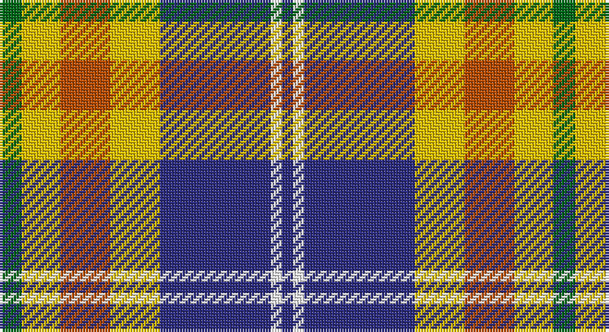

This page is one **sett** — a single exact thread-count. It belongs to the [tartan](/setts/g4ly7o9ly9db20w2db2/)
(the same proportion at any scale), whose colour order is pattern [BWBYRYG](/stripes/bwbyryg/).

Part of the [Tombow 140th Anniversary, The](/tartans/tombow-140th-anniversary-the/) tartan — the named design grouping this sett with its other cloths.

Sourced from tartans-authority.  It is a [7 stripe tartan](/stripes/stripes7/).

Original link http://www.tartansauthority.com/tartan-ferret/display/11220/

## Register references

External register numbers recorded for this tartan.

- Scottish Register of Tartans: [11220](https://www.tartanregister.gov.uk/tartanDetails?ref=11220)
- Scottish Tartans Authority (ITI): 11220

## Thread count
G/8 Y14 DO18 Y18 DB40 W4 DB/4

One full sett is **200 threads**.

## Palette

Palette: <strong>Tartan Register</strong> <small style="color:#888">(4 of 5 colours)</small>
<table><thead><tr><th>Colour</th><th>Threads</th><th>Shade</th><th>Base</th><th>OKLCh</th></tr></thead><tbody><tr><td>G/</td><td style="text-align:right;font-variant-numeric:tabular-nums">8</td><td><code style="background-color:#006818;">#006818</code> <small style="color:#888">#006818</small></td><td>G <code style="background-color:#006100;">#006100</code></td><td><small style="color:#888">oklch(45.0% 0.142 145.0)</small></td></tr><tr><td>Y</td><td style="text-align:right;font-variant-numeric:tabular-nums">14</td><td><code style="background-color:#E8C000;">#E8C000</code> <small style="color:#888">#E8C000</small></td><td>Y <code style="background-color:#F2BF00;">#F2BF00</code></td><td><small style="color:#888">oklch(81.9% 0.168 93.7)</small></td></tr><tr><td>DO</td><td style="text-align:right;font-variant-numeric:tabular-nums">18</td><td><code style="background-color:#B84C00;">#B84C00</code> <small style="color:#888">#B84C00</small></td><td>R <code style="background-color:#CC0000;">#CC0000</code></td><td><small style="color:#888">oklch(55.1% 0.156 45.5)</small></td></tr><tr><td>Y</td><td style="text-align:right;font-variant-numeric:tabular-nums">18</td><td><code style="background-color:#E8C000;">#E8C000</code> <small style="color:#888">#E8C000</small></td><td>Y <code style="background-color:#F2BF00;">#F2BF00</code></td><td><small style="color:#888">oklch(81.9% 0.168 93.7)</small></td></tr><tr><td>DB</td><td style="text-align:right;font-variant-numeric:tabular-nums">40</td><td><code style="background-color:#2C2C80;">#2C2C80</code> <small style="color:#888">#2C2C80</small></td><td>B <code style="background-color:#2A418A;">#2A418A</code></td><td><small style="color:#888">oklch(35.0% 0.138 276.6)</small></td></tr><tr><td>W</td><td style="text-align:right;font-variant-numeric:tabular-nums">4</td><td><code style="background-color:#FCFCFC;">#FCFCFC</code> <small style="color:#888">#FCFCFC</small></td><td>W <code style="background-color:#F7F7F7;">#F7F7F7</code></td><td><small style="color:#888">oklch(99.1% 0.000 89.9)</small></td></tr><tr><td>DB/</td><td style="text-align:right;font-variant-numeric:tabular-nums">4</td><td><code style="background-color:#2C2C80;">#2C2C80</code> <small style="color:#888">#2C2C80</small></td><td>B <code style="background-color:#2A418A;">#2A418A</code></td><td><small style="color:#888">oklch(35.0% 0.138 276.6)</small></td></tr></tbody></table>

# Sample pattern

## Compared to the master

This cloth is one sett of its design; the master sett (the exemplar the design is anchored on) is below for comparison.

<figure style="margin:0"><figcaption style="color:#888;font-size:smaller">this sett</figcaption></figure>
<figure style="margin:0"><figcaption style="color:#888;font-size:smaller"><a href="/setts/g4lo7r9lo9b20w2b2/">master sett →</a></figcaption></figure>

## Nearest tartans

The nearest existing variants by ΔTartan distance, with this tartan at the top so the swatches line up against it.

ΔTartan

Tartan

Sett

—

<a href="/ttd/edit/#slug=g4ly7o9ly9db20w2db2~x2">Tombow 140th Anniversary, The</a> <a class="nn-out" href="/variants/s7/g4ly7o9ly9db20w2db2~x2/" title="open its dictionary page">↗</a>

0.46

<a href="/ttd/edit/#slug=r4o25k6w12k11ly3~x2&amp;base=g4ly7o9ly9db20w2db2~x2">Thomson Dress (Grey) (Fashion)</a> <a class="nn-out" href="/variants/s6/r4o25k6w12k11ly3~x2/" title="open its dictionary page">↗</a>

0.85

<a href="/ttd/edit/#slug=dg20r3y3r15w19dg3t2~x2&amp;base=g4ly7o9ly9db20w2db2~x2">Glasgow</a> <a class="nn-out" href="/variants/s7/dg20r3y3r15w19dg3t2~x2/" title="open its dictionary page">↗</a>

0.89

<a href="/ttd/edit/#slug=lb5k26ly4lb24dp8k3r4~x2&amp;base=g4ly7o9ly9db20w2db2~x2">Pengelly, The Cornish (Name)</a> <a class="nn-out" href="/variants/s7/lb5k26ly4lb24dp8k3r4~x2/" title="open its dictionary page">↗</a>

0.93

<a href="/ttd/edit/#slug=r4t28k6lb12k12lo3~x2&amp;base=g4ly7o9ly9db20w2db2~x2">MacTavish Dress</a> <a class="nn-out" href="/variants/s6/r4t28k6lb12k12lo3~x2/" title="open its dictionary page">↗</a>

0.96

<a href="/ttd/edit/#slug=r2o20k5w10k10r2~x2&amp;base=g4ly7o9ly9db20w2db2~x2">Thompson Grey Family Tartan</a> <a class="nn-out" href="/variants/s6/r2o20k5w10k10r2~x2/" title="open its dictionary page">↗</a>

0.96

<a href="/ttd/edit/#slug=dy17g5db2w12db2ly4g7~x4&amp;base=g4ly7o9ly9db20w2db2~x2">Northern Ontario</a> <a class="nn-out" href="/variants/s7/dy17g5db2w12db2ly4g7~x4/" title="open its dictionary page">↗</a>

0.97

<a href="/ttd/edit/#slug=w39db9k10dg11r7k3r7~x2&amp;base=g4ly7o9ly9db20w2db2~x2">MacDuff Dress #5</a> <a class="nn-out" href="/variants/s7/w39db9k10dg11r7k3r7~x2/" title="open its dictionary page">↗</a>

0.98

<a href="/ttd/edit/#slug=w39db9k10g11r7k3r7~x2&amp;base=g4ly7o9ly9db20w2db2~x2">MacDuff dress</a> <a class="nn-out" href="/variants/s7/w39db9k10g11r7k3r7~x2/" title="open its dictionary page">↗</a>

0.99

<a href="/ttd/edit/#slug=r6db2p21w3dg19w26dg3w5~x2&amp;base=g4ly7o9ly9db20w2db2~x2">Culloden, dress Ancient</a> <a class="nn-out" href="/variants/s8/r6db2p21w3dg19w26dg3w5~x2/" title="open its dictionary page">↗</a>

1.00

<a href="/ttd/edit/#slug=r2lo20k5w10k10w2~x2&amp;base=g4ly7o9ly9db20w2db2~x2">Thompson Camel Clan Tartan</a> <a class="nn-out" href="/variants/s6/r2lo20k5w10k10w2~x2/" title="open its dictionary page">↗</a>

## Neighbour map

Every grey dot is one of 14360 variants placed by the first two principal components of the ΔTartan feature space (44% of its variance). Red is this tartan; blue dots are its nearest — click one to open its page.

<svg viewBox="0 0 640 380" role="img" style="max-width:100%;height:auto;border:1px solid #e0e0e0;border-radius:4px;display:block" xmlns="http://www.w3.org/2000/svg"><image href="/nn/cloud.v1.png" width="640" height="380"/><a href="/variants/s6/r4o25k6w12k11ly3~x2/"><circle cx="140.5" cy="186.0" r="4" fill="#3465a4"><title>Thomson Dress (Grey) (Fashion)</title></circle></a><a href="/variants/s7/dg20r3y3r15w19dg3t2~x2/"><circle cx="133.9" cy="158.8" r="4" fill="#3465a4"><title>Glasgow</title></circle></a><a href="/variants/s7/lb5k26ly4lb24dp8k3r4~x2/"><circle cx="151.8" cy="163.3" r="4" fill="#3465a4"><title>Pengelly, The Cornish (Name)</title></circle></a><a href="/variants/s6/r4t28k6lb12k12lo3~x2/"><circle cx="167.8" cy="188.3" r="4" fill="#3465a4"><title>MacTavish Dress</title></circle></a><a href="/variants/s6/r2o20k5w10k10r2~x2/"><circle cx="173.9" cy="193.4" r="4" fill="#3465a4"><title>Thompson Grey Family Tartan</title></circle></a><a href="/variants/s7/dy17g5db2w12db2ly4g7~x4/"><circle cx="102.8" cy="176.6" r="4" fill="#3465a4"><title>Northern Ontario</title></circle></a><a href="/variants/s7/w39db9k10dg11r7k3r7~x2/"><circle cx="170.4" cy="139.6" r="4" fill="#3465a4"><title>MacDuff Dress #5</title></circle></a><a href="/variants/s7/w39db9k10g11r7k3r7~x2/"><circle cx="164.3" cy="138.9" r="4" fill="#3465a4"><title>MacDuff dress</title></circle></a><a href="/variants/s8/r6db2p21w3dg19w26dg3w5~x2/"><circle cx="154.6" cy="140.9" r="4" fill="#3465a4"><title>Culloden, dress Ancient</title></circle></a><a href="/variants/s6/r2lo20k5w10k10w2~x2/"><circle cx="175.6" cy="191.0" r="4" fill="#3465a4"><title>Thompson Camel Clan Tartan</title></circle></a><circle cx="155.4" cy="171.6" r="5" fill="#c00000"/></svg>

ID: /variants/s7/g4ly7o9ly9db20w2db2~x2/
