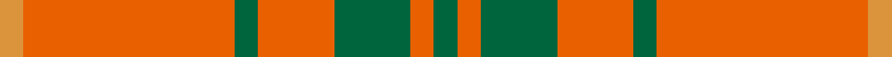
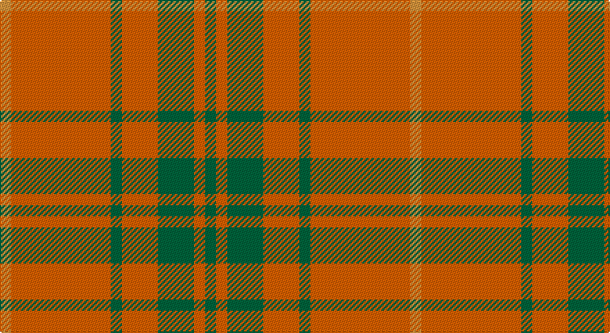

This page is one **sett** — a single exact thread-count. It belongs to the [tartan](/setts/g4o4g13o13g4o36lo4/)
(the same proportion at any scale), whose colour order is pattern [GRGRGRY](/stripes/grgrgry/).

Part of the [Wolfe](/tartans/wolfe/) tartan — the named design grouping this sett with its other cloths.

Sourced from tartans-authority.  It is a [7 stripe tartan](/stripes/stripes7/).

Original link http://www.tartansauthority.com/tartan-ferret/display/4096/

## Register references

External register numbers recorded for this tartan.

- Scottish Tartans Authority (ITI): 4096

## Thread count
O/8 Oa72 G8 Oa26 G26 Oa8 G/8

One full sett is **296 threads**.

## Palette

Palette: <strong>Tartan Register</strong>
<table><thead><tr><th>Colour</th><th>Threads</th><th>Shade</th><th>Base</th><th>OKLCh</th></tr></thead><tbody><tr><td>O/</td><td style="text-align:right;font-variant-numeric:tabular-nums">8</td><td><code style="background-color:#DC943C;">#DC943C</code> <small style="color:#888">#DC943C</small></td><td>Y <code style="background-color:#F2BF00;">#F2BF00</code></td><td><small style="color:#888">oklch(72.3% 0.133 67.9)</small></td></tr><tr><td>Oa</td><td style="text-align:right;font-variant-numeric:tabular-nums">72</td><td><code style="background-color:#E86000;">#E86000</code> <small style="color:#888">#E86000</small></td><td>R <code style="background-color:#CC0000;">#CC0000</code></td><td><small style="color:#888">oklch(65.3% 0.187 44.9)</small></td></tr><tr><td>G</td><td style="text-align:right;font-variant-numeric:tabular-nums">8</td><td><code style="background-color:#00643C;">#00643C</code> <small style="color:#888">#00643C</small></td><td>G <code style="background-color:#006100;">#006100</code></td><td><small style="color:#888">oklch(44.3% 0.104 157.7)</small></td></tr><tr><td>Oa</td><td style="text-align:right;font-variant-numeric:tabular-nums">26</td><td><code style="background-color:#E86000;">#E86000</code> <small style="color:#888">#E86000</small></td><td>R <code style="background-color:#CC0000;">#CC0000</code></td><td><small style="color:#888">oklch(65.3% 0.187 44.9)</small></td></tr><tr><td>G</td><td style="text-align:right;font-variant-numeric:tabular-nums">26</td><td><code style="background-color:#00643C;">#00643C</code> <small style="color:#888">#00643C</small></td><td>G <code style="background-color:#006100;">#006100</code></td><td><small style="color:#888">oklch(44.3% 0.104 157.7)</small></td></tr><tr><td>Oa</td><td style="text-align:right;font-variant-numeric:tabular-nums">8</td><td><code style="background-color:#E86000;">#E86000</code> <small style="color:#888">#E86000</small></td><td>R <code style="background-color:#CC0000;">#CC0000</code></td><td><small style="color:#888">oklch(65.3% 0.187 44.9)</small></td></tr><tr><td>G/</td><td style="text-align:right;font-variant-numeric:tabular-nums">8</td><td><code style="background-color:#00643C;">#00643C</code> <small style="color:#888">#00643C</small></td><td>G <code style="background-color:#006100;">#006100</code></td><td><small style="color:#888">oklch(44.3% 0.104 157.7)</small></td></tr></tbody></table>

# Sample pattern

## Compared to the master

This cloth is one sett of its design; the master sett (the exemplar the design is anchored on) is below for comparison.

<figure style="margin:0"><figcaption style="color:#888;font-size:smaller">this sett</figcaption></figure>
<figure style="margin:0"><figcaption style="color:#888;font-size:smaller"><a href="/setts/o36g4o13g13o4g4o4g13o13g4o36lo4/">master sett →</a></figcaption></figure>

## Nearest tartans

The nearest existing variants by ΔTartan distance, with this tartan at the top so the swatches line up against it.

ΔTartan

Tartan

Sett

—

<a href="/ttd/edit/#slug=g4o4g13o13g4o36lo4~x2">Wolfe (Name)</a> <a class="nn-out" href="/variants/s7/g4o4g13o13g4o36lo4~x2/" title="open its dictionary page">↗</a>

1.23

<a href="/ttd/edit/#slug=o36g4o13g13o4g4o4g13o13g4o36lo4~x2&amp;base=g4o4g13o13g4o36lo4~x2">Wolfe</a> <a class="nn-out" href="/variants/s12/o36g4o13g13o4g4o4g13o13g4o36lo4~x2/" title="open its dictionary page">↗</a>

1.44

<a href="/ttd/edit/#slug=r1g3r1g3r8ly1~x8&amp;base=g4o4g13o13g4o36lo4~x2">Cameron</a> <a class="nn-out" href="/variants/s6/r1g3r1g3r8ly1~x8/" title="open its dictionary page">↗</a>

1.46

<a href="/ttd/edit/#slug=r2g6r2g6r16ly1~x2&amp;base=g4o4g13o13g4o36lo4~x2">Cameron</a> <a class="nn-out" href="/variants/s6/r2g6r2g6r16ly1~x2/" title="open its dictionary page">↗</a>

1.50

<a href="/ttd/edit/#slug=r2g6r2g6r16ly1~x4&amp;base=g4o4g13o13g4o36lo4~x2">Cameron (Clan)</a> <a class="nn-out" href="/variants/s6/r2g6r2g6r16ly1~x4/" title="open its dictionary page">↗</a>

1.53

<a href="/ttd/edit/#slug=r58ly3r6g16r12g16r6&amp;base=g4o4g13o13g4o36lo4~x2">Cameron, Ancient</a> <a class="nn-out" href="/variants/s7/r58ly3r6g16r12g16r6/" title="open its dictionary page">↗</a>

1.61

<a href="/ttd/edit/#slug=r8g2r6db1r2db1r8g12r14db1r2~x2&amp;base=g4o4g13o13g4o36lo4~x2">MacDonell of Keppoch</a> <a class="nn-out" href="/variants/s11/r8g2r6db1r2db1r8g12r14db1r2~x2/" title="open its dictionary page">↗</a>

1.69

<a href="/ttd/edit/#slug=r6lb2r30dg12r3dg12r3&amp;base=g4o4g13o13g4o36lo4~x2">Crawford</a> <a class="nn-out" href="/variants/s7/r6lb2r30dg12r3dg12r3/" title="open its dictionary page">↗</a>

1.70

<a href="/ttd/edit/#slug=r21g3r21g16lo3w2lo3~x2&amp;base=g4o4g13o13g4o36lo4~x2">Claus of the North Pole (Restricted)</a> <a class="nn-out" href="/variants/s7/r21g3r21g16lo3w2lo3~x2/" title="open its dictionary page">↗</a>

1.72

<a href="/ttd/edit/#slug=r16g1r1g1r4g12~x4&amp;base=g4o4g13o13g4o36lo4~x2">MacQuarrie #5</a> <a class="nn-out" href="/variants/s6/r16g1r1g1r4g12~x4/" title="open its dictionary page">↗</a>

1.75

<a href="/ttd/edit/#slug=r4g14r5k6r24g2r4~x2&amp;base=g4o4g13o13g4o36lo4~x2">Auld Lang Syne (red) Tartan</a> <a class="nn-out" href="/variants/s7/r4g14r5k6r24g2r4~x2/" title="open its dictionary page">↗</a>

## Neighbour map

Every grey dot is one of 14360 variants placed by the first two principal components of the ΔTartan feature space (44% of its variance). Red is this tartan; blue dots are its nearest — click one to open its page.

<svg viewBox="0 0 640 380" role="img" style="max-width:100%;height:auto;border:1px solid #e0e0e0;border-radius:4px;display:block" xmlns="http://www.w3.org/2000/svg"><image href="/nn/cloud.v1.png" width="640" height="380"/><a href="/variants/s12/o36g4o13g13o4g4o4g13o13g4o36lo4~x2/"><circle cx="460.6" cy="197.7" r="4" fill="#3465a4"><title>Wolfe</title></circle></a><a href="/variants/s6/r1g3r1g3r8ly1~x8/"><circle cx="369.6" cy="227.2" r="4" fill="#3465a4"><title>Cameron</title></circle></a><a href="/variants/s6/r2g6r2g6r16ly1~x2/"><circle cx="415.5" cy="201.3" r="4" fill="#3465a4"><title>Cameron</title></circle></a><a href="/variants/s6/r2g6r2g6r16ly1~x4/"><circle cx="420.6" cy="202.7" r="4" fill="#3465a4"><title>Cameron (Clan)</title></circle></a><a href="/variants/s7/r58ly3r6g16r12g16r6/"><circle cx="494.4" cy="181.5" r="4" fill="#3465a4"><title>Cameron, Ancient</title></circle></a><a href="/variants/s11/r8g2r6db1r2db1r8g12r14db1r2~x2/"><circle cx="461.1" cy="189.5" r="4" fill="#3465a4"><title>MacDonell of Keppoch</title></circle></a><a href="/variants/s7/r6lb2r30dg12r3dg12r3/"><circle cx="416.0" cy="194.0" r="4" fill="#3465a4"><title>Crawford</title></circle></a><a href="/variants/s7/r21g3r21g16lo3w2lo3~x2/"><circle cx="355.2" cy="192.6" r="4" fill="#3465a4"><title>Claus of the North Pole (Restricted)</title></circle></a><a href="/variants/s6/r16g1r1g1r4g12~x4/"><circle cx="455.5" cy="215.6" r="4" fill="#3465a4"><title>MacQuarrie #5</title></circle></a><a href="/variants/s7/r4g14r5k6r24g2r4~x2/"><circle cx="393.5" cy="206.4" r="4" fill="#3465a4"><title>Auld Lang Syne (red) Tartan</title></circle></a><circle cx="446.9" cy="215.3" r="5" fill="#c00000"/></svg>

ID: /variants/s7/g4o4g13o13g4o36lo4~x2/
