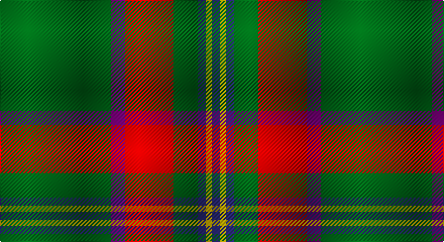

This page is one **sett** — a single exact thread-count. It belongs to the [tartan](/setts/g55dp7r24g12db4ly3db4/)
(the same proportion at any scale), whose colour order is pattern [BYBGRBG](/stripes/bybgrbg/).

Sourced from house-of-tartan.  It is a [7 stripe tartan](/stripes/stripes7/).

Original link http://www.house-of-tartan.scotland.net/house/TartanViewjs.asp?colr=Def&tnam=664

## Provenance

Earliest known date: 1988 A branch of the Stewart clan from Galloway and the South West of Scotland.

## Also known as

This cloth is also recorded under:

- Crieff, and Strathearn

## Thread count
G/110 P14 R48 G24 DB8 Y6 DB/8

One full sett is **318 threads**.

## Palette

Palette: <strong>Tartan Register</strong>
<table><thead><tr><th>Colour</th><th>Threads</th><th>Shade</th><th>Base</th><th>OKLCh</th></tr></thead><tbody><tr><td>G/</td><td style="text-align:right;font-variant-numeric:tabular-nums">110</td><td><code style="background-color:#006818;">#006818</code> <small style="color:#888">#006818</small></td><td>G <code style="background-color:#006100;">#006100</code></td><td><small style="color:#888">oklch(45.0% 0.142 145.0)</small></td></tr><tr><td>P</td><td style="text-align:right;font-variant-numeric:tabular-nums">14</td><td><code style="background-color:#780078;">#780078</code> <small style="color:#888">#780078</small></td><td>B <code style="background-color:#2A418A;">#2A418A</code></td><td><small style="color:#888">oklch(40.2% 0.185 328.4)</small></td></tr><tr><td>R</td><td style="text-align:right;font-variant-numeric:tabular-nums">48</td><td><code style="background-color:#C80000;">#C80000</code> <small style="color:#888">#C80000</small></td><td>R <code style="background-color:#CC0000;">#CC0000</code></td><td><small style="color:#888">oklch(52.3% 0.215 29.2)</small></td></tr><tr><td>G</td><td style="text-align:right;font-variant-numeric:tabular-nums">24</td><td><code style="background-color:#006818;">#006818</code> <small style="color:#888">#006818</small></td><td>G <code style="background-color:#006100;">#006100</code></td><td><small style="color:#888">oklch(45.0% 0.142 145.0)</small></td></tr><tr><td>DB</td><td style="text-align:right;font-variant-numeric:tabular-nums">8</td><td><code style="background-color:#2C2C80;">#2C2C80</code> <small style="color:#888">#2C2C80</small></td><td>B <code style="background-color:#2A418A;">#2A418A</code></td><td><small style="color:#888">oklch(35.0% 0.138 276.6)</small></td></tr><tr><td>Y</td><td style="text-align:right;font-variant-numeric:tabular-nums">6</td><td><code style="background-color:#E8C000;">#E8C000</code> <small style="color:#888">#E8C000</small></td><td>Y <code style="background-color:#F2BF00;">#F2BF00</code></td><td><small style="color:#888">oklch(81.9% 0.168 93.7)</small></td></tr><tr><td>DB/</td><td style="text-align:right;font-variant-numeric:tabular-nums">8</td><td><code style="background-color:#2C2C80;">#2C2C80</code> <small style="color:#888">#2C2C80</small></td><td>B <code style="background-color:#2A418A;">#2A418A</code></td><td><small style="color:#888">oklch(35.0% 0.138 276.6)</small></td></tr></tbody></table>

# Sample pattern

## Nearest tartans

The nearest existing variants by ΔTartan distance, with this tartan at the top so the swatches line up against it.

ΔTartan

Tartan

Sett

—

<a href="/ttd/edit/#slug=g55dp7r24g12db4ly3db4~x2">Crieff and Strathearn District Tartan</a> <a class="nn-out" href="/variants/s7/g55dp7r24g12db4ly3db4~x2/" title="open its dictionary page">↗</a>

0.64

<a href="/ttd/edit/#slug=g55p7r24g12db4ly3db4~x2&amp;base=g55dp7r24g12db4ly3db4~x2">Crieff, and Strathearn</a> <a class="nn-out" href="/variants/s7/g55p7r24g12db4ly3db4~x2/" title="open its dictionary page">↗</a>

0.99

<a href="/ttd/edit/#slug=ly5g3ly3g53r7db5r13w4~x2&amp;base=g55dp7r24g12db4ly3db4~x2">Hall (P.I.E.) (Personal)</a> <a class="nn-out" href="/variants/s8/ly5g3ly3g53r7db5r13w4~x2/" title="open its dictionary page">↗</a>

1.00

<a href="/ttd/edit/#slug=g55db7r24g12dt4ly3dt4~x2&amp;base=g55dp7r24g12db4ly3db4~x2">Crieff &amp; Strathearn #1</a> <a class="nn-out" href="/variants/s7/g55db7r24g12dt4ly3dt4~x2/" title="open its dictionary page">↗</a>

1.07

<a href="/ttd/edit/#slug=g28r2g28r7lb2r7lb2r7k5dp4lb2~x2&amp;base=g55dp7r24g12db4ly3db4~x2">Hynde (Sir John)</a> <a class="nn-out" href="/variants/s11/g28r2g28r7lb2r7lb2r7k5dp4lb2~x2/" title="open its dictionary page">↗</a>

1.12

<a href="/ttd/edit/#slug=db3g16ly1r1w1r6g3r1g3w1~x4&amp;base=g55dp7r24g12db4ly3db4~x2">Canadian Caledonian</a> <a class="nn-out" href="/variants/s10/db3g16ly1r1w1r6g3r1g3w1~x4/" title="open its dictionary page">↗</a>

1.19

<a href="/ttd/edit/#slug=k3g2k3g18r2db2lo1~x4&amp;base=g55dp7r24g12db4ly3db4~x2">Selvon-Bruce (Personal)</a> <a class="nn-out" href="/variants/s7/k3g2k3g18r2db2lo1~x4/" title="open its dictionary page">↗</a>

1.26

<a href="/ttd/edit/#slug=y40dt10o2dt2w2dt3r8y6dt2y4w2~x2&amp;base=g55dp7r24g12db4ly3db4~x2">Cavalier, Green</a> <a class="nn-out" href="/variants/s11/y40dt10o2dt2w2dt3r8y6dt2y4w2~x2/" title="open its dictionary page">↗</a>

1.28

<a href="/ttd/edit/#slug=t5k1g30db15r8g30r8db2~x2&amp;base=g55dp7r24g12db4ly3db4~x2">Shaw of Tordarroch Green (Htg) (Clan</a> <a class="nn-out" href="/variants/s8/t5k1g30db15r8g30r8db2~x2/" title="open its dictionary page">↗</a>

1.28

<a href="/ttd/edit/#slug=dy48dp11g16ly16dy11r3dy11~x2&amp;base=g55dp7r24g12db4ly3db4~x2">Shannon (?)</a> <a class="nn-out" href="/variants/s7/dy48dp11g16ly16dy11r3dy11~x2/" title="open its dictionary page">↗</a>

1.29

<a href="/ttd/edit/#slug=r17db7lo8g58k6~x2&amp;base=g55dp7r24g12db4ly3db4~x2">St Johns County Sheriff Office (Cor)</a> <a class="nn-out" href="/variants/s5/r17db7lo8g58k6~x2/" title="open its dictionary page">↗</a>

## Neighbour map

Every grey dot is one of 14360 variants placed by the first two principal components of the ΔTartan feature space (44% of its variance). Red is this tartan; blue dots are its nearest — click one to open its page.

<svg viewBox="0 0 640 380" role="img" style="max-width:100%;height:auto;border:1px solid #e0e0e0;border-radius:4px;display:block" xmlns="http://www.w3.org/2000/svg"><image href="/nn/cloud.v1.png" width="640" height="380"/><a href="/variants/s7/g55p7r24g12db4ly3db4~x2/"><circle cx="357.8" cy="155.0" r="4" fill="#3465a4"><title>Crieff, and Strathearn</title></circle></a><a href="/variants/s8/ly5g3ly3g53r7db5r13w4~x2/"><circle cx="344.4" cy="131.8" r="4" fill="#3465a4"><title>Hall (P.I.E.) (Personal)</title></circle></a><a href="/variants/s7/g55db7r24g12dt4ly3dt4~x2/"><circle cx="386.2" cy="175.6" r="4" fill="#3465a4"><title>Crieff &amp; Strathearn #1</title></circle></a><a href="/variants/s11/g28r2g28r7lb2r7lb2r7k5dp4lb2~x2/"><circle cx="335.4" cy="153.9" r="4" fill="#3465a4"><title>Hynde (Sir John)</title></circle></a><a href="/variants/s10/db3g16ly1r1w1r6g3r1g3w1~x4/"><circle cx="333.5" cy="130.5" r="4" fill="#3465a4"><title>Canadian Caledonian</title></circle></a><a href="/variants/s7/k3g2k3g18r2db2lo1~x4/"><circle cx="378.6" cy="155.1" r="4" fill="#3465a4"><title>Selvon-Bruce (Personal)</title></circle></a><a href="/variants/s11/y40dt10o2dt2w2dt3r8y6dt2y4w2~x2/"><circle cx="387.0" cy="122.7" r="4" fill="#3465a4"><title>Cavalier, Green</title></circle></a><a href="/variants/s8/t5k1g30db15r8g30r8db2~x2/"><circle cx="364.8" cy="161.6" r="4" fill="#3465a4"><title>Shaw of Tordarroch Green (Htg) (Clan</title></circle></a><a href="/variants/s7/dy48dp11g16ly16dy11r3dy11~x2/"><circle cx="330.3" cy="181.8" r="4" fill="#3465a4"><title>Shannon (?)</title></circle></a><a href="/variants/s5/r17db7lo8g58k6~x2/"><circle cx="325.0" cy="200.8" r="4" fill="#3465a4"><title>St Johns County Sheriff Office (Cor)</title></circle></a><circle cx="365.1" cy="158.3" r="5" fill="#c00000"/></svg>

ID: /variants/s7/g55dp7r24g12db4ly3db4~x2/
