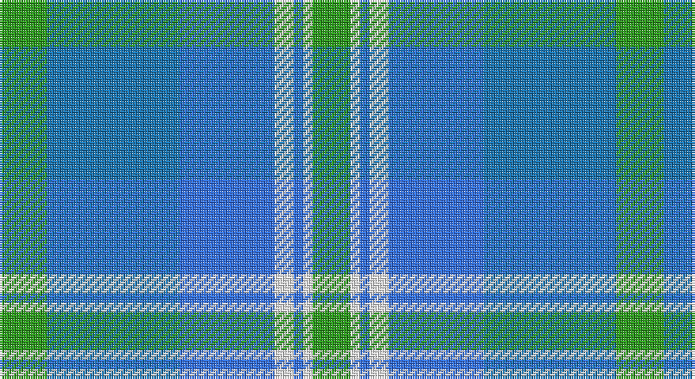

This page is one **sett** — a single exact thread-count. It belongs to the [tartan](/setts/g5b14bi10w2bi1w1g4/)
(the same proportion at any scale), whose colour order is pattern [GBBWBWG](/stripes/gbbwbwg/).

Sourced from tartans-authority.  It is a [7 stripe tartan](/stripes/stripes7/).

Original link http://www.tartansauthority.com/tartan-ferret/display/4777/

## Register references

External register numbers recorded for this tartan.

- Scottish Tartans Authority (ITI): 4777

## Thread count
G/20 Ba56 B40 W8 B4 W4 G/16

One full sett is **260 threads**.

## Palette

Palette: <strong>Tartan Register</strong> <small style="color:#888">(3 of 4 colours)</small>
<table><thead><tr><th>Colour</th><th>Threads</th><th>Shade</th><th>Base</th><th>OKLCh</th></tr></thead><tbody><tr><td>G/</td><td style="text-align:right;font-variant-numeric:tabular-nums">20</td><td><code style="background-color:#289C18;">#289C18</code> <small style="color:#888">#289C18</small></td><td>G <code style="background-color:#006100;">#006100</code></td><td><small style="color:#888">oklch(60.6% 0.191 141.6)</small></td></tr><tr><td>Ba</td><td style="text-align:right;font-variant-numeric:tabular-nums">56</td><td><code style="background-color:#1474B4;">#1474B4</code> <small style="color:#888">#1474B4</small></td><td>B <code style="background-color:#2A418A;">#2A418A</code></td><td><small style="color:#888">oklch(54.0% 0.129 245.1)</small></td></tr><tr><td>B</td><td style="text-align:right;font-variant-numeric:tabular-nums">40</td><td><code style="background-color:#3070FC;">#3070FC</code> <small style="color:#888">#3070FC</small></td><td>B <code style="background-color:#2A418A;">#2A418A</code></td><td><small style="color:#888">oklch(58.8% 0.219 262.9)</small></td></tr><tr><td>W</td><td style="text-align:right;font-variant-numeric:tabular-nums">8</td><td><code style="background-color:#F8F8F8;">#F8F8F8</code> <small style="color:#888">#F8F8F8</small></td><td>W <code style="background-color:#F7F7F7;">#F7F7F7</code></td><td><small style="color:#888">oklch(97.9% 0.000 89.9)</small></td></tr><tr><td>B</td><td style="text-align:right;font-variant-numeric:tabular-nums">4</td><td><code style="background-color:#3070FC;">#3070FC</code> <small style="color:#888">#3070FC</small></td><td>B <code style="background-color:#2A418A;">#2A418A</code></td><td><small style="color:#888">oklch(58.8% 0.219 262.9)</small></td></tr><tr><td>W</td><td style="text-align:right;font-variant-numeric:tabular-nums">4</td><td><code style="background-color:#F8F8F8;">#F8F8F8</code> <small style="color:#888">#F8F8F8</small></td><td>W <code style="background-color:#F7F7F7;">#F7F7F7</code></td><td><small style="color:#888">oklch(97.9% 0.000 89.9)</small></td></tr><tr><td>G/</td><td style="text-align:right;font-variant-numeric:tabular-nums">16</td><td><code style="background-color:#289C18;">#289C18</code> <small style="color:#888">#289C18</small></td><td>G <code style="background-color:#006100;">#006100</code></td><td><small style="color:#888">oklch(60.6% 0.191 141.6)</small></td></tr></tbody></table>

# Sample pattern

## Nearest tartans

The nearest existing variants by ΔTartan distance, with this tartan at the top so the swatches line up against it.

ΔTartan

Tartan

Sett

—

<a href="/ttd/edit/#slug=g5b14bi10w2bi1w1g4~x4">Earl of St. Andrews (Fashion)</a> <a class="nn-out" href="/variants/s7/g5b14bi10w2bi1w1g4~x4/" title="open its dictionary page">↗</a>

1.44

<a href="/ttd/edit/#slug=w15lg98dt72b25dt8ly15&amp;base=g5b14bi10w2bi1w1g4~x4">Afternoon Tea / Mint Tea</a> <a class="nn-out" href="/variants/s6/w15lg98dt72b25dt8ly15/" title="open its dictionary page">↗</a>

1.48

<a href="/ttd/edit/#slug=b30dt15lb4dg12lb9b8lb3~x2&amp;base=g5b14bi10w2bi1w1g4~x4">Newall (Personal)</a> <a class="nn-out" href="/variants/s7/b30dt15lb4dg12lb9b8lb3~x2/" title="open its dictionary page">↗</a>

1.59

<a href="/ttd/edit/#slug=g5db15t11w2t1w1dg4~x4&amp;base=g5b14bi10w2bi1w1g4~x4">Highlands Country Club</a> <a class="nn-out" href="/variants/s7/g5db15t11w2t1w1dg4~x4/" title="open its dictionary page">↗</a>

1.59

<a href="/ttd/edit/#slug=r15t98dt72ly25dt8w15&amp;base=g5b14bi10w2bi1w1g4~x4">Afternoon Tea / Earl Grey</a> <a class="nn-out" href="/variants/s6/r15t98dt72ly25dt8w15/" title="open its dictionary page">↗</a>

1.63

<a href="/ttd/edit/#slug=dt4b28dt11w2dt2g14ly2~x2&amp;base=g5b14bi10w2bi1w1g4~x4">Rhode Island, State of</a> <a class="nn-out" href="/variants/s7/dt4b28dt11w2dt2g14ly2~x2/" title="open its dictionary page">↗</a>

1.69

<a href="/ttd/edit/#slug=g5mi3g32k16b32m3b5~x2&amp;base=g5b14bi10w2bi1w1g4~x4">MacThomas</a> <a class="nn-out" href="/variants/s7/g5mi3g32k16b32m3b5~x2/" title="open its dictionary page">↗</a>

1.72

<a href="/ttd/edit/#slug=w4t1lo2t22b20w2b4w2~x2&amp;base=g5b14bi10w2bi1w1g4~x4">Gorman Blue (Personal)</a> <a class="nn-out" href="/variants/s8/w4t1lo2t22b20w2b4w2~x2/" title="open its dictionary page">↗</a>

1.72

<a href="/ttd/edit/#slug=k2t2k2t15g15k2g2w2~x4&amp;base=g5b14bi10w2bi1w1g4~x4">Ben Lomond (Fashion)</a> <a class="nn-out" href="/variants/s8/k2t2k2t15g15k2g2w2~x4/" title="open its dictionary page">↗</a>

1.73

<a href="/ttd/edit/#slug=w9b3ly3b24db24ly2db2ly2~x2&amp;base=g5b14bi10w2bi1w1g4~x4">Halesowen (District)</a> <a class="nn-out" href="/variants/s8/w9b3ly3b24db24ly2db2ly2~x2/" title="open its dictionary page">↗</a>

1.74

<a href="/ttd/edit/#slug=db35w3db8t36dg9o3~x2&amp;base=g5b14bi10w2bi1w1g4~x4">Georgian Bay, Waters of</a> <a class="nn-out" href="/variants/s6/db35w3db8t36dg9o3~x2/" title="open its dictionary page">↗</a>

## Neighbour map

Every grey dot is one of 14360 variants placed by the first two principal components of the ΔTartan feature space (44% of its variance). Red is this tartan; blue dots are its nearest — click one to open its page.

<svg viewBox="0 0 640 380" role="img" style="max-width:100%;height:auto;border:1px solid #e0e0e0;border-radius:4px;display:block" xmlns="http://www.w3.org/2000/svg"><image href="/nn/cloud.v1.png" width="640" height="380"/><a href="/variants/s6/w15lg98dt72b25dt8ly15/"><circle cx="192.8" cy="182.3" r="4" fill="#3465a4"><title>Afternoon Tea / Mint Tea</title></circle></a><a href="/variants/s7/b30dt15lb4dg12lb9b8lb3~x2/"><circle cx="215.4" cy="216.3" r="4" fill="#3465a4"><title>Newall (Personal)</title></circle></a><a href="/variants/s7/g5db15t11w2t1w1dg4~x4/"><circle cx="198.6" cy="178.9" r="4" fill="#3465a4"><title>Highlands Country Club</title></circle></a><a href="/variants/s6/r15t98dt72ly25dt8w15/"><circle cx="207.9" cy="186.9" r="4" fill="#3465a4"><title>Afternoon Tea / Earl Grey</title></circle></a><a href="/variants/s7/dt4b28dt11w2dt2g14ly2~x2/"><circle cx="246.4" cy="182.1" r="4" fill="#3465a4"><title>Rhode Island, State of</title></circle></a><a href="/variants/s7/g5mi3g32k16b32m3b5~x2/"><circle cx="212.0" cy="199.5" r="4" fill="#3465a4"><title>MacThomas</title></circle></a><a href="/variants/s8/w4t1lo2t22b20w2b4w2~x2/"><circle cx="297.7" cy="161.6" r="4" fill="#3465a4"><title>Gorman Blue (Personal)</title></circle></a><a href="/variants/s8/k2t2k2t15g15k2g2w2~x4/"><circle cx="232.9" cy="204.6" r="4" fill="#3465a4"><title>Ben Lomond (Fashion)</title></circle></a><a href="/variants/s8/w9b3ly3b24db24ly2db2ly2~x2/"><circle cx="210.7" cy="169.5" r="4" fill="#3465a4"><title>Halesowen (District)</title></circle></a><a href="/variants/s6/db35w3db8t36dg9o3~x2/"><circle cx="247.7" cy="196.7" r="4" fill="#3465a4"><title>Georgian Bay, Waters of</title></circle></a><circle cx="211.3" cy="200.2" r="5" fill="#c00000"/></svg>

ID: /variants/s7/g5b14bi10w2bi1w1g4~x4/
