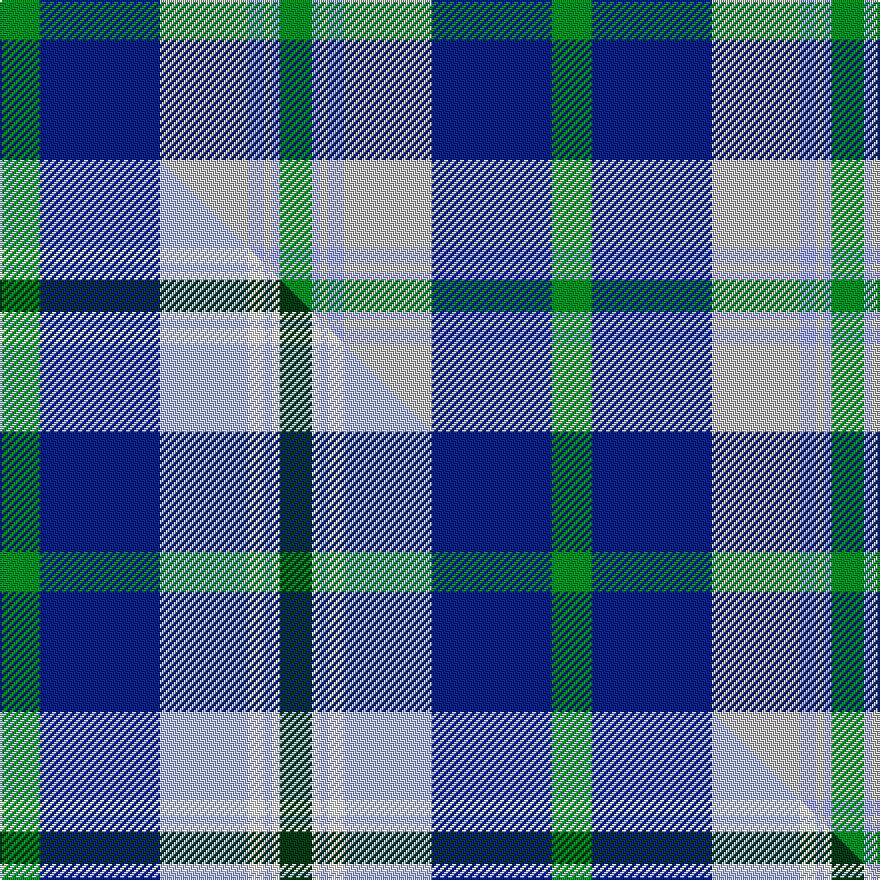

This is one **variant** — a specific cloth: this exact thread count and colourway, with its own
provenance below. It is one weaving of the [sett](/setts/g5db15lbi11lb2lbi1lb1g4/) (the scale-free proportion — the
same cloth at any scale or shade), whose colour order is pattern [GBWWWWG](/stripes/gbwwwwg/).

Part of the [Highlands Country Club](/tartans/h/hi/highlands-country-club-2/) tartan — the named design grouping this sett with its other cloths.

Sourced from tartans-authority.  It is a [7 stripe tartan](/stripes/stripes7/).

Original link [https://www.tartanregister.gov.uk/tartanDetails.aspx?ref=687](https://www.tartanregister.gov.uk/tartanDetails.aspx?ref=687)

Dataset <small>— provenance for this record, inherited from the source manifest</small>

<dl class="dataset-prov">
<dt>source</dt><dd><a href="/sources/tartans-authority/">Scottish Tartans Authority</a></dd>
<dt>data captured from</dt><dd><a href="https://github.com/thetartan/tartan-database/blob/master/data/tartans-authority/data.csv">https://github.com/thetartan/tartan-database/blob/master/data/tartans-authority/data.csv</a></dd>
<dt>data date</dt><dd>pre 2002 <small>(this record)</small></dd>
<dt>licence</dt><dd><a href="https://creativecommons.org/licenses/by-nc-nd/4.0/">CC BY-NC-ND 4.0</a></dd>
</dl>

Capture chain <small>— the hands this data passed through, oldest first; each capture carries its own licence</small>

<ol class="capture-chain">
<li><a href="https://www.tartansauthority.com/">Scottish Tartans Authority</a> <small>the heritage body's archive — its tartan-ferret record browser is retired (links repaired to the SRT, above)</small></li>
<li><a href="https://github.com/thetartan/tartan-database">thetartan/tartan-database</a> <small>2016-2017</small> · <a href="https://creativecommons.org/licenses/by-nc-nd/4.0/">CC BY-NC-ND 4.0</a> <small>Levko Kravets's frozen compilation — the capture we vendored, and where its CC licence text came from</small></li>
<li>this dictionary <small>captured 2026-06-10 · commit 5bf86c7566</small> <small>each re-capture is a git commit to data/sources</small></li>
</ol>

## Register references

External register numbers recorded for this tartan.

- Scottish Tartans Authority (ITI): 687

## Thread count
G/20 DB60 LBi44 LB8 LBi4 LB4 G/16

One full sett is **276 threads**.

## Palette
<table><thead><tr><th>Colour</th><th>Shade</th><th>OKLCh</th></tr></thead><tbody><tr><td>G</td><td><code style="background-color:#008B2A;">#008B2A</code> <small style="color:#888">#008B2A</small></td><td><small style="color:#888">oklch(55.4% 0.170 145.9)</small></td></tr><tr><td>LB</td><td><code style="background-color:#A8ACE8;">#A8ACE8</code> <small style="color:#888">#A8ACE8</small></td><td><small style="color:#888">oklch(76.3% 0.086 281.2)</small></td></tr><tr><td>DB</td><td><code style="background-color:#082077;">#082077</code> <small style="color:#888">#082077</small></td><td><small style="color:#888">oklch(30.0% 0.149 265.1)</small></td></tr><tr><td>LB</td><td><code style="background-color:#C0C0C0;">#C0C0C0</code> <small style="color:#888">#C0C0C0</small></td><td><small style="color:#888">oklch(80.8% 0.000 89.9)</small></td></tr><tr><td>DG</td><td><code style="background-color:#053819;">#053819</code> <small style="color:#888">#053819</small></td><td><small style="color:#888">oklch(30.0% 0.075 151.3)</small></td></tr></tbody></table>

# Sample pattern

## Compared to the master

This cloth is one sett of its design; the master sett (the exemplar the design is anchored on) is below for comparison.

Its **ΔTartan distance** from the master is **2.50** — the same measure the nearest-tartans table ranks by (0 is identical; a re-scale of the same cloth is near 0, a recolour or a different proportion further).

<figure class="master-compare" style="margin:0">

this sett
master sett ★

<figcaption style="color:#888;font-size:smaller">One weave of this sett against the <a href="/setts/g5db15lb11w2lb1w1dg4/">master sett ★</a>, split on the diagonal: a shared proportion runs seamlessly across it with only the shades shifting; a different proportion breaks on it.</figcaption>
</figure>

## Nearest tartan variants

The nearest existing variants by ΔTartan distance, with this cloth at the top so the swatches line up against it.

ΔTartan

Threads

Variant

Sett

—

276

<a href="/variants/s7/g5db15lbi11lb2lbi1lb1g4~x4~lbi3200000-lb3103284/">Highlands Country Club (Corporate)</a>

<a href="/ttd/edit/#slug=w9t3y3t24db24y2db2y2~x2&amp;base=g5db15lbi11lb2lbi1lb1g4~x4~lbi3200000-lb3103284" title="compare in the TTD">1.97</a>

254

<a href="/variants/s8/w9t3y3t24db24y2db2y2~x2/">Halesowen (District)</a>

<a href="/ttd/edit/#slug=g19w1db12lb2db2lb2db2lb16~x2&amp;base=g5db15lbi11lb2lbi1lb1g4~x4~lbi3200000-lb3103284" title="compare in the TTD">2.03</a>

154

<a href="/variants/s8/g19w1db12lb2db2lb2db2lb16~x2/">Unidentified No 52</a>

<a href="/ttd/edit/#slug=g19w1db12lb2db2lb2db2lb16~x2~db1004274&amp;base=g5db15lbi11lb2lbi1lb1g4~x4~lbi3200000-lb3103284" title="compare in the TTD">2.25</a>

154

<a href="/variants/s8/g19w1db12lb2db2lb2db2lb16~x2~db1004274/">Norwich No.052</a>

<a href="/ttd/edit/#slug=w4db30g10dr25w2~x2&amp;base=g5db15lbi11lb2lbi1lb1g4~x4~lbi3200000-lb3103284" title="compare in the TTD">2.42</a>

272

<a href="/variants/s5/w4db30g10dr25w2~x2/">Highland Spring Dress (2004) (Corp)</a>

<a href="/ttd/edit/#slug=dg35db40w11y3dg7~x2&amp;base=g5db15lbi11lb2lbi1lb1g4~x4~lbi3200000-lb3103284" title="compare in the TTD">2.45</a>

300

<a href="/variants/s5/dg35db40w11y3dg7~x2/">Fife Ethylene Plant</a>

<a href="/ttd/edit/#slug=g5db15lb11w2lb1w1dg4~x4&amp;base=g5db15lbi11lb2lbi1lb1g4~x4~lbi3200000-lb3103284" title="compare in the TTD">2.50</a>

276

<a href="/variants/s7/g5db15lb11w2lb1w1dg4~x4/">Highlands Country Club Corporate Tartan</a>

<a href="/ttd/edit/#slug=r2g12db2g8db18w3r2w2~x2&amp;base=g5db15lbi11lb2lbi1lb1g4~x4~lbi3200000-lb3103284" title="compare in the TTD">2.54</a>

188

<a href="/variants/s8/r2g12db2g8db18w3r2w2~x2/">Albuquerque, City of</a>

<a href="/ttd/edit/#slug=g4w28dp8dy2db17g4~x2&amp;base=g5db15lbi11lb2lbi1lb1g4~x4~lbi3200000-lb3103284" title="compare in the TTD">2.63</a>

236

<a href="/variants/s6/g4w28dp8dy2db17g4~x2/">Manx Dress</a>

<a href="/ttd/edit/#slug=g4w28dp8y2db17g4~x2&amp;base=g5db15lbi11lb2lbi1lb1g4~x4~lbi3200000-lb3103284" title="compare in the TTD">2.64</a>

236

<a href="/variants/s6/g4w28dp8y2db17g4~x2/">Manx Dress District Tartan</a>

<a href="/ttd/edit/#slug=db1g7db7dbi2w6db1w1~x4~db0906265-dbi1208266&amp;base=g5db15lbi11lb2lbi1lb1g4~x4~lbi3200000-lb3103284" title="compare in the TTD">2.72</a>

192

<a href="/variants/s7/db1g7db7dbi2w6db1w1~x4~db0906265-dbi1208266/">Blue Boy, The (Fashion)</a>

## Neighbour map

Every grey dot is one of 13656 variants placed by the first two principal components of the ΔTartan feature space (42% of its variance). Red is this tartan; blue dots are its nearest — click one to open its page. The map is a flat projection of a many-dimensional space — [how to read it](/posts/neighbourhood-maps/).

<svg viewBox="0 0 640 380" role="img" style="max-width:100%;height:auto;border:1px solid #e0e0e0;border-radius:4px;display:block" xmlns="http://www.w3.org/2000/svg"><image href="/nn/cloud.v1.png" width="640" height="380"/><a href="/variants/s8/w9t3y3t24db24y2db2y2~x2/"><circle cx="248.8" cy="199.2" r="4" fill="#3465a4"><title>Halesowen (District)</title></circle></a><a href="/variants/s8/g19w1db12lb2db2lb2db2lb16~x2/"><circle cx="251.5" cy="192.6" r="4" fill="#3465a4"><title>Unidentified No 52</title></circle></a><a href="/variants/s8/g19w1db12lb2db2lb2db2lb16~x2~db1004274/"><circle cx="248.4" cy="190.4" r="4" fill="#3465a4"><title>Norwich No.052</title></circle></a><a href="/variants/s5/w4db30g10dr25w2~x2/"><circle cx="268.1" cy="225.0" r="4" fill="#3465a4"><title>Highland Spring Dress (2004) (Corp)</title></circle></a><a href="/variants/s5/dg35db40w11y3dg7~x2/"><circle cx="277.2" cy="229.6" r="4" fill="#3465a4"><title>Fife Ethylene Plant</title></circle></a><a href="/variants/s7/g5db15lb11w2lb1w1dg4~x4/"><circle cx="195.3" cy="186.3" r="4" fill="#3465a4"><title>Highlands Country Club Corporate Tartan</title></circle></a><a href="/variants/s8/r2g12db2g8db18w3r2w2~x2/"><circle cx="210.6" cy="199.5" r="4" fill="#3465a4"><title>Albuquerque, City of</title></circle></a><a href="/variants/s6/g4w28dp8dy2db17g4~x2/"><circle cx="206.6" cy="187.8" r="4" fill="#3465a4"><title>Manx Dress</title></circle></a><a href="/variants/s6/g4w28dp8y2db17g4~x2/"><circle cx="207.4" cy="188.1" r="4" fill="#3465a4"><title>Manx Dress District Tartan</title></circle></a><a href="/variants/s7/db1g7db7dbi2w6db1w1~x4~db0906265-dbi1208266/"><circle cx="162.3" cy="238.5" r="4" fill="#3465a4"><title>Blue Boy, The (Fashion)</title></circle></a><circle cx="229.5" cy="203.6" r="5" fill="#c00000"/><text x="320" y="376" text-anchor="middle" font-size="11" fill="#999">ground</text><text x="11" y="190" text-anchor="middle" font-size="11" fill="#999" transform="rotate(-90 11 190)">complexity</text></svg>

ID: /variants/s7/g5db15lbi11lb2lbi1lb1g4~x4~lbi3200000-lb3103284/
