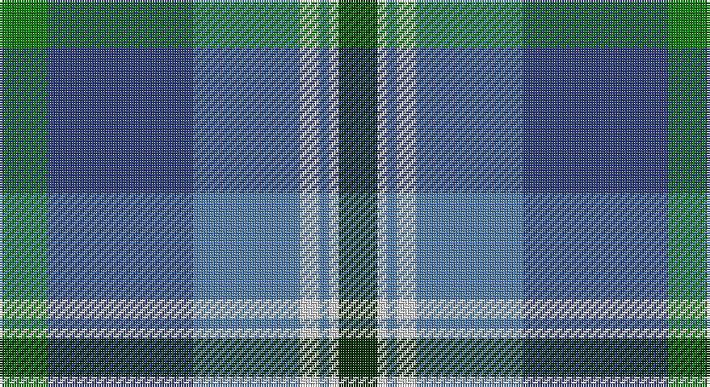

This page is one **sett** — a single exact thread-count. It belongs to the [tartan](/setts/g5db15t11w2t1w1dg4/)
(the same proportion at any scale), whose colour order is pattern [GBBWBWG](/stripes/gbbwbwg/).

Part of the [Highlands Country Club](/tartans/highlands-country-club/) tartan — the named design grouping this sett with its other cloths.

Sourced from weddslist.  It is a [7 stripe tartan](/stripes/stripes7/).

Original link http://www.weddslist.com/cgi-bin/tartans/pg.pl?source=sts

## Provenance

Earliest known date: 1984 Weft uses a dark green.

2 attestations — the source records this cloth was collapsed from (oldest owns this page)

<ul>
<li>undated — Highlands Country Club (weddslist, <a href="http://www.weddslist.com/cgi-bin/tartans/pg.pl?source=sts">record</a>)</li>
<li>undated — Highlands Country Club Corporate Tartan (house-of-tartan, <a href="http://www.house-of-tartan.scotland.net/house/TartanViewjs.asp?colr=Def&tnam=687">record</a>)</li>
</ul>

## Thread count
G/20 B60 Ba44 LN8 Ba4 LN4 DG/16

One full sett is **276 threads**.

## Palette

Palette: <strong>Tartan Dictionary</strong> <small style="color:#888">(1 of 5 colours)</small>
<table><thead><tr><th>Colour</th><th>Threads</th><th>Shade</th><th>Base</th><th>OKLCh</th></tr></thead><tbody><tr><td>G/</td><td style="text-align:right;font-variant-numeric:tabular-nums">20</td><td><code style="background-color:#008000;">#008000</code> <small style="color:#888">#008000</small></td><td>G <code style="background-color:#006100;">#006100</code></td><td><small style="color:#888">oklch(52.0% 0.177 142.5)</small></td></tr><tr><td>B</td><td style="text-align:right;font-variant-numeric:tabular-nums">60</td><td><code style="background-color:#304080;">#304080</code> <small style="color:#888">#304080</small></td><td>B <code style="background-color:#2A418A;">#2A418A</code></td><td><small style="color:#888">oklch(39.4% 0.109 270.2)</small></td></tr><tr><td>Ba</td><td style="text-align:right;font-variant-numeric:tabular-nums">44</td><td><code style="background-color:#5480B0;">#5480B0</code> <small style="color:#888">#5480B0</small></td><td>B <code style="background-color:#2A418A;">#2A418A</code></td><td><small style="color:#888">oklch(58.8% 0.089 251.5)</small></td></tr><tr><td>LN</td><td style="text-align:right;font-variant-numeric:tabular-nums">8</td><td><code style="background-color:#E0E0E0;">#E0E0E0</code> <small style="color:#888">#E0E0E0</small></td><td>W <code style="background-color:#F7F7F7;">#F7F7F7</code></td><td><small style="color:#888">oklch(90.7% 0.000 89.9)</small></td></tr><tr><td>Ba</td><td style="text-align:right;font-variant-numeric:tabular-nums">4</td><td><code style="background-color:#5480B0;">#5480B0</code> <small style="color:#888">#5480B0</small></td><td>B <code style="background-color:#2A418A;">#2A418A</code></td><td><small style="color:#888">oklch(58.8% 0.089 251.5)</small></td></tr><tr><td>LN</td><td style="text-align:right;font-variant-numeric:tabular-nums">4</td><td><code style="background-color:#E0E0E0;">#E0E0E0</code> <small style="color:#888">#E0E0E0</small></td><td>W <code style="background-color:#F7F7F7;">#F7F7F7</code></td><td><small style="color:#888">oklch(90.7% 0.000 89.9)</small></td></tr><tr><td>DG/</td><td style="text-align:right;font-variant-numeric:tabular-nums">16</td><td><code style="background-color:#003000;">#003000</code> <small style="color:#888">#003000</small></td><td>G <code style="background-color:#006100;">#006100</code></td><td><small style="color:#888">oklch(26.8% 0.091 142.5)</small></td></tr></tbody></table>

# Sample pattern

## Compared to the master

This cloth is one sett of its design; the master sett (the exemplar the design is anchored on) is below for comparison.

<figure style="margin:0"><figcaption style="color:#888;font-size:smaller">this sett</figcaption></figure>
<figure style="margin:0"><figcaption style="color:#888;font-size:smaller"><a href="/setts/db15lbi11lb2lbi1lb1g4lb1lbi1lb2lbi11db15g5/">master sett →</a></figcaption></figure>

## Nearest tartans

The nearest existing variants by ΔTartan distance, with this tartan at the top so the swatches line up against it.

ΔTartan

Tartan

Sett

—

<a href="/ttd/edit/#slug=g5db15t11w2t1w1dg4~x4">Highlands Country Club</a> <a class="nn-out" href="/variants/s7/g5db15t11w2t1w1dg4~x4/" title="open its dictionary page">↗</a>

0.81

<a href="/ttd/edit/#slug=dt4b28dt11w2dt2g14ly2~x2&amp;base=g5db15t11w2t1w1dg4~x4">Rhode Island, State of</a> <a class="nn-out" href="/variants/s7/dt4b28dt11w2dt2g14ly2~x2/" title="open its dictionary page">↗</a>

0.85

<a href="/ttd/edit/#slug=g5mi3g32k16b32m3b5~x2&amp;base=g5db15t11w2t1w1dg4~x4">MacThomas</a> <a class="nn-out" href="/variants/s7/g5mi3g32k16b32m3b5~x2/" title="open its dictionary page">↗</a>

0.87

<a href="/ttd/edit/#slug=r15t98dt72ly25dt8w15&amp;base=g5db15t11w2t1w1dg4~x4">Afternoon Tea / Earl Grey</a> <a class="nn-out" href="/variants/s6/r15t98dt72ly25dt8w15/" title="open its dictionary page">↗</a>

0.89

<a href="/ttd/edit/#slug=dg6r2db1r3db16g20w2~x2&amp;base=g5db15t11w2t1w1dg4~x4">MacCord / McCord (Personal)</a> <a class="nn-out" href="/variants/s7/dg6r2db1r3db16g20w2~x2/" title="open its dictionary page">↗</a>

1.01

<a href="/ttd/edit/#slug=b11k4g4m1g4k1r1~x4&amp;base=g5db15t11w2t1w1dg4~x4">Ednie (Personal)</a> <a class="nn-out" href="/variants/s7/b11k4g4m1g4k1r1~x4/" title="open its dictionary page">↗</a>

1.07

<a href="/ttd/edit/#slug=db3t24k11db20w2db5lo3~x2&amp;base=g5db15t11w2t1w1dg4~x4">Icelandair</a> <a class="nn-out" href="/variants/s7/db3t24k11db20w2db5lo3~x2/" title="open its dictionary page">↗</a>

1.11

<a href="/ttd/edit/#slug=db26w2db3dbi15t26dbi2t3ly4~x2&amp;base=g5db15t11w2t1w1dg4~x4">Banff and Buchan District Tartan</a> <a class="nn-out" href="/variants/s8/db26w2db3dbi15t26dbi2t3ly4~x2/" title="open its dictionary page">↗</a>

1.13

<a href="/ttd/edit/#slug=r1o5dt3dti11dt3o5lo1~x8&amp;base=g5db15t11w2t1w1dg4~x4">Newmill</a> <a class="nn-out" href="/variants/s7/r1o5dt3dti11dt3o5lo1~x8/" title="open its dictionary page">↗</a>

1.14

<a href="/ttd/edit/#slug=dy2g12k10r1b16r2~x4&amp;base=g5db15t11w2t1w1dg4~x4">MacWilliam (Clan)</a> <a class="nn-out" href="/variants/s6/dy2g12k10r1b16r2~x4/" title="open its dictionary page">↗</a>

1.14

<a href="/ttd/edit/#slug=b5dy28lb5k20lo5b47lo4~x2&amp;base=g5db15t11w2t1w1dg4~x4">State Seal of Washington (Fashion)</a> <a class="nn-out" href="/variants/s7/b5dy28lb5k20lo5b47lo4~x2/" title="open its dictionary page">↗</a>

## Neighbour map

Every grey dot is one of 14360 variants placed by the first two principal components of the ΔTartan feature space (44% of its variance). Red is this tartan; blue dots are its nearest — click one to open its page.

<svg viewBox="0 0 640 380" role="img" style="max-width:100%;height:auto;border:1px solid #e0e0e0;border-radius:4px;display:block" xmlns="http://www.w3.org/2000/svg"><image href="/nn/cloud.v1.png" width="640" height="380"/><a href="/variants/s7/dt4b28dt11w2dt2g14ly2~x2/"><circle cx="246.4" cy="182.1" r="4" fill="#3465a4"><title>Rhode Island, State of</title></circle></a><a href="/variants/s7/g5mi3g32k16b32m3b5~x2/"><circle cx="212.0" cy="199.5" r="4" fill="#3465a4"><title>MacThomas</title></circle></a><a href="/variants/s6/r15t98dt72ly25dt8w15/"><circle cx="207.9" cy="186.9" r="4" fill="#3465a4"><title>Afternoon Tea / Earl Grey</title></circle></a><a href="/variants/s7/dg6r2db1r3db16g20w2~x2/"><circle cx="226.2" cy="158.2" r="4" fill="#3465a4"><title>MacCord / McCord (Personal)</title></circle></a><a href="/variants/s7/b11k4g4m1g4k1r1~x4/"><circle cx="212.9" cy="195.3" r="4" fill="#3465a4"><title>Ednie (Personal)</title></circle></a><a href="/variants/s7/db3t24k11db20w2db5lo3~x2/"><circle cx="206.7" cy="188.5" r="4" fill="#3465a4"><title>Icelandair</title></circle></a><a href="/variants/s8/db26w2db3dbi15t26dbi2t3ly4~x2/"><circle cx="196.0" cy="169.2" r="4" fill="#3465a4"><title>Banff and Buchan District Tartan</title></circle></a><a href="/variants/s7/r1o5dt3dti11dt3o5lo1~x8/"><circle cx="205.9" cy="209.3" r="4" fill="#3465a4"><title>Newmill</title></circle></a><a href="/variants/s6/dy2g12k10r1b16r2~x4/"><circle cx="193.3" cy="192.3" r="4" fill="#3465a4"><title>MacWilliam (Clan)</title></circle></a><a href="/variants/s7/b5dy28lb5k20lo5b47lo4~x2/"><circle cx="218.6" cy="177.7" r="4" fill="#3465a4"><title>State Seal of Washington (Fashion)</title></circle></a><circle cx="198.6" cy="178.9" r="5" fill="#c00000"/></svg>

ID: /variants/s7/g5db15t11w2t1w1dg4~x4/
