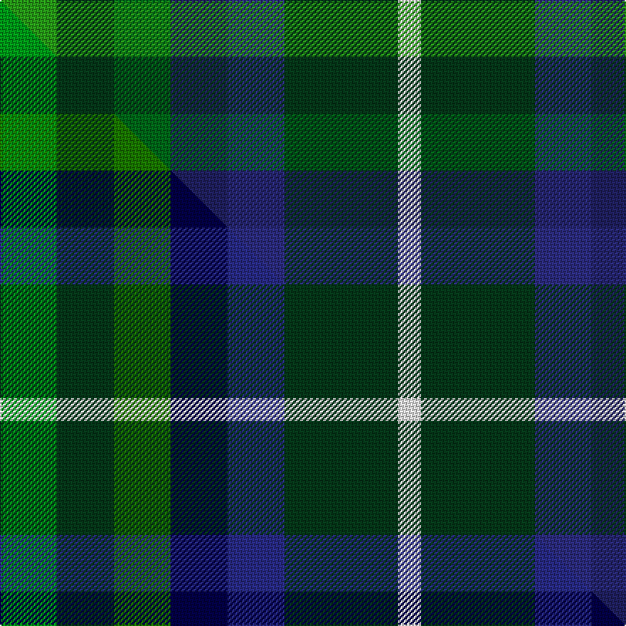

This page is one **sett** — a single exact thread-count. It belongs to the [tartan](/setts/g5dg5dgi5db5dbi5dg10w2/)
(the same proportion at any scale), whose colour order is pattern [GGGBBGW](/stripes/gggbbgw/).

Part of the [Pollard](/tartans/pollard/) tartan — the named design grouping this sett with its other cloths.

Sourced from tartans-authority.  It is a [7 stripe tartan](/stripes/stripes7/).

Original link [https://www.tartanregister.gov.uk/tartanDetails.aspx?ref=11151](https://www.tartanregister.gov.uk/tartanDetails.aspx?ref=11151)

Dataset <small>— provenance for this record, inherited from the source manifest</small>

<dl class="dataset-prov">
<dt>source</dt><dd><a href="/sources/tartans-authority/">Scottish Tartans Authority</a></dd>
<dt>data captured from</dt><dd><a href="https://github.com/thetartan/tartan-database/blob/master/data/tartans-authority/data.csv">https://github.com/thetartan/tartan-database/blob/master/data/tartans-authority/data.csv</a></dd>
<dt>data date</dt><dd>2014 <small>(this record)</small></dd>
<dt>licence</dt><dd><a href="https://creativecommons.org/licenses/by-nc-nd/4.0/">CC BY-NC-ND 4.0</a></dd>
</dl>

Capture chain <small>— the hands this data passed through, oldest first; each capture carries its own licence</small>

<ol class="capture-chain">
<li><a href="https://www.tartansauthority.com/">Scottish Tartans Authority</a> <small>the heritage body's archive — its tartan-ferret record browser is retired (links repaired to the SRT, above)</small></li>
<li><a href="https://github.com/thetartan/tartan-database">thetartan/tartan-database</a> <small>2016-2017</small> · <a href="https://creativecommons.org/licenses/by-nc-nd/4.0/">CC BY-NC-ND 4.0</a> <small>Levko Kravets's frozen compilation — the capture we vendored, and where its CC licence text came from</small></li>
<li>this dictionary <small>captured 2026-06-10 · commit 5bf86c7566</small> <small>each re-capture is a git commit to data/sources</small></li>
</ol>

## Register references

External register numbers recorded for this tartan.

- Scottish Register of Tartans: [11151](https://www.tartanregister.gov.uk/tartanDetails?ref=11151)
- Scottish Tartans Authority (ITI): 11151

## Thread count
G/40 DG40 DGi40 DB40 DBi40 DG80 W/16

One full sett is **536 threads**.

## Palette
<table><thead><tr><th>Colour</th><th>Shade</th><th>OKLCh</th></tr></thead><tbody><tr><td>DB</td><td><code style="background-color:#2C2C80;">#2C2C80</code> <small style="color:#888">#2C2C80</small></td><td><small style="color:#888">oklch(35.0% 0.138 276.6)</small></td></tr><tr><td>DB</td><td><code style="background-color:#202060;">#202060</code> <small style="color:#888">#202060</small></td><td><small style="color:#888">oklch(28.9% 0.111 276.9)</small></td></tr><tr><td>DG</td><td><code style="background-color:#053819;">#053819</code> <small style="color:#888">#053819</small></td><td><small style="color:#888">oklch(30.0% 0.075 151.3)</small></td></tr><tr><td>G</td><td><code style="background-color:#289C18;">#289C18</code> <small style="color:#888">#289C18</small></td><td><small style="color:#888">oklch(60.6% 0.191 141.6)</small></td></tr><tr><td>DG</td><td><code style="background-color:#006818;">#006818</code> <small style="color:#888">#006818</small></td><td><small style="color:#888">oklch(45.0% 0.142 145.0)</small></td></tr><tr><td>W</td><td><code style="background-color:#F7F7F7;">#F7F7F7</code> <small style="color:#888">#F7F7F7</small></td><td><small style="color:#888">oklch(97.6% 0.000 89.9)</small></td></tr></tbody></table>

# Sample pattern

## Compared to the master

This cloth is one sett of its design; the master sett (the exemplar the design is anchored on) is below for comparison.

Its **ΔTartan distance** from the master is **0.06** — the same measure the nearest-tartans table ranks by (0 is identical; a re-scale of the same cloth is near 0, a recolour or a different proportion further).

<figure class="master-compare" style="margin:0">

this sett
master sett ★

<figcaption style="color:#888;font-size:smaller">One weave of this sett against the <a href="/setts/gi5dg5g5db5dbi5dg10w2/">master sett ★</a>, split on the diagonal: a shared proportion runs seamlessly across it with only the shades shifting; a different proportion breaks on it.</figcaption>
</figure>

## Nearest tartan variants

The nearest existing variants by ΔTartan distance, with this cloth at the top so the swatches line up against it.

ΔTartan

Threads

Variant

Sett

—

536

<a href="/variants/s7/g5dg5dgi5db5dbi5dg10w2~x8~g2408144-dgi1806142-db1204274-dbi1406275/">Pollard (2014)</a>

<a href="/ttd/edit/#slug=gi5dg5g5k5db5dg10w2~x8~gi2408144-g2007139-k0705267-db1406275&amp;base=g5dg5dgi5db5dbi5dg10w2~x8~g2408144-dgi1806142-db1204274-dbi1406275" title="compare in the TTD">0.05</a>

536

<a href="/variants/s7/gi5dg5g5db5dbi5dg10w2~x8~gi2408144-g2007139-db0705267-dbi1406275/">Pollard (2014)</a>

<a href="/ttd/edit/#slug=y1db4o1g5dr2g1w1~x2~o1905046-dr1205000&amp;base=g5dg5dgi5db5dbi5dg10w2~x8~g2408144-dgi1806142-db1204274-dbi1406275" title="compare in the TTD">2.00</a>

56

<a href="/variants/s7/y1db4o1g5dr2g1w1~x2~o1905046-dr1205000/">Deeside District</a>

<a href="/ttd/edit/#slug=db5dy2dg4n3w1lb5~x8&amp;base=g5dg5dgi5db5dbi5dg10w2~x8~g2408144-dgi1806142-db1204274-dbi1406275" title="compare in the TTD">2.11</a>

240

<a href="/variants/s6/db5dy2dg4n3w1lb5~x8/">Heriot Bay Local (Quadra Island, British Columbia)</a>

<a href="/ttd/edit/#slug=y4dg30g15db5lb10y4~x2&amp;base=g5dg5dgi5db5dbi5dg10w2~x8~g2408144-dgi1806142-db1204274-dbi1406275" title="compare in the TTD">2.23</a>

256

<a href="/variants/s6/y4dg30g15db5lb10y4~x2/">MPS Emerald Society NCLEES 2012</a>

<a href="/ttd/edit/#slug=ly4dg30g15db5t10ly4~x2&amp;base=g5dg5dgi5db5dbi5dg10w2~x8~g2408144-dgi1806142-db1204274-dbi1406275" title="compare in the TTD">2.23</a>

256

<a href="/variants/s6/ly4dg30g15db5t10ly4~x2/">MPS Emerald Society</a>

<a href="/ttd/edit/#slug=g5db3lb3g5w4dy2lb1dy2db1r1~x6&amp;base=g5dg5dgi5db5dbi5dg10w2~x8~g2408144-dgi1806142-db1204274-dbi1406275" title="compare in the TTD">2.24</a>

288

<a href="/variants/s10/g5db3lb3g5w4dy2lb1dy2db1r1~x6/">Northern College (Corporate)</a>

<a href="/ttd/edit/#slug=g5db3lb3g5w4dy2lb1dy2db1r1~x6~g2203152&amp;base=g5dg5dgi5db5dbi5dg10w2~x8~g2408144-dgi1806142-db1204274-dbi1406275" title="compare in the TTD">2.24</a>

288

<a href="/variants/s10/g5db3lb3g5w4dy2lb1dy2db1r1~x6~g2203152/">Northern College (Ontario)</a>

<a href="/ttd/edit/#slug=dbi8g11k3g11dr12db10y2~x2~dbi1406275-db1404245&amp;base=g5dg5dgi5db5dbi5dg10w2~x8~g2408144-dgi1806142-db1204274-dbi1406275" title="compare in the TTD">2.30</a>

208

<a href="/variants/s7/dbi8g11k3g11dr12db10y2~x2~dbi1406275-db1404245/">Parliament Trade Tartan</a>

<a href="/ttd/edit/#slug=db8g11k3g11dr12ki10y2~x2~ki0604259&amp;base=g5dg5dgi5db5dbi5dg10w2~x8~g2408144-dgi1806142-db1204274-dbi1406275" title="compare in the TTD">2.31</a>

208

<a href="/variants/s7/db8g11k3g11dr12ki10y2~x2~ki0604259/">Scottish Parliament</a>

<a href="/ttd/edit/#slug=dg11dgi3dr4y2w2~x10~dgi1803189&amp;base=g5dg5dgi5db5dbi5dg10w2~x8~g2408144-dgi1806142-db1204274-dbi1406275" title="compare in the TTD">2.51</a>

310

<a href="/variants/s5/dg11dgi3dr4y2w2~x10~dgi1803189/">Phinn (Personal)</a>

## Neighbour map

Every grey dot is one of 13621 variants placed by the first two principal components of the ΔTartan feature space (42% of its variance). Red is this tartan; blue dots are its nearest — click one to open its page.

<svg viewBox="0 0 640 380" role="img" style="max-width:100%;height:auto;border:1px solid #e0e0e0;border-radius:4px;display:block" xmlns="http://www.w3.org/2000/svg"><image href="/nn/cloud.v1.png" width="640" height="380"/><a href="/variants/s7/gi5dg5g5db5dbi5dg10w2~x8~gi2408144-g2007139-db0705267-dbi1406275/"><circle cx="126.8" cy="278.3" r="4" fill="#3465a4"><title>Pollard (2014)</title></circle></a><a href="/variants/s7/y1db4o1g5dr2g1w1~x2~o1905046-dr1205000/"><circle cx="133.7" cy="222.4" r="4" fill="#3465a4"><title>Deeside District</title></circle></a><a href="/variants/s6/db5dy2dg4n3w1lb5~x8/"><circle cx="60.6" cy="273.9" r="4" fill="#3465a4"><title>Heriot Bay Local (Quadra Island, British Columbia)</title></circle></a><a href="/variants/s6/y4dg30g15db5lb10y4~x2/"><circle cx="228.3" cy="238.5" r="4" fill="#3465a4"><title>MPS Emerald Society NCLEES 2012</title></circle></a><a href="/variants/s6/ly4dg30g15db5t10ly4~x2/"><circle cx="232.4" cy="241.9" r="4" fill="#3465a4"><title>MPS Emerald Society</title></circle></a><a href="/variants/s10/g5db3lb3g5w4dy2lb1dy2db1r1~x6/"><circle cx="70.3" cy="223.9" r="4" fill="#3465a4"><title>Northern College (Corporate)</title></circle></a><a href="/variants/s10/g5db3lb3g5w4dy2lb1dy2db1r1~x6~g2203152/"><circle cx="78.8" cy="224.1" r="4" fill="#3465a4"><title>Northern College (Ontario)</title></circle></a><a href="/variants/s7/dbi8g11k3g11dr12db10y2~x2~dbi1406275-db1404245/"><circle cx="114.4" cy="242.5" r="4" fill="#3465a4"><title>Parliament Trade Tartan</title></circle></a><a href="/variants/s7/db8g11k3g11dr12ki10y2~x2~ki0604259/"><circle cx="89.4" cy="233.1" r="4" fill="#3465a4"><title>Scottish Parliament</title></circle></a><a href="/variants/s5/dg11dgi3dr4y2w2~x10~dgi1803189/"><circle cx="254.5" cy="257.8" r="4" fill="#3465a4"><title>Phinn (Personal)</title></circle></a><circle cx="142.9" cy="283.6" r="5" fill="#c00000"/><text x="320" y="376" text-anchor="middle" font-size="11" fill="#999">ground</text><text x="11" y="190" text-anchor="middle" font-size="11" fill="#999" transform="rotate(-90 11 190)">complexity</text></svg>

ID: /variants/s7/g5dg5dgi5db5dbi5dg10w2~x8~g2408144-dgi1806142-db1204274-dbi1406275/
