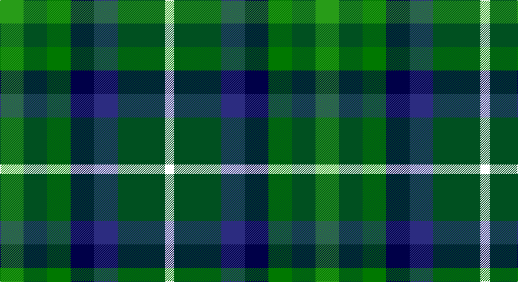

This page is one **sett** — a single exact thread-count. It belongs to the [tartan](/setts/g5dg5gi5dbi5db5dg10w2/)
(the same proportion at any scale), whose colour order is pattern [GGGBBGW](/stripes/gggbbgw/).

Sourced from register-of-tartans.  It is a [7 stripe tartan](/stripes/stripes7/).

Original link https://www.tartanregister.gov.uk/tartanDetails.aspx?ref=11151

## Register references

External register numbers recorded for this tartan.

- Scottish Register of Tartans: [11151](https://www.tartanregister.gov.uk/tartanDetails.aspx?ref=11151)

## Thread count
G/40 Gb40 Ga40 DB40 DBa40 Gb80 W/16

One full sett is **536 threads**.

## Palette

Palette: <strong>Tartan Register</strong>
<table><thead><tr><th>Colour</th><th>Threads</th><th>Shade</th><th>Base</th><th>OKLCh</th></tr></thead><tbody><tr><td>G/</td><td style="text-align:right;font-variant-numeric:tabular-nums">40</td><td><code style="background-color:#289C18;">#289C18</code> <small style="color:#888">#289C18</small></td><td>G <code style="background-color:#006100;">#006100</code></td><td><small style="color:#888">oklch(60.6% 0.191 141.6)</small></td></tr><tr><td>Gb</td><td style="text-align:right;font-variant-numeric:tabular-nums">40</td><td><code style="background-color:#005020;">#005020</code> <small style="color:#888">#005020</small></td><td>G <code style="background-color:#006100;">#006100</code></td><td><small style="color:#888">oklch(37.7% 0.105 149.6)</small></td></tr><tr><td>Ga</td><td style="text-align:right;font-variant-numeric:tabular-nums">40</td><td><code style="background-color:#007800;">#007800</code> <small style="color:#888">#007800</small></td><td>G <code style="background-color:#006100;">#006100</code></td><td><small style="color:#888">oklch(49.6% 0.169 142.5)</small></td></tr><tr><td>DB</td><td style="text-align:right;font-variant-numeric:tabular-nums">40</td><td><code style="background-color:#000048;">#000048</code> <small style="color:#888">#000048</small></td><td>B <code style="background-color:#2A418A;">#2A418A</code></td><td><small style="color:#888">oklch(18.2% 0.126 264.1)</small></td></tr><tr><td>DBa</td><td style="text-align:right;font-variant-numeric:tabular-nums">40</td><td><code style="background-color:#2C2C80;">#2C2C80</code> <small style="color:#888">#2C2C80</small></td><td>B <code style="background-color:#2A418A;">#2A418A</code></td><td><small style="color:#888">oklch(35.0% 0.138 276.6)</small></td></tr><tr><td>Gb</td><td style="text-align:right;font-variant-numeric:tabular-nums">80</td><td><code style="background-color:#005020;">#005020</code> <small style="color:#888">#005020</small></td><td>G <code style="background-color:#006100;">#006100</code></td><td><small style="color:#888">oklch(37.7% 0.105 149.6)</small></td></tr><tr><td>W/</td><td style="text-align:right;font-variant-numeric:tabular-nums">16</td><td><code style="background-color:#FFFFFF;">#FFFFFF</code> <small style="color:#888">#FFFFFF</small></td><td>W <code style="background-color:#F7F7F7;">#F7F7F7</code></td><td><small style="color:#888">oklch(100.0% 0.000 89.9)</small></td></tr></tbody></table>

# Sample pattern

## Nearest tartans

The nearest existing variants by ΔTartan distance, with this tartan at the top so the swatches line up against it.

ΔTartan

Tartan

Sett

—

<a href="/ttd/edit/#slug=g5dg5gi5dbi5db5dg10w2~x8">Pollard (2014)</a> <a class="nn-out" href="/variants/s7/g5dg5gi5dbi5db5dg10w2~x8/" title="open its dictionary page">↗</a>

0.53

<a href="/ttd/edit/#slug=g5dg5gi5db5dbi5dg10w2~x8&amp;base=g5dg5gi5dbi5db5dg10w2~x8">Pollard (2014)</a> <a class="nn-out" href="/variants/s7/g5dg5gi5db5dbi5dg10w2~x8/" title="open its dictionary page">↗</a>

1.21

<a href="/variants/s7/db8g11k3g11m12ki10ly2~x2/">Scottish Parliament</a>

1.54

<a href="/ttd/edit/#slug=y5g4w1g4o4dg4ly1~x4&amp;base=g5dg5gi5dbi5db5dg10w2~x8">Devon, Original</a> <a class="nn-out" href="/variants/s7/y5g4w1g4o4dg4ly1~x4/" title="open its dictionary page">↗</a>

1.61

<a href="/ttd/edit/#slug=dt3b12k11g11ly2g11k11b12dt3r2~x2&amp;base=g5dg5gi5dbi5db5dg10w2~x8">Huntly Gordon 2000</a> <a class="nn-out" href="/variants/s10/dt3b12k11g11ly2g11k11b12dt3r2~x2/" title="open its dictionary page">↗</a>

1.63

<a href="/ttd/edit/#slug=db8g11k3g11r12dt10ly2~x2&amp;base=g5dg5gi5dbi5db5dg10w2~x8">Parliament Trade Tartan</a> <a class="nn-out" href="/variants/s7/db8g11k3g11r12dt10ly2~x2/" title="open its dictionary page">↗</a>

1.67

<a href="/ttd/edit/#slug=g12k10ly9db11lyi3g9~x2&amp;base=g5dg5gi5dbi5db5dg10w2~x8">Centeno-Oxford</a> <a class="nn-out" href="/variants/s6/g12k10ly9db11lyi3g9~x2/" title="open its dictionary page">↗</a>

1.73

<a href="/ttd/edit/#slug=b7dbi11k3dbi11dy11g22db3~x2&amp;base=g5dg5gi5dbi5db5dg10w2~x8">Scottish Odyssey</a> <a class="nn-out" href="/variants/s7/b7dbi11k3dbi11dy11g22db3~x2/" title="open its dictionary page">↗</a>

1.75

<a href="/ttd/edit/#slug=db6r2db6ly3g6k1g2lb2g2k1g6~x2&amp;base=g5dg5gi5dbi5db5dg10w2~x8">Presbyterian Synod (US) (Corporate)</a> <a class="nn-out" href="/variants/s11/db6r2db6ly3g6k1g2lb2g2k1g6~x2/" title="open its dictionary page">↗</a>

1.76

<a href="/ttd/edit/#slug=g15dg18dt23w4r8~x2&amp;base=g5dg5gi5dbi5db5dg10w2~x8">Friebe (2014)</a> <a class="nn-out" href="/variants/s5/g15dg18dt23w4r8~x2/" title="open its dictionary page">↗</a>

1.77

<a href="/ttd/edit/#slug=g31ly4g6k19db18t9~x2&amp;base=g5dg5gi5dbi5db5dg10w2~x8">Lanarkshire</a> <a class="nn-out" href="/variants/s6/g31ly4g6k19db18t9~x2/" title="open its dictionary page">↗</a>

## Neighbour map

Every grey dot is one of 14360 variants placed by the first two principal components of the ΔTartan feature space (44% of its variance). Red is this tartan; blue dots are its nearest — click one to open its page.

<svg viewBox="0 0 640 380" role="img" style="max-width:100%;height:auto;border:1px solid #e0e0e0;border-radius:4px;display:block" xmlns="http://www.w3.org/2000/svg"><image href="/nn/cloud.v1.png" width="640" height="380"/><a href="/variants/s7/g5dg5gi5db5dbi5dg10w2~x8/"><circle cx="77.0" cy="254.9" r="4" fill="#3465a4"><title>Pollard (2014)</title></circle></a><a href="/variants/s7/db8g11k3g11m12ki10ly2~x2/"><circle cx="74.5" cy="228.7" r="4" fill="#3465a4"><title>Scottish Parliament</title></circle></a><a href="/variants/s7/y5g4w1g4o4dg4ly1~x4/"><circle cx="69.2" cy="243.9" r="4" fill="#3465a4"><title>Devon, Original</title></circle></a><a href="/variants/s10/dt3b12k11g11ly2g11k11b12dt3r2~x2/"><circle cx="74.4" cy="215.2" r="4" fill="#3465a4"><title>Huntly Gordon 2000</title></circle></a><a href="/variants/s7/db8g11k3g11r12dt10ly2~x2/"><circle cx="115.4" cy="248.3" r="4" fill="#3465a4"><title>Parliament Trade Tartan</title></circle></a><a href="/variants/s6/g12k10ly9db11lyi3g9~x2/"><circle cx="46.5" cy="276.4" r="4" fill="#3465a4"><title>Centeno-Oxford</title></circle></a><a href="/variants/s7/b7dbi11k3dbi11dy11g22db3~x2/"><circle cx="102.2" cy="216.9" r="4" fill="#3465a4"><title>Scottish Odyssey</title></circle></a><a href="/variants/s11/db6r2db6ly3g6k1g2lb2g2k1g6~x2/"><circle cx="123.1" cy="195.6" r="4" fill="#3465a4"><title>Presbyterian Synod (US) (Corporate)</title></circle></a><a href="/variants/s5/g15dg18dt23w4r8~x2/"><circle cx="104.3" cy="262.5" r="4" fill="#3465a4"><title>Friebe (2014)</title></circle></a><a href="/variants/s6/g31ly4g6k19db18t9~x2/"><circle cx="165.1" cy="233.2" r="4" fill="#3465a4"><title>Lanarkshire</title></circle></a><circle cx="67.9" cy="251.4" r="5" fill="#c00000"/></svg>

ID: /variants/s7/g5dg5gi5dbi5db5dg10w2~x8/
