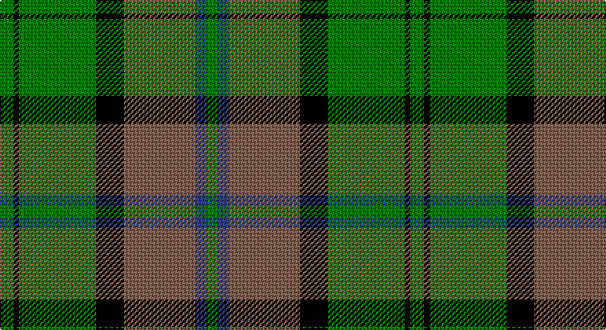

This page is one **sett** — a single exact thread-count. It belongs to the [tartan](/setts/g5k2g28k10o26db4g4/)
(the same proportion at any scale), whose colour order is pattern [GBRKGKG](/stripes/gbrkgkg/).

Part of the [John Telfar Dunbar Hunting](/tartans/john-telfar-dunbar-hunting/) tartan — the named design grouping this sett with its other cloths.

Sourced from weddslist.  It is a [7 stripe tartan](/stripes/stripes7/).

Original link http://www.weddslist.com/cgi-bin/tartans/pg.pl?source=sts

## Also known as

This cloth is also recorded under:

- John Telfar Dunbar/Hunting
- John Telfar, Dunbar hunting

## Thread count
G/10 K4 G56 K20 LT52 B8 G/8

One full sett is **298 threads**.

## Palette

Palette: <strong>Ingles Buchan</strong> <small style="color:#888">(1 of 4 colours)</small>
<table><thead><tr><th>Colour</th><th>Threads</th><th>Shade</th><th>Base</th><th>OKLCh</th></tr></thead><tbody><tr><td>G/</td><td style="text-align:right;font-variant-numeric:tabular-nums">10</td><td><code style="background-color:#008000;">#008000</code> <small style="color:#888">#008000</small></td><td>G <code style="background-color:#006100;">#006100</code></td><td><small style="color:#888">oklch(52.0% 0.177 142.5)</small></td></tr><tr><td>K</td><td style="text-align:right;font-variant-numeric:tabular-nums">4</td><td><code style="background-color:#000000;">#000000</code> <small style="color:#888">#000000</small></td><td>K <code style="background-color:#000000;">#000000</code></td><td><small style="color:#888">oklch(0.0% 0.000 0.0)</small></td></tr><tr><td>G</td><td style="text-align:right;font-variant-numeric:tabular-nums">56</td><td><code style="background-color:#008000;">#008000</code> <small style="color:#888">#008000</small></td><td>G <code style="background-color:#006100;">#006100</code></td><td><small style="color:#888">oklch(52.0% 0.177 142.5)</small></td></tr><tr><td>K</td><td style="text-align:right;font-variant-numeric:tabular-nums">20</td><td><code style="background-color:#000000;">#000000</code> <small style="color:#888">#000000</small></td><td>K <code style="background-color:#000000;">#000000</code></td><td><small style="color:#888">oklch(0.0% 0.000 0.0)</small></td></tr><tr><td>LT</td><td style="text-align:right;font-variant-numeric:tabular-nums">52</td><td><code style="background-color:#806050;">#806050</code> <small style="color:#888">#806050</small></td><td>R <code style="background-color:#CC0000;">#CC0000</code></td><td><small style="color:#888">oklch(51.7% 0.049 47.8)</small></td></tr><tr><td>B</td><td style="text-align:right;font-variant-numeric:tabular-nums">8</td><td><code style="background-color:#304080;">#304080</code> <small style="color:#888">#304080</small></td><td>B <code style="background-color:#2A418A;">#2A418A</code></td><td><small style="color:#888">oklch(39.4% 0.109 270.2)</small></td></tr><tr><td>G/</td><td style="text-align:right;font-variant-numeric:tabular-nums">8</td><td><code style="background-color:#008000;">#008000</code> <small style="color:#888">#008000</small></td><td>G <code style="background-color:#006100;">#006100</code></td><td><small style="color:#888">oklch(52.0% 0.177 142.5)</small></td></tr></tbody></table>

# Sample pattern

## Compared to the master

This cloth is one sett of its design; the master sett (the exemplar the design is anchored on) is below for comparison.

<figure style="margin:0"><figcaption style="color:#888;font-size:smaller">this sett</figcaption></figure>
<figure style="margin:0"><figcaption style="color:#888;font-size:smaller"><a href="/setts/dg5k2dg28k10dy26db4dg4/">master sett →</a></figcaption></figure>

## Nearest tartans

The nearest existing variants by ΔTartan distance, with this tartan at the top so the swatches line up against it.

ΔTartan

Tartan

Sett

—

<a href="/ttd/edit/#slug=g5k2g28k10o26db4g4~x2">John Telfar, Dunbar hunting</a> <a class="nn-out" href="/variants/s7/g5k2g28k10o26db4g4~x2/" title="open its dictionary page">↗</a>

0.98

<a href="/ttd/edit/#slug=g4r4k12w2k12g32r4k3~x2&amp;base=g5k2g28k10o26db4g4~x2">MacHardy (Clans Originaux)</a> <a class="nn-out" href="/variants/s8/g4r4k12w2k12g32r4k3~x2/" title="open its dictionary page">↗</a>

1.02

<a href="/ttd/edit/#slug=g24p3g3p3g3p7dg20r3~x2&amp;base=g5k2g28k10o26db4g4~x2">Crantock</a> <a class="nn-out" href="/variants/s8/g24p3g3p3g3p7dg20r3~x2/" title="open its dictionary page">↗</a>

1.02

<a href="/ttd/edit/#slug=g24dp3g3dp3g3dp7dg20r3~x2&amp;base=g5k2g28k10o26db4g4~x2">Crantock Trade Tartan</a> <a class="nn-out" href="/variants/s8/g24dp3g3dp3g3dp7dg20r3~x2/" title="open its dictionary page">↗</a>

1.04

<a href="/ttd/edit/#slug=g28r12g4db20ly2db3ly2db3g7~x2&amp;base=g5k2g28k10o26db4g4~x2">Cork</a> <a class="nn-out" href="/variants/s9/g28r12g4db20ly2db3ly2db3g7~x2/" title="open its dictionary page">↗</a>

1.10

<a href="/ttd/edit/#slug=k4dg5k2o21g8k2~x2&amp;base=g5k2g28k10o26db4g4~x2">MacDuck</a> <a class="nn-out" href="/variants/s6/k4dg5k2o21g8k2~x2/" title="open its dictionary page">↗</a>

1.18

<a href="/ttd/edit/#slug=g36k2g2k2g3k12t10r20~x2&amp;base=g5k2g28k10o26db4g4~x2">Georgia, State of</a> <a class="nn-out" href="/variants/s8/g36k2g2k2g3k12t10r20~x2/" title="open its dictionary page">↗</a>

1.19

<a href="/ttd/edit/#slug=db4o17db4g4db2g4db4g27db4ly4~x2&amp;base=g5k2g28k10o26db4g4~x2">Cape Breton University</a> <a class="nn-out" href="/variants/s10/db4o17db4g4db2g4db4g27db4ly4~x2/" title="open its dictionary page">↗</a>

1.20

<a href="/ttd/edit/#slug=t4dg26g8t8g8gi3t2~x2&amp;base=g5k2g28k10o26db4g4~x2">Valley, of the Green. (The )</a> <a class="nn-out" href="/variants/s7/t4dg26g8t8g8gi3t2~x2/" title="open its dictionary page">↗</a>

1.20

<a href="/ttd/edit/#slug=k5g2k5g2db8g25w4~x2&amp;base=g5k2g28k10o26db4g4~x2">Keppoch</a> <a class="nn-out" href="/variants/s7/k5g2k5g2db8g25w4~x2/" title="open its dictionary page">↗</a>

1.22

<a href="/ttd/edit/#slug=o5g12dg4r4dg27g3dg4o5&amp;base=g5k2g28k10o26db4g4~x2">Daks, Muted Loden</a> <a class="nn-out" href="/variants/s8/o5g12dg4r4dg27g3dg4o5/" title="open its dictionary page">↗</a>

## Neighbour map

Every grey dot is one of 14360 variants placed by the first two principal components of the ΔTartan feature space (44% of its variance). Red is this tartan; blue dots are its nearest — click one to open its page.

<svg viewBox="0 0 640 380" role="img" style="max-width:100%;height:auto;border:1px solid #e0e0e0;border-radius:4px;display:block" xmlns="http://www.w3.org/2000/svg"><image href="/nn/cloud.v1.png" width="640" height="380"/><a href="/variants/s8/g4r4k12w2k12g32r4k3~x2/"><circle cx="296.3" cy="177.0" r="4" fill="#3465a4"><title>MacHardy (Clans Originaux)</title></circle></a><a href="/variants/s8/g24p3g3p3g3p7dg20r3~x2/"><circle cx="219.4" cy="192.7" r="4" fill="#3465a4"><title>Crantock</title></circle></a><a href="/variants/s8/g24dp3g3dp3g3dp7dg20r3~x2/"><circle cx="227.1" cy="196.9" r="4" fill="#3465a4"><title>Crantock Trade Tartan</title></circle></a><a href="/variants/s9/g28r12g4db20ly2db3ly2db3g7~x2/"><circle cx="273.9" cy="178.4" r="4" fill="#3465a4"><title>Cork</title></circle></a><a href="/variants/s6/k4dg5k2o21g8k2~x2/"><circle cx="244.6" cy="195.7" r="4" fill="#3465a4"><title>MacDuck</title></circle></a><a href="/variants/s8/g36k2g2k2g3k12t10r20~x2/"><circle cx="273.2" cy="166.1" r="4" fill="#3465a4"><title>Georgia, State of</title></circle></a><a href="/variants/s10/db4o17db4g4db2g4db4g27db4ly4~x2/"><circle cx="250.9" cy="159.9" r="4" fill="#3465a4"><title>Cape Breton University</title></circle></a><a href="/variants/s7/t4dg26g8t8g8gi3t2~x2/"><circle cx="252.7" cy="211.3" r="4" fill="#3465a4"><title>Valley, of the Green. (The )</title></circle></a><a href="/variants/s7/k5g2k5g2db8g25w4~x2/"><circle cx="296.9" cy="187.5" r="4" fill="#3465a4"><title>Keppoch</title></circle></a><a href="/variants/s8/o5g12dg4r4dg27g3dg4o5/"><circle cx="291.9" cy="208.1" r="4" fill="#3465a4"><title>Daks, Muted Loden</title></circle></a><circle cx="253.1" cy="191.6" r="5" fill="#c00000"/></svg>

ID: /variants/s7/g5k2g28k10o26db4g4~x2/
