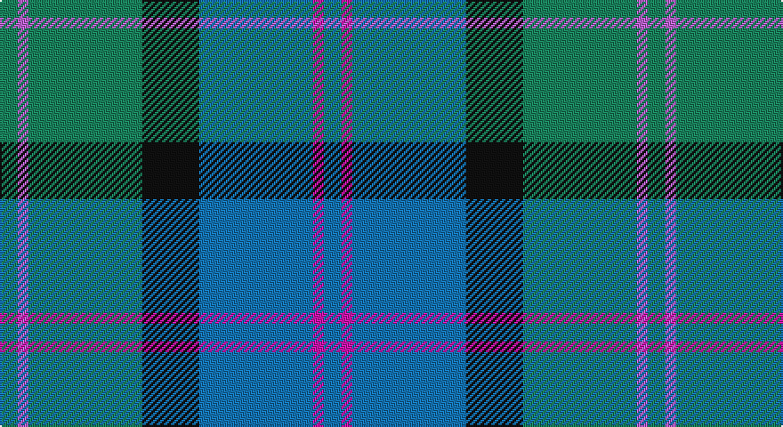

This page is one **sett** — a single exact thread-count. It belongs to the [tartan](/setts/g5mi3g32k16b32m3b5/)
(the same proportion at any scale), whose colour order is pattern [BRBKGRG](/stripes/brbkgrg/).

Sourced from register-of-tartans.  It is a [7 stripe tartan](/stripes/stripes7/).

Original link https://www.tartanregister.gov.uk/tartanDetails.aspx?ref=2772

## Register references

External register numbers recorded for this tartan.

- Scottish Register of Tartans: [2772](https://www.tartanregister.gov.uk/tartanDetails.aspx?ref=2772)
- Scottish Tartans Authority (ITI): 407
- Scottish Tartans World Register: 407

## Thread count
G/10 P6 G64 K32 B64 LR6 B/10

One full sett is **364 threads**.

## Palette

Palette: <strong>Tartan Register</strong> <small style="color:#888">(2 of 5 colours)</small>
<table><thead><tr><th>Colour</th><th>Threads</th><th>Shade</th><th>Base</th><th>OKLCh</th></tr></thead><tbody><tr><td>G/</td><td style="text-align:right;font-variant-numeric:tabular-nums">10</td><td><code style="background-color:#1B835D;">#1B835D</code> <small style="color:#888">#1B835D</small></td><td>G <code style="background-color:#006100;">#006100</code></td><td><small style="color:#888">oklch(54.3% 0.109 163.0)</small></td></tr><tr><td>P</td><td style="text-align:right;font-variant-numeric:tabular-nums">6</td><td><code style="background-color:#BB62CE;">#BB62CE</code> <small style="color:#888">#BB62CE</small></td><td>R <code style="background-color:#CC0000;">#CC0000</code></td><td><small style="color:#888">oklch(64.1% 0.178 320.3)</small></td></tr><tr><td>G</td><td style="text-align:right;font-variant-numeric:tabular-nums">64</td><td><code style="background-color:#1B835D;">#1B835D</code> <small style="color:#888">#1B835D</small></td><td>G <code style="background-color:#006100;">#006100</code></td><td><small style="color:#888">oklch(54.3% 0.109 163.0)</small></td></tr><tr><td>K</td><td style="text-align:right;font-variant-numeric:tabular-nums">32</td><td><code style="background-color:#101010;">#101010</code> <small style="color:#888">#101010</small></td><td>K <code style="background-color:#000000;">#000000</code></td><td><small style="color:#888">oklch(17.3% 0.000 89.9)</small></td></tr><tr><td>B</td><td style="text-align:right;font-variant-numeric:tabular-nums">64</td><td><code style="background-color:#1474B4;">#1474B4</code> <small style="color:#888">#1474B4</small></td><td>B <code style="background-color:#2A418A;">#2A418A</code></td><td><small style="color:#888">oklch(54.0% 0.129 245.1)</small></td></tr><tr><td>LR</td><td style="text-align:right;font-variant-numeric:tabular-nums">6</td><td><code style="background-color:#CB15AB;">#CB15AB</code> <small style="color:#888">#CB15AB</small></td><td>R <code style="background-color:#CC0000;">#CC0000</code></td><td><small style="color:#888">oklch(57.8% 0.245 337.6)</small></td></tr><tr><td>B/</td><td style="text-align:right;font-variant-numeric:tabular-nums">10</td><td><code style="background-color:#1474B4;">#1474B4</code> <small style="color:#888">#1474B4</small></td><td>B <code style="background-color:#2A418A;">#2A418A</code></td><td><small style="color:#888">oklch(54.0% 0.129 245.1)</small></td></tr></tbody></table>

# Sample pattern

## Nearest tartans

The nearest existing variants by ΔTartan distance, with this tartan at the top so the swatches line up against it.

ΔTartan

Tartan

Sett

—

<a href="/ttd/edit/#slug=g5mi3g32k16b32m3b5~x2">MacThomas</a> <a class="nn-out" href="/variants/s7/g5mi3g32k16b32m3b5~x2/" title="open its dictionary page">↗</a>

0.68

<a href="/ttd/edit/#slug=b11k4g4m1g4k1r1~x4&amp;base=g5mi3g32k16b32m3b5~x2">Ednie (Personal)</a> <a class="nn-out" href="/variants/s7/b11k4g4m1g4k1r1~x4/" title="open its dictionary page">↗</a>

0.74

<a href="/ttd/edit/#slug=dt4b28dt11w2dt2g14ly2~x2&amp;base=g5mi3g32k16b32m3b5~x2">Rhode Island, State of</a> <a class="nn-out" href="/variants/s7/dt4b28dt11w2dt2g14ly2~x2/" title="open its dictionary page">↗</a>

0.83

<a href="/ttd/edit/#slug=db6b47db22g47dp4g4o4&amp;base=g5mi3g32k16b32m3b5~x2">Boroughmuir</a> <a class="nn-out" href="/variants/s7/db6b47db22g47dp4g4o4/" title="open its dictionary page">↗</a>

0.85

<a href="/ttd/edit/#slug=g5db15t11w2t1w1dg4~x4&amp;base=g5mi3g32k16b32m3b5~x2">Highlands Country Club</a> <a class="nn-out" href="/variants/s7/g5db15t11w2t1w1dg4~x4/" title="open its dictionary page">↗</a>

0.86

<a href="/ttd/edit/#slug=dg5lp3dg32k16b32m3b5~x2&amp;base=g5mi3g32k16b32m3b5~x2">MacThomas (Clan)</a> <a class="nn-out" href="/variants/s7/dg5lp3dg32k16b32m3b5~x2/" title="open its dictionary page">↗</a>

0.91

<a href="/ttd/edit/#slug=db20k6lo4db3g20w2~x2&amp;base=g5mi3g32k16b32m3b5~x2">DeLoughery (Personal)</a> <a class="nn-out" href="/variants/s6/db20k6lo4db3g20w2~x2/" title="open its dictionary page">↗</a>

0.96

<a href="/ttd/edit/#slug=db9w4g36t36r4~x2&amp;base=g5mi3g32k16b32m3b5~x2">Alvis of Lee (Personal)</a> <a class="nn-out" href="/variants/s5/db9w4g36t36r4~x2/" title="open its dictionary page">↗</a>

0.98

<a href="/ttd/edit/#slug=b29db8g21r3g8b11w3db3w3g8~x2&amp;base=g5mi3g32k16b32m3b5~x2">Morneau, Richard (Personal)</a> <a class="nn-out" href="/variants/s10/b29db8g21r3g8b11w3db3w3g8~x2/" title="open its dictionary page">↗</a>

1.06

<a href="/ttd/edit/#slug=r1o5dt3dti11dt3o5lo1~x8&amp;base=g5mi3g32k16b32m3b5~x2">Newmill</a> <a class="nn-out" href="/variants/s7/r1o5dt3dti11dt3o5lo1~x8/" title="open its dictionary page">↗</a>

1.06

<a href="/ttd/edit/#slug=r15t98dt72ly25dt8w15&amp;base=g5mi3g32k16b32m3b5~x2">Afternoon Tea / Earl Grey</a> <a class="nn-out" href="/variants/s6/r15t98dt72ly25dt8w15/" title="open its dictionary page">↗</a>

## Neighbour map

Every grey dot is one of 14360 variants placed by the first two principal components of the ΔTartan feature space (44% of its variance). Red is this tartan; blue dots are its nearest — click one to open its page.

<svg viewBox="0 0 640 380" role="img" style="max-width:100%;height:auto;border:1px solid #e0e0e0;border-radius:4px;display:block" xmlns="http://www.w3.org/2000/svg"><image href="/nn/cloud.v1.png" width="640" height="380"/><a href="/variants/s7/b11k4g4m1g4k1r1~x4/"><circle cx="212.9" cy="195.3" r="4" fill="#3465a4"><title>Ednie (Personal)</title></circle></a><a href="/variants/s7/dt4b28dt11w2dt2g14ly2~x2/"><circle cx="246.4" cy="182.1" r="4" fill="#3465a4"><title>Rhode Island, State of</title></circle></a><a href="/variants/s7/db6b47db22g47dp4g4o4/"><circle cx="236.0" cy="203.0" r="4" fill="#3465a4"><title>Boroughmuir</title></circle></a><a href="/variants/s7/g5db15t11w2t1w1dg4~x4/"><circle cx="198.6" cy="178.9" r="4" fill="#3465a4"><title>Highlands Country Club</title></circle></a><a href="/variants/s7/dg5lp3dg32k16b32m3b5~x2/"><circle cx="213.8" cy="201.7" r="4" fill="#3465a4"><title>MacThomas (Clan)</title></circle></a><a href="/variants/s6/db20k6lo4db3g20w2~x2/"><circle cx="206.5" cy="204.1" r="4" fill="#3465a4"><title>DeLoughery (Personal)</title></circle></a><a href="/variants/s5/db9w4g36t36r4~x2/"><circle cx="221.1" cy="221.0" r="4" fill="#3465a4"><title>Alvis of Lee (Personal)</title></circle></a><a href="/variants/s10/b29db8g21r3g8b11w3db3w3g8~x2/"><circle cx="195.0" cy="184.1" r="4" fill="#3465a4"><title>Morneau, Richard (Personal)</title></circle></a><a href="/variants/s7/r1o5dt3dti11dt3o5lo1~x8/"><circle cx="205.9" cy="209.3" r="4" fill="#3465a4"><title>Newmill</title></circle></a><a href="/variants/s6/r15t98dt72ly25dt8w15/"><circle cx="207.9" cy="186.9" r="4" fill="#3465a4"><title>Afternoon Tea / Earl Grey</title></circle></a><circle cx="212.0" cy="199.5" r="5" fill="#c00000"/></svg>

ID: /variants/s7/g5mi3g32k16b32m3b5~x2/
