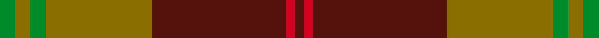

This page is one **sett** — a single exact thread-count. It belongs to the [tartan](/setts/g5y5g5y35dr44r3dr3/)
(the same proportion at any scale), whose colour order is pattern [BRBGGGG](/stripes/brbgggg/).

Sourced from tartans-authority.  It is a [7 stripe tartan](/stripes/stripes7/).

Original link http://www.tartansauthority.com/tartan-ferret/display/3966/

2 attestations — the source records this cloth was collapsed from (oldest owns this page)

<ul>
<li>2001 — Fernandes (Personal) (tartans-authority, <a href="http://www.tartansauthority.com/tartan-ferret/display/3966/">record</a>)  <em>Designed online by Ant?nio S. C. Fernandes.</em></li>
<li>undated — Fernandes (Personal) (register-of-tartans, <a href="https://www.tartanregister.gov.uk/tartanDetails.aspx?ref=5028">record</a>)  <em>Antonio S.C. Fernandes ascfcasa@hotmail.com, designed online.</em></li>
</ul>

## Register references

External register numbers recorded for this tartan.

- Scottish Register of Tartans: [5028](https://www.tartanregister.gov.uk/tartanDetails.aspx?ref=5028)
- Scottish Tartans Authority (ITI): 3966

## Thread count
G/10 Y10 G10 Y70 DR88 R6 DR/6

One full sett is **384 threads**.

## Palette
<table><thead><tr><th>Colour</th><th>Shade</th><th>OKLCh</th></tr></thead><tbody><tr><td>DR</td><td><code style="background-color:#55120C;">#55120C</code> <small style="color:#888">#55120C</small></td><td><small style="color:#888">oklch(30.0% 0.099 29.3)</small></td></tr><tr><td>G</td><td><code style="background-color:#008B2A;">#008B2A</code> <small style="color:#888">#008B2A</small></td><td><small style="color:#888">oklch(55.4% 0.170 145.9)</small></td></tr><tr><td>R</td><td><code style="background-color:#D60020;">#D60020</code> <small style="color:#888">#D60020</small></td><td><small style="color:#888">oklch(55.2% 0.224 25.5)</small></td></tr><tr><td>Y</td><td><code style="background-color:#8B6E00;">#8B6E00</code> <small style="color:#888">#8B6E00</small></td><td><small style="color:#888">oklch(55.1% 0.113 90.4)</small></td></tr></tbody></table>

# Sample pattern

## Nearest tartan variants

The nearest existing variants by ΔTartan distance, with this cloth at the top so the swatches line up against it.

ΔTartan

Threads

Variant

Sett

—

384

<a href="/variants/s7/g5y5g5y35dr44r3dr3~x2/">Fernandes (Personal)</a>

<a href="/ttd/edit/#slug=g5y5g5y35dr44r3dr3~x2~g2408144&amp;base=g5y5g5y35dr44r3dr3~x2" title="compare in the TTD">0.00</a>

384

<a href="/variants/s7/g5y5g5y35dr44r3dr3~x2~g2408144/">Fernandes Family Tartan</a>

<a href="/ttd/edit/#slug=r3g3y1r18w1g21y1g1y3~x2&amp;base=g5y5g5y35dr44r3dr3~x2" title="compare in the TTD">2.59</a>

196

<a href="/variants/s9/r3g3y1r18w1g21y1g1y3~x2/">MacDonald of Kingsburgh</a>

<a href="/ttd/edit/#slug=g18lb3y1r2y1r3y1r10~x4&amp;base=g5y5g5y35dr44r3dr3~x2" title="compare in the TTD">2.60</a>

200

<a href="/variants/s8/g18lb3y1r2y1r3y1r10~x4/">Brisbane (Artefact)</a>

<a href="/ttd/edit/#slug=dr2dg14lb3dr13ly1dr2~x4&amp;base=g5y5g5y35dr44r3dr3~x2" title="compare in the TTD">2.90</a>

264

<a href="/variants/s6/dr2dg14lb3dr13ly1dr2~x4/">Swedish Para Whisky Club (Corporate</a>

<a href="/ttd/edit/#slug=dy10r5dy62dg40dy5g44r10&amp;base=g5y5g5y35dr44r3dr3~x2" title="compare in the TTD">2.98</a>

332

<a href="/variants/s7/dy10r5dy62dg40dy5g44r10/">Ballintrae Trade Tartan</a>

<a href="/ttd/edit/#slug=ri2r1ri10r2g10w1g2~x2~ri2008029-r1506028&amp;base=g5y5g5y35dr44r3dr3~x2" title="compare in the TTD">3.00</a>

104

<a href="/variants/s7/ri2r1ri10r2g10w1g2~x2~ri2008029-r1506028/">Lennox</a>

<a href="/ttd/edit/#slug=r2dr1r10dr2g10lr1g2~x4&amp;base=g5y5g5y35dr44r3dr3~x2" title="compare in the TTD">3.00</a>

208

<a href="/variants/s7/r2dr1r10dr2g10lr1g2~x4/">Lennox</a>

## Neighbour map

Every grey dot is one of 13620 variants placed by the first two principal components of the ΔTartan feature space (42% of its variance). Red is this tartan; blue dots are its nearest — click one to open its page.

<svg viewBox="0 0 640 380" role="img" style="max-width:100%;height:auto;border:1px solid #e0e0e0;border-radius:4px;display:block" xmlns="http://www.w3.org/2000/svg"><image href="/nn/cloud.v1.png" width="640" height="380"/><a href="/variants/s7/g5y5g5y35dr44r3dr3~x2~g2408144/"><circle cx="360.9" cy="191.1" r="4" fill="#3465a4"><title>Fernandes Family Tartan</title></circle></a><a href="/variants/s9/r3g3y1r18w1g21y1g1y3~x2/"><circle cx="355.5" cy="152.5" r="4" fill="#3465a4"><title>MacDonald of Kingsburgh</title></circle></a><a href="/variants/s8/g18lb3y1r2y1r3y1r10~x4/"><circle cx="327.9" cy="168.8" r="4" fill="#3465a4"><title>Brisbane (Artefact)</title></circle></a><a href="/variants/s6/dr2dg14lb3dr13ly1dr2~x4/"><circle cx="364.7" cy="222.3" r="4" fill="#3465a4"><title>Swedish Para Whisky Club (Corporate</title></circle></a><a href="/variants/s7/dy10r5dy62dg40dy5g44r10/"><circle cx="309.5" cy="228.1" r="4" fill="#3465a4"><title>Ballintrae Trade Tartan</title></circle></a><a href="/variants/s7/ri2r1ri10r2g10w1g2~x2~ri2008029-r1506028/"><circle cx="283.0" cy="203.1" r="4" fill="#3465a4"><title>Lennox</title></circle></a><a href="/variants/s7/r2dr1r10dr2g10lr1g2~x4/"><circle cx="285.2" cy="204.4" r="4" fill="#3465a4"><title>Lennox</title></circle></a><circle cx="370.0" cy="194.1" r="5" fill="#c00000"/><text x="320" y="376" text-anchor="middle" font-size="11" fill="#999">ground</text><text x="11" y="190" text-anchor="middle" font-size="11" fill="#999" transform="rotate(-90 11 190)">complexity</text></svg>

ID: /variants/s7/g5y5g5y35dr44r3dr3~x2/
