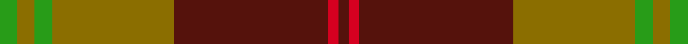

This page is one **sett** — a single exact thread-count. It belongs to the [tartan](/setts/g5y5g5y35dr44r3dr3/)
(the same proportion at any scale), whose colour order is pattern [BRBGGGG](/stripes/brbgggg/).

Sourced from house-of-tartan.  It is a [7 stripe tartan](/stripes/stripes7/).

Original link http://www.house-of-tartan.scotland.net/house/TartanViewjs.asp?colr=Def&tnam=3225

## Provenance

Earliest known date: 2001 Designed by Antonio Fernandes

Dataset <small>— provenance for this record, inherited from the source manifest</small>

<dl class="dataset-prov">
<dt>source</dt><dd><a href="/sources/house-of-tartan/">House of Tartan</a></dd>
<dt>data captured from</dt><dd><a href="https://github.com/thetartan/tartan-database/blob/master/data/house-of-tartan/data.csv">https://github.com/thetartan/tartan-database/blob/master/data/house-of-tartan/data.csv</a></dd>
<dt>data date</dt><dd>2017-01-10 <small>(dataset default)</small></dd>
<dt>licence</dt><dd><a href="https://creativecommons.org/licenses/by-nc-nd/4.0/">CC BY-NC-ND 4.0</a></dd>
</dl>

Capture chain <small>— the hands this data passed through, oldest first; each capture carries its own licence</small>

<ol class="capture-chain">
<li><a href="http://www.house-of-tartan.scotland.net/">House of Tartan</a> <small>the weaver/retailer's database — the site is now offline; the URL is kept as the ultimate source's identity</small></li>
<li><a href="https://github.com/thetartan/tartan-database">thetartan/tartan-database</a> <small>2016-2017</small> · <a href="https://creativecommons.org/licenses/by-nc-nd/4.0/">CC BY-NC-ND 4.0</a> <small>Levko Kravets's frozen compilation — the capture we vendored, and where its CC licence text came from</small></li>
<li>this dictionary <small>captured 2026-06-10 · commit 5bf86c7566</small> <small>each re-capture is a git commit to data/sources</small></li>
</ol>

## Thread count
G/10 Y10 G10 Y70 DR88 R6 DR/6

One full sett is **384 threads**.

## Palette
<table><thead><tr><th>Colour</th><th>Shade</th><th>OKLCh</th></tr></thead><tbody><tr><td>DR</td><td><code style="background-color:#55120C;">#55120C</code> <small style="color:#888">#55120C</small></td><td><small style="color:#888">oklch(30.0% 0.099 29.3)</small></td></tr><tr><td>G</td><td><code style="background-color:#289C18;">#289C18</code> <small style="color:#888">#289C18</small></td><td><small style="color:#888">oklch(60.6% 0.191 141.6)</small></td></tr><tr><td>DG</td><td><code style="background-color:#006818;">#006818</code> <small style="color:#888">#006818</small></td><td><small style="color:#888">oklch(45.0% 0.142 145.0)</small></td></tr><tr><td>W</td><td><code style="background-color:#F7F7F7;">#F7F7F7</code> <small style="color:#888">#F7F7F7</small></td><td><small style="color:#888">oklch(97.6% 0.000 89.9)</small></td></tr><tr><td>R</td><td><code style="background-color:#D60020;">#D60020</code> <small style="color:#888">#D60020</small></td><td><small style="color:#888">oklch(55.2% 0.224 25.5)</small></td></tr><tr><td>Y</td><td><code style="background-color:#8B6E00;">#8B6E00</code> <small style="color:#888">#8B6E00</small></td><td><small style="color:#888">oklch(55.1% 0.113 90.4)</small></td></tr></tbody></table>

# Sample pattern

## Nearest tartan variants

The nearest existing variants by ΔTartan distance, with this cloth at the top so the swatches line up against it.

ΔTartan

Threads

Variant

Sett

—

384

<a href="/variants/s7/g5y5g5y35dr44r3dr3~x2~g2408144/">Fernandes Family Tartan</a>

<a href="/ttd/edit/#slug=g5y5g5y35dr44r3dr3~x2&amp;base=g5y5g5y35dr44r3dr3~x2~g2408144" title="compare in the TTD">0.01</a>

384

<a href="/variants/s7/g5y5g5y35dr44r3dr3~x2/">Fernandes (Personal)</a>

<a href="/ttd/edit/#slug=g18lb3y1r2y1r3y1r10~x4&amp;base=g5y5g5y35dr44r3dr3~x2~g2408144" title="compare in the TTD">2.65</a>

200

<a href="/variants/s8/g18lb3y1r2y1r3y1r10~x4/">Brisbane (Artefact)</a>

<a href="/ttd/edit/#slug=r3g3y1r18w1g21y1g1y3~x2&amp;base=g5y5g5y35dr44r3dr3~x2~g2408144" title="compare in the TTD">2.69</a>

196

<a href="/variants/s9/r3g3y1r18w1g21y1g1y3~x2/">MacDonald of Kingsburgh</a>

<a href="/ttd/edit/#slug=do44o3do4w3do4o44~x2&amp;base=g5y5g5y35dr44r3dr3~x2~g2408144" title="compare in the TTD">2.79</a>

232

<a href="/variants/s6/do44o3do4w3do4o44~x2/">Wcwm 1166-2</a>

<a href="/ttd/edit/#slug=o10lb2g3lb2do24lb4do4o34do2lb3do2~x2&amp;base=g5y5g5y35dr44r3dr3~x2~g2408144" title="compare in the TTD">2.83</a>

336

<a href="/variants/s11/o10lb2g3lb2do24lb4do4o34do2lb3do2~x2/">Fort William (Fashion)</a>

<a href="/ttd/edit/#slug=g18w3y1r2y1r3y1r10~x4&amp;base=g5y5g5y35dr44r3dr3~x2~g2408144" title="compare in the TTD">2.84</a>

200

<a href="/variants/s8/g18w3y1r2y1r3y1r10~x4/">Brisbane (Artefact)</a>

<a href="/ttd/edit/#slug=r2g16ri1r2ri12y1lb1~x2~r1706009-ri2109032&amp;base=g5y5g5y35dr44r3dr3~x2~g2408144" title="compare in the TTD">2.88</a>

134

<a href="/variants/s7/r2g16ri1r2ri12y1lb1~x2~r1706009-ri2109032/">Spragg (Name)</a>

<a href="/ttd/edit/#slug=r8w2dr30dg12dr3dg12dr3~x2&amp;base=g5y5g5y35dr44r3dr3~x2~g2408144" title="compare in the TTD">2.95</a>

258

<a href="/variants/s7/r8w2dr30dg12dr3dg12dr3~x2/">Wasko (Personal)</a>

<a href="/ttd/edit/#slug=ri2r1ri10r2g10w1g2~x2~ri2008029-r1506028&amp;base=g5y5g5y35dr44r3dr3~x2~g2408144" title="compare in the TTD">3.09</a>

104

<a href="/variants/s7/ri2r1ri10r2g10w1g2~x2~ri2008029-r1506028/">Lennox</a>

<a href="/ttd/edit/#slug=r2dr1r10dr2g10lr1g2~x4&amp;base=g5y5g5y35dr44r3dr3~x2~g2408144" title="compare in the TTD">3.14</a>

208

<a href="/variants/s7/r2dr1r10dr2g10lr1g2~x4/">Lennox</a>

## Neighbour map

Every grey dot is one of 13620 variants placed by the first two principal components of the ΔTartan feature space (42% of its variance). Red is this tartan; blue dots are its nearest — click one to open its page.

<svg viewBox="0 0 640 380" role="img" style="max-width:100%;height:auto;border:1px solid #e0e0e0;border-radius:4px;display:block" xmlns="http://www.w3.org/2000/svg"><image href="/nn/cloud.v1.png" width="640" height="380"/><a href="/variants/s7/g5y5g5y35dr44r3dr3~x2/"><circle cx="370.0" cy="194.1" r="4" fill="#3465a4"><title>Fernandes (Personal)</title></circle></a><a href="/variants/s8/g18lb3y1r2y1r3y1r10~x4/"><circle cx="327.9" cy="168.8" r="4" fill="#3465a4"><title>Brisbane (Artefact)</title></circle></a><a href="/variants/s9/r3g3y1r18w1g21y1g1y3~x2/"><circle cx="355.5" cy="152.5" r="4" fill="#3465a4"><title>MacDonald of Kingsburgh</title></circle></a><a href="/variants/s6/do44o3do4w3do4o44~x2/"><circle cx="413.7" cy="205.7" r="4" fill="#3465a4"><title>Wcwm 1166-2</title></circle></a><a href="/variants/s11/o10lb2g3lb2do24lb4do4o34do2lb3do2~x2/"><circle cx="342.6" cy="153.7" r="4" fill="#3465a4"><title>Fort William (Fashion)</title></circle></a><a href="/variants/s8/g18w3y1r2y1r3y1r10~x4/"><circle cx="308.2" cy="162.3" r="4" fill="#3465a4"><title>Brisbane (Artefact)</title></circle></a><a href="/variants/s7/r2g16ri1r2ri12y1lb1~x2~r1706009-ri2109032/"><circle cx="311.6" cy="165.0" r="4" fill="#3465a4"><title>Spragg (Name)</title></circle></a><a href="/variants/s7/r8w2dr30dg12dr3dg12dr3~x2/"><circle cx="368.0" cy="205.7" r="4" fill="#3465a4"><title>Wasko (Personal)</title></circle></a><a href="/variants/s7/ri2r1ri10r2g10w1g2~x2~ri2008029-r1506028/"><circle cx="283.0" cy="203.1" r="4" fill="#3465a4"><title>Lennox</title></circle></a><a href="/variants/s7/r2dr1r10dr2g10lr1g2~x4/"><circle cx="285.2" cy="204.4" r="4" fill="#3465a4"><title>Lennox</title></circle></a><circle cx="360.9" cy="191.1" r="5" fill="#c00000"/><text x="320" y="376" text-anchor="middle" font-size="11" fill="#999">ground</text><text x="11" y="190" text-anchor="middle" font-size="11" fill="#999" transform="rotate(-90 11 190)">complexity</text></svg>

ID: /variants/s7/g5y5g5y35dr44r3dr3~x2~g2408144/
